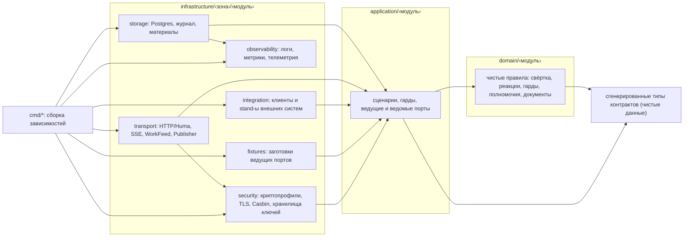
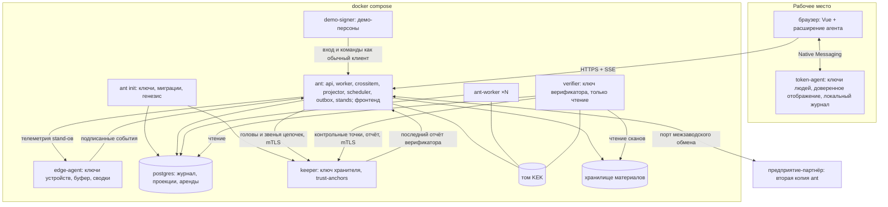
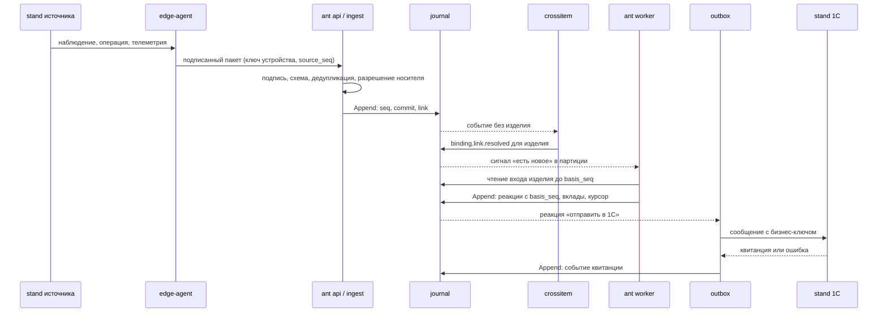
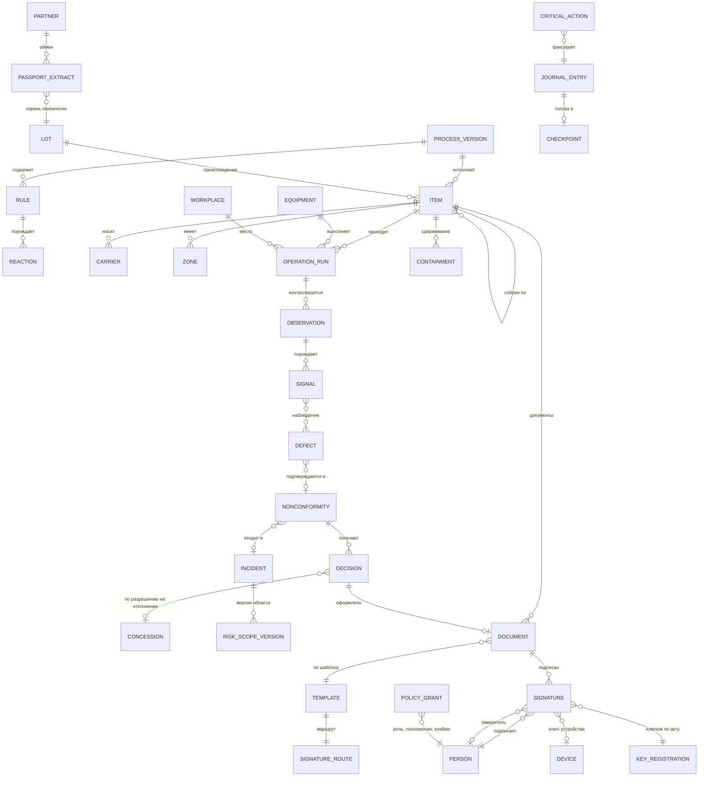

# Architecture Spine — ant

Спайн фиксирует инварианты, без которых независимо собранные части системы разойдутся. Всё структурное ниже — затравка: когда появится код, источником правды становится он. Обоснования решений — в `.memlog.md`, отзывы ревьюеров — в `reviews/`.

**Как читать агенту, который строит один эпик:** обязательно — парадигма, AD-1, AD-2, AD-20, AD-37, AD-39, AD-40, AD-44, соглашения; затем AD из колонки «Governed by» карты возможностей для своей области.

## Design Paradigm — парадигма

**Гексагональная архитектура с раскладкой по слоям и пяти зонам кейса плюс журнал событий как единственный источник истины.**

- **Раскладка.** Сначала слой (`domain` → `application` → `infrastructure`), инфраструктура — по пяти зонам кейса §3, внутри — одноимённые модули. Зависимости направлены только к домену.
- **Состояние.** Всё, что система знает, — записи append-only журнала. Всё, что она показывает, — проекции, пересчитываемые из журнала.
- **Домен.** Чистые детерминированные функции `вход + нормативный слой → состояние + реакции`. Один и тот же доменный код исполняют воркеры, воспроизведение, заготовки при регрессии и независимый верификатор.
- **Процессы.** Модульный монолит: одна кодовая база, несколько точек входа. Отдельные процессы — только по границам доверия: хранитель, верификатор, агент токена, edge-агент, демо-подписант.



## Применимость подхода — почему так (кейс §3)

| Требование кейса | Чем отвечает архитектура |
|---|---|
| §3 — разделение бизнес-правил и сценариев, хранения и доступа к данным, внешних интерфейсов и транспортов, интеграционных адаптеров, механизмов наблюдаемости и защиты | `domain` и `application` + пять зон `infrastructure`: `storage`, `transport`, `integration`, `observability`, `security` (AD-1) |
| §3.4, §4.5, §7.2 — исходные события, автоматический анализ, решения и производные показатели различимы, связаны и воспроизводимы | журнал как единственный источник истины (AD-2, AD-44), журналируемые реакции (AD-3), проекции |
| §3.4, §5.1 «Изменение данных» — предотвратить или обнаружить | подписи личными ключами вне сервера (AD-11, AD-14), две хеш-цепочки + хранитель (AD-8), независимый верификатор (AD-9) |
| §3.1, §6.1 — масштабирование, смысл при изменении числа экземпляров, порядок, нет повторного учёта | фиксированные партиции по изделию (AD-6), идемпотентность (AD-7), детерминизм и порядок знания (AD-4, AD-37) |
| §3.1 — замена хранилища, транспорта, внешней системы без переписывания правил; OpenTelemetry и Kafka | порты платформы с ключом конфигурации и контрактным тестом (AD-35) |
| §3.2 — «выделение каждого компонента в отдельный сервис не требуется» | модульный монолит; отдельные процессы только по границам доверия (AD-25) |
| §4.7, §6.2 — единый источник истины контрактов, обнаружение рассинхронизации | цепочка кодогенерации и проверки сборки (AD-20) |

| Зона кейса §3 | Где в коде | Примеры портов | AD |
|---|---|---|---|
| бизнес-правила | `domain/‹модуль›` | — (чистые функции) | AD-1, 4, 40 |
| производственные сценарии | `application/‹модуль›` | `Queries`, `Commands`, `AccessControl`, `JournalStore` | AD-1, 36, 39 |
| хранение и доступ к данным | `infrastructure/storage/‹модуль›` | `JournalStore`, `LeaseStore`, `MaterialStore`, репозитории проекций | AD-44, 45, 23 |
| внешние интерфейсы и транспорты | `infrastructure/transport/‹модуль›` | операции Huma, SSE, `WorkFeed`, `Publisher` | AD-20, 21, 35 |
| интеграционные адаптеры | `infrastructure/integration/‹модуль›/‹система›` | порт учёта, MES, КОМПАС, СКУД, УЦ, VisionQC, партнёр | AD-18, 19 |
| наблюдаемость и защита | `infrastructure/observability`, `infrastructure/security` | `Telemetry`, `Signer`, `Verifier`, `Cipher`, `AccessControl` | AD-10, 15, 23, 35 |

**Отвергнуто:** микросервисы на каждый компонент §3.2 (кейс не требует; 24 часа и 2,4 ГБ RAM; порядок событий между сервисами ломает детерминизм); CRUD + таблица аудита (журнал можно тихо переписать); Camunda / Flowable (JVM, иностранные вендоры, Указ № 166); блокчейн внутри предприятия (нет независимых сторон; описан как альтернатива за портом журнала). **Цена решения:** пересвёртка входа изделия на каждое событие и одна основная хеш-цепочка как точка сериализации — обе названы и имеют путь развития (Deferred).

## Invariants & Rules — инварианты и правила

### AD-1 — Слои, пять зон инфраструктуры и одноимённые модули [ADOPTED]

- **Binds:** весь бэкенд; NFR-ARCH-1, NFR-DEV-3; кейс §3.
- **Prevents:** модули, разложенные по-разному; утечку БД, сети и часов в домен; смешение хранения, транспорта, интеграций и механизмов защиты; «жёсткие связи» (критерий О6).
- **Rule:**
  - Код лежит в `backend/internal/domain/‹модуль›`, `backend/internal/application/‹модуль›` и `backend/internal/infrastructure/‹зона›/‹модуль›`; зоны кейса — `storage`, `transport`, `integration`, `observability`, `security`, плюс служебная зона `fixtures` (AD-36). `infrastructure/observability` и `infrastructure/security` — только технические механизмы без модульных подпапок; инфраструктура модуля `security` лежит в `storage/security` и `transport/security`.
  - `domain` импортирует только стандартную библиотеку, сгенерированные пакеты контрактов, пакет хеша `third_party/gogost/gost34112012256` (единственное исключение: чистая функция Стрибога без ввода-вывода, закреплённая по sha256 в `third_party/gogost/SOURCE`; подписи и шифрование в домен не входят) и доменные модули, стоящие раньше в полном порядке импорта `reference → signing → access → ‹порядок композиции AD-40› → crossitem → engine`. Прочие доменные модули (`security`, `federation`, `analytics`, `simulation`, `erp`, `mes`, `cad`, `ingest`, `journal`, `ops`, `materials`) импортируют только `reference`, `signing` и `access`. Правила `depguard` генерируются из этого списка.
  - `application` импортирует `domain`, объявляет ведущие порты (`Queries`, `Commands`) и ведомые порты; проверку прав вызывает через порт `AccessControl`. HTTP-фреймворка в `application` нет: операции Huma регистрирует `transport`.
  - Зоны `storage`, `transport`, `integration` и `fixtures` не импортируют друг друга — только порты `application`. `observability` и `security` — технические библиотеки для всех зон инфраструктуры. Сборка зависимостей — только в `cmd/*`.
  - Модуль не читает чужих таблиц и не вызывает чужие внутренности: у каждого модуля своя схема Postgres (журнал — схема `journal`), свои миграции goose (`infrastructure/storage/‹модуль›/migrations`, версии — метки времени) и своя конфигурация sqlc; запрос к чужой схеме ловит `make check`.
  - Роли БД: `ant_owner` — DDL, без LOGIN, используется только `ant migrate`; `ant_app` — INSERT и SELECT в `journal`, полный доступ к схемам модулей; `ant_verifier` — только SELECT.
  - `make check` падает при нарушении направления (`golangci-lint` + `depguard` по правилам, сгенерированным из списка модулей).

### AD-2 — Журнал — единственный источник истины; виды и происхождение записей [ADOPTED]

- **Binds:** все модули; FR-30, 40, 42–43, 71, 122–123, 140; кейс §3.4, §4.5, §7.2.
- **Prevents:** изменяемое состояние, которое нельзя воспроизвести; смешение исходного сигнала, анализа, решения и показателя; ручной ввод, выданный за данные станка; обход правил через факты, подписанные самим сервером; тихую потерю неудобного факта.
- **Rule:**
  - Каждая запись журнала — ровно один вид (`entry_kind`): **факт** (источник), **реакция** движка, **решение** человека, **служебная** (время, политика, ключи, контрольные точки, генезис, карантин). Четвёртый вид кейса §7.2 — «производные показатели» — это проекции, в журнал они не пишутся.
  - У каждого факта есть `source_kind` (ручной ввод / станок / датчик / камера / внешняя система / импорт) и `reliability`; пометка источника видна в интерфейсе (FR-140). Вывод системы — реакция, а не факт.
  - У каждой записи есть **класс происхождения подписи**: `device` (edge-агент), `personal` (человек, агент токена), `paper` (бумага с заверением, AD-43), `partner` (федерация, AD-19), `server-attested` (ключ шлюза или движка), `scenario`, `genesis`. Справочники, от которых зависят права и предусловия (квалификации, допуски, поверка, клейма, смены, календарь), не меняются фактами `server-attested`. Разрешающее действие (AD-27) не может опираться только на факты `server-attested`.
  - Исправление — новое событие (`corrects_event`: было / стало / кто / причина). Журнал изменений паспорта (FR-43) — проекция.
  - Изменения и удаления журнала невозможны: роль приложения без `UPDATE`/`DELETE`/`TRUNCATE`, строчный триггер `BEFORE UPDATE OR DELETE` и триггер оператора `BEFORE TRUNCATE`, таблицами владеет `ant_owner`, роль приложения не меняет `session_replication_role`. Обход возможен только суперпользователю БД — его обнаруживает хранитель (AD-8).
  - Содержимое невалидного сообщения хранится в карантине вне журнала, но **факт помещения в карантин** — служебная запись журнала (`source_id`, `source_seq`, отпечаток, код причины). Ошибка подписи дополнительно даёт событие `security`. Содержимое карантина хранится в `MaterialStore` по адресу H(байты) и шифруется (AD-23); адрес входит в служебную запись; если содержимого нет, верификатор ставит «не проверяемо».
  - В журнал пишет только модуль `journal` через `journal.Append` (AD-44); у каждого типа записи один модуль-эмитент (AD-40); у каждой проекции один модуль-писатель.

### AD-3 — Реакции движка: слот, версия, отзыв [ADOPTED]

- **Binds:** engine и все модули с автоматикой; FR-32, 48–50, 57, 61, 63, 98, 101, 144.
- **Prevents:** расхождение «что система сделала» между живым прогоном, воспроизведением и верификатором; второй перевод в брак после пересмотра; молчаливое снятие защиты при пересвёртке; автоматику сверх делегированного.
- **Rule:**
  - В журнал записывается каждая реакция с последствиями: блок и изоляция, черновик несоответствия, задача, уведомление, эскалация, отправка наружу, версия вывода разбора или области риска, приостановка паспорта допуска, срок (`obligation.due.set`).
  - **Слот реакции** — (правило, субъект, ключ срабатывания); субъект — изделие или объект вне изделия. `reaction_id` = UUIDv5(`NS_ANT`, слот ‖ версия); `NS_ANT` — константа в `contracts`. Пересмотр — тот же слот, следующая версия и `supersedes`. Причины — отсортированный список id записей, влияющих на вывод; его вычисляет доменная функция правила. Каждая пачка реакций несёт `basis_seq` (AD-5, AD-9, AD-39).
  - Реакции изделия **не входят** в его свёртку и не запускают пересвёртку: свёртка вычисляет их заново, записанные реакции служат только для сравнения и ссылок.
  - Если реакция при пересвёртке исчезла: задача или уведомление снимается реакцией `….withdrawn`; защитная реакция (блок, изоляция, расширение области риска) **не снимается** — движок ставит уполномоченному задачу «основание защиты изменилось — пересмотрите»; по отправленному наружу сообщению компенсация уходит только по решению человека (AD-7).
  - Правило — часть нормативного слоя и несёт режим автоматизации (FR-50, 1–5), владельца, утвердившего, срок, рамки. Реакция допустима, только если её разрешают одновременно класс действия (AD-27), режим правила и — для сигналов анализатора — уровень доверия паспорта (AD-29).
  - Предложения генератора на ИИ (FR-63) недетерминированы, поэтому это факты источника-генератора, а не реакции.
  - Подписывает реакции ключ «движок» (класс `server-attested`); доверие к ним даёт пересчёт верификатором (AD-9), а не ключ.

### AD-4 — Детерминированный домен [ADOPTED]

- **Binds:** `domain/*`; NFR-DET-1; FR-11, 19, 55, 57, 81, 107, 124.
- **Prevents:** разные результаты на 1 и N воркерах, при воспроизведении и у верификатора.
- **Rule:**
  - Домен не читает часы, не использует случайность, не зависит от порядка обхода map и не использует float. Доли и уверенность — фиксированная точка (`confidence_bp`); измерения — целое + единица + масштаб.
  - Механизм: `forbidigo` в `domain/**` запрещает `time.Now/Since/Until/After/Tick/NewTimer/NewTicker/Sleep`, `math/rand`, `crypto/rand`, пакет `os`; свой анализатор запрещает `float32`/`float64`; обход map — только `slices.Sorted(maps.Keys(m))`; тест детерминизма сворачивает каждый сценарий дважды в разных процессах и сравнивает хеши.
  - Время приходит в домен только аргументом из записей журнала; `DomainClock` читает `application` при приёме команды (AD-37). Сроки, эскалации, таймеры BPMN: записи `obligation.due.set` / `obligation.due.cleared` эмитит только `notifications` (последний в композиции, AD-40) по состоянию модулей-владельцев, `due_at` — по производственному календарю и графику смен; проекция сроков одна (писатель `notifications`); планировщик читает только её и пишет «наступил срок» с id = UUIDv5(`obligation_id`, `due_at`).

### AD-5 — Порядок в пределах изделия и пересвёртка целиком

- **Binds:** worker, engine; FR-32–33, 47; кейс §4.6, §5.1 «Задержка».
- **Prevents:** второй, инкрементальный алгоритм с откатом; переписывание прошлых выводов; разный триггер свёртки у воркера и верификатора.
- **Rule:**
  - Порядок в пределах изделия: `occurred_at` → `received_at` → `event_id`.
  - **Триггер свёртки** — новая запись в потоке изделия: факт, решение, адресованная запись межизделийной стадии (AD-42). Он одинаков для воркера и верификатора.
  - На триггер воркер заново сворачивает **весь** вход изделия и сравнивает вычисленные реакции с записанными: новые дописываются, изменённые — новой версией слота «пересмотрен из-за записи ‹id›», исчезнувшие — по правилам AD-3. Прежние записи не трогаются. Пакетная обработка разрешена: пачка несёт `basis_seq`.
  - Решение человека применяется к состоянию на своём `basis_seq` (AD-39). Позднее событие не делает его недействительным: движок дописывает «решение принято до новых данных — пересмотрите» и задачу автору.
  - Сдвиг часов оценивается по каждому `source_id`; событие из будущего или со сдвигом выше порога получает флаг, противоречие последовательности — флаг и сигнал; порядок по `occurred_at` молча не подменяется.

### AD-6 — Фиксированные партиции, аренды и названные узкие места

- **Binds:** роли `api`, `worker`, `crossitem`, `scheduler`, `outbox`, `stands`; FR-2, 107, 112–113; кейс §3.1, §6.1.
- **Prevents:** гонку двух копий над одним изделием; двойной учёт при N копиях; масштабирование «просто копиями»; запись от копии, потерявшей аренду.
- **Rule:**
  - P фиксированных партиций (`hash(item_id) mod P`, `item_id` — только внутренний ID, AD-41) с арендой в Postgres; семантика Kafka consumer group с `key = item_id`. У аренды есть эпоха; `journal.Append` проверяет эпоху (AD-44). Упавший воркер отдаёт партиции по истечении аренды по `InfraClock`; изменение N — перераспределение.
  - `crossitem`, `scheduler`, `outbox`, `stands` и глобальные потребители журнала (AD-45) — одна копия-лидер по аренде (названные ограничения).
  - Одна основная цепочка (не по партициям) + цепочка критических действий; запись в основную — названная точка сериализации, пакетами.
  - `api` без состояния: сеансы в Postgres; `LISTEN/NOTIFY` несёт только сигнал «есть новое» с `seq`, данных в нём нет; копия после переподключения догоняет по `seq`.
  - Общие ресурсы: Postgres (вертикально + реплики чтения для аналитики и воспроизведения) и хранитель.
  - Бюджет FR-2 (≤ 2 с): приём → запись ≤ 200 мс, свёртка ≤ 500 мс, SSE ≤ 300 мс; метрика `ant_event_to_sse_seconds`.
  - **Две проверки «1 = N»:** `rebuild_hash` — пересборка всех проекций над одним журналом на 1 и N воркерах, строгое совпадение; `state_hash` — раздельные прогоны одного seed, только итоговое состояние (оси статусов, итоговые версии выводов, состав несоответствий и областей риска, показатели) без истории версий, `seq`, `basis_seq`, времени записи и номеров CA. Нагрузочный генератор не создаёт соревнования за общий лимит — названное ограничение. Путеводитель для проверяющих объясняет, что доказывает каждый хеш.

### AD-7 — Идемпотентность приёма, команд и исходящих сообщений

- **Binds:** ingest, transport, integration, federation; FR-30–31, 35, 39, 41, 96.
- **Prevents:** повторный учёт; ложные конфликты целостности при досылке; двойную отправку в 1С; незамеченные потери.
- **Rule:**
  - Ключ приёма — `source_id + event_id`. «Содержимое» для сравнения — отпечаток канонического payload, а не конверт и не подписи. Тот же payload с другой действительной подписью того же ключа или ключа-преемника по акту ротации — дубль. Другой payload — конфликт целостности: запись CA и событие `security`, с ограничением частоты по `source_id`.
  - Edge-агент хранит в буфере и досылает исходные байты конверта; `source_seq` ведётся на `source_id` устройства; учёт последовательности ведёт приём вместе с карантином; сигнал «потеря данных источника» — только реакция планировщика после окна ожидания (конфигурация), досылка в окне его отменяет. `event_id` производной сводки = UUIDv5(устройство, окно, вид сводки).
  - Каждая команда API несёт `command_id` (UUIDv7 клиента; у подписанных команд — `event_id` пакета); повтор с тем же `command_id` возвращает прежний ответ.
  - **Исходящие:** ключ идемпотентности — бизнес-ключ (субъект, учётное действие, закрывающая точка). Новая версия реакции с тем же бизнес-ключом и другим содержимым даёт через порт учёта исправление (сторно + новое) только по решению человека; с тем же содержимым — ничего. Отправитель — роль `outbox`, одна копия-лидер.
  - Счётчики дублей, отказов, задержки, объём карантина — операционные метрики (`/metrics`), не проекции.

### AD-8 — Две хеш-цепочки и хранитель контрольных точек

- **Binds:** journal, `keeper`; FR-72, 77, 146; кейс §3.4; критерий Т3.
- **Prevents:** незаметное переписывание журнала администратором БД с пересчётом цепочки; вилку цепочки; молчание сервера перед хранителем.
- **Rule:**
  - Цепочек две: основной журнал и журнал критических действий; звено — по формуле AD-44. Запись критического действия — **в той же транзакции**, что и основная (AD-28).
  - Раз в N секунд `ant` передаёт хранителю головы обеих цепочек и звенья от прежней головы. Хранитель принимает новую голову, только если звенья сходятся (цепочка продолжена, а не переписана); отвергает точку с `seq` не больше последней или с тем же `seq` и другим звеном. Контрольная точка — пакет DSSE профиля `hybrid`: цепочка, `seq`, звено, диапазон `committed_at`, отпечаток предыдущей точки, время по часам хранителя. Головы обеих цепочек входят в одну контрольную точку.
  - N и предельный разрыв хранитель берёт из записи `policy.audit.*`, подписанной Аудитором ИБ (проверка по `trust-anchors`). Хранитель сам поднимает тревогу, если головы не приходили дольше 2N секунд; разрыв между точками больше порога верификатор считает нарушением.
  - В демо хранитель — отдельный контейнер со своим томом (mTLS). В промышленной эксплуатации — хост службы ИБ или ВП в другом административном домене (AD-15).

### AD-9 — Независимый верификатор

- **Binds:** `verifier`; FR-23, 68, 73–74, 146; UJ-5; кейс §4.2, §5.1 «Изменение данных».
- **Prevents:** «самопроверку» взломанной системы; незамеченную подмену записи, проекции, версии процесса, политики или ключа; ложные тревоги на корректных данных.
- **Rule:** верификатор — отдельная точка входа, роль БД `ant_verifier` (только чтение), корни доверия берёт из файла `trust-anchors` вне БД и вне `ant` (AD-33), контрольные точки — только у хранителя. Он проверяет:
  - цепочки обязательств и их совпадение с контрольными точками;
  - при наличии KEK — каждую подпись по профилю, требуемому реестром на момент подписи (AD-10); ключ зарегистрирован актом или генезисом, не отозван; подписи после «скомпрометирован с» — «под сомнением»;
  - **момент подписи** — интервал от `seen_checkpoint` в подписанном содержимом до первой контрольной точки, покрывающей запись; криптографические моменты — по `seq` и `committed_at`, деловые — по доменному времени (AD-37); в режиме `scenario` временные проверки помечаются «виртуальное время»;
  - право, клеймо и сеанс рабочего места подписанта на этом интервале — по политике, **построенной из журнала** (состав политики — по `seq`, сроки полномочий и клейм — по доменному времени записи; проекцию политики он только сверяет); доменные гарды — по пересвёртке, не по проекциям;
  - BPMN-версия подписана кворумом и не изменена;
  - **реакции:** переигрывает журнал по `seq`; каждую пачку реакций проверяет свёрткой префикса до её `basis_seq`; проверяет покрытие — по каждому изделию последний `basis_seq` не меньше последнего `seq` входа;
  - непрерывность `source_seq` по каждому источнику: каждый номер есть в журнале или в записи о карантине; «ошибка подписи» в карантине перепроверяется;
  - `rendering_hash` — заново отрисовывает документ; QR бумажных подписей — перечитывает из скана;
  - **задержку записи:** факт `device` с `committed_at − occurred_at` выше порога и решение, записанное между `occurred_at` и `seq` противоречащего ему факта, получают флаг «задержка записи»;
  - **сборку:** пачку реакций проверяет сборкой из её `domain_build` (перечень допустимых сборок — в нормативном слое); смена сборки — служебная запись, после неё воркер пересматривает слоты с пометкой «пересмотрено из-за обновления»;
  - **проекции:** сравнивает проекции состояния с пересвёрткой; правка таблицы в обход системы даёт «проекция расходится с журналом: … (CA-…)».

  Статусы — «цело», «отвергнуто», «не проверяемо»; общий вердикт «цело» только при нуле «не проверяемо», иначе «цело с оговорками». Класс хранения ключа (`hardware_token` / `software_browser`) показывается у каждой подписи человека. Классы подписей (`personal`, `paper`, `partner`, `scenario`, `genesis`, `server-attested`) в отчёте различаются; есть реестр бумажных решений для сверки с оригиналами. Отчёт подписан ключом верификатора и содержит хеш его бинарника (AD-46). Ограничение: ошибки и закладки в самом общем доменном коде верификатор не обнаруживает (смягчение — воспроизводимая сборка, хеш в нормативном слое; вторая реализация — описание). Запуск — по расписанию, по запросу и (описание) на рабочем месте ВП.

### AD-10 — Единый формат подписанного пакета

- **Binds:** всё подписываемое: события устройств, подписи людей и документов, контрольные точки, выписки, акты, генезис, отчёты верификатора; FR-26, 66–67, 76; кейс §6.3.
- **Prevents:** несколько форматов подписи; понижение гибрида удалением подписи; подпись не по назначению; атаки на расхождение парсеров.
- **Rule:**
  - Конверт DSSE над каноническим JSON (RFC 8785; в Go — `encoding/json/jsontext` `Value.Canonicalize` из стандартной библиотеки). Подписываемые байты обязаны совпадать с каноническим видом их разбора: без повторяющихся ключей, целые в пределах ±(2^53−1) (большие — строками), строки в NFC, идентификаторы — ASCII по шаблону.
  - **Внутри payload, под подписью:** версия формата, id криптопрофиля, `key_id@версия` каждого подписанта, перечень обязательных подписей, ссылка на исходное событие или материал, открытые параметры проверки. Обязательный профиль верификатор берёт из реестра профилей на момент подписи для класса объекта; более слабый — «отвергнуто: понижение профиля». Лишние подписи и повторы одного ключа не засчитываются.
  - У каждого класса пакета свой `payloadType` вида `application/vnd.ant.‹класс›+json; v=1`; акт регистрации ключа перечисляет допустимые для него классы.
  - Профили: `gost` — ГОСТ Р 34.10-2012 256 бит, `id-tc26-gost-3410-12-256-paramSetA`, Стрибог-256, кодирование в `contracts/crypto` с тест-векторами; `pq` — ML-DSA-65 с контекстной строкой `ant/‹payloadType›`, только демонстрационный; `hybrid` — обе подписи обязательны.
  - Схемы подписываемых документов закрыты (дополнительные поля запрещены) — в отличие от схем событий (AD-20). Секретных ключей нет ни в пакете, ни в коде, ни в демо-наборе.

### AD-11 — Ключи вне сервера; доверие ключу — от акта регистрации

- **Binds:** signing, access, `token-agent`, `edge-agent`, `demo-signer`, `verifier`; FR-69–70, 79, 84–85; A11.
- **Prevents:** подделку подписи человека или устройства тем, кто взломал сервер; выпуск «второго ключа» человека без его участия; сговор администратора с заинтересованной второй подписью.
- **Rule:**
  - Где лежат ключи: люди — в агенте токена (`hardware_token`) или, умышленно, в браузере зашифрованными под PIN (`software_browser`, AD-14), но никогда на сервере; демо-персоны сценариев — в `demo-signer`; устройства — только в edge-агенте; системные (движок, шлюзы) — в томе `ant`; хранитель — в томе `keeper`; верификатор — в томе `verifier`; KEK — в своём томе. Сервер не хранит закрытых ключей людей и устройств. Жизненный цикл всех ключей — таблица в AD-32.
  - Каждый выпуск и отзыв ключа — акт в журнале с маршрутом подписей (AD-13, AD-43). Акт содержит подпись нового ключа над актом (доказательство владения) и подтверждение субъекта: при ротации — подписью действующего ключа, при первичной выдаче — бумажной распиской с отпечатком (путь бумаги с заверением). В сводке уровня 2 акта — отпечаток ключа в короткой форме и «сверьте отпечаток».
  - У человека не больше одного действующего ключа на профиль; второй — тревога «повторный ключ» и уведомление субъекту через его агент.
  - **Вторая подпись — от независимой стороны:** полномочия ОТК, клейма и ключи контролёров — начальник ОТК (для продукции с приёмкой ВП — плюс уведомление ВП); полномочия и ключи производства — руководитель производства; привилегии администраторов и аудита — Аудитор ИБ; регистрация партнёра и его корней — начальник ОТК. «Выдача себе» проверяется по эффективным правам: расширение прав администратора — привилегированная выдача, кто бы её ни делал.
  - Отзыв несёт «скомпрометирован с X» (X может быть раньше даты отзыва) и порождает защитную реакцию: изделиям с решениями, подписанными этим ключом после X, — сдерживание «подпись под сомнением» и задачи на переподписание.
  - Класс доверия наследуется: ключ, зарегистрированный подписями класса `scenario` или `genesis`, получает класс не выше исходного.
  - Пользователь сеанса ≠ субъект ключа → отказ подписи и тревога «чужой ключ». В MVP «сертификат» — это акт регистрации (DSSE); X.509 и stand УЦ с ГОСТ — описание (в `crypto/x509` нет ГОСТ).

### AD-12 — Документ — детерминированная проекция журнала

- **Binds:** documents, все модули-триггеры документов; FR-54, 65, 132, 139; каталог документов ниже.
- **Prevents:** редактируемые документы; расхождение того, что видел подписант, и того, что подписано; цикл «QR ↔ отпечаток»; расхождение сервера и агента токена.
- **Rule:**
  - Документ = шаблон шага@версия (нормативный слой) × события-источники. `content` = JCS(данные без `rendering_hash`); `rendering_hash` = H(render(шаблон@версия, content)); **отпечаток** `doc_digest` = H(JCS(content ∪ `rendering_hash`, `template_ref`, `doc_format_version`)); H — хеш формата цепочки (AD-44). Поля сводки уровня 2 перечислены в шаблоне и входят в отпечаток.
  - Жизненный цикл — только события: `document.version.drafted` (реакция движка или команда человека — «Запросить решение», выдача прав) → подписи → `document.route.closed` (AD-43) → `document.version.annulled` новой записью. Документы вне изделия (политика, ключи, версия процесса, смена, партнёр) — потоки объектов межизделийной стадии (AD-42).
  - Бумажный экземпляр имеет свой статус (напечатан / подписан / уничтожен) — событием; журнал не трогается.
  - Документ не редактируется: новая версия — новый отпечаток; подписи прежней остаются при ней. Дописывание следующим подписантом — отдельный связанный документ со ссылкой на отпечаток предыдущего.
  - Каноническая отрисовка — HTML; серверного PDF нет. Печатная рамка (QR `ant:doc:‹id›:‹doc_digest›`, дата печати, колонтитул «получено из системы») в отрисовку не входит.
  - Сменный рапорт (уровень 3): дерево Меркла по RFC 6962 (лист H(0x00‖d), узел H(0x01‖l‖r)), листья — отпечатки подписей из локального журнала агента в порядке подписания (`seq` агент получает квитанцией приёма и хранит рядом); сервер сверяет набор листьев со своим журналом по окну смены (FR-81). Бумажные подписи в сменный рапорт не входят: их покрывают подпись заверителя и реестр бумажных решений (AD-9).
  - Агент токена, сервер и `demo-signer` собираются из одного коммита; `make check` содержит тест «отпечаток сервера = отпечаток агента» на эталонных документах; неизвестный `doc_format_version` агент отвергает явной ошибкой.
  - Проекция документов считает у изделия «документов собрано из истории» (FR-65).

### AD-13 — Маршрут подписей отделён от уровня подписи

- **Binds:** documents, signing, access; FR-19, 23–24, 50, 53–54, 56–57, 66, 85, 101, 136, 139, 145.
- **Prevents:** «при необходимости вторая подпись» вместо маршрутов; разные механизмы для кворума, отклонения, выдачи прав и допуска анализатора.
- **Rule:** уровень 0–3 определяет, **как** собирается одна подпись:
  - 0 — устройство;
  - 1 — только факты исполнителя и физические подтверждения мастера (начал, закончил, переместил, запросил контроль, сообщил о подозрении на дефект, нанёс или снял носитель); перечень вкомпилирован в агент токена;
  - 2 — доверенное отображение и явное подтверждение, в том числе **пачкой** («подписать: 12 изделий, операция X, годен» — одно окно, одно касание токена); все заключения ОТК и все критические действия — не ниже уровня 2;
  - 3 — сменный рапорт над корнем Меркла.

  Маршрут определяет, **кто, сколько и в каком порядке** подписывает: этапы по порядку; в этапе — полномочие и, для действий контроля, действующее цифровое клеймо; 1 | все | k из n; заместитель по делегированию; уровень и допустимый класс хранения ключа (`hardware_token` или любой); разделение обязанностей; эскалация на k-м предъявлении и по сроку; внешняя сторона (партнёр, ВП); допуск бумаги (разрешена с заверением / запрещена). Маршрут хранится в шаблоне документа в нормативном слое; обязательные подписи вычисляет одна функция (AD-43). Документ кворума содержит читаемую разницу с действующей версией (FR-24). Решение «ремонт» или «как есть» ссылается на отпечаток связанного документа «разрешение на отклонение».

### AD-14 — Подпись человека: порт один, адаптеры — физический ключ и ключ в браузере

- **Binds:** signing, `token-agent` (расширение + локальная программа), `extension/`, фронтенд (`SigningPort`); FR-66, 69, 139; решение Д-72.
- **Prevents:** агент как оракул подписи для кода сервера; взломанный сервер показывает одно, а даёт подписать другое; разные поля сводки у сервера и агента.
- **Rule:**
  - **Порт подписи на фронтенде один** (`SigningPort`), адаптеров два; какой применён — видно по классу хранения ключа (`key_storage` в акте регистрации ключа, AD-11), он же — в подписи, отчёте верификатора и аудите:
    - `hardware_token` — **эталон**: расширение — транслятор к локальному агенту токена (правила ниже);
    - `software_browser` — **умышленно сниженный порог ради работы с любого устройства** (планшет, телефон): ключ загружается файлом в расширение, а где расширений нет — в хранилище страницы; хранится зашифрованным под PIN (argon2id); подпись считается внутри браузера тем же пакетом подписи и `domain/documents`, собранными в WASM (ГОСТ и ML-DSA в WebCrypto нет) — отпечаток и сводка те же, что на сервере. Разновидность хранения (`extension` / `page`) — в акте; при `page` сводку показывает код, отданный сервером, — доверенного отображения нет.
  - Требование физического ключа — свойство шага BPMN (как заверитель бумаги, AD-17) и этапа маршрута (AD-13): этап может принимать только `hardware_token`; подпись ключом `software_browser` на таком этапе отклоняется. **По умолчанию** физический ключ нужен для приёмки на точках представителя заказчика (ВП / ПЗ) и для решений по несоответствию режимов 4–5 (ремонт, «как есть», разрешение на отклонение) (PRD §11.21). Код подписи в браузере приходит с сервера, поэтому ограничения уровня 1 (вкомпилированный перечень типов, частота, локальный журнал) для `software_browser` обеспечивает сам пакет подписи. В демо `software_browser` разрешён везде: демо-персоны подписывают ключом из `.demo-keys/token-agent/`, загруженным файлом; в материалах — «система рассчитана на физические ключи, ключ в браузере — дополнительная гибкость». Сборка агента и пакета подписи — под macOS arm64, остальные платформы — по возможности.
  - **Физический ключ:** браузерное расширение ⇄ Native Messaging ⇄ постоянно работающая локальная программа на Go (сокет пользователя 0600; PIN держит она; сброс при извлечении токена и блокировке экрана); хост Native Messaging — тонкий посредник.
  - Агент получает **содержимое** документа, сам считает отпечаток пакетом `domain/documents` и сам вычисляет поля сводки. В MVP окно подтверждения — страница расширения (её origin не контролирует сервер), цель — окно локальной программы. PIN вводится только там, никогда на веб-странице.
  - Запрос уровня 1 для типа вне вкомпилированного перечня агент отклоняет сам. Агент ограничивает частоту подписей уровня 1 и ведёт локальный журнал подписанного (тип, отпечаток, время); сменный рапорт строится по нему и показывает счётчики по типам; расхождение с журналом сервера — тревога `security`.
  - В подписываемое содержимое агент включает `seen_checkpoint` (последняя известная контрольная точка), `workplace_id` рабочего места (в MVP — из конфигурации агента; цель — ключ рабочего места по акту) и справочно `client_signed_at`.
  - Целевые браузеры — семейство Chromium (Chrome, Chromium, Яндекс Браузер, Chromium-Gost); Firefox ESR — по желанию. ID расширения фиксирован полем `key`; в `allowed_origins` — только он; расширение принимает сообщения только со страниц заданного origin. Расширение и агент ставятся пакетом, подписанным ИБ, или политикой браузера, без `update_url`; с `ant` не загружаются никогда. В демо — `make token-agent` и режим разработчика.

### AD-15 — Права — политика-данные «кто — что — над чем — где»

- **Binds:** access, все операции API, все столы; FR-50, 53, 56, 78, 81–85, 128, 136–137, 145–146; критерий Т3.
- **Prevents:** права в коде; две модели прав; подпись не на своём месте; неподтверждаемые права в прошлом; администратор, проверяющий сам себя.
- **Rule:**
  - **Casbin — единственный вычислитель решений о доступе; источник правды политики — журнал.** Модель: роли в домене-области + наследование ролей + условия по атрибутам. Иерархия областей (здание → цех → участок → рабочее место) — одна зарегистрированная функция сопоставления путей областей. Время — атрибут запроса (доменное время записи), сроки полномочий и клейм — поля политики со своей функцией сравнения; встроенные `timeMatch` и link-условия Casbin запрещены (тест). `eval` над данными политики не используется. Объяснение прав — свой код над политикой и маршрутом (встроенный `Explain` Casbin ходит во внешний ИИ и запрещён).
  - **Цифровое клеймо** — вид полномочия: по приказу, одно на вид контроля, с областью и сроком, отзываемое.
  - Изменения политики — записи `policy.*` журнала через маршрут подписей; Casbin загружает политику из проекции своим адаптером; каждая команда несёт `policy_seq`; отзыв доходит до всех копий `api` через `LISTEN/NOTIFY` (AD-39 отвергает команду по устаревшей политике).
  - **Три барьера:**
    1. вход — логин и пароль → сеанс веба (`scs` + `argon2id`, `http.CrossOriginProtection`, ограничение частоты `x/time/rate`, блокировка после N неудач; события неудачного входа — `security`; порт `IdentityProvider`, LDAP / ALD Pro / FreeIPA — следующий адаптер; перспектива — единый вход SSO (OpenID Connect, SAML) тем же портом, `docs/sso.md`);
    2. допуск к рабочему месту — правило домена: СКУД в зоне ∧ роль в области места ∧ квалификация на дату ∧ назначение на пост в смене ∧ токен и PIN; допуск и снятие — записи журнала `access.workplace.admitted` / `access.workplace.revoked` с `workplace_session_id`. Назначение на пост — запись журнала: исполнителей назначает мастер (только допущенных по квалификации); **контролёра** — документ с маршрутом «запрос мастера → согласование начальника ОТК» (PRD §11.18, независимость ОТК);
    3. действие — каждая операция объявляет id и класс (AD-40), сервер решает по политике, месту сеанса и доменным гардам.
  - **Доменные гарды** — чистые функции в `domain/‹модуль-владелец›` над свёрткой (разделение обязанностей FR-56, «вернуть поставщику» FR-53 и др.), их вызывают `api`, свёртка и верификатор (AD-39).
  - **Для фронтенда:** плоский список «действие → объект» и допустимые действия по объекту вычисляются вызовом того же `Enforce` по каталогу операций; тест «в списке ⇔ разрешено». Отображение — `@casl/vue`. «Запросить решение» создаёт документ с маршрутом (FR-136, 146).
  - **Три административных домена:** администратор системы (ОС, Postgres, контейнеры `ant`; прав в приложении нет); администратор безопасности (роль кейса «Администратор»: обычная роль — одной подписью, привилегированные выдачи и ключи — со второй подписью по AD-11); Аудитор ИБ (только чтение: верификатор, журнал критических действий, шина безопасности, история выдачи прав; ему принадлежат параметры аудита `policy.audit.*` — перечень критических типов, интервал и предельный разрыв контрольных точек, отпечаток ключа хранителя, подписчики шины). Хранитель и рабочее место верификатора администрирует не домен 1.
  - Роли: пять ролей кейса — основа; дополнительно Исполнитель, Представитель заказчика, Согласующий, Аудитор ИБ; руководящие подписанты — роли-наследники базовых. Генерируемые тесты «чужая операция → отказ» и «нарушение гарда → отказ» — пока бесплатны.

### AD-16 — Идентичность изделия отделена от носителя идентификатора

- **Binds:** item, ingest, process, simulation; FR-34, 45, 131; кейс §4.6.
- **Prevents:** ID, выведенный из метки; «потерянную» деталь при смене маркировки; забытую временную бирку.
- **Rule:**
  - ID изделия рождается в системе при регистрации (`код_предприятия:локальный_id`) и из метки не выводится. В контракте источника поле — `item_ref` (тип носителя, значение); соответствие полю `item_id` кейса §4.4 — в `contracts/events/README`. Разрешение носителя — AD-41.
  - Носитель — отдельная сущность: тип (DPM DataMatrix — если КД разрешает; бирка или ярлык с QR; тара + ячейка; сопроводительная карта; контекст поста; ручной ввод), значение, зона по КД, «временный / постоянный»; события: нанесён / проверен считыванием / нечитаем / снят / заменён. QR носителя — `ant:carrier:‹тип›:‹значение›`.
  - Нормативный слой задаёт ожидаемый носитель по шагам и задачу «перемаркировка»; не снятый временный носитель — задача от контроля полноты.
  - Потеря идентификации → «идентификация под сомнением» → изоляция до повторной идентификации человеком с подписью.
  - Демо: бирка с QR на входе → DPM после механообработки (проектное предположение: КД разрешает) → тара с ячейками для крепежа → контекст поста; сценарий «потеря / неоднозначность идентификации».

### AD-17 — Нормативный слой и исполнитель BPMN

- **Binds:** process, engine, редактор технолога; FR-10–25, 48, 64, 98, 125, 151.
- **Prevents:** исполнение неподписанной или изменённой версии; переезд изделия на новую версию посреди работы; приостановленный анализатор, продолжающий пропускать изделия в работе; пропажа изделий прежних версий с карты.
- **Rule:**
  - Процесс — BPMN 2.0 XML, наши свойства — в `extensionElements` пространства `urn:ant:bpmn-ext:1`; источник схемы — дескриптор moddle (AD-20). У каждого элемента есть стабильный `step_key`, сохраняемый между версиями; смена смысла — новый ключ. Свойства включают признак «специальный процесс» (FR-151), заверителя бумажной подписи на шаге (AD-43), требование физического ключа на шаге (AD-14) и нормативные опоры — повторяемый элемент `ant:normRef` (`standard`, `clause`, `check` — что проверить, `systemAction` — что делает система) для слоя «нормы» (FR-156).
  - Подписываемая версия — XML целиком: схема, свойства, раскладка BPMNDI и `<bpmn:documentation>` каждого элемента (описание шага для карточки узла, FR-154). Подписант утверждает ровно то, что увидит пользователь. Хеш версии = H(байты XML как загружены), без канонизации XML; лист утверждения версии (документ AD-12) содержит этот хеш, подпись кворума — над документом.
  - **Закрепляется при запуске изделия:** процесс, план контроля, карта реакций и правила с режимами, шаблоны документов и маршруты, классификатор дефектов, разрешения на отступление. **Действует на `occurred_at`:** статус паспорта допуска, разрешения на отклонение и их лимит, допуски людей и оборудования, поверка, календарь и смены. Приостановка паспорта сильнее закреплённой версии.
  - Версия: черновик → на утверждении → действующая → выведена. Движок отказывается исполнять версию без полного набора действительных подписей (или генезиса для стартовой, AD-33) или с изменённым содержимым. Каждая запись ссылается на хеш версии.
  - Исполнитель — чистая функция `версия + вход изделия → положение токенов + обязательства`. Таймер — «окно истекло»; подпроцесс — стек вызовов в состоянии токена с возвратом в точку вызова; неподдерживаемый элемент — отказ загрузки с id элемента.
  - Счётчики карты считаются по `step_key`; изделия прежних версий показываются на узлах своего `step_key` с пометкой версии, без соответствия — дорожка «прежние версии».

### AD-18 — Внешние системы — stand-ы за теми же протоколами; наружу и внутрь только через журнал

- **Binds:** erp (1С, Галактика), mes, cad (КОМПАС-3D), access (СКУД), signing (УЦ), vision, machinelogs, ingest (импорт), reference; FR-90–97, 121, 126, 141, 149; NFR-TEST-2; кейс §1.3, §3.3, §5.3, §6.2; критерии Т2, О8.
- **Prevents:** моки в обход портов; «набор эмуляторов» вместо продукта; утечку внешних форматов в домен; отправку наружу при воспроизведении; ошибку интеграции, замеченную только после отправки.
- **Rule:**
  - **Stand — это «эмулятор» кейса**, сделанный адаптером `infrastructure/integration/‹модуль›/‹система›/stand`: собственное состояние в схеме `stand_‹система›`, квитанции и сбои, протокол реальной системы; роль `stands` — одна копия. Каркас stand-а генерируется из `contracts/integrations`, руками — только состояние и сбои; граница эмуляции описана для каждого.
  - Протоколы: 1С — OData v3 на чтение и HTTP-сервис `/hs/qc/v1/` на запись (реальная 1С — сменой адреса + расширение конфигурации 1С); Галактика — XML-пакет + REST-фасад; MES — подмножество транзакций B2MML-JSON; КОМПАС — импорт файла условной сборки по образцу фланца ФЛ-100.00.000 СБ (PRD §11.15; схема — `contracts/integrations/cad/assembly.schema.json`; `geometry: null` явно; связи W-1, J-1, S-1 переводятся в зоны и ограничения нормативного слоя: лимит ремонтов шва, «закрывает доступ к зоне», порядок установки; правило сопоставления ID с 1С — через записи соответствий), прямой COM API7 или ЛОЦМАН:PLM — описание. Форматы Галактики и MES — проектные предположения.
  - **Проверка ответной стороны:** при старте каждый адаптер сверяет метаданные внешней системы (у 1С — `$metadata`) и версию её контракта со своей; при расхождении канал — `degraded` и не отправляет.
  - `/stand/1c/` показывает полученное «глазами 1С»; сбои включаются только со страницы тестовых сценариев через служебный порт stand-а.
  - **Входящие** — через обычный приём; факты шлюза — класс `server-attested` (AD-2); промышленный путь — шлюз отдельным процессом со своим ключом или подпись на стороне внешней системы, VisionQC и СКУД — через edge-агент. Ручной ввод и импорт Excel/CSV (FR-141) — такие же источники.
  - **Соответствия внешних ID** — записи журнала `reference.external_id.mapped` (эмитент — `reference`; адаптер-шлюз передаёт соответствие через приём, система различается по `source_id`); проекция одна, писатель — `reference`; конфликт — сигнал, не перезапись.
  - **Исходящие** — реакции (AD-3), очередь — проекция журнала, квитанция или ошибка — событие; повтор только при транспортных ошибках, затем карантин и ручная переотправка; при воспроизведении роль `outbox` не запущена.
  - **Порт учёта** на нашем языке: на вход — «производственное задание», «справочник номенклатуры», «поступившая партия»; на выход — «принято в работу», «смена склада», «перевод в брак», «возврат из брака в производство» (`return_from_defect`, после удачной переделки — Д-17, Д-58), «возврат поставщику», «выпуск» (с признаком `after_rework` для принятого после переделки), «результат контроля»; код — `backend/internal/domain/erp/action.go`. Блокировки в 1С не уходят. Включённые системы и адреса — конфигурация.
  - Stand-ы оборудования — станок ЧПУ и сварочный источник (FR-149) — отдают телеметрию edge-агенту по сценарию. В демо по коду: `stands.edge_url` в `deploy/config/ant.yaml` пуст, stand-ы камер и оборудования за edge-агентом не создаются, события сценария подаются в приём напрямую; путь через край — `go run ./cmd/edge-agent demo`.

### AD-19 — Федерация предприятий — вторая копия той же системы

- **Binds:** federation; FR-131–134; UJ-9; A14.
- **Prevents:** общую базу или доверие к чужой базе; второй механизм проверки подписей партнёра.
- **Rule:**
  - Партнёр — такой же экземпляр `ant` со своим кодом предприятия; локальный запуск второй копии в MVP не гарантируется, интерфейсы и код реализованы. Обмен — порт межзаводского обмена: HTTP с досылкой, квитанции событиями, работает и через однонаправленные каналы.
  - Доверие ключам партнёра выводится из нашего акта регистрации партнёра (код предприятия + корни; администратор безопасности + вторая подпись). Подписи внутри выписки проверяются цепочкой к корням партнёра, класс `partner`; наш акт на ключ сотрудника партнёра не нужен. Выписка несёт акты регистрации ключей подписантов и контрольную точку хранителя отправителя; без них — «происхождение подтверждено сервером отправителя»; непроверяемая — «происхождение не подтверждено».
  - Выписка входит через приём: `source_kind` = внешняя система, `source_id` = `partner:‹код›`. Исходящая выписка — документ (AD-12) с маршрутом: контролёр ОТК (уровень 2) + ключ шлюза предприятия.
  - Демо: подписанная выписка металлургического завода — фикстура в `scenarios/`, корни партнёра — в генезисе (AD-33); это заменяет «эмулятор второго предприятия» из A14.
  - Глобальный ID изделия = код предприятия + локальный ID.

### AD-20 — Один источник на каждый вид контракта, цепочка генерации без циклов

- **Binds:** `contracts/`, весь бэкенд и фронтенд; FR-27–29, 110–111; NFR-DEV-1–2; кейс §4.4, §4.7, §6.2; критерии О7, О8.
- **Prevents:** ручные дубли типов; устаревший сгенерированный код; несовместимое изменение контракта, замеченное после отправки результата; расхождение подписи и повышенной версии.
- **Rule:**
  - **Источники:** `contracts/events` (JSON Schema + `asyncapi.yaml` + `catalog.yaml`, AD-40); `contracts/journal` (AD-44); `contracts/internal` (AD-46); `contracts/crypto`; `contracts/errors.yaml` (коды ошибок FR-28); `contracts/bpmn-ext` (дескриптор moddle); `contracts/integrations` (схемы и эталонные сообщения внешних систем, только для `infrastructure`); SQL.
  - **Генерация:** Go-типы (`go-jsonschema`, чистый пакет данных, домену можно импортировать) + TS-типы (`json-schema-to-typescript`) + повышатели версий; Go-операции Huma → `contracts/openapi.yaml` (в репозитории) → клиент orval + Vue Query (ручные `fetch`/`axios` запрещены ESLint, кроме одного модуля `shared/api/sse` на сгенерированных типах); дескриптор moddle → Go-структуры XML + XSD + таблица документации; панель свойств BPMN — своя (`frontend/src/features/process-editor/ui/PropertiesPanel.vue`), с тестом соответствия дескриптору; SQL → sqlc — шаг генерации подготовлен (`sqlc.template.yaml`), конфигураций модулей пока нет, запросы на pgx.
  - **Диалект схем событий** — подмножество draft-07: без `type: number` (целое + масштаб), без `format: date|time|duration` (`date-time` или строка с `pattern`), полиморфизм через `event_type` и отдельные схемы, а не `oneOf`; линтер схем — в `make check`.
  - **Приём** берёт тело как сырой JSON и проверяет его теми же схемами (`santhosh-tekuri/jsonschema`); для типов событий генератор даёт `huma.SchemaProvider`, отдающий исходную схему; строгость остальных операций задана явно.
  - **Версии:** журнал хранит исходный подписанный конверт без изменений; повышатели — чистые функции сгенерированного пакета, их применяют при чтении воркер, воспроизведение и верификатор; `UNKNOWN(…)` — результат чтения. Версия контракта ≠ версия приложения ≠ версия анализатора.
  - **Пять случаев изменения контракта** (FR-29, кейс §4.7):

    | Случай | Поведение |
    |---|---|
    | неизвестная версия | карантин с кодом; переобработка после появления повышателя |
    | новое необязательное поле | принимается и сохраняется в исходнике; схемы событий не запрещают дополнительные поля |
    | нет обязательного поля | problem+json с кодом и карантин |
    | неизвестное значение перечисления | `UNKNOWN(значение)` с флагом; критичное для безопасности — карантин |
    | несовместимое изменение | только новая мажорная `schema_version`; сборка ловит |

  - **`make check`:** перегенерация + `git diff --exit-code`; `oasdiff breaking` и `@asyncapi/diff` против прошлого тега; контрактные тесты адаптеров на эталонных сообщениях; линтер слоёв и схем. **`make contract-demo`:** ветка с ломающим изменением контракта краснеет до отправки результата в 1С.
  - Версии генераторов закреплены в репозитории (директивы `tool` в `go.mod`, точные версии в `package.json` и lock-файле). `docs/codegen.md` — материалы кейса §6.2 одним файлом: источники, версии генераторов, команды, перечень генерируемых компонентов, пример изменения контракта v1 → v2. Конфликт в сгенерированных файлах решается перегенерацией, не ручным слиянием.

### AD-21 — Фронтенд: столы — данные, серверное состояние — только в кэше запросов, у виджета есть ось и момент

- **Binds:** `frontend/`; FR-1–9, 117, 124, 129, 150, §3a; NFR-UI-1–4, NFR-EXT-1.
- **Prevents:** дублирование виджетов по столам; две копии серверных данных; действия в режиме воспроизведения; ручные HTTP-вызовы; экран, приписывающий данным смысл, которого нет в контракте.
- **Rule:**
  - **FSD.** Стол = данные в `normative/desks/‹роль›.yaml`: раскладка → слоты → id виджетов → параметры среза и плотности (мастеру и исполнителю — крупно, технологу — плотный инженерный вид); отдаётся через `access.Queries.Desks`; `make check` сверяет id виджетов с реестром `frontend/src/widgets/registry.ts`. «Одна правда — разные взгляды» — один виджет, разный срез.
  - **Смысл данных** (NFR-UI-4): экран показывает только поля контракта и в их смысле; уверенность ≠ вероятность брака, «оценка невозможна» ≠ «годно», «под подозрением» ≠ «брак», «заблокировано» ≠ «признано дефектным»; расхождения смысла устраняются в адаптере. Минимум четыре состояния каждого экрана: норма / признак дефекта / «оценка невозможна» / ошибка входа.
  - **Серверные данные** — только в кэше Vue Query через сгенерированный клиент; Pinia — только состояние интерфейса и сеанса.
  - **Живые обновления** — SSE-канал в `asyncapi.yaml` с сообщением (сущность, id, `seq`); фронтенд инвалидирует ключ Vue Query `[сущность, id]`; счётчики узлов и ограничение линии считает сервер.
  - **Параметры момента** во всех запросах чтения — `axis=occurred|recorded` (по умолчанию `occurred` — «как было») и `as_of`; в воспроизведении действия выключены правилом прав. Режим `fixtures|live` — заголовок `Ant-Backend` и метка на виджете.
  - **Живая карта:** карточка узла (FR-154) — `documentation` элемента версии изделия + счётчики по `step_key` с переходом к изделиям и несоответствиям; проигрывание сценария и воспроизведение (FR-155) — те же запросы на момент времени (AD-22) в пределах `run_id` (AD-38), в том числе на заготовках (AD-36); слой «нормы» (FR-156) читает `ant:normRef` из версии процесса.
  - **Инструменты:** живая карта — просмотрщик bpmn-js с наложениями; редактор — модельер bpmn-js с панелью свойств (AD-20); водяной знак bpmn.io виден; окно подтверждения уровня 2 — в расширении агента; цвета статусов — из словаря статусов (AD-30); справка по ролям встроена и работает офлайн. Браузер ⇄ `ant` — в демо HTTP на `127.0.0.1` (`backend/cmd/ant/api.go`); в промышленной эксплуатации — HTTPS с сертификатом предприятия.

### AD-22 — Запросы состояния на момент времени — та же свёртка, без записи

- **Binds:** API чтения, воспроизведение, «по новым правилам», «что мы знали»; FR-3–4, 124.
- **Prevents:** отдельную логику истории; запись или отправку наружу при воспроизведении; разные числа у двух виджетов одного момента.
- **Rule:** каждый запрос состояния принимает ось и момент T. «Как было» — события с `occurred_at ≤ T` по всему известному; «что мы знали» — префикс журнала по `seq`, соответствующий `recorded_at ≤ T` (AD-37); для реакций ось «как было» — их `occurred_at` (наибольший у причин). Ответ строится только свёрткой префикса и функцией вклада изделия (AD-45); допустимы снимки свёрток по `seq` как пересобираемый кэш, отдельных исторических таблиц нет. Воспроизведение и прогон «по другой версии правил» ничего не пишут и ничего не отправляют.

### AD-23 — Шифрование при хранении не трогает доказательства и не выдаёт содержимое

- **Binds:** journal, materials, signing; FR-75–76, 102, 139; кейс §3.4, §6.3.
- **Prevents:** поломку подписей и цепочки при смене ключа или профиля; чтение результатов контроля перебором по открытому отпечатку; подмену вложений.
- **Rule:**
  - Звено цепочки строится над **обязательством** `commit` = H(`salt` ‖ канонические байты конверта); `salt` — 128 случайных бит на запись, хранится внутри зашифрованного блока. Открыт заголовок записи AD-44 (маршрутизация, время, тип, изделие, правило, слот), `commit` и звено; результат контроля и содержание решения — только в зашифрованном блоке вместе с конвертом DSSE; имена типов результат не кодируют (AD-40). Метаданные видны без KEK — названное ограничение.
  - Шифрование — конвертная схема: DEK на объект, обёртки — в таблице `journal.dek_wraps` (только дописывание, вне цепочки), KEK — в отдельном томе, монтируется только на чтение в `ant`, `ant-worker` и `verifier`; том материалов монтируется в `verifier` только на чтение (сканы для проверки QR). AEAD в MVP — AES-256-GCM (`security/atrest`, Д-61: «Кузнечика»-MGM в GoGOST 7 нет; ГОСТ-шифрование — сертифицированное СКЗИ за тем же портом `Cipher`); в дополнительные данные входят цепочка, `seq` и `commit`; после расшифрования `commit` проверяется всегда.
  - Ротация KEK — новые обёртки + служебная запись; старый KEK уничтожается, и об этом делается служебная запись. Смена алгоритма шифрования — перешифрование лениво, при чтении; старый формат читается, пока в нём есть хоть одна запись. В коде функции ротации в `security/atrest` пока нет — правило описано (case-compliance Q11).
  - Материалы (сканы, иллюстрации, вложения) хранятся по адресу H(байты) в хранилище материалов (порт `MaterialStore`), шифруются той же схемой; в журнале — только адрес и метаданные.
  - **Цель шифрования** (сказать на защите): защищает резервные копии, носители и чтение таблиц без KEK; не защищает от взломанного `ant` и администратора ОС (KEK доступен процессу); на проекции не распространяется.
  - Передача между контейнерами — TLS 1.3 (с гибридным обменом X25519MLKEM768 по умолчанию в Go), с хранителем и верификатором — mTLS; в промышленной эксплуатации — ГОСТ-TLS через СКЗИ. По коду: mTLS — на отрезке `ant` ↔ хранитель ↔ верификатор; к Postgres в демо TLS нет (`sslmode: disable` в `deploy/config/ant.yaml`).

### AD-24 — Шина безопасности поверх журнала

- **Binds:** security, все источники событий безопасности; FR-77, 84, 118.
- **Prevents:** изменяемые события безопасности; правку источников ради нового подписчика.
- **Rule:**
  - События безопасности — записи журнала семейства `security` (ошибки аутентификации, недействительные подписи, нарушения целостности, отказы в доступе и допуске, конфликты идемпотентности, выдача привилегий, отзыв ключей, тревоги хранителя и агента).
  - Подписчики — уведомления, индикатор целостности, экспорт во внешний мониторинг ИБ (в MVP — JSON-строки в файл или syslog) — глобальные потребители журнала (AD-45), подключаются к порту шины без изменения источников; тест «новый подписчик без изменения источников». Журнал критических действий шиной не питается (AD-8).

### AD-25 — Точки входа, развёртывание и эксплуатация

- **Binds:** `backend/cmd/*`, `extension/`, `deploy/`; FR-39, 109, 112, 115, 127, 147; кейс §3.2, §6.1; критерии Т1, О6.
- **Prevents:** эмуляторы как отдельные процессы; ключи устройств на сервере; запуск, зависящий от интернета, ручных шагов или Go на машине.
- **Rule:**
  - **Точки входа:**
    - `cmd/ant` — роли флагом: `api`, `worker`, `crossitem`, `projector` (глобальные потребители AD-45, копия-лидер), `scheduler`, `outbox`, `stands`, `init`, `migrate`, `rebuild`; фронтенд встроен в бинарник;
    - `cmd/keeper`, `cmd/verifier`;
    - `cmd/token-agent` + `extension/`;
    - `cmd/edge-agent` — у источника: ключ устройства, `source_seq`, буфер исходных конвертов, досылка; сводки телеметрии на окно цикла станка, сырые данные остаются на краю (FR-147);
    - `cmd/demo-signer` — демо-персоны сценариев (AD-26, AD-33);
    - `cmd/tamper` — демо-инструмент подделки в обход системы (FR-74, FR-152), только профили `fixtures` и `demo`.
  - **Демо:** `docker compose up` — разовые `secrets-init`, `migrate`, `trust-init`, `init` (ключи в тома, сертификаты mTLS, генезис; `deploy/compose/genesis.yaml`), postgres, ant (все роли), keeper, verifier, tamper; `demo-signer` — в профиле `demo` (`make demo`). По коду: отдельной службы `ant-worker ×N` в compose нет (копии воркеров — `deploy/k8s`, нагрузочный профиль), edge-agent службой compose не поднимается — запускается у источника (`go run ./cmd/edge-agent demo`). Используются `depends_on: condition: service_completed_successfully` и лимиты памяти под ~2,4 ГБ. Манифесты k8s — в `deploy/k8s` как конфигурация масштабирования, без локального запуска.
  - **Сборка** — только в контейнерах: многоступенчатый Dockerfile на `golang:1.27.1` и `node:24.21.0`; Go на машине не нужен. Разработка: `make build`, `make dev-db` поднимает отдельную БД `ant_‹ветка›` для каждого агента. Базовые образы закреплены и загружаются заранее; `go mod vendor`, офлайн-кэш npm; шрифты и иконки локальные.
  - **Конфигурация:** `deploy/config/ant.yaml` + `ANT_*`, профили `fixtures` / `demo` / `load` / `prod`: режим ведущих портов (AD-36), P, параллелизм свёртки, пул pgx, пакет записи, адреса и включённые внешние системы, лимиты. Параметры аудита — не конфигурация, а данные журнала (AD-15). Секретов в `ANT_*` нет: ключи — только файлами в томах с правами 0400. `docs/new-adapter.md` — пример нового адаптера.
  - **Эксплуатация:** самопроверка после старта; liveness / readiness; логи JSON (`slog`); `/metrics`; `ant rebuild` (на время пересборки берёт все аренды; `--item` — одно изделие); `make tamper` (AD-28); модуль `ops` — состояние сервисов, очередей, карантина, интеграций, остановленных изделий и последнего отчёта верификатора (FR-127).

### AD-26 — Тестовые сценарии идут через обычный вход и сверяются с отдельно хранимым ожидаемым

- **Binds:** simulation, `demo-signer`, `cmd/tamper`; FR-104–108, 119, 124, 129, 149, 151, 152; кейс §4.1–4.2, §5.1, §6.1–6.4; SM-1–3.
- **Prevents:** сценарии в обход приёма и барьеров доступа; «подкрученные» ожидаемые результаты; недетерминированные прогоны; автосверку, которая стоит на решении человека; демо-инструмент подделки, оставшийся в промышленной системе.
- **Rule:**
  - **Цифровой стенд** (FR-152) — кнопки-инъекции страницы тестовых сценариев поверх идущего прогона: повтор события, опоздавшее событие, испорченный кадр, сбой станка / ток вне уставки, потеря куска данных — через служебный порт stand-ов и обычный приём (edge-агент); «подделать запись в обход системы» — только демо-инструментом `cmd/tamper` с отдельным подключением суперпользователя БД (как `make tamper`, AD-28). `cmd/tamper` и его учётные данные есть только в профилях `fixtures` и `demo`; профиль `prod` без них не стартует. Результат каждой кнопки виден на столах и на табло сверки.
  - Генератор детерминирован по seed в пространстве имён прогона (AD-38): «истина» + события с шумом (дубли, опоздания, пропуски, расхождение часов, нарушения порядка); десятки изделий плюс фоновые — не меньше 10 выполнений на исполнителя, станок и смену.
  - События идут через stand-ы источников → edge-агент → обычный приём; время — доменные часы сценария (AD-37); пауза останавливает поток и часы.
  - На решении человека: в интерактивном режиме сценарий ждёт решение на столе роли; в режиме автосверки его подписывает `demo-signer`. Он — **обычный клиент**: входит через `IdentityProvider` под демо-персоной, получает допуск к рабочему месту событиями СКУД-stand, вызывает те же операции API; подписывает только запросы, совпадающие с шагом из `scenarios/definitions` (том только для чтения), и сам считает отпечаток. Служебных обходов нет.
  - Ключи класса `scenario` принимаются только в профилях `fixtures`, `demo`, `load`; профиль `prod` не стартует, если в реестре есть такие ключи или в составе есть `demo-signer`.
  - `scenarios/definitions` — один к одному: 8 ситуаций §4.2, 9 проверочных сценариев §5.1, демо-сценарии PRD, сбои; оборудование — нормальное выполнение и с двумя отклонениями (FR-149); «сварка вне режима» (FR-151); идентификация (AD-16); входящая выписка партнёра (AD-19). Потоки событий — JSONL (исходное событие в строке, подписывает stand или edge-агент), справочники и определения — YAML.
  - `scenarios/expected/‹сценарий›.yaml` — утверждения над теми же `operationId` (путь → ожидаемое значение), хранятся отдельно; автосверка вызывает те же `Queries`; итог — табло «ожидалось → получилось». `scenarios/crypto` — данные до и после смены ключа и профиля, изменённый пакет, понижение профиля, недоступный ключ, тест-векторы JCS; создаются при `init`, в репозитории — только открытые ключи. `scenarios/load` — параметры и отчёт.
  - Обязательные автопроверки — сверка сценариев и согласованность контрактов (NFR-TEST-1); `make check` содержит холодный старт → верификатор «цело» → каждый сценарий запускается.

### AD-27 — Ограничивать автоматически безопаснее, чем разрешать

- **Binds:** engine, nonconformity, analysis, vision, crossitem; FR-49–50, 61, 98, 101, 144.
- **Prevents:** автоматическое снятие блока или исключение из подозрения; необратимое решение без уполномоченного человека.
- **Rule:** каждый тип действия — команда API или реакция — объявляет класс в каталоге (AD-40); `make check` падает, если класса нет:
  - **защитное и обратимое** (заблокировать, изолировать, расширить область риска, назначить доп. контроль, приостановить паспорт допуска) — движок выполняет сам; откат анализатора — защитное действие по делегированному правилу режима 2 (FR-101);
  - **разрешающее** (снять блок, исключить из области риска, пропустить контроль, вернуть анализатор) — только по явно делегированному правилу режима 2 или человеком; автоматический «пропуск годен» — только при уровне паспорта 4 (AD-29);
  - **необратимое и инженерное** (списать, ремонт, «как есть», подтвердить причину или ошибку, изменить техпроцесс) — только уполномоченный человек по маршруту (режимы 3–5).

  Защитная реакция при пересвёртке не снимается автоматически (AD-3). Верификатор проверяет, что ни одна реакция не превысила класс, режим правила и уровень паспорта.

### AD-28 — Сервис доверенных решений (CriticalActions)

- **Binds:** security, access, documents, все модули с критическими действиями; FR-74, 77, 85, 145–146; критерий Т3.
- **Prevents:** «критическим» становится каждое нажатие или, наоборот, важное решение без следа; запись CA отдельно от основной; отмену правкой; доступ администратора к аудиту.
- **Rule:**
  - Критическое действие меняет судьбу изделия или процесса, заключение о качестве, полномочия или защищённую настройку контроля. Группы: решения по изделию; по несоответствию; причина; изменение области риска; изменения контроля; полномочия; защищённые данные; администрирование и безопасность. Признак и группа — в каталоге типов (AD-40).
  - Единственный путь — `application/security.CriticalActions.Execute(команда, fn)`: гард класса и полномочий → `fn` формирует основную запись → `domain/security.BuildCA(запись, каталог)` формирует запись CA → `journal.Append(записи, критические_действия)` одной транзакцией. Для реакций с признаком критичности `application/engine` вызывает ту же `BuildCA` и пишет CA в той же транзакции. Модули не создают записи CA сами.
  - Запись CA: действие, объект, было → стало, кто, полномочие и клеймо с ревизией политики, основание, материалы, ссылка на подписанную запись основного журнала (`event_id`, `commit`). Номер `CA-‹n›` — позиция в цепочке критических действий, в хеш состояния не входит. Строка проекции, изменённая критическим действием, хранит `ca_id`; верификатор сверяет CA с подписанным решением один к одному.
  - Отмена — только новой записью «отменяет CA-…» с причиной. У администратора приложения пути записи нет (предотвращение); от администратора БД/ОС — обнаружение при хранителе и верификаторе в другом административном домене.
  - MVP — не меньше девяти действий: подтвердить несоответствие; отклонить признак; блок; снять блок / выпуск; назначить переделку; исправить прежнее решение новой записью; **и действия исполнителя** — пропуск обязательной проверки, работа при отказе в допуске к рабочему месту, ручная смена режима оборудования или отключение источника.
  - **`make tamper`** показывает три атаки: правка записи журнала → нарушение звена с номером записи; правка записи и пересчёт всей цепочки суперпользователем → расхождение с контрольной точкой хранителя; правка проекции сдерживания → «проекция расходится с журналом: изделие X в журнале „заблокировано“ (CA-…), в проекции „разрешено“». Та же попытка через API — 403 или 405.

### AD-29 — События оборудования и контур допуска анализатора

- **Binds:** machinelogs, vision, edge-agent, crossitem, analysis; FR-58, 61, 97–101, 121, 126, 135, 147–149, 151; A18.
- **Prevents:** миллисекундную телеметрию в журнале; разные типы для одного смысла от разных источников; теневой анализатор, останавливающий производство; откат, переписывающий историю.
- **Rule:**
  - **Оборудование.** Классификация как в MTConnect: измерение (SAMPLE) / событие (EVENT: режимы, программа и ревизия, инструмент и ресурс) / условие исправности (CONDITION: норма, предупреждение, неисправность); понятия OPC UA Machine Tools. Один тип события на смысл (например, `equipment.state.changed`) от любого источника с `source_kind`. Четыре слоя: что делал станок, чем, как шёл процесс (сводки на окно цикла от edge-агента), отклонения. Сырые данные — на краю.
  - Привязку к выполнению операции делает только межизделийная стадия (AD-42); edge-агент не подставляет `operation_run_id`. **Профиль выполнения операции** (FR-148) — проекция `machinelogs`. **Экран «Разбор обстоятельств»** (FR-153) читает проекцию `analysis.circumstances` (писатель — `analysis`, потребитель журнала): события изделия, исполнителя и оборудования, привязанные к выполнению операции, на общей шкале времени, окно возможного возникновения (от последнего подтверждённо нормального состояния до первой находки) и ссылки на кадры и записи журнала. Формулировка в интерфейсе — «возможные обстоятельства», не «причина».
  - **Специальный процесс** (FR-151): нарушение режима оборудования на операции с признаком «специальный процесс» — нарушение техпроцесса; стадия регистрирует несоответствие для всех изделий окна нарушения, даже без найденного дефекта; решение — маршрутом комиссии.
  - **Анализатор.** Карта контроля и паспорт допуска — нормативный слой; паспорт — документ с маршрутом. Вектор версий на каждом наблюдении: ревизия изделия, карта контроля, камера, калибровка, анализатор, профиль порогов, контракт, приложение; ответ анализатора и ответ эксперта — раздельно.
  - **Уровень доверия паспорта → допустимые автоматические действия** (таблица в `contracts`): 0 — только запись наблюдения; 1 — рекомендация (задача контролёру); 2 — «под подозрением» и доп. контроль; 3 — дополнительно блок и изоляция; 4 — дополнительно пропуск уверенных «годен» по правилу режима 2.
  - Откат по триггерам (дрейф, провал эталонного набора, рост расхождений с людьми, пропуск брака) — «паспорт приостановлен», действует на будущее и сильнее закреплённой версии (AD-17); старые наблюдения сохраняют «проанализировано версией …»; возврат — разрешающее действие начальника ОТК. Таблица A18 «изменение → что перепроверять» — данные нормативного слоя.

### AD-30 — Модель статусов: у каждой оси один модуль-владелец

- **Binds:** process, quality, nonconformity, analysis, erp, frontend; §3b PRD, §11.9; FR-44, 51, 55, 62.
- **Prevents:** два модуля, меняющие одну ось; разные словари статусов на экранах; блокировка, по-разному понятая командой и внешним фактом.
- **Rule:**

  | Ось (§3b) | Модуль-владелец (эмитент и писатель) | Кем меняется |
  |---|---|---|
  | положение в процессе | `process` | реакции движка по фактам |
  | состояние качества | `quality` | реакции движка; подтверждение контролёра — решением `nonconformity` |
  | решение по изделию | `nonconformity` | человек или явно делегированное правило режима 2 (типовая переделка); необратимые — только уполномоченные |
  | сдерживание | `nonconformity` | правило (защитное) или человек |
  | учёт в 1С | `erp` | квитанции внешней системы |
  | статус в инциденте | `analysis` | человек по основаниям; расширение — правило |

  Ось меняет только тип записи модуля-владельца (AD-40); другой модуль выражает намерение через доменную функцию владельца. Словарь статусов — одно перечисление в `contracts`, из него же — цвета статусов. «Изоляция» — положение; «блок» — сдерживание; снятие блока ≠ годность. Команду API или терминала, нарушающую блок или предусловие, гард отклоняет; внешний факт о том же принимается с сигналом нарушения, затем реакция и блок в MES.

### AD-31 — Справочники — версионируемые данные журнала

- **Binds:** reference, crossitem, все модули с предусловиями; FR-17, 80–81.
- **Prevents:** предусловия, проверенные по текущему, а не по действовавшему справочнику.
- **Rule:** справочники (`reference`) — изделия и номенклатура, линии, участки, рабочие места, оборудование с поверкой, партии и сроки годности, задания 1С, календарь и смены, соответствия внешних ID — записи журнала с датой действия. Вход свёртки изделия берёт срез справочника по `valid_at = occurred_at` и `seq ≤ basis_seq`. Изменение с действием в прошлом доходит до изделий только адресованными записями межизделийной стадии (AD-42).

### AD-32 — Смена криптопрофиля, ротация ключей и их жизненный цикл

- **Binds:** signing, journal, keeper, verifier; FR-76; кейс §6.3; критерий О9.
- **Prevents:** молчаливое переписывание доказательной истории при миграции; «валидно» при недоступном ключе; неясность, какой объект чем подписан.
- **Rule:**
  - Старые подписи не трогаются и проверяются по профилю на момент подписи; реестр профилей и ключей — акты журнала. При смене профиля хранитель переподписывает головы цепочек новым профилем.
  - Хеш-функцию задаёт версия формата цепочки, а не профиль подписи. Смена хеш-функции открывает новый сегмент: служебная запись связывает голову старого сегмента с перехешированием записей новым хешем, хранитель подписывает её обоими профилями (как обновление хеш-дерева в RFC 4998).
  - Недоступный ключ — «ключ недоступен» и «не проверяемо», никогда не «валидно». Компрометация ключа хранителя с X: верификатор опирается на точки до X; новый ключ регистрирует акт Аудитора ИБ и администратора безопасности и входит в новый файл `trust-anchors`, подписанный Аудитором ИБ и переданный вне `ant` (акт в журнале лишь фиксирует факт). Компрометация якоря — новый домен доверия (новый генезис).
  - **Объект → профиль в MVP:** контрольные точки, генезис и акты — `hybrid` (реализованный гибридный сценарий О9; у подписантов актов — администратора безопасности и вторых сторон по AD-11 — два ключа, `gost` и `pq`); остальные подписи людей и устройств — `gost`, `hybrid` — переключаемый профиль в `scenarios/crypto`; реакции — `gost`. `pq` — демонстрационный; следующий промышленный постквантовый профиль — отечественный (разработки ТК 26) за тем же id профиля.
  - **Жизненный цикл ключей** — таблица в `docs/crypto.md`: где создаётся, где хранится, кто применяет, профиль, ротация, отзыв и компрометация, резервирование, уничтожение — для якоря, хранителя, верификатора, движка, шлюзов, шлюза предприятия, устройств, людей, демо-персон, KEK, DEK, mTLS, TLS веба, ключа сеансов.
  - Криптография MVP (GoGOST, `crypto/mldsa`) — не СКЗИ; в промышленной эксплуатации за портами `Signer`/`Verifier`/`Cipher` — сертифицированное СКЗИ класса не ниже КС2.

### AD-33 — Генезис доверия, корни верификатора и демо-подписанты

- **Binds:** `ant init`, journal, keeper, verifier, `demo-signer`, simulation; FR-10, 23, 69, 109; SM-4; критерий Т1.
- **Prevents:** холодный старт, который сам себя блокирует; второй генезис; проверку, замкнутую сама на себя; ключи людей на сервере ради автопрогона.
- **Rule:**
  - При первом `docker compose up` роль `ant init` генерирует ключи в тома и пишет **блок генезиса** — записи `seq` 1…k класса `genesis`, подписанные установочным ключом-якорем (`hybrid`). Состав фиксирован: криптопрофили и формат цепочки; ключи движка, хранителя, верификатора, шлюзов; ключи устройств; ключи демо-персон (класс `scenario`) и интерактивных демо-персон для агента токена (кладутся в `./.demo-keys/token-agent/` вне репозитория); корни партнёра; код предприятия; режим часов (AD-37); стартовая политика (роли, области, полномочия, клейма, Аудитор ИБ, разделение обязанностей); справочники (здания, цеха, участки, рабочие места, оборудование с поверкой, календарь, смены, шаблоны партий фикстур — AD-38); нормативный слой v1 с подписями кворума ключами из этого же блока.
  - Верификатор принимает блок целиком по якорю; полномочия внутри блока действуют с `seq` 1. `init` идемпотентен: генезис есть — ничего не делает. Второй блок генезиса в журнале — нарушение. Первая контрольная точка каждой цепочки содержит отпечаток генезиса.
  - Закрытый ключ-якорь уничтожается сразу после подписи генезиса; служебная запись «якорь уничтожен». Файл `trust-anchors` — отпечатки якоря, хранителя и верификатора, отпечаток генезиса, ожидаемые профили — лежит в томе `keeper`; в `verifier` монтируется только этот файл (отдельный том или привязка файла), без закрытого ключа хранителя; в промышленной эксплуатации его передают ИБ или ВП на отчуждаемом носителе.
  - Промышленный генезис (описание) — церемония ключей с протоколом: генезис регистрирует ключи хранителя, верификатора, первого администратора безопасности и всех держателей второй подписи по AD-11 — начальника ОТК, руководителя производства, Аудитора ИБ, — созданные на их токенах; ключей людей `init` не создаёт.
  - `demo-signer` — код агента токена без интерфейса, вне `ant`, по правилам AD-26. Жюри подписывает интерактивно агентом токена, если он поставлен, иначе — на бумаге с заверением (AD-43). Если агента нет ни у кого, бумагу заверяет демо-персона заверителя через `demo-signer` по шагу `attest_paper` сценария (класс `scenario`, в отчёте верификатора — отдельной строкой); для интерактивного заверения нужен хотя бы один агент (`make token-agent`).

### AD-34 — Резервирование, восстановление и границы защиты

- **Binds:** journal, keeper, materials, ops, docs; FR-115, 120; кейс §3.4; критерии Т3, О9.
- **Prevents:** восстановление, неотличимое от отката; обещание защиты, которой нет.
- **Rule:**
  - Резервируются: журнал (дамп Postgres), контрольные точки и открытые ключи хранителя, KEK (отдельно; разделение секрета M из N у ИБ — описание), хранилище материалов. Не резервируются: проекции (пересобирает `ant rebuild`) и закрытые ключи хранителя и движка (при утрате — новый ключ по акту).
  - Восстановление: БД → верификатор против контрольных точек хранителя → `ant rebuild` → сверка хеша проекций. Журнал из копии старше последней контрольной точки верификатор принимает только при подписанном «акте восстановления» (администратор безопасности + Аудитор ИБ) с диапазоном потерянных номеров, иначе это «откат». Хвост досылают edge-агенты (буфер хранится до подтверждения контрольной точкой) и агенты токена (по локальному журналу); недосланные решения акт перечисляет как потерянные с задачей принять заново.
  - Границы защиты (полная модель угроз с соответствием мерам приказа ФСТЭК № 117 — документ FR-120):

    | Нарушитель | Предотвращаем | Обнаруживаем | Не защищаем |
    |---|---|---|---|
    | исполнитель, контролёр — чужой ключ, чужое место | подпись чужим ключом; действие вне своего места, прав и клейма; самоприёмку | пропуск проверки; «чужой ключ»; повторный ключ | — |
    | подписант со своим ключом и клеймом, действующий злонамеренно | действия сверх полномочий и клейма | противоречие подписи фактам `device`; статистику подписанта | ложное заключение, которому не противоречат данные |
    | администратор приложения | выдачу себе прав; запись в журнал критических действий; изменение параметров аудита | изменения политики (журнал выдачи прав у Аудитора ИБ) | — |
    | администратор и держатель второй подписи в сговоре | — | выдачу прав и ключей (верификатор, Аудитор ИБ, уведомление субъекту) | подписи выданным ключом до обнаружения |
    | администратор БД/ОС, взломанный `ant` | подделку подписей людей уровня ≥ 2 и подписей устройств | правку, удаление и вставку записей до последней контрольной точки; подмену проекций; разрывы `source_seq`; задержку записи; молчание перед хранителем; подписи уровня 1 сверх обычного (сменный рапорт) | подделку фактов `server-attested` и дописывание новых записей ключами сервера; бумажные подписи (только сверка с оригиналом); чтение данных (KEK у процесса); отказ в обслуживании |
    | администратор БД/ОС в сговоре с администратором хранителя | — | — | подделку всей истории после генезиса, включая перерегистрацию ключей |
    | подменённое устройство | работу с неизвестным или отозванным ключом | разрывы `source_seq`, аномалии | данные устройства до обнаружения |
    | ключ в браузере (`software_browser`): взломанный сервер, подменённый код страницы или устройство | подпись на этапах, требующих `hardware_token` | подписи ключом класса `software_browser` видны отдельно в отчёте верификатора и аудите; частота и сменный рапорт | подписи от имени пользователя, пока ключ разблокирован PIN; при хранении в странице — подмену сводки |
    | скомпрометированное рабочее место | — | подписи сверх обычного (сменный рапорт) | подписи от имени пользователя, пока токен разблокирован; в MVP окно подтверждения — страница расширения: подменённое расширение показывает одно, а подписывает другое (цель — окно локальной программы, AD-14) |
    | разработчик, поставщик зависимостей | — | расхождение хеша сборки верификатора с нормативным слоем | закладку в общем доменном коде |
    | предприятие-партнёр | принятие непроверенной выписки как доверенной | подмену выписки | ложь в правильно подписанной выписке |

    **Демо:** все границы доверия — контейнеры на одном хосте, ключи создал один `init`; демонстрируется механизм, а не независимость сторон. Криптография MVP — не СКЗИ; GoGOST 34.10 работает не за постоянное время. Шифрование при хранении защищает копии и носители, а не данные работающей системы; проекции открыты.

### AD-35 — Порты платформы: где меняются хранилище, транспорт и наблюдаемость

- **Binds:** `infrastructure/*` и все модули; FR-82, 112–114; кейс §3, §3.1; критерий О6.
- **Prevents:** вызовы Kafka, Prometheus или Postgres, расползшиеся по модулям; замену транспорта с переписыванием правил.
- **Rule:** внешняя зависимость — только за портом; у каждого порта ключ конфигурации и общий контрактный тест для всех адаптеров. Kafka — транспорт, не источник истины: журнал остаётся в своём хранилище.

  | Порт | Зона | MVP | Замена (описано) | Проверка |
  |---|---|---|---|---|
  | `JournalStore` | storage | Postgres | BFT-реестр (A11) | верификатор |
  | `LeaseStore` | storage | Postgres | k8s Lease | тест эпох аренды |
  | `MaterialStore` | storage | том | S3-совместимое хранилище в контуре | тест по адресу |
  | `WorkFeed` | transport | партиции в Postgres | Kafka, `key = item_id` | контрактный тест + `state_hash` на Kafka |
  | `Publisher` | transport | HTTP с повтором | брокер | эталонные сообщения |
  | ведущие `Queries` / `Commands` | fixtures / application | `live` | `fixtures` (AD-36) | путь пользователя на обоих |
  | `Telemetry` | observability | Prometheus `/metrics` | OTLP (OpenTelemetry) | тест с экспортёром в память |
  | `Signer` / `Verifier` / `Cipher` | security | агент токена, бумага, `demo-signer`; GoGOST, `crypto/mldsa` | PKCS#11; сертифицированное СКЗИ | `scenarios/crypto` |
  | `AccessControl` | security | Casbin | — | автотесты прав |
  | `IdentityProvider` | security | локальные пользователи | SSO (OpenID Connect, SAML), LDAP / ALD Pro / FreeIPA | тест входа |
  | `DomainClock` / `InfraClock` | порты `application/journal`, адаптеры `storage/journal` | системные часы | доменное «сейчас» из журнала в режиме сценария (только `DomainClock`) | сценарии |
  | внешние системы | integration | stand-ы | реальные 1С, Галактика, MES, СКУД, УЦ, VisionQC; биометрия — заглушка (FR-82) | контрактные тесты |

### AD-36 — Режим заготовок — адаптер за ведущими портами приложения, а не макет

- **Binds:** все модули с операциями API, `frontend/`, simulation; FR-108, 129, 150; NFR-DEV-2, NFR-UI-4; PRD §6.4, §11.10.
- **Prevents:** заготовки в коде интерфейса; второй контракт API «для демо»; заготовки, обходящие права; разные изделия у заготовок и движка; демо, выдающее заготовки за работу движка.
- **Rule:**
  - Граница — **ведущие порты приложения** `Queries` и `Commands` каждого модуля; HTTP-операции и SSE опираются только на них; контракт OpenAPI один. Реализации: `live` (сценарии приложения над доменом, журналом и проекциями) и `fixtures` (`infrastructure/fixtures/‹модуль›` поверх общего загрузчика).
  - Авторизация, место сеанса, доменные гарды, допустимые действия и объяснение прав — **общий декоратор приложения** над портами, одинаковый для обеих реализаций; заготовки получают только разрешённые команды и не содержат `allowed_actions`; политика та же — из генезиса.
  - Заготовки — `scenarios/fixtures/‹сценарий›/steps/NN.yaml` (шаг, часы, ответы по `operationId` и параметрам; тела валидируются схемами `openapi.yaml` в `make check`); генерирует их тот же генератор и seed, что и прогоны (AD-38), поэтому ID изделий совпадают. Курсор сценария — порт `FixtureCursor` с адаптером `infrastructure/storage/fixtures` (схема Postgres `fixtures`), общий для копий `api`; ID в заготовках хранятся без префикса прогона — адаптер берёт `run_id` из курсора и добавляет префикс в ответе; момент `as_of` на заготовках — шаг курсора. Таблицы проекций заготовки не трогают, в журнал не пишут, наружу не отправляют.
  - Переключение — конфигурацией: `backend: fixtures | live`; переопределение по модулю — только вертикальными срезами из конфигурации (например, «сигнал → качество → несоответствие → карточка»), модули среза получают вход из журнала прогона того же сценария — так проходит «первое живое соединение».
  - Модули в режиме `fixtures` верификатор не проверяет; индикатор показывает «демо на заготовках»; режим указывается в ответе API на каждый объект, интерфейс ставит метку. Регрессия «заготовки → движок» сверяет смысловые поля (оси статусов, состав, счётчики) без id, времени и номеров.

### AD-37 — Две шкалы времени и порядок знания

- **Binds:** journal, все роли `ant`, keeper, verifier, simulation, token-agent; FR-4, 32–33, 106, 124, 129.
- **Prevents:** виртуальное время сценария в криптографических проверках; истекающие на ×1000 аренды и сеансы; немонотонное «что мы знали»; решения людей, упорядоченные по часам клиента.
- **Rule:**
  - У записи три координаты: `seq` — позиция в основной цепочке; `committed_at` — реальные монотонные часы `InfraClock`, не убывает по `seq`, покрыт контрольными точками; `recorded_at` — доменные часы `DomainClock` в момент записи (в сценарии — виртуальные, иначе равен `committed_at`), не убывает по `seq`; `journal.Append` отвергает убывание.
  - `InfraClock` — единственный источник для аренд и эпох, сеансов, ограничения частоты, повторов, интервала контрольных точек, TLS; импорт `DomainClock` в `transport`, `storage/journal` (аренды), `keeper` запрещён `depguard`. Криптографические моменты (действительность и отзыв ключа, «скомпрометирован с», рамки контрольных точек) — по `seq` и `committed_at`; деловые (срок полномочия и клейма, квалификация на дату, сроки решений, оси `asOf`) — по доменному времени.
  - Режим часов — свойство журнала: фиксируется генезисом (`time.clock.mode_set`: `system` или `scenario`), меняется только сбросом окружения. В режиме `scenario` доменное «сейчас» — последняя запись `time.clock.ticked`, которую ведёт `simulation`; все процессы читают её из журнала.
  - **Порядок знания** — `seq`: «что было известно на T» — префикс журнала по `seq`.
  - Для записей, рождённых в ядре, `occurred_at` ставит ядро: для решений — доменное «сейчас» при приёме команды (время клиента — `client_signed_at`, в порядок не входит); для реакций и адресованных записей — наибольший `occurred_at` среди причин.

### AD-38 — Прогон сценария — отдельное пространство имён

- **Binds:** simulation, ingest, fixtures, все проекции и столы; FR-104–108, 119, 129.
- **Prevents:** второй прогон, погашенный идемпотентностью; сотни ложных конфликтов целостности; смешение изделий двух прогонов.
- **Rule:** каждый запуск сценария — служебная запись `simulation.run.started` с `run_id`, seed, версией сценария и скоростью. `source_id` источников сценария — `‹run_id›/‹источник›`; `event_id` = UUIDv5(`run_id`, seed, номер события генератора), его ставит генератор, edge-агент не переназначает; локальные ID изделий, партий и носителей сценария получают префикс прогона. Проекции, табло автосверки и столы фильтруются по `run_id`; `asOf` и воспроизведение работают в пределах прогона. В профиле `prod` `run_id` нет; `demo` допускает несколько прогонов в одном журнале без взаимного влияния. Всё, что прогон меняет, создаётся записями прогона с `run_id`: партии, изделия, носители, состояние и поверка оборудования, справочники и политика сценария; общий генезис прогон не меняет — шаблоны партий фикстур генезиса копируются в прогон. Даты в `scenarios/definitions` — смещения от доменного «сейчас» на старте прогона (AD-37).

### AD-39 — Конкурентность команд и авторитет свёртки

- **Binds:** transport, application всех модулей, journal, worker, crossitem, verifier; FR-50, 53–56, 85.
- **Prevents:** гард над отстающей проекцией; снятие блока при активном инциденте; двойной расход лимита разрешения; два противоречащих решения с двух копий `api`.
- **Rule:**
  - **Потоки:** поток изделия и потоки объектов вне изделия (партия, разрешение на отклонение, инцидент, документ, политика, рабочее место). Версия потока — `seq` его последней записи с пометкой `guard_relevant` (AD-40).
  - Каждая команда несёт `basis_seq` потоков, которые проверил её гард, и `policy_seq`. `journal.Append` в той же транзакции проверяет: после `basis_seq` в этих потоках нет новых записей `guard_relevant`, у изделия нет необработанного входа, политика субъекта не менялась после `policy_seq`, остаток лимита разрешения достаточен (расход записывается атомарно с решением). Иначе — `409 problem+json` с кодом `journal.stale_state`, `journal.stale_policy` или `journal.concession_exhausted`, и запись CA не делается.
  - **Гард — чистая доменная функция** `Guard(состояние@basis, команда) → ok | отказ(код)` в модуле-владельце операции. Её вызывают `api` до записи, свёртка при применении и верификатор; проекция — только кэш её входа.
  - Одна операция — одна реализация команды в модуле-владельце (каталог операций, AD-40). Принятая команда в свёртке не отменяется: поздние события дают реакцию AD-5.

### AD-40 — Каталог типов записей и операций; композиция движка

- **Binds:** все модули, `contracts/events/catalog.yaml`, операции API; FR-27–28, 50, 144, 146.
- **Prevents:** два модуля, эмитящие один смысл; двойной блок и две задачи по одному событию; «движок», которого нет в раскладке; эпики, придумывающие свои типы.
- **Rule:**
  - **Семейства → модуль-владелец схемы:** `item`→item, `operation`→process, `inspection`→quality, `quality`→quality, `equipment`→machinelogs, `operator`→access, `decision`→nonconformity, `erp`→erp, `mes`→mes, `cad`→cad, `security`→security, `document`→documents, `policy`→access, `access`→access, `key`→signing, `time`→journal (`time.clock.mode_set` пишет генезис, `time.clock.ticked` эмитит `simulation`), `journal`→journal (контрольные точки, генезис, «якорь уничтожен», восстановление), `ingest`→ingest (карантин, импорт), `material`→materials, `binding`→crossitem, `genealogy`→crossitem, `normative`→process, `reference`→reference, `obligation`→notifications, `task`→notifications, `incident`→analysis, `analyzer`→vision, `federation`→federation, `simulation`→simulation, `ops`→ops. Имя — `семейство.сущность.действие` (три сегмента); схема — `contracts/events/‹семейство›/‹тип›.v‹N›.json`. Имена типов не кодируют результат (`inspection.result.recorded`, а не `inspection.result.failed`).
  - **Эмитент** — доменный модуль, чья функция формирует запись; роль процесса, в которой функция исполняется (`worker`, `crossitem`, `projector`), каталог указывает отдельно.
  - **Для каждого типа записи** `catalog.yaml` задаёт: единственный модуль-эмитент; вид (AD-2); поток (изделие, объект, глобальный); ось статуса, которую меняет (AD-30); класс действия (AD-27); признак критичности и группу CA (AD-28); пометки `guard_relevant` и `publish: stage`. **Для каждой операции API** — `x-ant-action`: id `‹модуль›.‹объект›.‹действие›` (он же OperationID Huma, ключ Casbin и `@casl`), класс, критичность, модуль-владелец, обязательные гарды. `make check` падает, если модуль эмитит чужой тип или у операции нет класса.
  - **Движок** — модуль `engine`: `domain/engine.Fold(версия, вход) → состояние + реакции` вызывает чистые функции модулей (`Reduce`, `React`) в фиксированном порядке `item → process → vision → quality → machinelogs → documents → nonconformity → analysis (адресованное) → notifications`. Ранний модуль узнаёт вывод позднего только через свою доменную функцию-намерение, которую вызывает поздний (как в AD-30): `quality` продвигает токен точки предъявления функцией `process`, `nonconformity` создаёт черновик через `documents.Draft(контекст)` и читает `documents.RouteClosed`. `application/engine` — сценарий воркера (вход через `WorkFeed`, сравнение реакций, запись через `journal`). Задачи, уведомления и сроки (`obligation.*`) порождает только `notifications` — последним в композиции, по состоянию модулей-владельцев.
  - **Каталог v1** фиксирует эпик 0 «Контракты» до запуска параллельных эпиков — по FR-27/28 и кейсу §4.4. Каталог событий процессной сессии сверяется потом как изменение контракта по таблице AD-20.

### AD-41 — Разрешение носителя и ключ партиции

- **Binds:** ingest, item, crossitem, worker, verifier; FR-34, 45; кейс §4.6.
- **Prevents:** события одной детали в разных партициях; разрешение носителя по текущей проекции, дающее другой результат при воспроизведении.
- **Rule:** в журнале `item_id` — только внутренний ID; значение носителя — отдельное поле `carrier_ref`. Разрешение — чистая доменная функция над реестром носителей на `occurred_at` события (с учётом «снят / заменён») и журналом до `basis_seq`; приём вызывает её до выбора партиции и записывает результат (`item_id`, `binding_basis`, `binding_reliability`); верификатор проверяет повторным вычислением. Неразрешимое или неоднозначное событие идёт в поток межизделийной стадии, и стадия пишет `binding.link.resolved` с кандидатами или одним изделием. Партиция — только по внутреннему ID. Перепривязка — новая запись и пересвёртка обоих изделий.

### AD-42 — Контракт межизделийной стадии

- **Binds:** модуль `crossitem` (все слои), item, analysis, nonconformity, machinelogs, reference; FR-15, 45, 49, 54, 61–62, 121, 133, 147, 151.
- **Prevents:** два владельца генеалогии; сдерживание компонента, не дошедшее до сборки; второй алгоритм интервалов операции; изменение справочника задним числом, которого не видит воркер; цикл «стадия → изделие → стадия».
- **Rule:**
  - **Владеет:** генеалогией (`item` только показывает её в паспорте через порт стадии), партиями, садками, плавками, временной линией оборудования, точками процесса (стоп, точка чистоты), проекцией расхода и сроков разрешений на отклонение (сам расход — атомарно в `journal.Append` по записям потока разрешения в журнале, AD-39), вычисляет инциденты и область риска функциями `domain/analysis` (эмитент и писатель — `analysis`, AD-30, AD-40), привязкой событий без изделия, потоками документов вне изделия (AD-12).
  - **Вход:** факты без изделия; команды над объектами вне изделия; записи изделий с пометкой `publish: stage` (например, `operation.run.interval_resolved`, `decision.nonconformity.confirmed`, `item.assembly.recorded`). Сырые факты изделия стадия заново не толкует.
  - **Выход** — адресованные записи с `occurred_at` = наибольший среди причин и `basis_seq`: `binding.link.resolved`, `genealogy.link.added` (обоим изделиям), распространение сдерживания, области риска и статуса в инциденте вверх по дереву сборки (вниз — по правилу нормативного слоя), `reference.change.affects_item` для изменений справочника с действием в прошлом (детерминированный запрос затронутых изделий), несоответствия всех изделий окна нарушения специального процесса (FR-151).
  - **Порядок слоёв:** изделие → стадия → изделие. Без нового факта стадия не реагирует на записи, вызванные её же адресованными записями; тест неподвижной точки — в `make check`.

### AD-43 — Обязательные подписи: одна функция, замороженный набор, закрытие реакцией; бумага с заверением

- **Binds:** access, documents, nonconformity, process, vision, federation, signing; FR-23, 50, 54, 56, 136, 139, 145.
- **Prevents:** «как есть» без подписей режимов 4–5; три модуля, по-разному решающие «маршрут закрыт»; скан, нарисованный сервером; подписант, подменённый загрузившим.
- **Rule:**
  - Одна чистая функция `domain/access.RequiredApprovals(маршрут шаблона, контекст решения, политика@basis)` возвращает этапы (полномочие, клеймо, сколько, уровень, разделение обязанностей, эскалация, внешняя сторона, допуск бумаги). Её вызывают `documents` при черновике, `api` для объяснения прав и «Запросить решение», верификатор.
  - Набор вычисляется один раз при `document.version.drafted` и входит в канонический JSON документа (подписант видит, кто ещё подписывает); пересчитывается только новой версией документа. Новая версия до закрытия — маршрут заново, прежние подписи видны «по прежней версии» и не засчитываются; после закрытия — AD-5.
  - «Маршрут закрыт» — только реакция `document.route.closed` модуля `documents` после проверки каждой подписи: над текущим отпечатком, полномочие и клеймо подписанта на её `seq`, разделение обязанностей. Модули-исполнители действуют только по `document.route.closed` и подписи сами не считают; в свёртке изделия закрытие вычисляется заново по подписям (AD-3), записанная реакция служит для сравнения и для потоков вне изделия.
  - **Бумага** — всегда подпись двух людей: подписант ставит подпись ручкой на распечатке с QR (в QR — отпечаток и ожидаемый подписант этапа); скан загружает и **заверяет своей цифровой подписью уровня 2** второй человек с допуском и ролью, стоящий над процессом или рядом с ним — заверитель задаётся свойством шага в BPMN (AD-17), а для документов вне шага — этапом `attester` маршрута шаблона; если заверитель не задан, бумага на этапе запрещена. Заверитель ≠ подписант; в сводке заверения — отпечаток документа, адрес скана, подписант. `document.signature.recorded` (method = paper) несёт `signer_person_id`, `attested_by` и учётный номер бумажного оригинала в архиве ОТК. Полномочие, клеймо и разделение обязанностей проверяются по подписанту на `seq` заверения; у заверителя — полномочие «заверение бумажной подписи» в области документа. Запись CA фиксирует обоих. Этап маршрута может запретить бумагу.

### AD-44 — Контракт записи журнала и единственная функция записи

- **Binds:** journal, ingest, worker, crossitem, scheduler, outbox, keeper, verifier; FR-27, 71–72; кейс §4.4.
- **Prevents:** разные представления записи у эпиков журнала, верификатора и агента; вилку цепочки при конкурентной записи; взаимную блокировку двух цепочек.
- **Rule:**
  - Схема — `contracts/journal/entry.schema.json`; Go-типы генерируются и используются всеми, включая верификатор. Открытые поля: `seq`, `chain` (`main`|`ca`), `entry_kind`, `event_type`, `schema_version`, `event_id` (UUIDv7; у реакций, производных и событий сценария AD-38 — UUIDv5), `source_id`, `source_seq`, `run_id`, `item_id`, `carrier_ref`, `stream`, `partition`, `occurred_at`, `received_at`, `recorded_at`, `committed_at`, `correlation_id`, `causation_id`, `rule_id`, `normative_rev`, `reaction_slot`, `version`, `supersedes`, `basis_seq`, `policy_seq`, `provenance_class`, `domain_build` (хеш доменного пакета), `commit`, `link`. Зашифровано (AD-23): конверт DSSE с payload и подписями, `salt`.
  - **Формат цепочки v1:** H = Стрибог-256 (ГОСТ Р 34.11-2012); `commit` = H(`salt` ‖ JCS(конверт)); `link` = H(`prev_link` ‖ `commit` ‖ H(JCS(открытые поля без `link`))). Отпечаток документа и адрес материала — тот же H с префиксом алгоритма (`streebog256:…`). Смена H — новый сегмент (AD-32).
  - `journal.Append(пачка, критические_действия, ограждение, проверки)` — единственная функция записи. В одной транзакции: проверка аренды `lease` с эпохой (`ErrFenced`); `pg_advisory_xact_lock` основной цепочки, затем — если есть CA — цепочки CA (порядок фиксирован); проверки AD-39; чтение голов, вычисление звеньев, INSERT. Писатель держит блокировку головы до фиксации, поэтому видимость по `seq` монотонна. Пачка — не больше K записей или не дольше 50 мс ожидания. Проекции и курсор потребителя, если вызывающий — потребитель, пишутся в той же транзакции (AD-45).

### AD-45 — Потребители журнала

- **Binds:** все проекции, analytics, notifications, security, outbox, reference, crossitem, worker; FR-2, 31, 86–89, 107.
- **Prevents:** каждый эпик со своим механизмом подписки; двойное применение после падения; N процессов-писателей одного агрегата; «ядовитое» изделие, останавливающее партицию.
- **Rule:**
  - Любой потребитель журнала — `Consumer`: порт `application/journal`, адаптер `infrastructure/storage/journal/feed`, с именем и охватом `partition` или `global`; курсор `consumer_offsets(имя, партиция, seq)` обновляется в той же транзакции, что и его выход; проектор — чистая функция `(состояние, запись) → состояние`.
  - Глобальные потребители (`notifications`, подписчики шины безопасности, проекция CA, `reference`, `analysis.circumstances`) — роль `projector`, одна копия-лидер по аренде; `outbox` — своя роль-лидер.
  - **Показатели** строятся только из строк вклада изделия (`item_id`, показатель, срез → значение). Воркер заменяет вклад изделия целиком при каждой пересвёртке — в той же транзакции, что и курсор с эпохой аренды; агрегат — сумма вкладов (запрос или пересчитываемая материализация); инкременты запрещены.
  - `basis_seq` свёртки и разрешения носителя не больше курсора каждой проекции, из которой читается их вход (`reference`, реестр носителей, политика); иначе свёртка ждёт. Верификатор строит эти входы сам из журнала.
  - Ошибка свёртки или проекции на записи → служебная запись `ops.processing.failed` (эмитент — `ops`; потребитель сообщает через порт `ops.Commands.ReportFailure` в той же транзакции; изделие, `seq`, ошибка); изделие помечается «обработка остановлена», партиция продолжает; `ops` показывает такие изделия, `ant rebuild --item` повторяет.

### AD-46 — Контракты собственных процессов; подписанный отчёт верификатора

- **Binds:** token-agent, extension, keeper, verifier, demo-signer, edge-agent, stands; FR-69, 73; кейс §4.7.
- **Prevents:** несогласованные протоколы между собственными процессами; вердикт целостности, который подавляет или подделывает взломанный `ant`.
- **Rule:**
  - `contracts/internal/`: JSON Schema сообщений Native Messaging агента токена; API порта `SigningPort` фронтенда и WASM-пакета подписи (одна схема для обоих адаптеров, AD-14); `keeper.openapi.yaml` (приём голов со звеньями, выдача контрольных точек, приём и выдача отчётов верификатора); API `demo-signer`; схема отчёта верификатора; схема телеметрии stand-ов → edge-агент. Пачки edge-агента идут обычной операцией приёма из `openapi.yaml`. Go- и TS-типы генерирует тот же `make generate`.
  - Верификатор подписывает отчёт своим ключом (том `verifier`, регистрация генезисом), указывает хеш своего бинарника и сдаёт отчёт хранителю. Первичный канал вердикта — отчёт у хранителя и вывод самого верификатора (CLI и его страница); Аудитор ИБ и ВП получают его без `ant`. `ant` забирает последний отчёт и журналирует `security.integrity.checked` со ссылкой на его отпечаток; индикатор на столах помечен «по данным сервера» и желтеет сам, если свежего отчёта нет дольше двух интервалов.

### AD-47 — Управление интеграциями: установка — конфигурацией, включение — данными журнала

- **Binds:** ops, integration всех модулей, outbox, access, security; FR-96, 114, 127, 146, 157.
- **Prevents:** включение и выключение адаптеров правкой файлов без следа; перезапуск ради переключения; потерю исходящих при выключенной системе; stand в промышленной эксплуатации.
- **Rule:**
  - **Установка** — конфигурация `deploy/config`: какие адаптеры есть, адреса реальной системы и stand-а, секреты (файлами). Интерфейс её не меняет. Новый адаптер: каркас с контрактным тестом → зелёный `make check` → установка конфигурацией → включение на экране (FR-114).
  - **Состояние** каждой интеграции — `включена` / `выключена` / `stand` — записи журнала `ops.integration.state_set` (эмитент и писатель проекции — `ops`). Каждое изменение — критическое действие (AD-28): в MVP администратор безопасности подписывает его единолично (Д-71, PRD §11.21), запись в журнал обязательна; вторая подпись Аудитора ИБ — позже, этапом маршрута общего механизма (AD-13). В профиле `prod` состояние `stand` отвергается доменным гардом; в `demo` и `fixtures` по умолчанию — `stand`.
  - **Чтение на лету:** адаптеры и `outbox` получают состояние через порт `application/ops.IntegrationSwitch` (проекция + сигнал `LISTEN/NOTIFY` с `seq`), без перезапуска. `выключена` — входящий адаптер перестаёт опрашивать, исходящие копятся в очереди и не считаются ошибкой, уходят после включения; `stand` ↔ реальная система — смена адреса в пределах установленного.
  - **«Проверить соединение»** — команда `ops.integration.check` вызывает у клиентского адаптера порт `Probe()` — ту же проверку ответной стороны, что при старте (AD-18: метаданные, версия контракта); результат — служебная запись `ops.integration.checked`, при расхождении канал `degraded`.
  - Экран «Интеграции» стола администратора — модуль `ops` (FR-127): состояние, последний обмен, ошибки, карантин и ручная переотправка, проверка соединения. Режим заготовок (AD-36) — о ведущих портах и с этим переключателем не смешивается.

## Consistency Conventions — соглашения

| Concern | Convention |
| --- | --- |
| Имена событий | `семейство.сущность.действие` (три сегмента, латиница): `operation.run.started`, `quality.signal.received`, `document.route.closed`; семейства и владельцы — AD-40 |
| Идентификаторы | `event_id` — UUIDv7 (stdlib `uuid.NewV7`); реакции и производные — UUIDv5 от `NS_ANT` (своя функция в домене, RFC 9562 §5.5); изделие — `код_предприятия:локальный_id`; критические действия — `CA-‹n›`; прогон — `run_id`; внешние ID — только записями соответствий (AD-18); исполнители — псевдонимы, соответствие человеку — отдельно в `access` |
| Время | RFC 3339 UTC, ровно три знака после секунд (`YYYY-MM-DDTHH:MM:SS.mmmZ`); координаты записи — AD-37 |
| Числа в домене | без float: фиксированная точка (`*_bp`), измерения — целое + единица + масштаб; в подписываемом JSON — целые в пределах ±(2^53−1) |
| Длительности | значение + единица + смысл интервала (активная обработка / полное время на участке / иное) + происхождение (передано источником / вычислено системой) |
| Источник и происхождение | `source_kind` + `reliability` у факта; класс происхождения подписи — AD-2; надёжность привязки — от носителя |
| Дефект | один физический дефект — ключ (изделие, зона и место) в пределах выполнения операции или до следующей операции, **без вида дефекта** (FR-37); повторные наблюдения не увеличивают показатели; дефекты и изделия с дефектами — раздельно |
| Повтор операции | новый `operation_run_id` + `rework_of` (FR-47) |
| Наблюдение | вектор версий (AD-29) — обязательные поля контракта |
| Неизвестность | явное `unknown`; `UNKNOWN(значение)` с флагом; вывод системы — отдельно от факта, с уверенностью и основаниями |
| Ошибки API | RFC 9457 `application/problem+json`; коды — строковые с префиксом семейства (`ingest.unknown_schema_version`, `ingest.missing_required_field`, `ingest.unknown_enum_value`, `ingest.signature_invalid`, `ingest.duplicate_conflict`, `journal.stale_state`), каталог — `contracts/errors.yaml` |
| QR | документ — `ant:doc:‹id›:‹отпечаток›`; носитель — `ant:carrier:‹тип›:‹значение›` |
| Язык | код, идентификаторы, ключи контрактов — латиница; интерфейс, документация, `description` в схемах, сообщения пользователю — русский; термины интерфейса — из словаря продукта (NFR-UI-3); в документах — «цифровое клеймо контролёра» |
| Контрольные точки | `checkpoint` в коде — только контрольная точка журнала; точка контроля процесса — `inspection_point` |
| Владение данными | один эмитент на тип записи (AD-40), один писатель на проекцию, в журнал пишет только `journal`; схема Postgres на модуль (AD-1) |
| Показатели | строки вклада изделия (AD-45); каждая хранит id исходных записей для раскрытия |
| Сгенерированный код | `*_gen.go` и `frontend/src/shared/api/generated/`; руками не правятся; источник — в шапке файла; конфликт — перегенерацией |
| Логи | JSON (`slog`): `event_id`, `correlation_id`, `item_id`, `run_id`, `module`; без содержимого записей и без секретов |
| Заимствованный код | `make licenses` (`go-licenses` + `license-checker-rseidelsohn`) — перечень зависимостей с лицензиями (PRD §6.3, NFR-SEC-2); GoGOST — GPLv3, исходник и sha256 в `third_party/gogost/SOURCE` |
| Комментарии к коду (NFR-DOC-3) | русский язык; у каждого пакета — заголовок: назначение, слой и зона, связи; у экспортируемых элементов — godoc / TSDoc; объясняется «почему»; в ключевых местах — ссылки вида `// FR-31, кейс §4.5: …`, на них ведёт путеводитель для проверяющих (FR-117); сгенерированный код берёт описания из спецификаций |

## Stack

| Name | Version |
| --- | --- |
| Go (stdlib: `crypto/mldsa`, `encoding/json/jsontext` Canonicalize, `uuid` V7, `http.CrossOriginProtection`) | 1.27.1 |
| Huma (OpenAPI 3.1 из Go, SSE) | v2.39.1 |
| PostgreSQL (образ `postgres:18.6-alpine`) | 18.6 |
| pgx | v5.11.0 |
| sqlc (грамматика PG 17 — без синтаксиса только PG 18) | v1.31.1 |
| goose | v3.28.0 |
| Casbin | v3.10.0 |
| alexedwards/scs (+ `pgxstore` — закреплённая псевдоверсия) | v2.9.0 |
| golang.org/x/crypto (argon2id) | v0.57.0 |
| golang.org/x/time/rate | v0.16.0 |
| GoGOST — `third_party/`, архив автора (подпись `.sig` проверяется OpenSSH ≥ 10.4 в одноразовом контейнере + сверка кода с `deckhouse/gogost/v6` v6.2.0) | 7.0.0 |
| go-securesystemslib (dsse) | v0.11.1 |
| go-jsonschema | v0.24.1 |
| santhosh-tekuri/jsonschema | v6.0.3 |
| prometheus/client_golang | v1.24.1 |
| golangci-lint (depguard, forbidigo) | v2.14.0 |
| oasdiff | v1.32.1 |
| google/go-licenses | v2.0.1 |
| yeqown/go-qrcode (генерация QR) | v2.3.0 |
| makiuchi-d/gozxing (чтение QR) | v0.1.1 |
| Node.js (только сборка, образ `node:24.21.0`) | 24.21.0 |
| TypeScript | 5.9.3 |
| Vue | 3.5.43 |
| Vite | 8.3.1 |
| Vue Router | 5.3.1 |
| Pinia | 4.0.3 |
| Naive UI | 2.45.3 |
| @tanstack/vue-query | 5.103.2 |
| orval | 8.37.0 |
| @casl/ability / @casl/vue | 7.0.1 / 3.0.1 |
| bpmn-js / bpmn-js-properties-panel | 18.30.1 / 5.65.1 |
| @bpmn-io/properties-panel / camunda-bpmn-js-behaviors | 3.55.0 / 1.18.0 |
| echarts / vue-echarts | 6.1.0 / 8.3.0 |
| json-schema-to-typescript | 16.0.0 |
| @asyncapi/cli / @asyncapi/diff / @asyncapi/parser | 6.2.0 / 0.5.0 / 3.6.3 |
| ESLint | 10.11.0 |
| license-checker-rseidelsohn | 5.0.1 |
| Docker Compose (минимум; замер на машине сборки v2.29.7) | v2.29.7 |

## Structural Seed — затравка

### Контейнеры и границы доверия



### Путь события



### Основные сущности (имена и связи)



### Модули (одноимённые на каждом слое) и компоненты кейса §3.2

| Модуль | Ответственность | Компонент кейса §3.2 |
|---|---|---|
| `journal` | запись (`Append`), цепочки, контрольные точки, чтение по оси и моменту | Централизованное ядро |
| `engine` | композиция свёртки изделия и сценарий воркера (AD-40) | Централизованное ядро |
| `crossitem` | межизделийная стадия: генеалогия, партии, оборудование, разрешения, инциденты, привязка, документы вне изделия (AD-42) | Централизованное ядро, ErrorAnalysis |
| `ingest` | приём, подпись, схема, дедупликация, карантин, разрешение носителя, импорт CSV/Excel | Edge-агенты и защищённый обмен |
| `reference` | справочники с версиями, календарь и смены, соответствия внешних ID | Централизованное ядро |
| `process` | нормативный слой, версии, кворум, исполнитель BPMN | Централизованное ядро |
| `item` | паспорт, зоны, носители идентификатора | Централизованное ядро |
| `quality` | результаты контроля, сигналы, дефекты, карта реакций, методы и покрытие | VisionQC (границы) |
| `nonconformity` | несоответствия, решения, сдерживание, изоляция | ErrorAnalysis |
| `analysis` | разбор обстоятельств, гипотезы, общие факторы, правила области риска, карта дефицита данных, предложения, корректирующие меры | ErrorAnalysis |
| `machinelogs` | события оборудования, профиль выполнения операции | MachineLogs |
| `vision` | порты VisionQC и OperatorVision, карты контроля, паспорта допуска, откат | VisionQC, OperatorVision |
| `documents` | шаблоны, отрисовка, отпечаток, жизненный цикл, закрытие маршрута | CriticalActions |
| `signing` | профили, пакеты, проверка подписей, реестр ключей, акты, генезис; stand УЦ — `infrastructure/integration/signing/ca/stand` | Хранение и защита (§3.4) |
| `access` | политика, роли, полномочия, клейма, обязательные подписи, допуск, СКУД, вход, объяснение прав | Хранение и защита (§3.4) |
| `security` | сервис доверенных решений, журнал критических действий, шина безопасности | CriticalActions |
| `materials` | хранилище материалов по адресу содержимого | Хранение и защита (§3.4) |
| `notifications` | сроки, задачи, уведомления, эскалации с ценой задержки | Централизованное ядро |
| `analytics` | вклады изделий и агрегаты показателей, контрольные карты, счётчики узлов, ограничение линии | Централизованное ядро |
| `erp` / `mes` / `cad` | 1С и Галактика, MES, КОМПАС-3D (+ stand-ы) | Интеграции (§3.3) |
| `federation` | межзаводской обмен, выписки паспорта, партнёры | — (кооперация) |
| `simulation` | генератор, прогоны, виртуальные часы, пауза, автосверка | Simulation |
| `ops` | состояние компонентов, настройки источников и адаптеров, остановленные изделия | Администрирование |
| — (описание, PRD §11.14) | **Predictive** — прогноз риска качества по трендам оборудования, ресурсу инструмента, Cpk характеристики, состоянию камер; внешний анализатор за портом сигналов; реакции только защитные по утверждённым правилам (AD-27); допуск — тот же паспорт, тень и откат, что у VisionQC (AD-29). **MobileOps** — тележки, роботы, мобильная камера, планшеты как источники событий через edge-агент на беспроводном канале: перемещение «отправлено / принято», наблюдения по зонам, подтверждения задач; роботу — только сдерживание и перемещение, никогда не выпуск; досылка с исходным временем; «в перемещении» до события «принято»; в прототипе — только события перемещения от stand-а | Predictive, MobileOps |

### Сущности на стыках: кто пишет и где вычисляется

| Сущность | Модуль-писатель | Где вычисляется |
|---|---|---|
| блок изделия и блок партии | `nonconformity` (ось «сдерживание») | изделие — свёртка; партия — `crossitem`, адресованные записи изделиям |
| инцидент и версии области риска | `analysis` | `crossitem` по правилам `domain/analysis` |
| расход лимита разрешения на отклонение | `journal.Append` атомарно с решением (AD-39) | проекция — `crossitem` |
| прогресс маршрута подписей | `documents` | обязательные подписи — `domain/access.RequiredApprovals` |
| генеалогия | `crossitem` | `crossitem`; `item` показывает |
| сроки | `notifications` — эмитент `obligation.*` и писатель проекции | по состоянию модулей-владельцев в свёртке |
| соответствия внешних ID | `reference` | адаптеры-шлюзы через приём |

### Дерево репозитория

```text
backend/
  cmd/ant  cmd/keeper  cmd/verifier  cmd/token-agent  cmd/edge-agent  cmd/demo-signer  cmd/tamper
  internal/domain/<модуль>/                      бизнес-правила
  internal/application/<модуль>/                 производственные сценарии, гарды, порты
  internal/infrastructure/storage/<модуль>/      Postgres, sqlc, миграции, журнал, материалы
  internal/infrastructure/transport/<модуль>/    операции Huma, SSE, WorkFeed, Publisher
  internal/infrastructure/integration/<модуль>/<система>/   клиент + stand
  internal/infrastructure/fixtures/<модуль>/     заготовки ведущих портов
  internal/infrastructure/observability/         логи, метрики, телеметрия
  internal/infrastructure/security/              криптопрофили (gost, pq, hybrid), TLS, Casbin, хранилища ключей
  third_party/gogost/                            GoGOST 7.0.0 (GPLv3), SOURCE, replace в go.mod
extension/                                       браузерное расширение агента токена
frontend/src/{app,pages,widgets,features,entities,shared}/   FSD
contracts/{events,journal,internal,crypto,bpmn-ext,integrations}/  openapi.yaml  errors.yaml
normative/                                       seed: BPMN, шаблоны документов, маршруты, карта реакций, классификатор, desks, policy
scenarios/{definitions,expected,fixtures,crypto,load}/
deploy/{compose,k8s,config}/
docs/                                            архитектура, модель угроз, crypto, codegen, путеводитель для проверяющих, руководства ролей, new-adapter
Makefile   up · demo · build · dev-db · generate · check · contract-demo · tamper · keys · load · verify · rebuild · licenses · token-agent
```

### Окружения и упрощённый режим

| Окружение | Состав | Отличия |
|---|---|---|
| Разработка | `make build` (сборка только в контейнерах), `make dev-db` — своя БД `ant_‹ветка›` на агента | профиль `fixtures` или `demo` |
| Демо / проверка жюри | `docker compose up` на одной машине, офлайн | stand-ы вместо внешних систем; программные ключи; генезис; хранитель — отдельный контейнер |
| Нагрузочный прогон | то же + `ant-worker ×N`, профиль `load` | отчёт о задержках, потерях, повторах, полноте; `rebuild_hash` и `state_hash` |
| Промышленный (описание) | k8s-манифесты; хранитель — хост ИБ или ВП в другом административном домене; верификатор также на рабочем месте ВП; внешний корпоративный УЦ; сертифицированное СКЗИ и PKCS#11-токены; LDAP / ALD Pro; церемония ключей | Kafka и OpenTelemetry — адаптерами за портами (AD-35) |

**Упрощённый режим и путь внедрения** (FR-116, FR-142, A13 — описание, без отдельного кода). История изделия одна на всех ступенях, меняется только доля фактов, приходящих автоматически:
- ступень 0–1 «поверх бумаги» — терминал или планшет участка (FR-137), ручной ввод и импорт CSV/Excel, печать сопроводительной карты с QR, подпись на бумаге с заверением (AD-43); нет СКУД — адаптер «допуск подтверждает мастер» с пометкой в журнале;
- ступень 2 «дооснащённый цех» — внешние датчики и шлюз на старом станке через edge-агент;
- ступень 3 «связанное производство» — MES, ERP, PLM напрямую;
- ступень 4 «адаптивное» — больше утверждённых правил; всё в закрытом контуре.

## Каталог документов по этапам

Классы: **Запись** — генерируется из журнала; **Решение** — черновик + маршрут подписей; **Требование** — ссылка с версией; **Вход** — внешняя запись. Уровень — уровень подписи этапов маршрута (AD-13); любой этап, где шаблон не запрещает, можно закрыть бумагой с заверением (AD-43). Полный перечень с нормами и полями — `input-document-catalog.md`; уровни и маршруты берутся только из этой таблицы — колонка «Ур» во входном файле устарела.

| Этап | Документ | Событие-триггер | Класс | Маршрут подписей | Ур. | Наружу |
|---|---|---|---|---|---|---|
| Нормативный слой | Лист утверждения версии процесса (карта реакций, правила, шаблоны, читаемая разница) | версия отправлена на утверждение | Решение | кворум: технолог-автор → все из: контролёр качества с полномочием «кворум», руководитель производства | 2 | — |
| Нормативный слой | Разрешение на отступление (до изготовления) | утверждение отступления от КД/ТД | Требование | в составе нормативного слоя | — | — |
| Нормативный слой | КД, ТУ, МК, ОК, КЭ, план контроля | — | Требование | — | — | вход из САПР/PLM |
| Входной контроль | Акт входного контроля с журналом регистрации | приёмка партии | Запись | контролёр качества | 2 | — |
| Входной контроль | Ярлык соответствия / несоответствия партии (QR) | заключение входного контроля | Запись | контролёр качества | 2 | печать |
| Входной контроль | Выписка паспорта поставщика (импорт) | поступление партии с выпиской | Вход | проверка подписей партнёра (класс `partner`) | — | вход от партнёра |
| Запуск и операции | **Сопроводительная карта изделия** (ядро) | запуск → каждая операция → итог | Запись | строка: исполнитель (1) → мастер (1) → контролёр «годен» (2, пачкой); ответственные операции — + представитель заказчика; итоговая годность: контролёр + мастер (2) | 1–2 | маршрутный лист в другой цех |
| Запуск и операции | Бирка изделия с QR | регистрация, перемаркировка | Запись | мастер (1) или контролёр (2) | 1–2 | печать |
| Запуск и операции | Акт первой детали | первая деталь после смены программы, оснастки, КД | Запись | контролёр с полномочием «первая деталь» | 2 | — |
| Контроль и предъявление | Журнал предъявления ОТК | точка предъявления | Запись | исполнитель (1) → мастер (1) → контролёр (2, пачкой); повторное — начальник ОТК / начальник цеха | 1–2 | — |
| Контроль и предъявление | Извещение о предъявлении ВП | точка приёмки ВП | Решение | мастер + контролёр; при повторном — подписант выше | 2 | ВП |
| Контроль и предъявление | Заключение ВП (связанный документ) | ответ ВП | Решение | представитель заказчика | 2 | — |
| Несоответствие | Заявление о несоответствии | подтверждение сигнала | Запись | обнаруживший (1) → контролёр качества подтверждает (2) | 1–2 | — |
| Несоответствие | Ярлык «Брак» / НП (QR) | изоляция, окончательный брак | Запись | контролёр качества | 2 | печать |
| Несоответствие | Журнал изолятора | вход и выход изолятора | Запись | исполнитель или мастер (физическое подтверждение) | 1 | — |
| Несоответствие | Решение по несоответствующей продукции | решение по несоответствию | Решение | по `RequiredApprovals`: контролёр; режим 4 — + технолог, начальник ОТК; режим 5 — + представитель заказчика; «ремонт» / «как есть» — со ссылкой на разрешение на отклонение | 2 | итог — в 1С |
| Несоответствие | Разрешение на отклонение (ремонт / «как есть»; форма — по ГОСТ Р 59312; может покрывать серию изделий с лимитом) | выбран ремонт или «как есть» | Решение | мастер цеха-виновника → технолог → начальник ОТК → представитель заказчика → согласующий (держатель КД) → руководитель производства; порядок — в шаблоне | 2 | держатель изделия, ВП |
| Несоответствие | Акт о браке | решение «списать»; по решению Р-11 (PRD §11.22) — и на исправимый брак, в шаблоне `scrap-act` пока только `scrap` | Решение | контролёр → комиссия (согласующие, k из n) → начальник цеха → руководитель производства «утверждаю»; виновное лицо — только после объяснительной | 2 | 1С: перевод в брак |
| Несоответствие | Решение комиссии по специальному процессу (FR-151) | несоответствие окна нарушения режима | Решение | комиссия (согласующие, k из n) → начальник ОТК | 2 | — |
| Несоответствие | Журнал регистрации несоответствий | каждое несоответствие | Запись | подписи не требуется — реестр-проекция подписанных решений | — | — |
| Несоответствие | План корректирующих мер | подтверждённая причина | Решение | технолог → начальник ОТК → представитель заказчика (для продукции с приёмкой ВП) → руководитель производства | 2 | — |
| Перемещение | Маршрутный лист межцеховой передачи | передача между цехами (закрывающая точка) | Запись | мастер-отправитель → мастер-получатель | 1 | 1С: смена склада |
| Сборка | Запись вмешательства | разборка собранного изделия | Запись | мастер открывает (1) → контролёр закрывает после повторной проверки зоны (2) | 1–2 | — |
| Выпуск | Паспорт / формуляр — свидетельство о приёмке | закрывающая точка выпуска | Решение | начальник ОТК → руководитель производства → представитель заказчика (для МО) | 2 | 1С: выпуск; с изделием |
| Сменные | Назначение контролёра на пост | мастер запрашивает назначение | Решение | мастер участка (запрос) → начальник ОТК (согласование); исполнителей назначает мастер одной подписью уровня 2 | 2 | — |
| Сменные | Сменный рапорт | конец смены | Запись | каждый подписант смены — одна подпись над корнем Меркла по локальному журналу агента | 3 | — |
| Межзаводской обмен | Выписка паспорта (экспорт) | отгрузка партнёру | Решение | контролёр ОТК (2) + ключ шлюза предприятия (0) | 2 | партнёр |
| Межзаводской обмен | Уведомление партнёру / основание претензии | область риска задела отгруженное; причина у поставщика | Решение | технолог → руководитель производства | 2 | партнёр, поставщик |
| Служебные | Акт генезиса | первый запуск | Решение | установочный ключ-якорь + демо-кворум (AD-33) | — | — |
| Служебные | Акт ввода устройства | регистрация ключа устройства | Решение | подпись ключа устройства (владение) → администратор безопасности → средства контроля: начальник ОТК; оборудование производства: руководитель производства | 2 | — |
| Служебные | Включение, выключение, режим интеграции (stand ↔ реальная) | изменение состояния на экране «Интеграции» | Решение | администратор безопасности единолично (MVP, Д-71); позже — + Аудитор ИБ | 2 | — |
| Служебные | Регистрация партнёра и его корней | акт партнёра | Решение | администратор безопасности → начальник ОТК | 2 | — |
| Служебные | Выдача и отзыв ключа человека | выпуск, ротация, отзыв | Решение | субъект (владение, подтверждение) → администратор безопасности → вторая подпись по AD-11; отзыв — с датой компрометации | 2 | — |
| Служебные | Выдача ролей, полномочий, клейм | изменение политики | Решение | администратор безопасности → обычная роль — без второй подписи; полномочия ОТК и клейма — начальник ОТК; производство — руководитель производства; администраторы и аудит — Аудитор ИБ | 2 | — |
| Служебные | Паспорт допуска карты контроля / протокол допуска анализатора | допуск версии анализатора | Решение | начальник ОТК + технолог + метролог (согласующий); при изменении ТП/КД — + представитель заказчика + держатель КД | 2 | — |
| Служебные | Возврат анализатора в работу после отката | решение о возврате | Решение | начальник ОТК | 2 | — |
| Служебные | Акт восстановления (описание) | восстановление из копии старше контрольной точки | Решение | администратор безопасности + Аудитор ИБ | 2 | — |

**Внешний вход, без шаблонов:** протоколы КИМ, заключения неразрушающего контроля, наряды и задания MES/1С, сертификаты поставщиков.

**Не в MVP, строкой в каталоге** (подробности — `input-document-catalog.md`): извещение об изменении (ИИ), ВТУ, паспорт спецпроцесса, перечни входного контроля / первой детали / приёмок ВП, удостоверения и допуски; запрещение, сохранная расписка, акт отбора образцов; журнал параметров спецпроцесса, журнал сварочных работ; протоколы ПИ/ПСИ, лист замечаний ОТК; журналы извещений и предъявления ВП; акт анализа возвращённых ВП и акт анализа НП; акт на утилизацию; декларация соответствия ДСЕ, журнал условий хранения, карта сборки и дело изделия; электронный формуляр; периодические испытания; архив спецпроцессов и ведомость наличия клейм; заявление о соответствии оборонной продукции; рекламационный акт.

## Capability → Architecture Map — карта возможностей

Порядок работ (PRD §6.4): **позвоночник** — 9 обязательных областей кейса §02, запуск одной командой, табло сверки, путеводитель, кодогенерация и `make check` с первого часа; **очередь** — всё остальное (это порядок, а не урезание). Эпик 0 «Контракты» (AD-20, AD-40, AD-44) идёт до параллельных эпиков.

| Capability / Area | Lives in | Governed by | Порядок |
| --- | --- | --- | --- |
| Контракты, каталог типов, запись журнала, кодогенерация, `make check`, `make contract-demo` (FR-27–29, 110–111) | `contracts/`, `journal` | AD-20, 40, 44, 46 | позвоночник — эпик 0 |
| Режим заготовок: интерфейс через настоящий API до готовности движка (FR-150) | ведущие порты всех модулей, `infrastructure/fixtures`, `scenarios/fixtures` | AD-36, 21, 38 | позвоночник — первым после эпика 0 |
| Приём событий, источник факта, ручной ввод и импорт (FR-26–41, 121–123, 140–141) | `ingest`, `journal`, `edge-agent` | AD-2, 4, 5, 6, 7, 37, 41, 44 | позвоночник |
| Свёртка изделия и межизделийная стадия | `engine`, `crossitem` | AD-3, 5, 39, 40, 42, 45 | позвоночник |
| Прослеживаемость, паспорт, генеалогия, идентификация (FR-15–16, 42–47, 130) | `item`, `crossitem`, `process` | AD-2, 16, 17, 41, 42 | позвоночник |
| Справочники, календарь, смены (FR-17, 80–81) | `reference` | AD-31, 4, 37 | позвоночник |
| Нормативный слой и исполнение BPMN (FR-10–25, 125, 151) | `process` | AD-17, 13, 43 | исполнитель — позвоночник; редактор и кворум — очередь |
| Несоответствия, решения, сдерживание, статусы (FR-48–56, 144, §3b) | `quality`, `nonconformity` | AD-3, 27, 30, 39, 43 | позвоночник |
| Сроки, задачи, уведомления, эскалации (FR-55, 57) | `notifications`, роль `scheduler` | AD-4, 45 | позвоночник |
| Разбор обстоятельств, экран трёх дорожек, область риска, общие факторы (FR-58–62, 135, 153) | `analysis`, `crossitem`, `machinelogs` | AD-3, 5, 29, 42 | позвоночник |
| Цифровой стенд: инъекции поверх сценария (FR-152) | `simulation`, stand-ы, `cmd/tamper` | AD-26, 28 | очередь (после позвоночника) |
| Оборудование: события, профиль выполнения, специальный процесс (FR-121, 147–149, 151) | `machinelogs`, `edge-agent`, `crossitem` | AD-29, 42, 18 | позвоночник |
| Предложения, корректирующие меры, карта дефицита данных — проекция `analysis` (FR-63–64, 138, 143) | `analysis` | AD-3, 45 | очередь |
| Учёт работы и аналитика (FR-86–89) | `analytics` | AD-45, соглашения «Показатели», «Длительности», «Дефект» | позвоночник |
| Защита: журнал, цепочки, хранитель, верификатор, шина, критические действия, `make tamper` (FR-71–77, 118, 120, 145–146) | `journal`, `security`, `keeper`, `verifier` | AD-8, 9, 23, 24, 28, 34, 46 | позвоночник |
| Подписи, генезис, бумага с заверением, демо-подписант (FR-66–70, 139) | `signing`, `access`, `demo-signer` | AD-10, 11, 13, 33, 43 | позвоночник |
| Подпись человека: ключ в браузере (демо) и агент токена (FR-69, Д-72) | `extension/`, WASM-пакет подписи, `token-agent` | AD-14, 11, 46 | ключ в браузере с демо-ключом — позвоночник; агент токена — очередь; минимум для позвоночника — один агент на рабочем месте заверителя или заверение бумаги через `demo-signer` |
| Смена профиля и ротация, `scenarios/crypto` (FR-76) | `signing` | AD-32, 10, 26 | позвоночник (материалы кейса §6.3 и О9) |
| Документы (FR-65, каталог) | `documents` | AD-12, 13, 43 | сопроводительная карта, заявление о НС — позвоночник; остальные — очередь |
| Доступ и персонал (FR-78–85, 128, 136–137) | `access` | AD-15, 39 | вход, роли, политика — позвоночник; СКУД, допуск, клейма — очередь |
| Интеграции (FR-90–96) | `erp`, `mes`, `cad` + stand-ы | AD-18, 20, 35 | 1С целиком + порты, клиенты, эталонные сообщения и контрактные тесты Галактики, MES и импорт КОМПАС — позвоночник; stand-ы Галактики и MES — очередь |
| VisionQC, OperatorVision, адаптация (FR-97–103, 126) | `vision` | AD-3, 13, 18, 29 | порты сигналов — позвоночник; паспорта и откат — очередь |
| Федерация (FR-131–134) | `federation` | AD-19 | очередь |
| Интерфейс и столы (FR-1–9, §3a) | `frontend/`, `analytics` | AD-21, 22, 15, 30 | карта, карточка, паспорт, индикаторы — позвоночник |
| Живая карта: карточка узла, проигрывание сценария, слой «нормы» (FR-154–156) | `frontend/`, `process`, `simulation` | AD-17, 21, 22, 38 | карточка узла и проигрывание — позвоночник (кадр видео защиты); слой «нормы» — очередь |
| Генератор, сценарии, воспроизведение (FR-104–108, 119, 124, 129) | `simulation`, `demo-signer` | AD-22, 26, 37, 38 | табло сверки — позвоночник |
| Эксплуатация, документация, управление интеграциями (FR-109, 112–117, 127, 157) | `deploy/`, `docs/`, `ops` | AD-25, 34, 35, 47 | запуск, путеводитель — позвоночник |
| Упрощённый режим, путь внедрения (FR-116, 142) | описание | раздел «Окружения и упрощённый режим» | описание |

## Deferred — отложено

| Что | Почему можно ждать / когда вернуться |
|---|---|
| Адаптеры Kafka и OpenTelemetry | Порты `WorkFeed`, `Publisher`, `Telemetry` есть (AD-35); PRD требует описания (FR-113). Вернуться, если останется время после 14-го часа |
| Единый вход (SSO): OpenID Connect, SAML, LDAP | Перспектива, в MVP не реализуется: адаптер порта `IdentityProvider` (барьер 1 AD-15, AD-35); SSO отвечает только «кто это», роли, полномочия и подписи остаются в журнале; проект — `docs/sso.md` |
| Цепочки по партициям | Одна основная цепочка — названное узкое место. Вернуться, если нагрузочный прогон упрётся в запись |
| Постквантовая подпись пакетом событий, а не каждого | На объёмах демо допустимо; вернуться, если размер журнала в нагрузке станет проблемой |
| Окно подтверждения в локальной программе агента вместо страницы расширения | Цель AD-14; в MVP — страница расширения, разница названа в AD-34 |
| PKCS#11-токен, сертифицированное СКЗИ, X.509 с ГОСТ и внешний УЦ, CAdES для внешнего юридически значимого обмена, LDAP / ALD Pro / FreeIPA, Ory Kratos | Всё за существующими портами (AD-11, 14, 15, 35); промышленный контур |
| Шлюзы внешних систем отдельным процессом со своим ключом | Промышленный путь для фактов `server-attested` (AD-18); в MVP — класс помечен и ограничен (AD-2) |
| Вторая независимая реализация проверки ключевых правил верификатором | Описание (AD-9); смягчение в MVP — воспроизводимая сборка и хеш бинарника в отчёте |
| Промышленная церемония ключей, акт восстановления, разделение секрета KEK | Описание (AD-33, AD-34) |
| Живое отслеживание у партнёров, межзаводской реестр, BFT-реестр вместо журнала | Описание (FR-134, A11); порты журнала и федерации не меняются |
| Прогнозирование, беспроводное взаимодействие с роботами | Описание (FR-116); строка в таблице модулей |
| Прямое подключение к КОМПАС-3D через COM | Описание (FR-94); в MVP — импорт файла |
| Содержание seed-процесса (BPMN фланца), словарь продукта, перечень аналитики, каталог событий процесса | Вход от процессной сессии; сверка в конце (решение пользователя); каталог событий v1 фиксирует эпик 0 (AD-40) |
| Поля шаблонов документов | Строятся в эпике «Документы» по `input-document-catalog.md` |
| Способ маркировки у конкретных деталей | Содержание процесса и КД (процессный PRD) |
| TypeScript 6/7 | Закреплён 5.9.3; перейти после проверки совместимости с `vue-tsc` |
| Схема таблиц **проекций**, P партиций, размер пакета | Затравка и конфигурация (`deploy/config`); источник правды — код. Интервал и предельный разрыв контрольных точек — данные `policy.audit.*` (AD-15); схема записи журнала — не отложена (AD-44) |
| Не-цели MachineLogs | Не SCADA; без миллисекундной телеметрии, предиктивного ТО, OEE, управления станком, цифрового двойника (PRD §11.6) |
