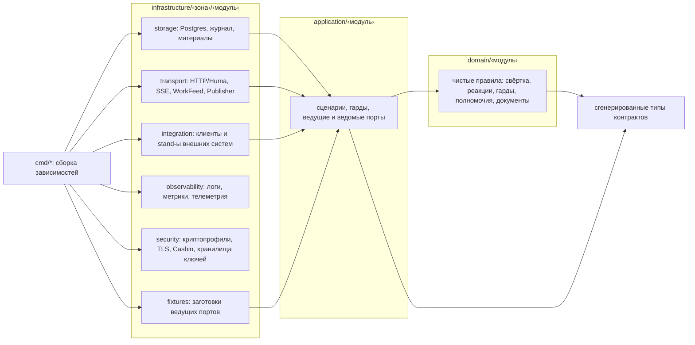
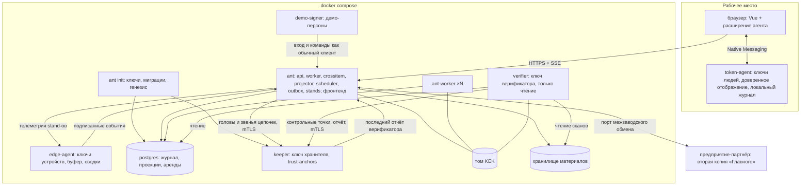
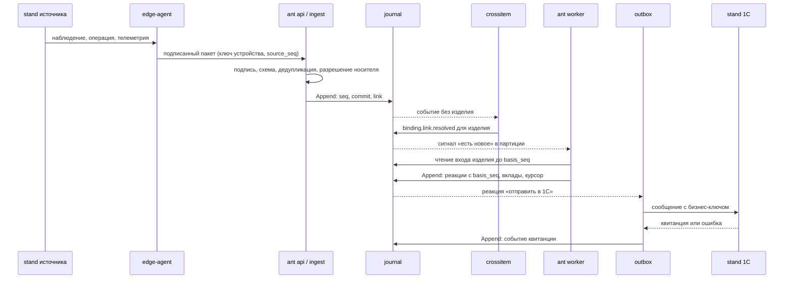

# Архитектура системы «Главный»

Документ для жюри и для команды, которая примет проект. Он пересказывает архитектурный спайн (`architecture-spine.md`) человеческим языком, связывает его с требованиями кейса и ведёт к подробным документам. Решения обозначены как в спайне: AD-1…AD-46. Требования — как в PRD (`prd.md`): FR-…, NFR-…. Пункты кейса — «кейс §…».

**Статус.** Документ написан до кода, по спайну. Структурные подробности (пути, имена типов, таблицы проекций) — затравка; когда появится код, источником правды становится код, а документ сверяется с ним (раздел «Уточнить после появления кода» в конце).

## Карта документов

| Вопрос | Документ |
|---|---|
| Как проверить каждый критерий оценки: команда, что увидеть, где в коде | [reviewer-guide.md](reviewer-guide.md) — путеводитель для проверяющих |
| Как работать на столе каждой роли, как запускать демо-сценарии | [guides/README.md](guides/README.md) — руководства ролей (тот же текст — во встроенной справке) |
| Как устроена система целиком | этот документ |
| Какие данные, записи, сущности, статусы, проекции | [data-model.md](data-model.md) |
| Где спецификации API, событий, BPMN, интеграций и как они проверяются | [specifications.md](specifications.md); генерация кода — [codegen.md](codegen.md) |
| Как масштабируется, где узкие места (кейс §3.1) | [scaling.md](scaling.md) |
| Как подключить OpenTelemetry и Kafka (кейс §3.1) | [observability-kafka-otel.md](observability-kafka-otel.md) |
| От чего защищаемся и от чего нет, меры приказа ФСТЭК № 117 | [threat-model.md](threat-model.md); ключи — [crypto.md](crypto.md) |
| Резервирование и восстановление (кейс §3.4) | [backup-restore.md](backup-restore.md) |
| 1С, Галактика:ERP, MES, КОМПАС-3D (кейс §3.3, §5.3) | [integrations/README.md](integrations/README.md) |
| Как подключить новый адаптер | [new-adapter.md](new-adapter.md) |
| Проект комплекса «камеры + ИИ» (кейс §2.1–2.2) | [vision-camera-project.md](vision-camera-project.md) |
| Компоненты кейса §3.2, Predictive, MobileOps, путь внедрения | [target-components.md](target-components.md) |
| Межзаводская кооперация, живое отслеживание у партнёров, межзаводской реестр | [federation.md](federation.md) |
| Как система отрабатывает сценарии кейса §4.2 и §5.1 | [scenario-processing.md](scenario-processing.md) |
| Документы по этапам процесса и маршруты подписей | [document-catalog.md](document-catalog.md) |
| Нормативные опоры (ГОСТ) | [normative-anchors.md](normative-anchors.md) |
| Ограничения, допущения, проектные предположения, границы эмуляции | [assumptions.md](assumptions.md) |
| Заимствованный код, лицензии, режимные требования | [third-party.md](third-party.md) |
| Термины | [glossary.md](glossary.md) |
| Требования и полное обоснование | [prd.md](prd.md), [architecture-spine.md](architecture-spine.md) |

## 1. Что это за система

«Главный» (в коде — `ant`) — доверенная система контроля качества для единичного и мелкосерийного производства ракетно-космической отрасли. Она собирает результаты контроля, производственные события, действия исполнителей и состояние оборудования в единую историю каждого экземпляра изделия, помогает рассмотреть несоответствие и разобрать его обстоятельства и не даёт изделию пройти закрывающую точку без подписанного решения уполномоченного человека.

Главные свойства:

- **Одна правда.** Всё, что система знает, — записи журнала, в который только дописывают. Всё, что она показывает, — проекции, пересчитываемые из журнала (AD-2). Исходный сигнал, вывод системы, решение человека и производный показатель различимы и связаны (кейс §7.2).
- **Машина ищет, человек решает.** Автоматика ограничивает (изолирует, блокирует, расширяет область риска), но не выпускает и не списывает сама, если организация явно не делегировала ей это правилом (AD-27, FR-144).
- **Подмену видно.** Записи сцеплены хешами, головы цепочек подписывает хранитель в отдельном процессе, независимый верификатор переигрывает журнал (AD-8, AD-9). Подписи людей и устройств ставятся ключами, которых нет на сервере (AD-11).
- **Процесс — данные.** Процесс описан в BPMN 2.0 XML с нашими расширениями; новая версия вступает в силу только после подписей кворума (AD-17). Новый процесс подключается без правки кода.
- **Замена без переписывания.** Хранилище, транспорт, внешние системы, наблюдаемость — за портами (AD-35). Эмуляторы внешних систем — это адаптеры за теми же протоколами (AD-18).

Граница: «Главный» — не MES и не ERP. Производственный учёт движения средств остаётся в 1С; туда уходят только учётные события на закрывающих точках (FR-91). Содержание производственного процесса (маршрут фланца, контрольные точки, нормы) — входной артефакт от PRD процесса; `ant` его исполняет.

## 2. Архитектурный подход и почему он подходит

**Гексагональная архитектура (порты и адаптеры), разложенная по слоям и пяти зонам кейса, плюс журнал событий как единственный источник истины (event sourcing / CQRS) с детерминированным функциональным ядром.** Процессы — модульный монолит: одна кодовая база, несколько точек входа; отдельные процессы — только по границам доверия.

| Требование кейса | Чем отвечает архитектура |
|---|---|
| §3 — разделить бизнес-правила и сценарии, хранение, внешние интерфейсы и транспорты, интеграционные адаптеры, наблюдаемость и защиту | слои `domain` и `application` + пять зон `infrastructure`: `storage`, `transport`, `integration`, `observability`, `security` (AD-1) |
| §3.4, §4.5, §7.2 — исходные события, анализ, решения и показатели различимы, связаны, воспроизводимы | журнал как единственный источник истины (AD-2, AD-44), журналируемые реакции (AD-3), проекции |
| §3.4, §5.1 «Изменение данных» — предотвратить или обнаружить | подписи личными ключами вне сервера (AD-11, AD-14), две хеш-цепочки и хранитель (AD-8), независимый верификатор (AD-9) |
| §3.1, §6.1 — масштабирование без двойного учёта и с сохранением порядка | фиксированные партиции по изделию (AD-6), идемпотентность (AD-7), детерминизм и порядок знания (AD-4, AD-37) |
| §3.1 — замена хранилища, транспорта, внешней системы; OpenTelemetry и Kafka | порты платформы с ключом конфигурации и контрактным тестом (AD-35) |
| §3.2 — «выделение каждого компонента в отдельный сервис не требуется» | модульный монолит, отдельные процессы только по границам доверия (AD-25) |
| §4.7, §6.2 — единый источник истины контрактов, обнаружение рассинхронизации | цепочка кодогенерации и проверки сборки (AD-20) |

**Что отвергли и почему.**

- Микросервис на каждый компонент §3.2 — кейс этого не требует; 24 часа работы и около 2,4 ГБ памяти на демо-машине; порядок событий между сервисами ломает детерминизм.
- CRUD и таблица аудита — такой журнал можно тихо переписать.
- Camunda / Flowable как движок BPMN — JVM, иностранные вендоры (Указ № 166); наш исполнитель — чистая функция над подмножеством BPMN.
- Блокчейн внутри предприятия — нет независимых сторон; описан как альтернатива за портом журнала и как межзаводской реестр ([federation.md](federation.md)).

**Цена решения** (названа, у обеих есть путь развития — раздел «Отложено»): на каждое событие изделие пересворачивается целиком; одна основная хеш-цепочка — точка сериализации записи.

## 3. Слои и зоны

| Зона кейса §3 | Где в коде | Примеры портов | AD |
|---|---|---|---|
| бизнес-правила | `backend/internal/domain/‹модуль›` | — (чистые функции) | AD-1, 4, 40 |
| производственные сценарии | `backend/internal/application/‹модуль›` | `Queries`, `Commands`, `AccessControl`, `JournalStore` | AD-1, 36, 39 |
| хранение и доступ к данным | `backend/internal/infrastructure/storage/‹модуль›` | `JournalStore`, `LeaseStore`, `MaterialStore`, репозитории проекций | AD-44, 45, 23 |
| внешние интерфейсы и транспорты | `backend/internal/infrastructure/transport/‹модуль›` | операции Huma, SSE, `WorkFeed`, `Publisher` | AD-20, 21, 35 |
| интеграционные адаптеры | `backend/internal/infrastructure/integration/‹модуль›/‹система›` | порт учёта, MES, КОМПАС, СКУД, УЦ, VisionQC, партнёр | AD-18, 19 |
| наблюдаемость и защита | `backend/internal/infrastructure/observability`, `backend/internal/infrastructure/security` | `Telemetry`, `Signer`, `Verifier`, `Cipher`, `AccessControl` | AD-10, 15, 23, 35 |

**Правила зависимостей (AD-1)** — проверяются автоматически в `make check` (`golangci-lint` + `depguard`, правила генерируются из списка модулей):

- зависимости направлены только к домену;
- `domain` импортирует только стандартную библиотеку, сгенерированные пакеты контрактов, чистую функцию хеша Стрибог и доменные модули, стоящие раньше в фиксированном порядке импорта (`reference → signing → access → … → crossitem → engine`);
- в `domain` запрещены часы, случайность, пакет `os` и числа с плавающей точкой (`forbidigo` и свой анализатор, AD-4);
- `application` объявляет порты и не знает про HTTP; операции регистрирует `transport`;
- зоны `storage`, `transport`, `integration`, `fixtures` не импортируют друг друга, только порты `application`; сборка зависимостей — только в `backend/cmd/*`;
- у каждого модуля своя схема Postgres, свои миграции и свои запросы sqlc; запрос к чужой схеме ловит `make check`.

## 4. Модули

Модуль — одноимённая папка на каждом слое. У каждого семейства событий один модуль-владелец схемы, у каждого типа записи — один модуль-эмитент, у каждой проекции — один писатель (AD-40, соглашение «Владение данными»).

| Модуль | Ответственность | Компонент кейса §3.2 |
|---|---|---|
| `journal` | единственная функция записи `journal.Append`, две хеш-цепочки, контрольные точки, чтение по оси и моменту | Централизованное ядро |
| `engine` | композиция свёртки изделия, сценарий воркера | Централизованное ядро |
| `crossitem` | межизделийная стадия: генеалогия, партии, оборудование, разрешения на отклонение, инциденты, привязка событий, документы вне изделия | Централизованное ядро, ErrorAnalysis |
| `ingest` | приём: подпись, схема, дедупликация, карантин, разрешение носителя, импорт CSV/Excel | Edge-агенты и защищённый обмен |
| `reference` | справочники с версиями, календарь и смены, соответствия внешних ID | Централизованное ядро |
| `process` | нормативный слой, версии, кворум, исполнитель BPMN | Централизованное ядро |
| `item` | паспорт изделия, зоны, носители идентификатора | Централизованное ядро |
| `quality` | результаты контроля, сигналы, дефекты, карта реакций, методы и покрытие | VisionQC (границы) |
| `nonconformity` | несоответствия, решения, сдерживание, изоляция | ErrorAnalysis |
| `analysis` | разбор обстоятельств, гипотезы, общие факторы, область риска, карта дефицита данных, предложения, корректирующие меры | ErrorAnalysis |
| `machinelogs` | события оборудования, профиль выполнения операции | MachineLogs |
| `vision` | порты VisionQC и OperatorVision, карты контроля, паспорта допуска, откат | VisionQC, OperatorVision |
| `documents` | шаблоны, отрисовка, отпечаток, жизненный цикл, закрытие маршрута подписей | CriticalActions |
| `signing` | криптопрофили, пакеты, проверка подписей, реестр ключей, акты, генезис | Хранение и защита (§3.4) |
| `access` | политика, роли, полномочия, цифровые клейма, обязательные подписи, допуск к рабочему месту, СКУД, вход, объяснение прав | Хранение и защита (§3.4) |
| `security` | сервис доверенных решений, журнал критических действий, шина безопасности | CriticalActions |
| `materials` | хранилище материалов по адресу содержимого | Хранение и защита (§3.4) |
| `notifications` | сроки, задачи, уведомления, эскалации с ценой задержки | Централизованное ядро |
| `analytics` | вклады изделий и агрегаты показателей, контрольные карты, счётчики узлов, ограничение линии | Централизованное ядро |
| `erp` / `mes` / `cad` | 1С и Галактика:ERP, MES, КОМПАС-3D, их stand-ы | Интеграции (§3.3) |
| `federation` | межзаводской обмен, выписки паспорта, партнёры | кооперация |
| `simulation` | генератор, прогоны, виртуальные часы, пауза, автосверка | Simulation |
| `ops` | состояние компонентов, настройки источников и адаптеров, остановленные изделия | Администрирование |

Predictive и MobileOps — описание, без отдельного модуля в MVP ([target-components.md](target-components.md)).

## 5. Процессы, контейнеры и границы доверия

Точки входа (AD-25):

| Точка входа | Что делает | Почему отдельный процесс |
|---|---|---|
| `backend/cmd/ant` | роли флагом: `api`, `worker`, `crossitem`, `projector`, `scheduler`, `outbox`, `stands`, `init`, `migrate`, `rebuild`; фронтенд встроен в бинарник | основное приложение |
| `backend/cmd/keeper` | хранитель контрольных точек: принимает головы цепочек, подписывает контрольные точки, хранит отчёты верификатора | другой административный домен (AD-8) |
| `backend/cmd/verifier` | независимый верификатор, только чтение | не доверяем проверяемому (AD-9) |
| `backend/cmd/token-agent` + `extension/` | агент токена: ключи людей, доверенное отображение, локальный журнал подписанного | ключи людей не на сервере (AD-11, AD-14) |
| `backend/cmd/edge-agent` | у источника: ключ устройства, `source_seq`, буфер исходных конвертов, досылка, сводки телеметрии | ключи устройств не на сервере; работа при недоступности ядра (FR-39) |
| `backend/cmd/demo-signer` | подписи демо-персон в автопрогонах сценариев | ключи демо-персон вне `ant` (AD-33) |
| `backend/cmd/tamper` | демо-инструмент подделки в обход системы; только профили `fixtures` и `demo` | показать обнаружение (FR-74) |

В демо все границы доверия — контейнеры на одном хосте, ключи создаёт один `init`: показывается механизм, а не независимость сторон. В промышленной эксплуатации хранитель — хост службы ИБ или военного представительства в другом административном домене, верификатор — также на рабочем месте ВП ([threat-model.md](threat-model.md)).

## 6. Путь события

1. **Источник.** Stand источника (или реальное оборудование, камера, терминал) отдаёт наблюдение edge-агенту. Edge-агент подписывает событие ключом устройства, ведёт номер `source_seq`, хранит исходные байты в буфере до подтверждения и досылает их с исходным `occurred_at` (FR-39).
2. **Приём** (`ingest`, AD-7, AD-20, AD-41). Проверка подписи (зарегистрированный, не отозванный ключ — FR-26), проверка тела теми же JSON Schema, что лежат в контракте (FR-29), дедупликация по `source_id + event_id` и отпечатку канонического содержимого (FR-31), разрешение носителя идентификатора в внутренний `item_id` чистой функцией (FR-34). Невалидное — в карантин с кодом; сам факт помещения в карантин — служебная запись журнала (FR-30). Ответ — `problem+json` с кодом из `contracts/errors.yaml`.
3. **Запись** (`journal.Append`, AD-44). В одной транзакции: проверка аренды партиции, блокировка головы цепочки, проверки конкурентности, вычисление звена хеш-цепочки, вставка. Запись получает `seq`, `committed_at`, `recorded_at`.
4. **Межизделийная стадия** (`crossitem`, AD-42). События без изделия (станок, партия, СКУД) привязываются к изделиям; генеалогия, область риска, распространение сдерживания по дереву сборки — здесь, адресованными записями изделиям.
5. **Свёртка** (`engine`, воркер партиции, AD-5). На каждую новую запись в потоке изделия воркер заново сворачивает весь вход изделия чистой функцией `Fold(версия процесса, вход) → состояние + реакции` и сравнивает вычисленные реакции с записанными: новые дописываются, изменённые — новой версией слота с пометкой «пересмотрен из-за записи ‹id›», исчезнувшие — по правилам AD-3 (защитные не снимаются сами).
6. **Проекции и живые обновления** (AD-45, AD-21). В той же транзакции обновляются проекции модулей и вклад изделия в показатели; фронтенд получает по SSE сигнал «сущность, id, `seq`» и перечитывает данные через сгенерированный клиент. Бюджет от приёма до экрана — 2 с (FR-2).
7. **Наружу** (`outbox`, AD-7, AD-18). Отправка во внешние системы — тоже реакция в журнале. Роль `outbox` (одна копия-лидер) отправляет её с бизнес-ключом идемпотентности; квитанция или ошибка — новое событие. При воспроизведении `outbox` не запущен.

## 7. Журнал — единственный источник истины

Подробно — [data-model.md](data-model.md).

- **Четыре вида записей** (AD-2): факт (источник), реакция движка, решение человека, служебная (время, политика, ключи, контрольные точки, генезис, карантин). Производные показатели — проекции, в журнал не пишутся.
- **Происхождение.** У факта — `source_kind` (ручной ввод / станок / датчик / камера / внешняя система / импорт) и `reliability`; пометка источника видна в интерфейсе (FR-140). У каждой записи — класс происхождения подписи: `device`, `personal`, `paper`, `partner`, `server-attested`, `scenario`, `genesis`. Разрешающее действие не может опираться только на факты, подписанные ключами самого сервера.
- **Исправление — новая запись** (`corrects_event`: было / стало / кто / причина; FR-122). Удалять и менять записи невозможно: у роли приложения нет `UPDATE`/`DELETE`/`TRUNCATE`, стоят триггеры, таблицами владеет отдельная роль без входа (AD-2).
- **Реакции журналируются** (AD-3). Реакция — это «что система сделала»: блок, изоляция, черновик несоответствия, задача, уведомление, эскалация, отправка наружу, версия вывода разбора или области риска, приостановка паспорта допуска, срок. У реакции есть слот (правило, субъект, ключ срабатывания) и версия; пересмотр — следующая версия того же слота. Реакции не входят в свёртку изделия — свёртка вычисляет их заново; записанные нужны для сравнения, ссылок и проверки верификатором.
- **Две хеш-цепочки** (AD-8): основной журнал и журнал критических действий. Запись критического действия пишется в той же транзакции, что и основная.

## 8. Движок

- **Композиция** (AD-40). `domain/engine.Fold` вызывает чистые функции модулей в фиксированном порядке `item → process → vision → quality → machinelogs → documents → nonconformity → analysis → notifications`. Ранний модуль узнаёт вывод позднего только через свою доменную функцию-намерение, которую вызывает поздний. Задачи, уведомления и сроки порождает только `notifications`, последним.
- **Детерминизм** (AD-4, NFR-DET-1). Домен не читает часы, не использует случайность, не зависит от порядка обхода map, не использует float (уверенность — целые базисные пункты `confidence_bp`, измерения — целое + единица + масштаб). Тест детерминизма сворачивает каждый сценарий дважды в разных процессах и сравнивает хеши. Поэтому один и тот же доменный код дают один результат у воркера, при воспроизведении, на заготовках и у верификатора.
- **Время** (AD-37). У записи три координаты: `seq` — порядок знания; `committed_at` — реальные часы, покрыты контрольными точками; `recorded_at` — доменные часы (в сценарии — виртуальные). Криптографические моменты (действительность ключа, контрольные точки) — по `seq` и `committed_at`; деловые (срок полномочия, квалификация на дату, сроки решений) — по доменному времени. Порядок в пределах изделия — `occurred_at → received_at → event_id` (FR-32).
- **Нормативный слой и BPMN** (AD-17). Процесс — BPMN 2.0 XML, наши свойства — в `extensionElements` пространства `urn:ant:bpmn-ext:1` (метод контроля, зона, точка предъявления, лимит доработок, предусловия, документы шага, карта реакций, признак специального процесса, заверитель бумажной подписи, нормативные опоры `ant:normRef`). Исполнитель — чистая функция `версия + вход изделия → положение токенов + обязательства`. Поддерживаемое подмножество: задачи трёх видов, шлюзы И/ИЛИ, события начала, конца (включая terminate), промежуточные, стартовое событие по сообщению из 1С, граничные таймеры (окно «кромки → сварка»), встроенные и вызываемые подпроцессы (общий подпроцесс «Брак» с возвратом в точку вызова), потоки с условиями на собственном минимальном языке без вызовов функций, циклы; неявные слияния стрелок запрещены — загрузчик отклоняет их с id узла (решения Д-4…Д-8). Версия вступает в силу только с полным набором подписей кворума над листом утверждения; изделие исполняется по версии, закреплённой при запуске (PRD §11.9).
- **Межизделийная стадия** (AD-42) — одна копия-лидер; порядок «изделие → стадия → изделие» и тест неподвижной точки не дают стадии зациклиться.

## 9. Решения, полномочия, подписи

- **Классы действий** (AD-27, FR-144). Каждая операция API и каждая реакция объявляют класс в каталоге: защитное и обратимое (заблокировать, изолировать, расширить область риска, назначить доп. контроль) — движок делает сам; разрешающее (снять блок, исключить из области риска, пропустить контроль, вернуть анализатор) — только по явно делегированному правилу режима 2 или человеком; необратимое и инженерное (списать, ремонт, «как есть», подтвердить причину, изменить техпроцесс) — только уполномоченный человек по маршруту. `make check` падает, если у операции нет класса.
- **Режимы автоматизации 1–5** (FR-50) несёт правило нормативного слоя вместе с владельцем, утвердившим, сроком и рамками; карточка показывает «почему система остановила эти изделия»: правило, ревизию, владельца, основания.
- **Сервис доверенных решений** (AD-28, FR-146). Единственный путь критического действия — `application/security.CriticalActions.Execute`: гард класса и полномочий → основная запись → запись журнала критических действий (действие, объект, было → стало, кто, полномочие и цифровое клеймо, основание, материалы) → одна транзакция. Отмена — только новой записью «отменяет CA-…».
- **Уровни подписи и маршрут** (AD-13, PRD §11.16). Уровень определяет, как собирается одна подпись: 0 — устройство; 1 — только факты исполнителя и физические подтверждения мастера (перечень вкомпилирован в агент токена); 2 — доверенное отображение сводки и явное подтверждение, в том числе пачкой; все заключения ОТК и критические действия — не ниже 2; 3 — сменный рапорт над корнем дерева Меркла. Маршрут определяет, кто, сколько и в каком порядке подписывает; обязательные подписи вычисляет одна чистая функция `domain/access.RequiredApprovals` (AD-43). «Маршрут закрыт» — только реакция модуля `documents`.
- **Два равноправных пути подписи** (FR-69, FR-139): агент токена или бумага с QR. Бумажную подпись всегда заверяет второй человек своей цифровой подписью уровня 2; кто заверяет — свойство шага BPMN.
- **Документы** (AD-12) — детерминированные проекции журнала по шаблону шага; редактировать нельзя, новая версия — новый отпечаток. Перечень — [document-catalog.md](document-catalog.md).

## 10. Доступ

Права — данные политики «кто — что — над чем — где» (AD-15). Casbin — единственный вычислитель решений; источник политики — журнал; изменения политики — записи `policy.*` через маршрут подписей; каждая команда несёт `policy_seq`, и команда по устаревшей политике отвергается (AD-39). Три барьера:

1. **Вход** — логин и пароль, сеанс (`scs` + `argon2id`), защита от перебора; следующий адаптер `IdentityProvider` — LDAP / ALD Pro / FreeIPA.
2. **Допуск к рабочему месту** — СКУД в зоне ∧ роль в области места ∧ квалификация на дату ∧ назначение на пост в смене ∧ токен и PIN; допуск и снятие — записи журнала.
3. **Действие** — каждая операция объявляет id и класс; сервер решает по политике, месту сеанса и доменным гардам. Фронтенд только отображает допустимые действия, вычисленные тем же `Enforce`.

Три административных домена: администратор системы (ОС, Postgres, контейнеры; прав в приложении нет), администратор безопасности (роль кейса «Администратор»; привилегированные выдачи — со второй подписью независимой стороны по AD-11), Аудитор ИБ (только чтение: верификатор, журнал критических действий, шина безопасности, история выдачи прав, параметры аудита).

## 11. Доверие и целостность

Кратко; полностью — [threat-model.md](threat-model.md), ключи — [crypto.md](crypto.md).

- Хранитель (`keeper`) раз в N секунд принимает головы обеих цепочек со звеньями и принимает новую голову, только если цепочка продолжена, а не переписана; контрольная точка подписана гибридным профилем.
- Верификатор — отдельный процесс с ролью БД только на чтение и корнями доверия из файла `trust-anchors` вне БД; проверяет цепочки, подписи и профили на момент подписи, права подписанта по политике, построенной из журнала, подписи кворума версии процесса, реакции пересвёрткой, непрерывность `source_seq`, отрисовку документов, задержку записи и расхождение проекций с журналом. Вердикт — «цело» / «цело с оговорками» / место и тип нарушения; отчёт подписан ключом верификатора и хранится у хранителя.
- Формат подписанного пакета один (AD-10): DSSE над каноническим JSON (RFC 8785); профили `gost` (ГОСТ Р 34.10-2012, Стрибог-256), `pq` (ML-DSA-65, демонстрационный), `hybrid` (обе подписи обязательны). Метаданные кейса §6.3 — внутри подписанного содержимого.
- Шифрование при хранении (AD-23) — конвертная схема (DEK на объект, KEK в отдельном томе); цепочка строится над обязательством с солью, поэтому смена ключа шифрования не трогает доказательства.
- Шина безопасности (AD-24) — семейство `security` в журнале; подписчики подключаются без изменения источников.
- `make tamper` показывает три атаки: правка записи → нарушение звена; правка с пересчётом цепочки → расхождение с контрольной точкой; правка проекции → «проекция расходится с журналом … (CA-…)». Та же попытка через API — 403 или 405.

## 12. Интеграции

Подробно — [integrations/README.md](integrations/README.md). Внешние системы — адаптеры `infrastructure/integration/‹модуль›/‹система›`; «эмулятор» кейса — stand, адаптер за протоколом реальной системы со своим состоянием и управляемыми сбоями (AD-18). Порт учёта говорит на нашем языке: на вход — производственное задание, справочник номенклатуры, поступившая партия; на выход — принято в работу, смена склада, перевод в брак, возврат поставщику, выпуск, результат контроля. Внешние ID — только записями соответствий (FR-95). Каждый адаптер при старте сверяет версию контракта ответной стороны; при расхождении канал `degraded` и ничего не отправляет. Несовместимость контракта ловит сборка до отправки результата в 1С (`make contract-demo`).

## 13. Фронтенд

- Vue 3 + TypeScript, Feature-Sliced Design (`frontend/src/{app,pages,widgets,features,entities,shared}`). Рабочий стол роли — данные (`normative/desks/‹роль›.yaml`: раскладка → слоты → виджеты → параметры среза); новая роль и новый стол — конфигурацией (NFR-EXT-1, AD-21).
- Серверные данные — только в кэше Vue Query через клиент, сгенерированный orval из `contracts/openapi.yaml`; ручные HTTP-вызовы запрещены ESLint (NFR-DEV-2).
- Живые обновления — SSE; во всех запросах чтения — ось `axis=occurred|recorded` и момент `as_of`: «как было» и «что мы знали» (AD-22). В воспроизведении действия выключены правилом прав.
- Живая карта — просмотрщик bpmn-js с наложениями; редактор процесса — модельер bpmn-js с панелью наших свойств. Экран не приписывает данным смысл, которого нет в контракте (NFR-UI-4): уверенность ≠ вероятность брака, «оценка невозможна» ≠ «годно».

## 14. Режим заготовок и тестовые сценарии

- **Заготовки** (AD-36, FR-150) — не макет, а адаптер `infrastructure/fixtures/‹модуль›` за теми же ведущими портами `Queries` / `Commands`, что и живой движок. Контракт API один; авторизация и гарды — общий декоратор для обеих реализаций. Переключение — конфигурацией (ключ `ports.mode: fixtures | live` в `deploy/config/ant.yaml`, профиль `fixtures`), в том числе вертикальными срезами; режим виден в ответе API и меткой на виджете.
- **Тестовые сценарии** (AD-26, AD-38) идут через обычный вход: stand-ы источников → edge-агент → приём. Каждый прогон — своё пространство имён `run_id`, генератор детерминирован по seed, время — доменные часы сценария, пауза останавливает поток и часы. На решении человека сценарий ждёт решения на столе роли или (в автосверке) его подписывает `demo-signer` как обычный клиент. Ожидаемые результаты хранятся отдельно (`scenarios/expected/`) и сверяются теми же запросами API — табло «ожидалось → получилось». Подробно — [scenario-processing.md](scenario-processing.md); как запускать с пульта и читать табло — [guides/demo_scenarios.md](guides/demo_scenarios.md).

## 15. Масштабирование

Подробно — [scaling.md](scaling.md). Коротко: P фиксированных партиций по `hash(item_id)` с арендой и эпохой в Postgres; воркеры масштабируются горизонтально; межизделийные расчёты — отдельная стадия с явным порядком; названные узкие места — запись в основную хеш-цепочку, копии-лидеры (`crossitem`, `scheduler`, `outbox`, `stands`, `projector`), Postgres, хранитель. Две проверки «1 = N»: `rebuild_hash` и `state_hash`.

## 16. Расширяемость: порты платформы

Внешняя зависимость — только за портом, у каждого порта ключ конфигурации и общий контрактный тест для всех адаптеров (AD-35).

| Порт | Зона | MVP | Замена (описано) | Проверка |
|---|---|---|---|---|
| `JournalStore` | storage | Postgres | BFT-реестр | верификатор |
| `LeaseStore` | storage | Postgres | k8s Lease | тест эпох аренды |
| `MaterialStore` | storage | том | S3-совместимое хранилище в контуре | тест по адресу |
| `WorkFeed` | transport | партиции в Postgres | Kafka, `key = item_id` | контрактный тест + `state_hash` на Kafka |
| `Publisher` | transport | HTTP с повтором | брокер | эталонные сообщения |
| ведущие `Queries` / `Commands` | fixtures / application | `live` | `fixtures` | путь пользователя на обоих |
| `Telemetry` | observability | Prometheus `/metrics` | OTLP (OpenTelemetry) | тест с экспортёром в память |
| `Signer` / `Verifier` / `Cipher` | security | агент токена, бумага, `demo-signer`; GoGOST, `crypto/mldsa` | PKCS#11; сертифицированное СКЗИ | `scenarios/crypto` |
| `AccessControl` | security | Casbin | — | автотесты прав |
| `IdentityProvider` | security | локальные пользователи | LDAP / ALD Pro / FreeIPA | тест входа |
| `DomainClock` / `InfraClock` | application / storage | системные часы | доменное «сейчас» из журнала в режиме сценария | сценарии |
| внешние системы | integration | stand-ы | реальные 1С, Галактика:ERP, MES, СКУД, УЦ, VisionQC | контрактные тесты |

Как подключить OpenTelemetry и Kafka — [observability-kafka-otel.md](observability-kafka-otel.md); как написать новый адаптер — [new-adapter.md](new-adapter.md). Новый генератор предложений подключается к порту генераторов без изменения ядра (FR-63).

## 17. Развёртывание и эксплуатация

- **Демо** (FR-109): `docker compose up` на чистой машине без интернета; интерфейс — `http://127.0.0.1:8480/`, проверки живости — `/healthz` и `/readyz`. Одноразовая роль `init` генерирует ключи в тома, сертификаты mTLS, применяет миграции и пишет блок генезиса; затем поднимаются `postgres`, `ant` (все роли, кроме дополнительных воркеров), `ant-worker ×N`, `keeper`, `verifier`, `edge-agent`, `demo-signer`. Лимиты памяти — под ~2,4 ГБ.
- **Сборка** — только в контейнерах (многоступенчатый `deploy/Dockerfile` на `golang:1.27.1` и `node:24.21.0-slim`, исполнение — distroless static); Go и Node.js на машине не нужны. Зависимости — `go mod vendor` и офлайн-кэш npm; шрифты и иконки локальные (NFR-SEC-1).
- **Конфигурация** — `deploy/config/ant.yaml` + переменные `ANT_*` (порядок наложения: `defaults` → `profiles.‹профиль›` → `ANT_*`), профили `fixtures` / `demo` / `load` / `prod`, выбор — `ANT_PROFILE`. Секретов в переменных нет: ключи — только файлами в томах с правами 0400. Параметры аудита — не конфигурация, а подписанные данные журнала. Профиль `prod` не стартует с ключами класса `scenario`, с `demo-signer` или `cmd/tamper`.
- **Эксплуатация**: самопроверка после старта, liveness / readiness, JSON-логи, `/metrics`, `ant rebuild` (пересборка проекций; `--item` — одно изделие), модуль `ops` — состояние сервисов, очередей, карантина, интеграций, остановленных изделий и последнего отчёта верификатора (FR-127).
- **Makefile** (`make help` — все цели): `up`, `down`, `demo`, `build`, `dev-db`, `generate`, `check`, `contract-demo`, `tamper`, `keys`, `load`, `verify`, `rebuild`, `licenses`, `token-agent`.

| Окружение | Состав | Отличия |
|---|---|---|
| Разработка | `make build`, `make dev-db` — своя БД на агента | профиль `fixtures` или `demo` |
| Демо / проверка жюри | `docker compose up` на одной машине, офлайн | stand-ы вместо внешних систем; программные ключи; генезис; хранитель — отдельный контейнер |
| Нагрузочный прогон | то же + `ant-worker ×N`, профиль `load` | отчёт о задержках, потерях, повторах, полноте; `rebuild_hash` и `state_hash` |
| Промышленный (описание) | манифесты k8s (`deploy/k8s`); хранитель у ИБ или ВП; верификатор также на рабочем месте ВП; корпоративный УЦ; сертифицированное СКЗИ и PKCS#11-токены; LDAP / ALD Pro; церемония ключей | Kafka и OpenTelemetry — адаптерами за портами |

## 18. Стек

Go 1.27.1 (Huma v2 — OpenAPI 3.1 из Go, pgx, sqlc, goose, Casbin, scs, GoGOST 7.0.0, go-securesystemslib/dsse, prometheus/client_golang), PostgreSQL 18.6, Vue 3.5 + Vite + Pinia + Vue Router + Naive UI + TanStack Vue Query + orval + CASL, bpmn-js, ECharts. Точные версии — в спайне (раздел Stack) и в файлах зависимостей; полный перечень зависимостей с лицензиями — `docs/licenses/` (`make licenses`); режимные оговорки — [third-party.md](third-party.md).

## 19. Соответствие требованиям кейса

| Требование кейса | Где в архитектуре | Документ |
|---|---|---|
| «Что должно работать»: приём и обработка результатов контроля, событий, действий, состояния оборудования | `ingest`, `journal`, `edge-agent`, `machinelogs`, `vision`; AD-2, 5, 7, 29, 41, 44 | этот документ, [data-model.md](data-model.md) |
| Прослеживаемость в единой истории | `item`, `crossitem`, паспорт изделия, генеалогия; AD-16, 41, 42 | [data-model.md](data-model.md) |
| Несоответствие: исходное сообщение / решение контролёра / итоговый статус | `quality`, `nonconformity`; виды записей AD-2; оси статусов AD-30 | [data-model.md](data-model.md) |
| Разбор обстоятельств | `analysis`, `machinelogs`, экран трёх дорожек; AD-29, 42 | [scenario-processing.md](scenario-processing.md) |
| Аналитика | `analytics`, вклады изделия; AD-45 | [data-model.md](data-model.md) |
| Интеграция с эмулятором и описание 1С, Галактика, MES, КОМПАС-3D | `erp`, `mes`, `cad`, stand-ы; AD-18 | [integrations/README.md](integrations/README.md) |
| Характеристики оборудования, камер, алгоритмов — проектные предположения | NFR-DOC-2 | [vision-camera-project.md](vision-camera-project.md), [assumptions.md](assumptions.md) |
| §2.1–2.2 Проект «камеры + ИИ», адаптация | `vision`; AD-29 | [vision-camera-project.md](vision-camera-project.md) |
| §3 Разделение слоёв, выбор подхода | AD-1, парадигма | разделы 2–3 |
| §3.1 Масштабирование, узкие места, OpenTelemetry и Kafka | AD-6, 35 | [scaling.md](scaling.md), [observability-kafka-otel.md](observability-kafka-otel.md) |
| §3.2 Состав целевой системы | модули и точки входа | раздел 4, [target-components.md](target-components.md) |
| §3.3, §5.3 Интеграции | AD-18 | [integrations/README.md](integrations/README.md) |
| §3.4 Хранение и защита, резервирование, границы защиты | AD-2, 8, 9, 23, 34 | [threat-model.md](threat-model.md), [backup-restore.md](backup-restore.md) |
| §4.4, §4.7 Состав сигнала, контракты и версии | AD-20, 40, 44 | [data-model.md](data-model.md), [specifications.md](specifications.md) |
| §5.1 Проверочные сценарии, ожидаемые результаты отдельно | AD-26 | [scenario-processing.md](scenario-processing.md) |
| §6.2 Кодогенерация | AD-20 | [codegen.md](codegen.md), [specifications.md](specifications.md) |
| §6.3 Метаданные долгосрочной защиты, смена профиля | AD-10, 32 | [crypto.md](crypto.md), [threat-model.md](threat-model.md) |
| §6.4 Материалы воспроизведения | `scenarios/` | [scenario-processing.md](scenario-processing.md) |
| Т5 Документация: архитектура, схемы данных, API-спецификации, сценарии, ограничения | — | этот документ, [data-model.md](data-model.md), [specifications.md](specifications.md), [scenario-processing.md](scenario-processing.md), [assumptions.md](assumptions.md); руководства ролей — [guides/README.md](guides/README.md); путеводитель — [reviewer-guide.md](reviewer-guide.md) |
| О9 Модель угроз, ключи, смена профилей | AD-10, 11, 32, 34 | [threat-model.md](threat-model.md), [crypto.md](crypto.md) |
| О1 Отраслевые нормы | нормативный слой, `ant:normRef` | [normative-anchors.md](normative-anchors.md), [document-catalog.md](document-catalog.md) |

## 20. Отложено

| Что | Почему можно ждать |
|---|---|
| Адаптеры Kafka и OpenTelemetry | порты есть (AD-35), PRD требует описания (FR-113) — [observability-kafka-otel.md](observability-kafka-otel.md) |
| Цепочки по партициям | одна основная цепочка — названное узкое место; вернуться, если нагрузочный прогон упрётся в запись |
| Постквантовая подпись пачкой событий, а не каждого | на объёмах демо допустимо |
| Окно подтверждения в локальной программе агента вместо страницы расширения | цель AD-14; разница названа в модели угроз |
| PKCS#11-токен, сертифицированное СКЗИ, X.509 с ГОСТ и внешний УЦ, CAdES, LDAP / ALD Pro / FreeIPA | за существующими портами; промышленный контур |
| Шлюзы внешних систем отдельным процессом со своим ключом | промышленный путь для фактов `server-attested`; в MVP класс помечен и ограничен |
| Вторая независимая реализация проверки ключевых правил верификатором | описание; смягчение — воспроизводимая сборка и хеш бинарника в отчёте |
| Промышленная церемония ключей, акт восстановления, разделение секрета KEK | описание ([backup-restore.md](backup-restore.md), [threat-model.md](threat-model.md)) |
| Живое отслеживание у партнёров, межзаводской реестр | описание ([federation.md](federation.md)) |
| Predictive, MobileOps | описание ([target-components.md](target-components.md)) |
| Прямое подключение к КОМПАС-3D через COM | описание; в MVP — импорт файла ([integrations/kompas.md](integrations/kompas.md)) |

## Уточнить после появления кода

- Сверить таблицу модулей и точек входа с `backend/cmd/*` и `backend/internal/*`; убрать модули, которых нет, добавить появившиеся.
- Проверить, что порядок импорта доменных модулей в документе совпадает со сгенерированными правилами `depguard`.
- Заменить слова «предварительно» на фактические имена типов событий из `contracts/events/catalog.yaml` в примерах пути события.
- Добавить ссылки на конкретные пакеты: `journal.Append`, `domain/engine.Fold`, `application/security.CriticalActions.Execute`, `domain/access.RequiredApprovals`.
- Указать фактические лимиты памяти контейнеров из `deploy/compose` и значения по умолчанию P, N, K из `deploy/config/ant.yaml`.
- Проверить, какие роли `cmd/ant` реально собраны к сдаче, и отметить неготовые как «описание».
