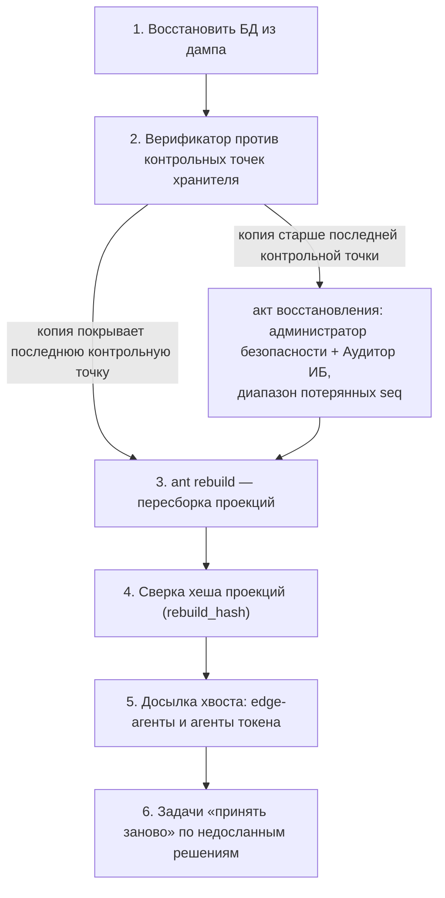

# Резервирование и восстановление

Что резервируется, что нет, как восстановиться и как отличить законное восстановление от отката истории. Опоры: AD-8, AD-23, AD-32, AD-33, AD-34, AD-45; FR-115, FR-120; кейс §3.4 («резервирование, восстановление и границы защиты описываются в архитектуре»); критерии Т3, О9.

**Статус.** В MVP построено восстановление проекций из журнала (`ant rebuild`) и проверка журнала верификатором против контрольных точек хранителя. Процедуры резервного копирования, акт восстановления и разделение секрета KEK — описание (FR-115: «Описание; MVP — восстановление проекций из журнала»).

## 1. Принцип

Доказательная ценность системы — в журнале и в контрольных точках, которые хранятся **вне** основного хранилища. Проекции — производные и пересобираются. Поэтому резервируются журнал и то, без чего его нельзя прочитать или проверить; не резервируется то, что пересобирается или что безопаснее перевыпустить.

## 2. Что резервируется

| Объект | Где живёт | Как резервируется | Кто отвечает | Почему |
|---|---|---|---|---|
| Журнал (схема `journal`, включая цепочку критических действий и `journal.dek_wraps`) | Postgres | дамп Postgres (логический или физический с WAL); копия шифрована тем же конвертным ключом — содержимое без KEK не читается | администратор системы | единственный источник истины |
| Схемы модулей со справочниками, если они не только проекции | Postgres | тем же дампом | администратор системы | ускоряет восстановление; при расхождении прав журнал |
| Контрольные точки и открытые ключи хранителя, отчёты верификатора | том `keeper` | копия тома в другом административном домене | служба ИБ / ВП | доказывают, что журнал не переписан после точки |
| Файл `trust-anchors` | том `keeper`; в промышленности — у ИБ или ВП на отчуждаемом носителе | копия вне `ant` | Аудитор ИБ | корни доверия верификатора |
| KEK | отдельный том, в `ant` монтируется только на чтение | отдельно от дампа; в промышленности — разделение секрета M из N у ИБ (описание) | служба ИБ | без KEK журнал не расшифровать; вместе с дампом не хранить |
| Хранилище материалов (сканы, иллюстрации, вложения, содержимое карантина) | том / `MaterialStore` | копия тома; объекты адресуются хешем содержимого | администратор системы | скан бумажной подписи нужен верификатору для сверки QR |
| Локальные журналы агентов токена и буферы edge-агентов | рабочие места и устройства | не копируются централизованно; хранятся до подтверждения контрольной точкой | — | источник досылки хвоста после восстановления |

## 3. Что не резервируется

| Объект | Почему | Как восстанавливается |
|---|---|---|
| Проекции всех модулей | производные от журнала | `ant rebuild` пересобирает; хеш проекций сверяется |
| Закрытый ключ хранителя | при утрате — новый ключ по акту безопаснее, чем копия ключа | новый ключ регистрирует акт Аудитора ИБ и администратора безопасности; входит в новый файл `trust-anchors` (AD-32) |
| Закрытые ключи движка и шлюзов | то же | новый ключ по акту; старые подписи остаются проверяемыми по открытым ключам |
| Закрытые ключи людей и устройств | на сервере их нет | остаются на токенах и в edge-агентах |
| Закрытый ключ-якорь генезиса | уничтожен сразу после подписи генезиса | не нужен: генезис проверяется по отпечатку в `trust-anchors` |

## 4. Восстановление

1. **База.** Поднять Postgres, восстановить дамп журнала; смонтировать KEK только на чтение.
2. **Проверка журнала.** Верификатор (роль БД только на чтение, корни — из `trust-anchors`) проверяет цепочки и сравнивает головы с контрольными точками хранителя. Если журнал из копии **старше последней контрольной точки**, верификатор принимает его только при подписанном **акте восстановления** (администратор безопасности + Аудитор ИБ) с диапазоном потерянных номеров `seq`. Без акта это **«откат»** — нарушение целостности, а не восстановление.
3. **Проекции.** `ant rebuild` пересобирает все проекции из журнала (на время пересборки берёт все аренды; `--item` — одно изделие).
4. **Сверка.** Хеш проекций после пересборки сравнивается с ожидаемым (`rebuild_hash`, [scaling.md](scaling.md)); верификатор сверяет проекции с пересвёрткой — расхождение даёт «проекция расходится с журналом».
5. **Хвост.** Edge-агенты досылают исходные конверты из буфера (буфер хранится до подтверждения контрольной точкой), агенты токена — подписанные решения по локальному журналу. Приём идемпотентен: уже записанное не задваивается.
6. **Потерянное.** Решения, которые не удалось дослать, акт восстановления перечисляет как потерянные; по ним ставятся задачи принять заново. Внешние системы не получают повторных сообщений: исходящие идут по бизнес-ключу идемпотентности (AD-7).

## 5. Частные случаи

| Ситуация | Что делаем |
|---|---|
| Потеряна только БД проекций / испорчена проекция | `ant rebuild`; если правку сделали в обход системы — верификатор покажет расхождение и номер критического действия |
| Одно изделие «обработка остановлена» | `ant rebuild --item ‹id›` после исправления причины (AD-45) |
| Утрачен том хранителя | контрольные точки восстановить из копии в другом домене; ключ хранителя — новый по акту; разрыв между точками верификатор покажет как нарушение, если он больше порога из `policy.audit.*` |
| Скомпрометирован ключ хранителя с момента X | верификатор опирается на точки до X; новый ключ — акт Аудитора ИБ и администратора безопасности, новый `trust-anchors` вне `ant` (AD-32) |
| Утрачен KEK | данные в журнале не прочитать; подписи и цепочка остаются проверяемыми по обязательствам (`commit`), но содержимое — нет. Поэтому KEK резервируется отдельно и, в промышленности, с разделением секрета |
| Ротация KEK | новые обёртки DEK + служебная запись; старый KEK уничтожается, и это записывается (AD-23) |
| Скомпрометирован якорь доверия | новый домен доверия — новый генезис (AD-32) |
| Переезд на другую машину | тома `postgres`, `keeper`, KEK, материалов + `trust-anchors`; далее — шаги 2–4 |

## 6. Границы защиты при восстановлении

- Восстановление неотличимо от отката только если администратор БД/ОС в сговоре с администратором хранителя; это названо в модели угроз как «не защищаем» ([threat-model.md](threat-model.md)).
- Копия журнала содержит метаданные заголовков в открытом виде (маршрутизация, время, тип, изделие) — это названное ограничение шифрования при хранении (AD-23).
- Демо: все тома на одном хосте; показывается механизм, а не разнесение по административным доменам.

## 7. Как проверить в демо

- `make rebuild` — удалить проекции и пересобрать; счётчики и паспорта совпадают, хеш проекций тот же.
- `make verify` — верификатор «цело» после пересборки.
- `make tamper` — правка проекции сдерживания в обход системы обнаруживается как расхождение с журналом.

## Уточнить после появления кода

- Добавить фактические команды резервного копирования томов compose (имена томов из `deploy/compose`) и пример дампа журнала.
- Указать, где в демо лежит `trust-anchors` и как смонтирован в `verifier`.
- Проверить, реализован ли к сдаче акт восстановления как тип записи `journal.*`; если нет — оставить описанием.
- Записать фактический вывод `ant rebuild` и `make verify` после пересборки.
- Указать значения порогов разрыва контрольных точек из стартовой политики `policy.audit.*`.
