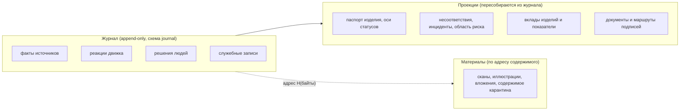
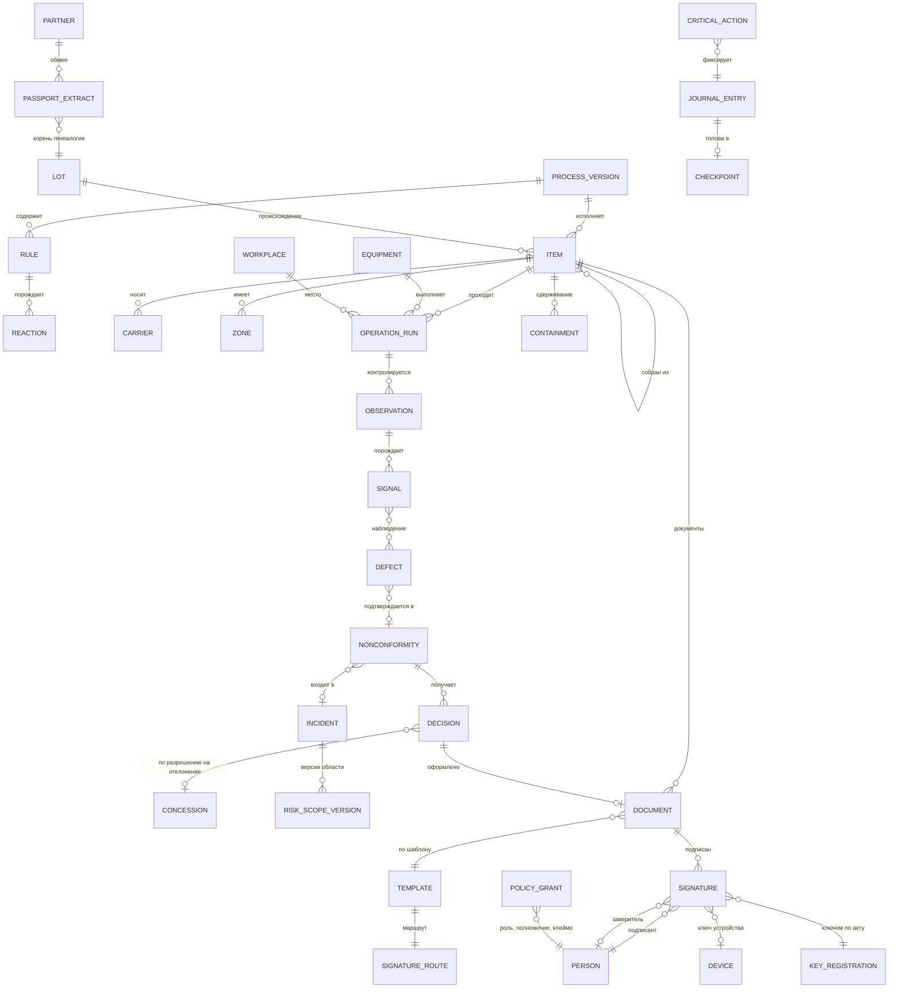

# Модель данных

Что система хранит, как устроена запись журнала и событие, какие есть сущности, статусы, проекции и соглашения. Опоры: AD-2, AD-16, AD-20, AD-23, AD-29, AD-30, AD-37, AD-40, AD-41, AD-44, AD-45, соглашения спайна; FR-27…FR-47, FR-122, FR-123, FR-140; кейс §4.3–§4.7, §7.2.

**Статус.** Написано по спайну и сверено с кодом — раздел [«Сверено с кодом»](#сверено-с-кодом). Источник правды для схем — файлы в `contracts/`; этот документ объясняет их смысл. Полный перечень типов событий — каталог `contracts/events/catalog.yaml`. Где выбирать — прав каталог.

## 1. Три слоя данных



- **Журнал** — единственный источник истины (AD-2). Только дописывание; исправление — новая запись.
- **Проекции** — таблицы модулей, пересчитываемые из журнала командой `ant rebuild`; в резервную копию не входят (AD-34).
- **Материалы** — байты вне журнала, адресуемые хешем содержимого; в журнале — только адрес и метаданные (AD-23).

Производные показатели (четвёртый вид данных кейса §7.2) — проекции, в журнал не пишутся.

## 2. Запись журнала

Схема — `contracts/journal/entry.schema.json`; Go-типы генерируются и используются всеми, включая верификатор (AD-44).

### 2.1. Виды записей и происхождение

| Поле | Значения | Смысл |
|---|---|---|
| `entry_kind` | `fact` / `reaction` / `decision` / `service` | факт источника; реакция движка; решение человека; служебная (время, политика, ключи, контрольные точки, генезис, карантин) |
| `source_kind` (у факта) | ручной ввод / станок / датчик / камера / внешняя система / импорт | откуда пришёл факт (FR-140); вывод системы — реакция, а не факт |
| `reliability` (у факта) | по источнику и способу привязки | насколько надёжен факт и его привязка (FR-34) |
| `provenance_class` | `device`, `personal`, `paper`, `partner`, `server_attested`, `scenario`, `genesis` | чьей подписью подтверждена запись; разрешающее действие не может опираться только на `server_attested` |

### 2.2. Открытые и зашифрованные поля

| Группа | Поля |
|---|---|
| Позиция и цепочка | `seq`, `chain` (`main` / `ca`), `commit`, `link` |
| Тип и версия | `entry_kind`, `event_type`, `schema_version` |
| Идентичность события | `event_id` (UUIDv7; у реакций, производных и событий сценария — UUIDv5), `source_id`, `source_seq`, `run_id` |
| Маршрутизация | `item_id` (только внутренний ID), `carrier_ref`, `stream`, `partition` |
| Время | `occurred_at`, `received_at`, `recorded_at`, `committed_at` |
| Причинность | `correlation_id`, `causation_id` |
| Реакции | `rule_id`, `normative_rev`, `reaction_slot`, `version`, `supersedes`, `basis_seq` |
| Конкурентность и сборка | `policy_seq`, `domain_build` (хеш доменного пакета) |
| Происхождение | `provenance_class` |
| **Зашифровано** (AD-23) | блок `sealed` (`aead`, `dek_id`, `nonce_b64`, `ciphertext_b64`) над конвертом DSSE с содержимым и подписями и `salt_b64` |

Результат контроля и содержание решения лежат только в зашифрованном блоке; имена типов результат не кодируют (`inspection.result.recorded`, а не `inspection.result.failed`). Метаданные заголовка видны без ключа шифрования — это названное ограничение ([threat-model.md](threat-model.md)).

### 2.3. Формат цепочки v1

- H — Стрибог-256 (ГОСТ Р 34.11-2012).
- `commit` = H(`salt` ‖ JCS(конверт)) — обязательство над каноническими байтами конверта; соль — 128 случайных бит на запись.
- `link` = H(`prev_link` ‖ `commit` ‖ H(JCS(открытые поля без `link`))).
- Отпечаток документа и адрес материала — тот же H с префиксом алгоритма: `streebog256:…`.
- Смена хеш-функции открывает новый сегмент цепочки со связующей служебной записью (AD-32).

Две цепочки: основная и цепочка критических действий; запись критического действия — в той же транзакции, что и основная (AD-8, AD-28).

### 2.4. Три координаты времени (AD-37)

| Координата | Кто ставит | Что значит |
|---|---|---|
| `occurred_at` | источник (для решений и реакций — ядро) | когда произошло; по нему строится история «как было» |
| `received_at` | приём | когда получено |
| `recorded_at` | ядро, доменные часы | когда записано по доменному времени (в сценарии — виртуальное); «что мы знали» |
| `committed_at` | ядро, реальные монотонные часы | покрыто контрольными точками хранителя |
| `seq` | `journal.Append` | порядок знания; позиция в основной цепочке |

Порядок в пределах изделия — `occurred_at` → `received_at` → `event_id` (FR-32). Время клиента при подписи (`client_signed_at`) — справочно, в порядок не входит.

## 3. Событие источника (конверт)

Событие, которое присылает источник, — подписанный пакет DSSE над каноническим JSON (RFC 8785) с полями в стиле CloudEvents (FR-27). Подписанное содержимое несёт метаданные долгосрочной защиты кейса §6.3: версию формата, id криптопрофиля, `key_id@версия` подписанта, перечень обязательных подписей, ссылку на исходное событие или материал, открытые параметры проверки (AD-10; подробно — [crypto.md](crypto.md)).

### 3.1. Поля кейса §4.4 → наши поля

Кейс разрешает другую схему «при документировании соответствий». Соответствие:

| Поле кейса §4.4 | Поле контракта | Примечание |
|---|---|---|
| `event_id`, `event_type`, `schema_version` | те же | `event_type` — `семейство.сущность.действие` |
| `occurred_at`, `source_id` | те же | RFC 3339 UTC, ровно три знака после секунд |
| (время поступления) | `received_at` | ставит только ядро |
| `item_id` | `item_ref` (тип носителя, значение) → после разрешения `item_id` + `carrier_ref` | ID изделия рождается в системе и из метки не выводится (AD-16, AD-41); подробно — `contracts/events/README.md` |
| `item_type_id` | `item_type_id` | ссылка на номенклатуру |
| `line_id`, `station_id` | те же | линия и участок (пост) |
| `operation_run_id` | тот же | повтор операции — новый `operation_run_id` + `rework_of` (FR-47) |
| `operator_id`, `equipment_id` | те же | исполнитель — условный псевдоним; неизвестный — `null` («неизвестно», FR-123) |
| `operation_started_at`, `operation_finished_at` | те же | если доступны |
| `reported_duration` | `reported_duration` {значение, единица, смысл интервала, происхождение} | смысл: активная обработка / полное время на участке / иное; происхождение: передано источником / вычислено системой (FR-88) |
| `inspection_result` | `outcome` | `defect_indicated` / `no_defect_indicated` / `unable_to_assess` с причиной `unable_reason` (FR-36) |
| `defects` | `defects[]` | код вида по классификатору (`defect_type_code`), описание, зона и место, тяжесть, измеренное значение и допуск (FR-27, FR-125) |
| `confidence` | `analyzer_confidence_bp` | целые базисные пункты (0…10000), без float (AD-4) |
| `observation_quality` | `observation_quality_bp` | отдельно от уверенности |
| `action_type` | отдельные типы семейства `operator` | действия исполнителя (`operator.*`) |
| `machine_state` | v1: `machine_state`; v2: `execution` + `condition` + `controller_mode` | состояние оборудования по классам MTConnect (AD-29) |
| `evidence_refs` | тот же | ссылки на материалы по адресу содержимого; отсутствие обрабатывается явно (FR-102) |
| `analyzer_version` | `versions.analyzer_version` в векторе версий `versions` | ревизия изделия, карта контроля, камера, калибровка, анализатор, профиль порогов, контракт, приложение (AD-29) |
| — | `method`, `processing_state`, `versions.recipe_ref`, `item_ref.identification_level`, `limitations[]`, `correlation_id`, `causation_id` | дополнительно (FR-27) |

### 3.2. Пример

Эталонное событие сценария F15 (`scenarios/definitions/streams/F15.events.jsonl`, метка `F-501/kt3`; `zone_ids` сокращён). Подписывается целиком: DSSE с `payloadType` = `application/vnd.ant.event+json; v=1`, `payload` — байты JCS этого объекта, `signatures[]` — `{keyid: "‹key_id›@‹версия›", sig}` (`contracts/crypto/dsse-envelope.schema.json`).

```json
{
  "event_id": "10ed6e88-3332-534e-b131-1942c326ebee",
  "event_type": "inspection.result.recorded",
  "schema_version": 1,
  "source_id": "f15-20261015/edge-kt3",
  "source_seq": 1,
  "source_kind": "camera",
  "reliability": "medium",
  "occurred_at": "2026-09-21T09:50:00.000Z",
  "correlation_id": "10ed6e88-3332-534e-b131-1942c326ebee",
  "causation_id": null,
  "run_id": "f15-20261015",
  "item_ref": {"carrier_type": "dpm_datamatrix", "identification_level": "unique", "value": "f15-20261015/DM:F-501"},
  "integrity": {"format_version": 1, "crypto_profile": "gost", "signers": ["scenario.edge-kt3@1"]},
  "data": {
    "method": "camera",
    "phase": "after_operation",
    "step_key": "welding.kt3_camera",
    "inspection_point": "KT-3",
    "observation_id": "f15-20261015/KT3-F-501-KT3",
    "operation_run_id": "f15-20261015/SV-501-1",
    "outcome": "defect_indicated",
    "processing_state": "completed",
    "zone_ids": ["W-1.U1", "W-1.U2", "…", "W-1.U8"],
    "defects": [{"defect_type_code": "W-SPATTER", "severity": "minor", "zone_id": "W-1.U1"}],
    "analyzer_confidence_bp": 9500,
    "observation_quality_bp": 9200,
    "versions": {"analyzer_version": "vqc-weld 2.3.1", "camera_config": "angle-1", "contract_version": "1.0", "item_revision": "Б", "recipe_ref": "kt3-weld@1"},
    "is_simulated": true
  }
}
```

Здесь `evidence_refs` нет — кадр не приложен, и интерфейс показывает «материал отсутствует», а не пустую рамку (кейс §5.4).

## 4. Семейства и типы записей

Имя типа — `семейство.сущность.действие`, три сегмента, латиница; схема — `contracts/events/‹семейство›/‹тип›.v‹N›.json` (AD-40). Для каждого типа каталог задаёт: единственный модуль-эмитент; вид записи; поток (изделие / объект / глобальный); ось статуса, которую меняет; класс действия (AD-27); признак критичности и группу критических действий; пометки `guard_relevant` и `publish: stage`.

| Семейство | Модуль-владелец | Семейство | Модуль-владелец |
|---|---|---|---|
| `item` | item | `document` | documents |
| `operation` | process | `policy`, `access`, `operator` | access |
| `inspection`, `quality` | quality | `key` | signing |
| `equipment` | machinelogs | `time` | journal (`time.clock.mode_set` — генезис, `time.clock.ticked` — simulation) |
| `decision` | nonconformity | `journal` | journal (контрольные точки, генезис, «якорь уничтожен», восстановление) |
| `erp` | erp | `ingest` | ingest (карантин, импорт) |
| `mes` | mes | `material` | materials |
| `cad` | cad | `binding`, `genealogy` | crossitem |
| `security` | security | `normative` | process |
| `reference` | reference | `obligation`, `task` | notifications |
| `incident` | analysis | `analyzer` | vision |
| `federation` | federation | `simulation` | simulation |
| `ops` | ops | | |

Кейс §4.3 называет семь групп данных, FR-28 — восемь семейств верхнего уровня. Соответствие групп кейса нашим семействам: справочники → `reference`, `item`; контроль → `inspection`, `quality`; операции → `operation`; действия → `operator`, `decision`; оборудование → `equipment`; интеграции → `erp`, `mes`, `cad`; материалы → `material`.

Примеры типов, названных в спайне: `operation.run.started`, `operation.run.interval_resolved`, `inspection.result.recorded`, `quality.signal.raised`, `decision.nonconformity.confirmed`, `item.assembly.recorded`, `binding.link.resolved`, `genealogy.link.added`, `document.version.drafted`, `document.route.closed`, `document.signature.recorded`, `document.version.annulled`, `reference.external_id.mapped`, `reference.change.affects_item`, `access.workplace.admitted`, `access.workplace.revoked`, `obligation.due.set`, `obligation.due.cleared`, `equipment.state.changed`, `security.integrity.checked`, `simulation.run.started`, `ops.processing.failed`.

## 5. Основные сущности



| Сущность | Что это | Где рождается |
|---|---|---|
| Изделие (`ITEM`) | экземпляр детали или сборки; ID `код_предприятия:локальный_id`, рождается при регистрации и из метки не выводится (AD-16) | `item` |
| Носитель (`CARRIER`) | бирка или ярлык с QR, DPM DataMatrix, тара + ячейка, сопроводительная карта, контекст поста, ручной ввод; «временный / постоянный»; события нанесён / проверен / нечитаем / снят / заменён | `item` |
| Зона (`ZONE`) | участок шва, соединение, отверстие; к зоне привязываются контроль, доработки со счётчиком, скрытые работы, вмешательства; статус «проверена / устарела после вмешательства / закрыта» (FR-46) | `item` |
| Партия, садка, плавка (`LOT`) | происхождение изделий; корень генеалогии; выписка паспорта поставщика | `crossitem` |
| Выполнение операции (`OPERATION_RUN`) | конкретное выполнение над конкретным изделием; повтор — новое выполнение со ссылкой на прежнее | `process` |
| Профиль выполнения операции | изделие, станок, программа, инструмент и его ресурс, начало и конец, режим, ручные изменения, предупреждения, контроль до и после (FR-148) | проекция `machinelogs` |
| Наблюдение (`OBSERVATION`) | результат контроля с вектором версий; ответ анализатора и ответ эксперта — раздельно | `quality` / `vision` |
| Сигнал (`SIGNAL`) | признак дефекта или отклонения; ещё не несоответствие | `quality` |
| Дефект (`DEFECT`) | один физический дефект — ключ (изделие, зона и место) в пределах выполнения операции или до следующей операции, без вида дефекта; повторные наблюдения не увеличивают показатели (FR-37) | `quality` |
| Несоответствие (`NONCONFORMITY`) | подтверждённое человеком расхождение факта с требованием; два статуса: «по изделию» и «системное расследование» (FR-51) | `nonconformity` |
| Решение (`DECISION`) | переделка / ремонт / как есть / списать / вернуть поставщику; «ремонт» и «как есть» — только по разрешению на отклонение | `nonconformity` |
| Разрешение на отклонение (`CONCESSION`) | номер, пункт КД/ТУ, область действия, лимит количества, срок, подписи; расход лимита — атомарно с решением (AD-39) | `nonconformity`, проекция расхода — `crossitem` |
| Инцидент и версии области риска | группа несоответствий с общей предполагаемой причиной; область расширяется консервативно, сужается только с основанием; каждая правка — новая версия | `analysis` (вычисляет `crossitem`) |
| Сдерживание (`CONTAINMENT`) | наблюдать / доп. проверка / блок изделия / блок партии / стоп точки процесса / критическая остановка | `nonconformity` |
| Документ, шаблон, маршрут, подпись | см. раздел 9 и [document-catalog.md](document-catalog.md) | `documents`, `signing`, `access` |
| Грант политики | роль в области, полномочие с рамками и сроком, цифровое клеймо | `access` |
| Критическое действие | действие, объект, было → стало, кто, полномочие и клеймо, основание, материалы, ссылка на основную запись; номер `CA-‹n›` | `security` |
| Контрольная точка | подписанная хранителем голова цепочек | `journal` / `keeper` |

## 6. Статусы изделия

Словарь статусов — одно перечисление `contracts/statuses.yaml`, из него же — цвета статусов на экранах. У каждой оси один модуль-владелец (AD-30).

| Ось | Значения | Модуль-владелец | Кем меняется |
|---|---|---|---|
| Положение в процессе | в очереди / в работе / на контроле / на точке предъявления / в перемещении / на хранении / в изоляции / завершено | `process` | реакции движка по фактам |
| Состояние качества | не проверено / годно / годно по разрешению на отклонение / оценка невозможна / сигнал / подтверждённое несоответствие | `quality` | реакции движка; подтверждение контролёра — решением `nonconformity` |
| Решение по изделию | нет / переделка / ремонт / как есть / списать / вернуть поставщику | `nonconformity` | человек или явно делегированное правило режима 2 (типовая переделка); необратимые — только уполномоченные |
| Сдерживание | нет / наблюдать / доп. проверка / блок (изделия или партии) | `nonconformity` | правило (защитное) или человек |
| Учёт в 1С | не передано / принято в работу / перемещено / переведено в брак / возвращено поставщику / выпущено | `erp` | квитанции внешней системы |
| Статус в инциденте (на каждый инцидент) | подтверждено / под подозрением / исключено / неизвестно | `analysis` | человек по основаниям; расширение — правило |

«Изоляция» — положение изделия, ждущего решения; «блок» — уровень сдерживания, запрещающий движение; снятие блока не означает годность. Команду, нарушающую блок, гард отклоняет; внешний факт о том же принимается с сигналом нарушения.

## 7. Соглашения

| Что | Правило |
|---|---|
| Идентификаторы | `event_id` — UUIDv7; реакции и производные — UUIDv5 от константы `NS_ANT` (RFC 9562); изделие — `код_предприятия:локальный_id`; критические действия — `CA-‹n›`; прогон — `run_id`; внешние ID — только записями соответствий; исполнители — псевдонимы, соответствие человеку — отдельно в `access` |
| Время | RFC 3339 UTC, ровно три знака после секунд (`YYYY-MM-DDTHH:MM:SS.mmmZ`) |
| Числа | без float: фиксированная точка (`*_bp`), измерения — целое + единица + масштаб; в подписываемом JSON — целые в пределах ±(2^53−1), большие — строками |
| Длительности | значение + единица + смысл интервала + происхождение (передано источником / вычислено системой) |
| Неизвестность | явное `unknown`; неизвестное значение перечисления — `UNKNOWN(значение)` с флагом; вывод системы — отдельно от факта, с уверенностью и основаниями |
| Строки | NFC; идентификаторы — ASCII по шаблону; подписываемые байты совпадают с каноническим видом их разбора |
| QR | документ — `ant:doc:‹id›:‹отпечаток›`; носитель — `ant:carrier:‹тип›:‹значение›` |
| Контрольная точка | в коде `checkpoint` — только контрольная точка журнала; точка контроля процесса — `inspection_point` |

## 8. Хранение: схемы, роли, проекции

- **Схема Postgres на модуль** (AD-1): журнал — схемы `journal` и `journal_state`; модуль со своими таблицами — своя схема и свои миграции goose (`backend/internal/infrastructure/storage/‹модуль›/migrations`, версии — метки времени); доступ — pgx, конфигураций sqlc у модулей нет (только заготовка `storage/sqlc.template.yaml`). Модуль не читает чужих таблиц. Stand-ы внешних систем — схемы `stand_‹система›`; курсор заготовок — схема `fixtures`.
- **Роли БД**: `ant_owner` — DDL, без входа, только для `ant migrate`; `ant_app` — INSERT и SELECT в `journal`, полный доступ к схемам модулей; `ant_verifier` — только SELECT. У `ant_app` нет `UPDATE`/`DELETE`/`TRUNCATE` на журнал; строчный и операторный триггеры запрещают изменения; обойти это может только суперпользователь, и это обнаруживают хранитель и верификатор.
- **Обёртки ключей шифрования** — таблица `journal.dek_wraps` (только дописывание, вне цепочки).
- **Потребители журнала** (AD-45) — у каждого имя и охват (`partition` или `global`); курсор `journal_state.consumer_offsets(name, partition, seq)` обновляется в той же транзакции, что и выход потребителя; проектор — чистая функция `(состояние, запись) → состояние`.
- **Показатели** строятся только из строк вклада изделия (`item_id`, показатель, срез → значение); воркер заменяет вклад изделия целиком при каждой пересвёртке; агрегат — сумма вкладов; каждая строка хранит id исходных записей для раскрытия до исходных данных (FR-7). Инкременты запрещены — поэтому повтор и позднее событие не искажают показатели.

Проекции и их писатели (затравка; фактический состав — по коду):

| Проекция | Писатель | Что содержит |
|---|---|---|
| паспорт изделия, журнал изменений паспорта | `item` | факты, решения, документы с автором, временем, подписью и статусом проверки подписи (FR-42, FR-43) |
| положение в процессе, счётчики узлов по `step_key` | `process`, `analytics` | карта процесса (FR-2) |
| состояние качества, дефекты, наблюдения | `quality` | |
| несоответствия, решения, сдерживание | `nonconformity` | карточка несоответствия (FR-51) |
| генеалогия, партии, оборудование, расход разрешений | `crossitem` | |
| инциденты, версии области риска, `analysis.circumstances` | `analysis` | экран «Разбор обстоятельств» (FR-153) |
| профиль выполнения операции | `machinelogs` | FR-148 |
| сроки, задачи, уведомления | `notifications` | единственная проекция сроков |
| документы и прогресс маршрутов | `documents` | «документов собрано из истории» (FR-65) |
| политика доступа | `access` | загружается в Casbin своим адаптером |
| критические действия | `security` | журнал CA для Аудитора ИБ |
| соответствия внешних ID, справочники с версиями | `reference` | |
| вклады изделий, агрегаты показателей | `analytics` | |
| исходящие сообщения и квитанции | `erp` / `mes` / `federation` | очередь outbox — проекция журнала |
| состояние компонентов, остановленные изделия | `ops` | |

## 9. Нормативный слой и документы

**Нормативный слой** — «как должно быть»: версия процесса (BPMN 2.0 XML + наши свойства `urn:ant:bpmn-ext:1`), план контроля, карта реакций и правила с режимами, шаблоны документов и маршруты подписей, классификатор видов дефектов (код, наименование, класс тяжести по ГОСТ 15467, методы, способные выявить вид, признак «измеряемая характеристика»), карты контроля и паспорта допуска анализаторов, таблица «уровень доверия → допустимые автоматические действия». Файлы затравки — `normative/`.

- **Закрепляется при запуске изделия**: процесс, план контроля, карта реакций и правила, шаблоны документов и маршруты, классификатор, разрешения на отступление.
- **Действует на `occurred_at`**: статус паспорта допуска, разрешения на отклонение и их лимит, допуски людей и оборудования, поверка, календарь и смены. Приостановка паспорта сильнее закреплённой версии (AD-17).
- **Справочники** — версионируемые данные журнала с датой действия; вход свёртки берёт срез по `valid_at = occurred_at` и `seq ≤ basis_seq` (AD-31).
- **Хеш версии процесса** — хеш байтов XML как загружены; каждая запись ссылается на него.

**Документ** (AD-12) — детерминированная проекция журнала: `content` = JCS(данные без `rendering_hash`); `rendering_hash` = H(отрисовка(шаблон@версия, content)); отпечаток `doc_digest` = H(JCS(content ∪ `rendering_hash`, `template_ref`, `doc_format_version`)). Каноническая отрисовка — HTML. Жизненный цикл — только события: черновик → подписи → «маршрут закрыт» → аннулирование новой записью.

## 10. Изменение контрактов

Кейс §4.7 и FR-29 — пять случаев, поведение одинаково для приёма от устройств, от внешних систем и от партнёров (AD-20):

| Случай | Поведение | Код ошибки |
|---|---|---|
| неизвестная версия | карантин с кодом; переобработка после появления повышателя версии | `ingest.unknown_schema_version` |
| новое необязательное поле | принимается и сохраняется в исходнике; схемы событий не запрещают дополнительные поля | — |
| нет обязательного поля | `problem+json` с кодом и карантин | `ingest.missing_required_field` |
| неизвестное значение перечисления | `UNKNOWN(значение)` с флагом; критичное для безопасности — карантин | `ingest.unknown_enum_value` |
| несовместимое изменение | только новая мажорная `schema_version`; сборка ловит (`oasdiff breaking`, `@asyncapi/diff`) | — |

Журнал хранит исходный подписанный конверт без изменений; повышатели версий — чистые функции сгенерированного пакета, их применяют при чтении воркер, воспроизведение и верификатор. Версия контракта ≠ версия приложения ≠ версия анализатора. Две последовательные версии контракта и воспроизводимое изменение — в [codegen.md](codegen.md).

## 11. Ошибки API

RFC 9457 `application/problem+json`; коды — строки с префиксом семейства-владельца; каталог — `contracts/errors.yaml`. Примеры: `ingest.unknown_schema_version`, `ingest.missing_required_field`, `ingest.unknown_enum_value`, `ingest.signature_invalid`, `ingest.duplicate_conflict`, `journal.stale_state`, `journal.stale_policy`, `journal.concession_exhausted`, `process.rework_limit_exceeded` (превышен лимит доработок), `nonconformity.concession_required` (нужно разрешение на отклонение), `reference.not_found` (ссылка не найдена).

```json
{
  "type": "urn:ant:problem:journal.stale_state",
  "title": "Состояние изменилось после проверки",
  "status": 409,
  "detail": "В потоке item:ENT01:F-015 после seq 18231 есть новые записи — обновите и проверьте ещё раз",
  "code": "journal.stale_state",
  "params": {"stream": "item:ENT01:F-015", "basis_seq": "18231"},
  "basis_seq": 18231
}
```

Форма — `Problem` в `backend/internal/infrastructure/transport/httpapi/problem.go` по схеме `contracts/problem.schema.json`: `type` = `urn:ant:problem:‹код›`, `title` и шаблон `detail` — из `contracts/errors.yaml`; необязательные `instance`, `violations`, `quarantine_id`, `ca_ref`, `allowed_actions`.

## Сверено с кодом

- Таблица раздела 2.2 совпадает с `contracts/journal/entry.schema.json`: `reaction_slot` — объект (`rule_id`, `subject`, `trigger_key`); зашифрованный блок `sealed` — AEAD (`kuznyechik_mgm` / `aes_256_gcm`) над `{salt_b64, envelope}`; класс происхождения пишется `server_attested` (snake_case, исправлено в 2.1). `source_kind` и `reliability` — поля конверта `contracts/events/common/envelope.v1.json`, не записи. Go-тип — `JournalEntry` в `backend/internal/contracts/journal/journal_gen.go` (go-jsonschema, `make generate-go`).
- Каталог `contracts/events/catalog.yaml` — 203 типа в 30 семействах; вид: 83 `decision`, 45 `fact`, 40 `reaction`, 35 `service`; класс: 144 `record`, 28 `protective`, 27 `permissive`, 4 `irreversible`; критических — 58. Эмитенты семейств совпадают с таблицей раздела 4 (исключение `time.clock.ticked` → `simulation` — в `emitter_exceptions`). Полную выгрузку в документ не переносим: поля типа — в самом каталоге, их смысл — `contracts/events/README.md`, раздел «Каталог». Все примеры раздела 4 в каталоге есть; `quality.signal.received` исправлен на `quality.signal.raised`.
- Таблица 3.1 сверена с `contracts/events/README.md` и схемами `contracts/events/inspection/inspection.result.recorded.v1.json`, `contracts/events/common/defs.v1.json`. Исправлено: `inspection_result` → `outcome` (`defect_indicated` / `no_defect_indicated` / `unable_to_assess`), `analyzer_confidence_bp`, `observation_quality_bp`, `action_type` → типы `operator.*`, `machine_state` v1 / v2, `versions.analyzer_version`, `method`, `item_ref.identification_level`, неизвестный исполнитель — `null`.
- Пример 3.2 заменён эталонным событием сценария F15 из `scenarios/definitions/streams/F15.events.jsonl`. Примеры пяти случаев изменения контракта — `contracts/events/examples/contract-change/*.json` (`{case, note, expect, message}`, проверка — `contracts/scripts/check-examples.mjs`).
- Своя схема и миграции goose есть только у `journal` (`journal.entries`, `journal.concession_ledger`, `journal.dek_wraps`, `journal_state.consumer_offsets`, `journal_state.leases`), `engine`, `access` (`credentials`, `sessions`), `erp` (`channels`, `gateway_seen`, `gateway_seq`, `outbox`), `ingest` (`quarantine`, `seen`, `sources`), `process` (`versions`), `fixtures` (`cursor`) и stand-а 1С (`stand_onec`, `backend/internal/infrastructure/integration/erp/onec/stand/migrations/`). Проекции таблицы раздела 8 — строки общей `engine.projections(name, key, item_id, value)` с именем `‹модуль›.‹проекция›` (`process.item`, `quality.item`, `nonconformity.item`, `documents.item`, `crossitem.stage`, `analysis.incident`, `analysis.circumstances`, `machinelogs.item_runs`, `notifications.obligation`, `erp.item_accounting` и др.; константы — `backend/internal/application/‹модуль›/projections.go`); вклады показателей — `engine.contributions`, изменения для SSE — `engine.changes` (`backend/internal/infrastructure/storage/engine/migrations/20260926090000_engine.sql`). У `reference`, `vision` и политики `access` отдельной проекции нет — срез строится из журнала (`storage/reference/doc.go`, `storage/vision/doc.go`, `storage/access/policylog.go`). Конфигураций sqlc нет ни у одного модуля.
- Пример `problem+json` раздела 11 заменён формой фактического ответа (`newProblem`, `problemFrom` в `backend/internal/infrastructure/transport/httpapi/problem.go`; параметры `stream`, `basis_seq` — `Reject` в `backend/internal/infrastructure/storage/journal/store.go`). `type` = `urn:ant:problem:‹код›` (`problem_type_prefix` в `contracts/errors.yaml`); все коды раздела 11 в каталоге есть. Поле `instance` в схеме есть, код его пока не заполняет.
- Перечисление статусов — `contracts/statuses.yaml`: шесть осей (`position`, `quality`, `disposition`, `containment`, `erp_accounting`, `incident`), таблица цветов — `palette` (тон → цвет), у значения — `code`, `label`, `tone`. Совпадение кодов с `axis_*` в `contracts/events/common/defs.v1.json` проверяет `contracts/scripts/check-catalog.mjs`; производные — `backend/internal/contracts/statuses/statuses_gen.go` и `frontend/src/shared/api/generated/statuses.ts` (`statusPalette`, `statusAxes`), показ — `frontend/src/shared/ui/StatusTag.vue`.
