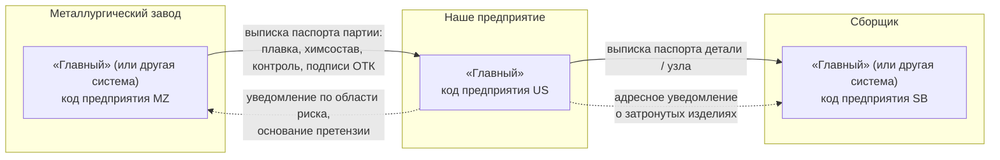
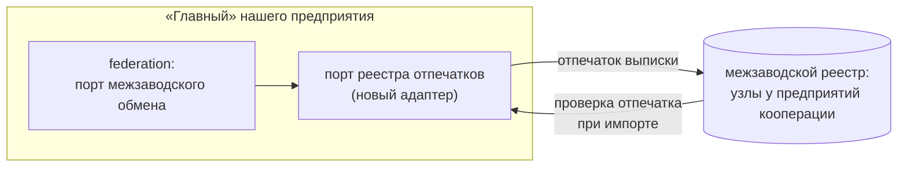

# Межзаводская кооперация (федерация)

Документ описывает, как система «Главный» работает с предприятиями кооперации: металлургическим заводом, поставщиками, сборщиком. Что сделано в MVP (порт, формат выписки, импорт и экспорт, уведомления по области риска) и что описано как развитие (живое отслеживание у партнёров, межзаводской реестр отпечатков).

- **Опоры:** FR-131, FR-132, FR-133 (MVP), FR-134 (описание), FR-95, FR-112; AD-19, AD-10, AD-11, AD-12, AD-33, AD-35, AD-42; UJ-9; addendum A11, A14; кейс §3.1 (масштабирование), §3.3 (интеграции), §4.6 (идентификаторы); критерии Т2, О5, О6, О9.
- **Связанные документы:** [architecture.md](architecture.md), [data-model.md](data-model.md), [threat-model.md](threat-model.md), [target-components.md](target-components.md), [integrations/README.md](integrations/README.md), [assumptions.md](assumptions.md), [architecture-spine.md](architecture-spine.md), [prd.md](prd.md).
- **Статус:** проект. Пути кода — по дереву спайна; источник правды — код, когда он появится.

## 1. Зачем федерация

Изделие проходит через несколько предприятий: металл — с металлургического завода, заготовка и деталь — у нас, узел — у сборщика. Паспорт изделия должен начинаться ещё у поставщика материала (PRD §1).

Одна общая система на все предприятия нереалистична: это разные юридические лица, разные защищённые контуры, режимы и аттестации (addendum A14). Поэтому архитектура — **федерация**:

- у каждого предприятия своя система (эта или другая);
- общей базы нет, и доверия к чужой базе нет;
- на границе предприятия обмениваются **подписанными выписками паспорта** — цифровой заменой бумажного сертификата качества — и событиями;
- получатель проверяет подписи сам.



## 2. Партнёр — вторая копия той же системы

По AD-19 партнёр — такой же экземпляр «Главного» со своим **кодом предприятия**. Поэтому второго механизма проверки подписей нет: выписка проверяется тем же кодом `signing`, что и любые другие подписи.

- **Глобальный ID изделия** = код предприятия + локальный ID (`код_предприятия:локальный_id`, соглашения спайна). Внешние ID никогда не становятся нашими первичными ключами — они хранятся записями соответствий `reference.external_id.mapped` (FR-95, AD-18).
- **Масштабирование между предприятиями** — федерацией: каждое предприятие масштабируется независимо, связь асинхронная (FR-112).
- **MVP:** интерфейсы и код реализованы; локальный запуск второй копии в демо **не гарантируется** — её заменяет фикстура подписанной выписки (раздел 7).

## 3. Порт межзаводского обмена

Модуль `federation` (все слои: `backend/internal/domain/federation`, `backend/internal/application/federation`, `backend/internal/infrastructure/integration/federation/…`).

| Свойство | Как устроено |
|---|---|
| Транспорт в MVP | HTTP с досылкой: исходящие — реакции журнала, очередь — проекция журнала, отправитель — роль `outbox` (AD-7, AD-18) |
| Сменный адаптер | брокер сообщений за тем же портом (AD-35); ядро не меняется |
| Квитанции | приходят событиями (асинхронно), а не синхронным ответом |
| Однонаправленные каналы | обмен работает и через диод данных: подтверждения — асинхронными событиями (FR-39, FR-131) |
| Идемпотентность | ключ приёма `source_id + event_id`; исходящие — по бизнес-ключу (субъект, действие, закрывающая точка), повтор только при транспортных ошибках (AD-7) |
| Воспроизведение | при воспроизведении роль `outbox` не запущена — наружу ничего не уходит (AD-22) |

### 3.1. Регистрация партнёра

Партнёр — зарегистрированное предприятие со своими корнями доверия. Регистрация — **акт** в журнале с маршрутом подписей (каталог документов спайна, «Регистрация партнёра и его корней»):

- администратор безопасности → начальник ОТК (вторая подпись от независимой стороны, AD-11);
- акт содержит код предприятия и отпечатки корней партнёра;
- доверие ключам сотрудников партнёра **выводится из нашего акта регистрации партнёра**: подписи внутри выписки проверяются цепочкой к корням партнёра, наш отдельный акт на ключ каждого сотрудника партнёра не нужен (AD-19).

## 4. Выписка паспорта

Выписка — подписанный пакет единого формата (DSSE над каноническим JSON, AD-10; метаданные долгосрочной защиты по кейсу §6.3 — версия формата, профиль, `key_id@версия`, ссылка на исходные объекты, FR-67). Класс пакета — свой `payloadType` вида `application/vnd.ant.‹класс›+json; v=1`.

**Содержимое (предварительно; фиксирует контракт `contracts/events/federation/…`):** изделие или партия (глобальные ID), происхождение (плавка, партия, сертификат), результаты контроля, решения по несоответствиям, подписи ОТК, **акты регистрации ключей подписантов** и **контрольная точка хранителя отправителя** (AD-8).

### 4.1. Экспорт

При отгрузке изделия или партии система формирует выписку как документ — детерминированную проекцию журнала (AD-12) с маршрутом подписей:

- контролёр ОТК — подпись уровня 2 (сводка из 3–7 полей и явное подтверждение токеном, AD-13);
- ключ шлюза предприятия — подпись уровня 0.

### 4.2. Импорт

```mermaid
sequenceDiagram
  participant P as партнёр (металлургический завод)
  participant F as порт межзаводского обмена
  participant I as приём (ingest)
  participant S as signing: проверка подписей
  participant J as журнал
  participant X as crossitem: генеалогия
  P->>F: выписка паспорта партии (DSSE)
  F->>I: source_kind = внешняя система, source_id = partner:MZ
  I->>S: подписи → цепочка к корням партнёра (из акта регистрации)
  S-->>I: класс partner; статус происхождения
  I->>J: Append: факт выписки + статус проверки
  J-->>X: партия от поставщика
  X->>J: genealogy.link.added: выписка — корень генеалогии
  I-->>F: квитанция (событием)
  F-->>P: квитанция
```

- Выписка входит **через обычный приём** (AD-19): `source_kind` = внешняя система, `source_id` = `partner:‹код›`. Никакого обходного пути.
- Подписи проверяются цепочкой к корням партнёра; класс происхождения подписи — `partner` (AD-2); в отчёте верификатора он показан отдельно (AD-9).
- **Статусы происхождения:**

| Что есть в выписке | Статус |
|---|---|
| Подписи людей, акты регистрации их ключей и контрольная точка хранителя отправителя — всё проверяется | происхождение подтверждено |
| Подписи есть, но нет актов ключей или контрольной точки | «происхождение подтверждено сервером отправителя» |
| Подписи не проверяются | «происхождение не подтверждено» (принимается с явной пометкой, FR-132) |
| Содержимое изменено после подписи | выписка отклоняется при импорте (FR-132), событие `security` |

- Принятая выписка становится **корнем генеалогии**: «плавка → лист → деталь → сборка» (FR-45, FR-132). Генеалогией владеет межизделийная стадия `crossitem` (AD-42); паспорт детали показывает плавку и результаты контроля металлургического завода с отметкой о проверке подписей.

## 5. Область риска через границу предприятий

Если область риска (FR-61) включает изделия, отгруженные другим предприятиям, система (FR-133):

- показывает, кому и что ушло (разбивка области риска: в производстве / ушли дальше / собраны / отгружены);
- формирует этим предприятиям **адресное подписанное уведомление** — документ «Уведомление партнёру / основание претензии» с маршрутом технолог → руководитель производства (каталог документов спайна);
- если причина найдена у поставщика (например, плавка), формирует основание претензии и уведомление поставщику.

Пример (UJ-9): по одной из деталей подтверждается дефект материала → область риска по плавке показывает наши изделия и узлы, уже отгруженные сборщику → уведомление сборщику и основание претензии металлургическому заводу. Исполнителям вина не приписывается (FR-58).

## 6. Угрозы федерации (кратко)

Полная модель угроз — [threat-model.md](threat-model.md). По таблице границ защиты AD-34:

| Нарушитель | Предотвращаем | Обнаруживаем | Не защищаем |
|---|---|---|---|
| Предприятие-партнёр | принятие непроверенной выписки как доверенной | подмену выписки (изменённое содержимое не проходит проверку подписи) | ложь в правильно подписанной выписке |
| Посредник на канале | подмену содержимого (подпись над каноническим JSON) | повтор и конфликт по ключу `source_id + event_id` | задержку доставки (только досылка и квитанции) |
| Администратор нашего предприятия | регистрацию корней партнёра одной подписью (нужна вторая — начальник ОТК) | изменения актов регистрации (журнал, верификатор) | — |

## 7. Демонстрация в MVP

- Подписанная выписка металлургического завода — **фикстура** в `scenarios/` (AD-19); корни партнёра записаны в блок генезиса (AD-33). Это заменяет «эмулятор второго предприятия» из addendum A14.
- Сценарий «входящая выписка партнёра» — в `scenarios/definitions` (AD-26); вариант с изменённым содержимым проверяет отказ при импорте.
- Сценарий «на вход завезли брак» (UJ-8, FR-133) показывает на карте затронутые изделия у другого предприятия и отправленное уведомление.

## 8. Развитие (описание, FR-134)

### 8.1. Живое отслеживание у партнёров

По договорённости предприятие-партнёр публикует события статуса **только по переданным ему изделиям**: этап, несоответствия, отгрузка. Руководитель видит, где сейчас его партия у других предприятий.

- Механизм — тот же порт межзаводского обмена: подписка на подписанные события статуса по списку глобальных ID; входят через приём с `source_id = partner:‹код›`.
- Партнёр не получает доступа к нашей базе, а мы — к его; публикуется только оговорённое подмножество.
- Для ядра это ещё один источник фактов класса `partner`; новых механизмов проверки не требуется.

### 8.2. Межзаводской реестр отпечатков выписок

**Где блокчейн обоснован, а где нет.** Внутри одного предприятия распределённый реестр ценности не добавляет: нет нескольких независимых, не доверяющих друг другу сторон, держащих узлы; обработка и так идёт в одной аттестованной системе (addendum A11). Главная угроза внутри предприятия — «дефектная деталь ушла дальше» — закрывается **личными подписями** людей и устройств, подписанной кворумом версией процесса, хеш-цепочкой с контрольными точками у независимого хранителя и независимым верификатором.

Между предприятиями кооперации ситуация другая: это несколько независимых юридических лиц. Здесь общий реестр отпечатков выписок — **единственное место, где распределённый реестр (блокчейн) обоснован** (FR-134, A14).

**Что даёт реестр.** Каждое предприятие публикует в общий реестр отпечаток выписки (хеш, не содержимое), код предприятия, отпечатки ключей подписантов и время. Получатель выписки сверяет её отпечаток с реестром. Это даёт:

- доказательство, что выписка существовала в момент T и не была подменена «задним числом» отправителем;
- обнаружение «раздвоения»: две разные выписки на одну партию;
- общий порядок публикаций без доверия к одному оператору.

**Чего реестр не даёт.** Реестр подтверждает только факт и время публикации отпечатка. Ложь в правильно подписанной выписке он не обнаруживает — это граница доверия к партнёру (AD-34). Содержимое в реестр не кладётся: конфиденциальность сохраняется, каждый узел видит только отпечатки.

**Как встаёт в архитектуру без изменения ядра.**



- Реестр — **адаптер** за портом федерации (публикация и сверка отпечатка при экспорте и импорте). Журнал предприятия, свёртка, подписи и верификатор не меняются.
- Тот же принцип заложен и глубже: доменный код детерминирован и не зависит от хранилища (AD-4), поэтому порт журнала `JournalStore` в принципе допускает BFT-реестр как адаптер (AD-35, строка «замена: BFT-реестр»). Это путь развития, а не обещание.

**Варианты реализации и их цена** (по исследованию блокчейна этапа планирования; оценки — **проектные предположения**):

| Вариант | Что даёт | Чего не даёт | Цена |
|---|---|---|---|
| Прозрачный журнал со свидетелями (Меркл-журнал, подписанные контрольные точки, косигнатуры свидетелей) | append-only, отсутствие «раздвоенного вида», доказательства включения | правил не исполняет; оператор журнала принимает любую запись | лёгкий; один оператор + свидетели у партнёров |
| BFT-реестр на CometBFT со своим приложением | репликация у каждого предприятия, единый порядок, правило «отпечаток + подписи + корни партнёра» проверяет каждый узел | защиты от сговора ≥ 2/3 узлов и от общего администратора всех узлов | узлы у независимых сторон (n ≥ 3f + 1: 4 узла выдерживают 1 недобросовестный), согласование, сертификация, сопровождение |
| Cosmos SDK (PoA, межсетевое взаимодействие IBC) | полный фреймворк: управление набором узлов, обновления, связь цепочек разных площадок | ГОСТ-подписи всё равно пишутся вручную; тяжёлая сборка | высокая; только при необходимости межсетевого обмена |
| Hyperledger Fabric | модель «организаций», закрытые коллекции данных | тяжёлая инфраструктура | высокая |

Условия, без которых реестр не имеет смысла: узлы у **независимых** сторон с разными администраторами и разной инфраструктурой; нет общего канала развёртывания; обновления правил — только согласованием участников. Если все узлы администрирует один человек, консенсус от него не защищает.

## Как сделано (эпик 41)

- **Операции API** (`contracts/openapi.yaml`, семейство `federation`): `federation.partner.list`, `federation.partner.register` (акт регистрации партнёра и его корней), `federation.extract.list`, `federation.extract.read` (содержимое, подписи с итогом проверки каждой, контрольная точка, сам пакет DSSE для скачивания), `federation.extract.receive` (`POST /api/v1/passport-extracts/incoming` — порт межзаводского обмена: приём с самостоятельной проверкой), `federation.extract.send`.
- **Формат выписки** — `payloadType = application/vnd.ant.passport-extract+json; v=1` (`backend/internal/domain/federation/extract.go`): отправитель и получатель (коды предприятий), предмет с глобальным ID и `recipient_ref` (наш ID партии — под ним выписка становится корнем генеалогии), происхождение (плавка, материал, сертификат, химсостав, механика), контроль, решения, подписанты с **актами ключей** (конверт `key-act`, подписан корнем отправителя), корни отправителя, контрольная точка хранителя, ссылки на исходные объекты.
- **Проверка** — `VerifyExtract`: корень учитывается, только если его отпечаток есть в нашем акте регистрации партнёра; ключ сотрудника — по акту, подписанному таким корнем; подпись известным ключом не сходится или содержимое не канонично — отказ `422 federation.extract_tampered`; подписи людей по актам + контрольная точка — «происхождение подтверждено»; только корень или шлюз — «подтверждено сервером отправителя»; ни одной проверяемой — «происхождение не подтверждено».
- **Запись в журнал**: `federation.extract.received` (пакет — в хранилище материалов по адресу содержимого), `federation.partner.registered`, `federation.message.sent` (+ необязательные `extract_digest`, `material_address`, `subject_id`).
- **Фикстуры** — `scenarios/federation/` (пересборка: `ANT_UPDATE_FEDERATION=1 go test -run TestFederationSamples ./internal/infrastructure/fixtures/world`): выписка МЗ-1 по плавке 5512 для партии ЗФ-201 (подтверждено), её изменённая копия (отказ), выписка поставщика колец ПК-2 только с подписью шлюза (подтверждено сервером), исходящая выписка фланца Ф-001 сборщику СБ-1 и манифест с корнями. Паспорт изделия показывает выписку в генеалогии под партией.
- **Экран** — раздел «Партнёры и выписки» на столах администратора и начальника ОТК; окно выписки и окно партнёра справа (Д-70). На экране «Интеграции» партнёры федерации — установленный стенд (`integrations.enabled` профиля demo, мир заготовок).

## Ещё не сделано

- Приём через общий конвейер `ingest` с `source_id = partner:‹код›` — сейчас выписку принимает операция модуля federation (запись ключом движка, класс `server_attested`).
- Отправитель роли `outbox` с досылкой и квитанции `federation.message.acknowledged` от партнёра; сборка содержимого исходящей выписки из паспорта изделия (порт `Passport` не подключён — в пакете предмет и ссылка на документ).
- Уведомление партнёру и основание претензии по области риска (FR-133) — документом «Уведомление партнёру / основание претензии».
- Сценарий «входящая выписка партнёра» в `scenarios/definitions`.
