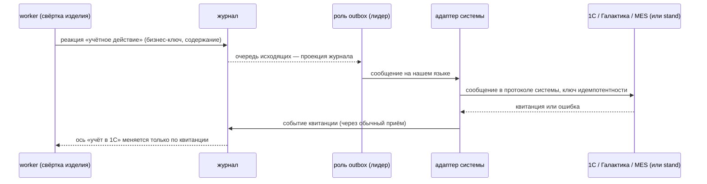

# Интеграции: 1С, Галактика:ERP, MES, КОМПАС-3D

Обзор того, как система «Главный» обменивается данными с внешними системами предприятия. Подробности по каждой системе — в отдельных файлах:

| Система | Документ | Что в MVP |
|---|---|---|
| 1С:ERP 2.5 / ERP УХ | [1c.md](1c.md) | живой двусторонний обмен со stand-ом 1С (эмулятор кейса) |
| Галактика ERP | [galaktika.md](galaktika.md) | адаптер в коде, контракт, эталонные сообщения, контрактные тесты; stand — в очереди работ |
| MES (нейтральный контракт ISA-95 / B2MML) | [mes.md](mes.md) | адаптер в коде, контракт, эталонные сообщения, контрактные тесты; stand — в очереди работ |
| КОМПАС-3D | [kompas.md](kompas.md) | импорт файла условной сборки; прямое подключение — описание |

**Опоры:** FR-90…96, FR-114, FR-130, FR-141; NFR-TEST-2; AD-7, AD-18, AD-20, AD-30, AD-35 (`architecture-spine.md`); кейс §1.5, §3.3, §4.7, §5.3, §6.2; критерии Т2 и О8.

Связанные документы: [architecture.md](../architecture.md) — общая архитектура; [data-model.md](../data-model.md) — запись журнала и сущности; [specifications.md](../specifications.md) — где лежат контракты; [new-adapter.md](../new-adapter.md) — как подключить новый адаптер; [codegen.md](../codegen.md) — кодогенерация и проверки контрактов; [federation.md](../federation.md) — обмен с предприятиями-партнёрами (это не интеграция с учётной системой, а вторая копия «Главного»); [threat-model.md](../threat-model.md) — доверие к фактам внешних систем; [assumptions.md](../assumptions.md) — сводный реестр проектных предположений.

## 1. Принцип: внутренняя модель отдельно, внешние форматы — на границе

Кейс §5.3 требует, чтобы внутренняя производственная модель и форматы внешних систем были различимы, а преобразование шло на границе интеграции. В «Главном» это правило закреплено слоями (AD-1, AD-18):

- **Домен и сценарии приложения** говорят только на нашем языке: изделие, закрывающая точка, решение по изделию, учётное действие. Ни одно имя поля 1С, Галактики или MES в домен не попадает.
- **Порт учёта** (модуль `erp`, слой `application`) — единственная точка, через которую ядро «знает» об учётной системе. Он описан нашими понятиями:
  - на вход — «производственное задание», «справочник номенклатуры», «поступившая партия»;
  - на выход — «принято в работу», «смена склада», «перевод в брак» (вид: переделка, списание, переработка), «возврат поставщику», «выпуск» (с признаком `after_rework` для изделия, принятого после переделки, и с номером разрешения на отклонение, если оно есть), «результат контроля»; предварительно — «возврат из брака в производство» (см. [1c.md](1c.md), §3).
- **Адаптер** конкретной системы (`infrastructure/integration/‹модуль›/‹система›`) переводит порт в протокол системы и обратно. Изменение внешнего формата меняет только адаптер и его контракт в `contracts/integrations/…`, правила домена не трогаются.
- Один и тот же внутренний сигнал может уйти в 1С и в Галактику одновременно — включённые системы и адреса задаются конфигурацией (FR-92).

«Главный» — отдельная система контроля качества и документооборота, а не часть ERP или MES (PRD §4.11). Поэтому в учётную систему уходят только **учётные последствия** решений, а источником истины по сигналам, решениям контролёра, сдерживанию и подписанным документам остаётся «Главный».

## 2. Stand-ы — эмуляторы за теми же протоколами

«Эмулятор» кейса в «Главном» сделан как **stand** — адаптер `infrastructure/integration/‹модуль›/‹система›/stand` (AD-18):

- stand отвечает теми же адресами, форматами и кодами ошибок, что реальная система, на подмножестве объектов; наш клиент не знает, с кем говорит;
- у stand-а собственное состояние в схеме Postgres `stand_‹система›`, свои квитанции и сбои;
- stand-ы работают в роли `stands` процесса `ant` — одна копия-лидер;
- каркас stand-а генерируется из `contracts/integrations`, руками пишутся только состояние и сбои;
- сбои (недоступность, ошибка, дубль, потеря ответа, несовместимые метаданные) включаются только со страницы тестовых сценариев через служебный порт stand-а (FR-91, FR-152);
- переход на реальную систему — сменой адреса в `deploy/config/ant.yaml` (для 1С — плюс установка расширения конфигурации, см. [1c.md](1c.md), §9).

Граница эмуляции описана для каждого stand-а в его документе (NFR-TEST-2): что stand имитирует, чего в нём нет и почему.

## 3. Наружу — только реакциями из журнала и только на закрывающих точках

Исходящее сообщение — не побочный вызов из кода, а **реакция движка**, записанная в журнал (AD-3, AD-18):



Правила:

- **Когда уходит.** Только на закрывающих точках маршрута (ЗТ-1…ЗТ-6 и ЗТ-Р — решение по несоответствию) и только то, что затрагивает учёт: движение и качество материальных ценностей. Внутреннее движение изделия по линии, сигналы, наблюдения камер, журналы станков, гипотезы причин, решения контролёра по сигналам в учётную систему не уходят (FR-91, PRD §4.11). Блокировки уходят только в MES (FR-93), в 1С — нет (AD-18).
- **Ось статуса «учёт в 1С»** (не передано / принято в работу / перемещено / переведено в брак / возвращено поставщику / выпущено) меняет только модуль `erp` и только по квитанции внешней системы (AD-30). Отправка не держит изделие: изделие идёт по маршруту, а «учтено» наступает после подтверждения.
- **Идемпотентность исходящих** (AD-7, FR-96). Ключ — бизнес-ключ (субъект, учётное действие, закрывающая точка). Из него детерминированно получается идентификатор сообщения, который адаптер кладёт в поле системы (`X-Message-Id` у 1С, `messageId` у Галактики, `BODID` у MES). Повтор с тем же ключом получает ту же квитанцию. Новая версия реакции с тем же бизнес-ключом и тем же содержанием — ничего не отправляет; с другим содержанием — исправление через порт учёта (сторно + новое) **только по решению человека**.
- **Повторы.** Автоматический повтор — только при транспортных ошибках (нет соединения, таймаут, 5xx, «сервис временно недоступен»), с экспоненциальной задержкой и ограничением числа попыток. Бизнес-ошибка (4xx, код ошибки системы, `ErrorMessage` MES) — сразу в карантин сообщений без автоповтора.
- **Карантин и ручная переотправка.** Сообщение, исчерпавшее повторы или получившее бизнес-ошибку, попадает в карантин исходящих; администратор видит причину на своём столе (FR-127) и переотправляет вручную с тем же ключом идемпотентности.
- **Отказ доступа** (401/403 или аналог) — канал ставится на паузу, администратору — тревога.
- **Воспроизведение не отправляет.** При воспроизведении, прогоне «по новым правилам» и запросах «на момент времени» роль `outbox` не запущена (AD-18, AD-22, FR-4, FR-96).
- **Отправитель один** — роль `outbox`, одна копия-лидер по аренде (AD-6). Это названное ограничение масштабирования.

## 4. Внутрь — через обычный приём

Задания, справочники, поступившие партии, события MES и файл сборки входят **тем же путём, что и любые факты** (AD-18, FR-26…41):

- адаптер-шлюз читает внешнюю систему и подаёт сообщение на приём (`ingest`) как источник с `source_kind` «внешняя система» и `source_id` вида `erp:1c:‹база›`, `erp:galaktika:‹база›`, `mes:‹экземпляр›`, `cad:kompas`;
- приём проверяет схему, идемпотентность по `source_id + event_id`, при ошибке — карантин с кодом (FR-30); `event_id` входящего факта адаптер строит детерминированно из внешнего ключа и версии записи (например, для 1С — из `Ref_Key` и `DataVersion`), поэтому повторное чтение не даёт двойного учёта;
- такие факты подписаны ключом шлюза и имеют класс происхождения `server-attested` (AD-2). Разрешающие действия и справочники, от которых зависят права и предусловия, не опираются только на такие факты. Промышленный путь — шлюз отдельным процессом со своим ключом или подпись на стороне внешней системы (см. [threat-model.md](../threat-model.md));
- подтверждение приёма внешней системе (квитанция 1С, `Acknowledge*` MES, `GalAck`) отдаётся **после** записи в журнал;
- задание из 1С запускает процесс изделия: стартовое событие BPMN с `messageEventDefinition`, привязанное к типу события «задание из 1С» (решение Д-5 журнала решений, AD-17);
- ручной ввод и импорт Excel/CSV (FR-141) — такие же источники со своей пометкой; они нужны, когда внешней системы нет (ступень «поверх бумаги»).

## 5. Проверка ответной стороны при старте

Каждый адаптер при старте и по расписанию сверяет контракт внешней системы со своим (AD-18, кейс §6.2):

- у 1С — читает `$metadata` OData и сравнивает с манифестом ожидаемых сущностей и полей;
- у MES и Галактики — сверяет версию контракта в квитанциях и валидирует эталонные сообщения по схемам.

При расхождении канал переходит в состояние `degraded`: сообщения не отправляются и копятся в очереди, администратор видит карточку «чего не хватает» на столе состояния компонентов (FR-127). Так ошибка интеграции обнаруживается **до** отправки результата (FR-111).

## 6. Сквозные правила

### 6.1 Источник достоверных сведений

| Что | Источник истины | Кто потребляет | Замечание |
|---|---|---|---|
| Конструкторский состав, обозначение, исполнение, версия КД | КОМПАС-3D / PLM (ЛОЦМАН:PLM) | «Главный», ERP, MES | у нас — неизменяемая версия состава, импорт создаёт новую версию |
| Техпроцесс, маршрут, контрольные операции | САПР ТП / PLM — как черновик | «Главный», MES | **исполняемая подписанная кворумом версия процесса — только в «Главном»** (FR-22, FR-23) |
| Номенклатура (учётная карточка), склады, подразделения | ERP (1С / Галактика) | «Главный», MES | «Главный» номенклатуру в ERP не создаёт |
| Производственные задания, этапы, план | ERP; пооперационный план — MES | «Главный» | «Главный» только читает |
| Серии закупленных партий | ERP (поступление) | «Главный» | входной контроль ссылается на серию ERP |
| Факты операций (начало, конец, исполнитель) | MES; без MES — терминал исполнителя «Главного» | «Главный», ERP через MES | «без повторного ручного ввода» (FR-93) |
| Результаты контроля, дефекты, сигнал, решение контролёра, итоговый статус, сдерживание, область риска, подписанные документы, разрешения на отклонение | **«Главный»** | ERP (учётные последствия), MES (блокировки и результаты) | ядро ответственности «Главного» |
| Остатки, себестоимость, списания, возвраты, претензии | ERP | «Главный» (для отчётов и области риска) | |
| Сотрудники, допуски, СКУД | кадровая система, СКУД | «Главный» | вне этого документа |

Кто присваивает заводской номер изготовленному экземпляру (MES, «Главный» или ERP) — **проектное предположение**: «Главный» при регистрации изделия, регистрация серии в ERP — при выпуске.

### 6.2 Сопоставление идентификаторов (FR-95)

- **Внешний идентификатор никогда не становится нашим ключом.** Изделие получает ID при регистрации в «Главном»: `код_предприятия:локальный_id` (AD-16, AD-19); он же — глобальный ID в федерации.
- Каждое соответствие — запись журнала `reference.external_id.mapped` (эмитент — модуль `reference`; адаптер-шлюз передаёт соответствие через приём, система различается по `source_id`). Проекция соответствий одна, её писатель — `reference` (AD-18, AD-31).
- Соответствие содержит: систему и экземпляр (база), тип объекта, внешний ID, внешний код или номер (для людей), версию внешней записи, наш ID, дату действия.
- **Конфликт** (тот же внешний ID указывает на другой наш объект, или наоборот) — сигнал администратору, а **не перезапись**. Смена внешнего ID (объект пересоздали во внешней системе) — новая запись соответствия, прежняя остаётся в истории.
- Входящий объект, который не удалось сопоставить, не создаёт наш объект молча: для номенклатуры, где источник истины — ERP, создаётся наша запись справочника со ссылкой на внешнюю; расхождение обозначений между КОМПАС и ERP — отчёт о расхождениях без автосоздания.
- В каждом исходящем сообщении — и ID получателя, и наш ID, и естественный ключ (обозначение, заводской номер), чтобы получатель мог сверить.

| Система | Внешний ID | Что ещё храним | Подводные камни |
|---|---|---|---|
| 1С | `Ref_Key` (GUID) | `Code` / `Number` + `Date`, `DataVersion` | `Code`/`Number` не уникальны во времени; пустая ссылка — нулевой GUID; `DeletionMark` — не удаление |
| Галактика | `NRec` **строкой** + таблица + филиал | код, номер документа | 64-битное целое теряет точность в JSON — только строка |
| MES | `ID` объекта (`MaterialLot.ID`, `OperationsRequest.ID`) | `BODID` сообщения | партия MES ≠ серия ERP — связь хранится явно |
| КОМПАС | обозначение (+ исполнение) + файл + хеш файла | `UniqueNum` (только внутри документа) | пустое или повторяющееся обозначение — ошибка импорта |

### 6.3 Время

В каждом сообщении — время возникновения из источника (`occurred_at`); время получения (`received_at`) и записи ставит только ядро (FR-27, кейс §4.4). В наших контрактах время — RFC 3339 UTC с тремя знаками миллисекунд. Время внешней системы без часового пояса адаптер переводит в UTC по часовому поясу, заданному в конфигурации канала.

### 6.4 Версии контрактов и обнаружение несовместимости до отправки

- Наши контракты с внешними системами версионируются отдельно от приложения и от анализатора (кейс §4.7): `qc.v1` (1С), `gal.qc.v1` (Галактика), `mes.isa95.v1` (MES), формат файла сборки — поле версии формата. Добавление необязательного поля совместимо; удаление или смена смысла — новая мажорная версия.
- Схемы и эталонные сообщения лежат в `contracts/integrations/…` и используются только в `infrastructure` (AD-20).
- `make check` содержит контрактные тесты адаптеров на эталонных сообщениях: каждое эталонное сообщение валидируется схемой (JSON Schema, XSD; для MES — родные XSD B2MML), адаптер проверяется против stand-а с эталонными метаданными.
- `make contract-demo` — ветка с ломающим изменением контракта краснеет **до** отправки результата в 1С (FR-111, кейс §6.2, критерий О8).
- В работе — проверка ответной стороны при старте (§5).

## 7. Событие системы → сообщение → система → объект

Сводная таблица сигналов. Имена наших типов событий — предварительные (фиксирует `contracts/events/catalog.yaml`, эпик 00). Объекты внешних систем, кроме отмеченных «проверено по документации» в документах систем, — **проектные предположения**.

| # | Что произошло в «Главном» | Сообщение / вызов | Система | Объект у получателя |
|---|---|---|---|---|
| 1 | Нужны справочники (номенклатура, серии, склады, подразделения) | OData `GET Catalog_…` | 1С → «Главный» | справочники ERP → наш справочник + соответствия ID |
| 2 | Нужно задание | OData `GET Document_ЭтапПроизводства2_2` | 1С → «Главный» | «Этап производства» → задание, старт процесса изделий |
| 2а | То же из MES | `ProcessOperationsSchedule` → `AcknowledgeOperationsSchedule` | MES → «Главный» | `OperationsRequest` → задание |
| 2б | То же из Галактики | XML-пакет «сменное задание / маршрутный лист» → `GalAck` | Галактика → «Главный» | маршрутный лист → задание |
| 3 | Новая версия состава изделия | файл условной сборки | КОМПАС → «Главный» | новая версия состава в нормативном слое |
| 4 | Операция начата / завершена | `NotifyOperationsEvent`, `SyncOperationsPerformance` | MES → «Главный» | факт операции |
| 5 | ЗТ-1: выдано в производство | `POST /hs/qc/v1/postings` «принято в работу» | «Главный» → 1С | «Этап производства» |
| 6 | ЗТ-2, ЗТ-3: передача между цехами | «смена склада» | «Главный» → 1С / Галактика | «Перемещение товаров» / накладная на перемещение |
| 7 | Любая подписанная ЗТ и ЗТ-Р | «результат контроля» | «Главный» → 1С / Галактика / MES | отметка результата контроля / «Управление качеством продукции» / `TestResult` |
| 8 | Защитная реакция: блок изделия или партии | `SyncMaterialLot` / `SyncMaterialSubLot` `Disposition=Restricted` | «Главный» → MES | блок партии или экземпляра; **в 1С не уходит** |
| 9 | Снятие блока (решение человека) | `SyncMaterialLot` `Disposition=UnRestricted` | «Главный» → MES | снятие блока |
| 10 | ЗТ-Р: переделка / ремонт | «перевод в брак (переделка)»; в MES — сегмент доработки | «Главный» → 1С / Галактика / MES | «Этап производства» (изменение качества) / задание на доработку |
| 11 | ЗТ-Р: списать | «перевод в брак (списание)» | «Главный» → 1С / Галактика / MES | «Не годен» + списание / закрытие партии |
| 12 | ЗТ-Р: вернуть поставщику | «возврат поставщику» с основанием претензии | «Главный» → 1С / Галактика | «Возврат товаров поставщику» |
| 13 | ЗТ-6: выпуск | «выпуск» (`after_rework`, номер разрешения на отклонение) | «Главный» → 1С / Галактика | выпуск продукции из производства |
| 14 | Квитанция или ошибка | `202/200/422/409/5xx`, `odata.error`, `ConfirmBOD`, `GalAck` | система → «Главный» | событие квитанции; ось «учёт в 1С» |
| 15 | Контракт системы изменился | чтение `$metadata`, проверка версии | 1С, MES | канал `degraded`, карточка администратора |

## 8. Где что лежит в коде

Пути — по дереву репозитория из `architecture-spine.md`; окончательные имена пакетов уточняются по коду.

| Что | Путь |
|---|---|
| Порт учёта и сценарии модуля `erp` | `backend/internal/application/erp/` |
| Доменные правила «какое учётное действие на какой закрывающей точке» | `backend/internal/domain/erp/` |
| Клиент и stand 1С | `backend/internal/infrastructure/integration/erp/1c/`, `…/erp/1c/stand/` |
| Клиент Галактики (stand — в очереди) | `backend/internal/infrastructure/integration/erp/galaktika/` |
| Клиент MES (stand — в очереди) | `backend/internal/infrastructure/integration/mes/b2mml/` |
| Импорт файла сборки КОМПАС | `backend/internal/infrastructure/integration/cad/kompas/` |
| Схемы, манифест метаданных 1С, эталонные сообщения | `contracts/integrations/erp/1c/`, `contracts/integrations/erp/galaktika/`, `contracts/integrations/mes/`, `contracts/integrations/cad/assembly.schema.json` |
| Типы событий `erp.*`, `mes.*`, `cad.*`, `reference.*` | `contracts/events/catalog.yaml`, `contracts/events/‹семейство›/` |
| Включённые системы, адреса, таймауты, повторы | `deploy/config/ant.yaml`, переменные `ANT_*` (без секретов; учётные данные — файлами в томах) |
| Карантин исходящих, состояние каналов | модуль `ops`, стол администратора (FR-127) |

Пример фрагмента конфигурации (предварительно, ключи уточняются по коду):

```yaml
integrations:
  erp:
    onec:
      enabled: true
      base_url: http://ant/stand/1c/erp          # адрес stand-а внутри compose; реальная 1С — адрес публикации базы
      contract: qc.v1
      poll_interval: 15s
      timezone: Europe/Moscow
      retry: { max_attempts: 10, initial: 1s, max: 30m }
      credentials_file: /run/secrets/onec-basic    # файл в томе, не переменная окружения
    galaktika:
      enabled: false
      transport: exchange-dir                      # exchange-dir | rest-facade
  mes:
    enabled: false
    contract: mes.isa95.v1
  cad:
    kompas:
      import_dir: /data/import/cad
```

## 9. Состав MVP и очередь

| Система | Позвоночник (строим первым) | Очередь |
|---|---|---|
| 1С | stand, клиент OData и HTTP-сервиса, порт учёта целиком, квитанции, сбои, сверка `$metadata`, `/stand/1c/` | — |
| Галактика | порт, клиент, контракт `gal.qc.v1`, эталонные сообщения, контрактные тесты | stand (файловый приёмник + REST-фасад) |
| MES | порт, клиент, контракт `mes.isa95.v1`, эталонные сообщения, контрактные тесты | stand |
| КОМПАС-3D | импорт файла условной сборки ФЛ-100.00.000 СБ | прямое подключение — только описание |

Основание — карта возможностей спайна (строка «Интеграции») и кейс §3.3: «в MVP реализуется один двусторонний обмен с эмулятором… для остальных систем предоставляются контракты, примеры сообщений, правила сопоставления идентификаторов и обработки ошибок».

## Уточнить после появления кода

- Окончательные имена типов событий семейств `erp`, `mes`, `cad`, `reference` (сейчас предварительные) — по `contracts/events/catalog.yaml`.
- Имя и методы порта учёта в `backend/internal/application/erp/`, перечень учётных действий (включён ли «возврат из брака в производство»).
- Фактические пути пакетов адаптеров и stand-ов, схема `stand_‹система›`.
- Ключи конфигурации в `deploy/config/ant.yaml` (пример выше — предварительный).
- Формула идентификатора исходящего сообщения из бизнес-ключа (UUIDv5 от `NS_ANT` и бизнес-ключа — предварительно).
- Имена эталонных сообщений и тестов в `contracts/integrations/…`; имя цели и ветки для `make contract-demo`.
- Коды ошибок `contracts/errors.yaml` для интеграций (карантин исходящих, `degraded`, конфликт соответствия ID).
- Где на столе администратора показаны карантин исходящих и состояние каналов.
