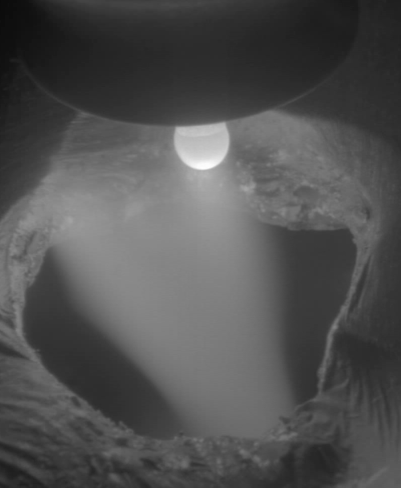
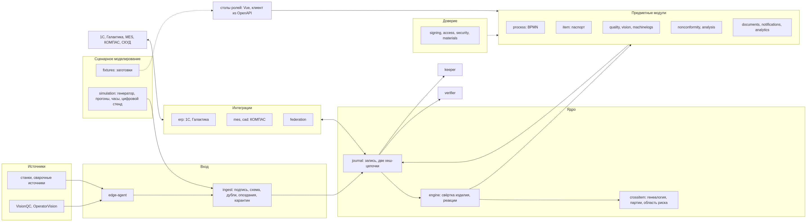

# «Главный» — техническая мини-презентация

Короткая версия защиты для чтения с экрана: 12 слайдов, у каждого — вывод в заголовке, 3–5 строк и ссылка на
доказательство в репозитории. Все изделия, числа и люди — условные, из сюжета «Плохой день сварочного участка (ИС-2)»;
внешние системы и источники эмулируются ([assumptions.md](assumptions.md)). PDF презентации сдаётся на платформе.
Проверить каждую строку без нас — [reviewer-guide.md](reviewer-guide.md).

## 1. «Главный» — платформа управления космическим производством

- Собирает результаты контроля, события производства, действия исполнителей и состояние оборудования в одну
  подписанную историю каждого экземпляра изделия.
- Не пускает изделие через закрывающую точку без подписанного решения уполномоченного человека.
- В кейсе «Интеллектуальный контроль качества деталей» мы делаем её часть — контур качества; в коде система
  называется `ant`.

Доказательство: [README.md](../README.md), [architecture.md](architecture.md).

## 2. Дорог не только брак, но и неизвестность после него

- Камера после сварки видит прожог на Ф-017. Сразу встают вопросы: когда появился дефект, что ещё задето, можно ли
  работать дальше, что проверить.
- Первый ответ «виноват сварщик» — самый дешёвый и чаще всего неверный: обнаружение после операции ещё не вина
  оператора.
- Нужна доказательная история, по которой человек решает, а система не угадывает.

Доказательство: [guides/demo_scenarios.md](guides/demo_scenarios.md#главная-история-плохой-день-сварочного-участка-ис-2),
[scenario-processing.md](scenario-processing.md).

## 3. Сквозной процесс брака: сигнал — ещё не несоответствие

- Исходный сигнал, анализ системы, решения людей и итоговый статус — разные записи, связанные ссылками (кейс §7.2).
- Автоматика только ограничивает: изолирует, блокирует, расширяет область риска. «Годно», «ремонт», «списать» ставит
  человек с полномочием и подписью; ремонт и «как есть» — только по разрешению на отклонение.
- Переделка — новое выполнение операции со ссылкой на прежнее, счётчик доработок против лимита.
- Документы (акт о браке, сопроводительная карта) собираются из истории по шаблону: 39 видов документов в
  нормативном слое.

Доказательство: [reviewer-guide.md — О2 / Т6](reviewer-guide.md#о2--т6-сквозной-процесс-контроля-качества-и-работы-с-браком-15--15),
`backend/internal/domain/nonconformity/`, [document-catalog.md](document-catalog.md).

## 4. Сбор данных: повтор не задваивается, опоздание встаёт на своё время

- Каждое событие проходит подпись, схему, проверку дублей и опозданий; некорректное — в карантин с кодом и полем,
  номер изделия без человека не подставляется.
- Три времени: `occurred_at` — когда произошло (источник), `received_at` — когда получено, `recorded_at` — доменное
  время записи («что мы знали»); порядок в пределах изделия — `occurred_at → received_at → event_id`.
- В главной истории опоздавший журнал ИС-2 с повторами: 312 повторов отсеяно, 928 опоздавших встали на своё время.
- edge-агент у источника: ключ устройства, номер `source_seq`, буфер и досылка при недоступности ядра.

Доказательство: [reviewer-guide.md — О3 / Т7](reviewer-guide.md#о3--т7-модуль-сбора-и-обработки-данных-15--15),
`backend/internal/application/ingest/pipeline.go`, [data-model.md](data-model.md), `make sim-check`.

## 5. Область риска сужается только по доказательствам: 34 → 13 → 6

- Под подозрением всё, что сварено после последнего точно годного изделия; расширяет область система сама.
- Сужает только технолог и только с основанием: 34 → 13 (только источник ИС-2), затем 13 → 6 — после опоздавшего
  журнала ИС-2. У каждого исключённого изделия — кнопка «почему?».
- Новые данные меняют вывод, а не прошлое: у подписанного раньше решения по Ф-015 — метка «пересмотрите».
- Три дорожки «изделие — человек — оборудование» и общие факторы: «источник 3 из 3, сварщики разные».

Доказательство: `backend/internal/domain/analysis/stage.go`, `backend/internal/domain/analysis/factors.go`,
[process/differentiators.md](process/differentiators.md).

## 6. Камеры и ИИ: «не видно» не значит «годно»

- Вход — готовые результаты анализатора; своей CV-модели нет, модель не обучали (кейс §4.1, §4.5).
- Три исхода результата контроля: «признаки есть», «признаков нет», «оценка невозможна». Уверенность анализатора и
  качество наблюдения — разные величины: «признаков нет, уверенность 0,91» при качестве 0,34 — «оценка невозможна»
  и повторный кадр.
- Карта реакций и уровни доверия анализатора: система сама может заблокировать и изолировать, подтверждает
  несоответствие контролёр.
- Кадры — иллюстрации классов дефектов из открытого набора TIG Aluminium 5083 (CC BY-SA 4.0), не снимки изделий.

Доказательство: [vision-camera-project.md](vision-camera-project.md), `backend/internal/domain/quality/observe.go`,
[images/vision-demo/ATTRIBUTION.md](images/vision-demo/ATTRIBUTION.md), [process/detection-methods.md](process/detection-methods.md).

## 7. Интеграции: живой обмен с 1С, остальные — за протоколами настоящих систем

- 1С: чтение через OData v3, запись через HTTP-сервис, квитанции, повтор с идемпотентностью, карантин исходящих;
  страница «глазами 1С» — <http://127.0.0.1:8491/stand/1c/>.
- Галактика:ERP и MES (B2MML-JSON) — адаптеры и stand-ы по проектным форматам; КОМПАС-3D — импорт файла условной
  сборки (геометрии нет, это сказано прямо); СКУД — допуск к рабочему месту.
- Обмен наружу и внутрь — только через журнал; внешние номера — через таблицу соответствий.
- Эталонные сообщения 1С, Галактики, MES и КОМПАС со схемами — в [integrations/examples/](integrations/examples/README.md).

Доказательство: [integrations/README.md](integrations/README.md), [reviewer-guide.md — Т2](reviewer-guide.md#т2-архитектура-и-системные-интеграции-12).

## 8. Безопасность и целостность: подмену видно

- Две хеш-цепочки на Стрибог-256; контрольные точки подписывает отдельный хранитель, независимый верификатор
  переигрывает журнал тем же доменным кодом.
- `make tamper` — три атаки в обход системы (правка записи, правка с пересчётом цепочки, правка представления),
  каждую ловит верификатор; `make verify` — внеочередная проверка.
- Криптопрофили: `gost` (ГОСТ Р 34.10-2012, Стрибог-256), `pq` (ML-DSA-65, демонстрационный), `hybrid` (обе
  подписи); ключи людей — вне сервера, в расширении браузера или у агента токена.
- Права — политика-данные на Casbin; критические действия — в отдельном журнале (AUD-01).

Доказательство: [crypto.md](crypto.md), [threat-model.md](threat-model.md), `backend/cmd/tamper/`, `backend/cmd/verifier/`.

## 9. Архитектура: журнал — единственный источник истины

- Всё, что система показывает, пересчитывается из журнала, в который только дописывают.
- Слои `domain → application → infrastructure`; инфраструктура — пять зон кейса (хранение, транспорт, интеграции,
  наблюдаемость, защита); направление зависимостей проверяет линтер.
- Хранитель и верификатор — отдельные процессы; масштаб — фиксированные партиции по изделию с арендами.

Схема процессов и границ доверия — [images/architecture-containers.png](images/architecture-containers.png).
Доказательство: [architecture.md](architecture.md), [architecture-spine.md](architecture-spine.md) (47 решений).

## 10. Расширяемость: один источник на контракт, рассинхронизацию ловит сборка

- OpenAPI, AsyncAPI + JSON Schema, дескриптор BPMN — единственные источники; из них генерируются типы Go и
  TypeScript и клиент API (`make generate`, `make check-generated`).
- `make contract-demo` — ломающее изменение исходящего сообщения в 1С обнаруживается до отправки; `make check-compat`
  сверяет контракт с базой `contract-v1`; пример изменения v1 → v2 — `equipment.state.changed`.
- Новый адаптер — без правки ядра: порты платформы и ключи конфигурации; столы ролей — данные.
- Процесс — BPMN 2.0 с расширениями; новая версия вступает в силу после подписей кворума.

Доказательство: [codegen.md](codegen.md), [new-adapter.md](new-adapter.md), [scaling.md](scaling.md).

## 11. Что работает, что эмулируется, что описано

- **Работает в `main`:** приём и журнал, история изделия, несоответствия и решения с подписью, область риска,
  разбор обстоятельств, документы из истории, обмен с 1С, `make tamper` и `make verify`, кодогенерация и проверки
  контрактов, цифровой стенд и табло «ожидалось → получилось».
- **Эмулируется** (stand-ы за протоколами): 1С, Галактика, MES, СКУД, VisionQC, OperatorVision, станки и сварочные
  источники, КОМПАС (файл сборки), второе предприятие — [assumptions.md](assumptions.md).
- **Частично или описано:** срез «по линиям» и доля ошибок по сопоставимым работам, прогон «1 = N» обработчиков
  (`make load` подготовлен, не прогонялся), Kafka и OpenTelemetry, TLS к Postgres, ротация KEK — [case-compliance.md](case-compliance.md),
  [reviewer-guide.md — Ограничения решения](reviewer-guide.md#ограничения-решения).

## 12. Как проверить без нас

- Запуск: `make demo` (нужен только Docker), интерфейс — <http://127.0.0.1:8480/>, вход ADM-01 → «Тестовые сценарии».
- Показ «Партия фланцев: сбой ИС-2» (SHOW-IS2) и главная история MS-1 — [guides/demo_scenarios.md](guides/demo_scenarios.md).
- Проверки: `make check`, `make sim-check`, `make tamper`, `make verify`, `make contract-demo`, `make check-compat`;
  документация — `node docs/scripts/check-docs.mjs`; все цели — `make help`.
- Видео: скринкасты — ссылки будут добавлены (раздел «Материалы защиты» в [README.md](../README.md#материалы-защиты)).
- Ответы на частые вопросы жюри — [jury-answers.md](jury-answers.md); источники — [sources.md](sources.md).
