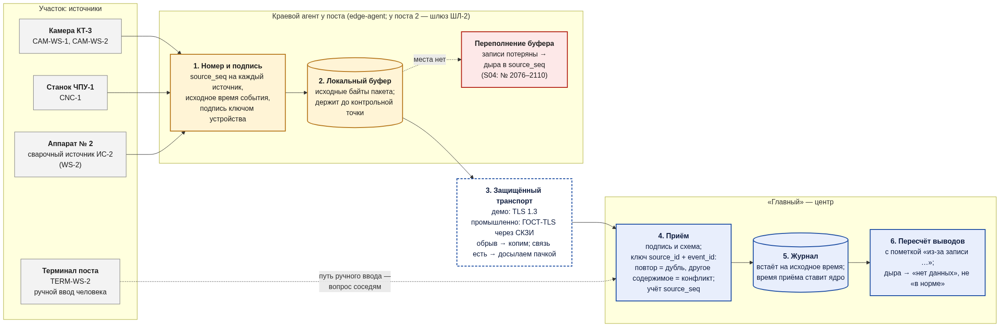
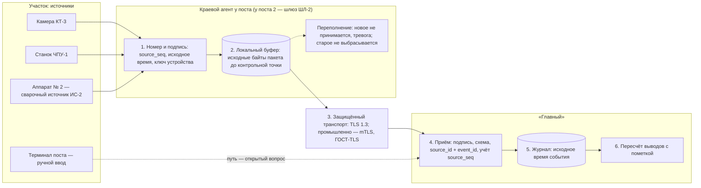

# Краевой агент: буфер, досылка, дыры в данных

> **Статус документа.** Материал процессной сессии, сверяется с кодом `backend/cmd/edge-agent`. Поведение агента взято из плана разработки: спайн архитектуры (AD-2, AD-5, AD-7, AD-9, AD-10, AD-11, AD-23, AD-25, AD-29, AD-34, AD-37, AD-38, AD-46) и PRD (FR-147). Числа и время — из наших машинных данных имитатора (`scenarios/process-session/emulator-data/`: `definitions/reference/sources.yaml`, `streams/_manifest.yaml`, ожидания S04, S05, S07). **Это план, а не проверенный код.** Где ответа в плане нет, стоит пометка **«открытый вопрос»**.

> **Коротко в 5 строк**
> 1. Краевой агент стоит у источника: у камеры, станка, сварочного аппарата. Он нумерует записи (`source_seq`), сохраняет исходное время события и подписывает пакет ключом устройства.
> 2. Нет связи — агент копит исходные пакеты в локальном буфере. Связь вернулась — досылает пачкой, время события не меняется.
> 3. «Главный» принимает пачку по ключу `source_id + event_id`: повтор — дубль, а не второй учёт; тот же номер с другим содержимым — конфликт.
> 4. Переполнился буфер — агент **новое не принимает и поднимает тревогу**, старое из буфера не выбрасывает. Непринятые записи — явная дыра в данных источника. Система пишет «нет данных», а не «в норме».
> 5. Наш сюжет: шлюз ШЛ-2 аппарата № 2 потерял связь во вторник в 09:50, дослал журнал в среду в 12:05, 35 записей потеряны. Опоздавший журнал сузил область риска с 13 до 6 изделий.

## 1. Схема

Источник схемы — блок Mermaid ниже (упрощённый; картинку перерисовывают любым рендером Mermaid, например mermaid-cli).

## 2. Что делает краевой агент (по плану разработки)

| Что | Как по плану | Где |
|---|---|---|
| Где живёт | Отдельный процесс `cmd/edge-agent` у источника: ключ устройства, `source_seq`, буфер исходных конвертов, досылка. Отдельный процесс нужен из-за границы доверия: ключ устройства не лежит на сервере | AD-25, AD-11 |
| Номер записи | `source_seq` ведётся на каждый `source_id` устройства. В прогоне сценария `source_id` получает префикс прогона: `‹run_id›/‹источник›` | AD-7, AD-38 |
| Время | Агент ставит время события `occurred_at` по часам источника. Время приёма ставит только ядро. Сдвиг часов оценивается по каждому источнику; событие «из будущего» получает флаг, порядок молча не подменяется | AD-5, AD-37 |
| Подпись | Пакет DSSE, подпись ключом устройства (класс происхождения `device`). Ключ вводится «актом ввода устройства» с маршрутом подписей | AD-10, AD-2, каталог документов |
| Что отправляет | Значимые события и сводки телеметрии на окно цикла станка; сырые миллисекундные данные остаются на краю. Номер выполнения операции агент не подставляет — привязку делает межизделийная стадия | AD-29, FR-147 |
| Буфер | Хранит и досылает **исходные байты** конверта. Держит их до подтверждения контрольной точкой хранителя — чтобы после восстановления из резервной копии дослать хвост | AD-7, AD-34 |
| Транспорт | TLS 1.3 между компонентами; промышленный вариант — mTLS (взаимная аутентификация агента и сервера), ГОСТ-TLS через СКЗИ. Пачки идут обычной операцией приёма из `openapi.yaml` | AD-23, AD-46 |

## 3. Поведение при обрыве связи

| Шаг | Что происходит | Правило |
|---|---|---|
| 1. Обрыв | Агент не может отправить пакет. Он продолжает нумеровать и подписывать записи и кладёт их в буфер | AD-7 |
| 2. Буфер | Копятся исходные байты пакетов с исходным `occurred_at` и `source_seq` | AD-7 |
| 3. Переподключение | Агент досылает пачку. Повтор части пачки допустим | AD-7 |
| 4. Досылка с исходным временем | Запись встаёт в историю изделия на своё время события, а не на время получения. Порядок в пределах изделия: `occurred_at` → `received_at` → `event_id` | AD-5, AD-37 |
| 5. Идемпотентность | Ключ приёма — `source_id + event_id`. Тот же payload — дубль, его не считают второй раз. Другой payload с тем же ключом — конфликт целостности: запись в журнал критических действий и событие безопасности | AD-7 |
| 6. Пересчёт | Воркер заново сворачивает весь вход изделия. Изменившиеся выводы получают новую версию с пометкой «пересмотрен из-за записи ‹id›». Подписанные решения людей не отменяются — автору ставится «решение принято до новых данных — пересмотрите» | AD-3, AD-5 |

## 4. Переполнение буфера: новое не принимается, тревога, явная дыра

| Что | Как по плану | Где |
|---|---|---|
| Политика переполнения | Буфер полон — агент новые записи не принимает и поднимает тревогу; уже накопленное не выбрасывает и досылает после восстановления связи. Непринятые записи в историю не попадают — это явная дыра, а не тихая замена | FR-147 |
| Дыра видна | Приём ведёт учёт последовательности `source_seq` по каждому источнику вместе с карантином | AD-7 |
| Сигнал о потере | «Потеря данных источника» — реакция планировщика после окна ожидания (параметр конфигурации). Если пропуск дослали внутри окна, сигнал отменяется | AD-7 |
| Верификатор | Проверяет непрерывность `source_seq`: каждый номер есть в журнале или в записи о карантине | AD-9 |
| На экране | «Не знаем» — не «годно»: сварка без журнала режима получает «оценка режима невозможна», изделие в области риска — серое «нет данных». Ток не «дорисовывается» | AD-2; наши ожидания S04, S07 |

## 5. Наш сюжет: шлюз ШЛ-2 и аппарат № 2

Аппарат № 2 — сварочный источник ИС-2 (`WS-2`) на сварочном посту 2 линии L-FL-2. Его журнал идёт через краевой агент — шлюз ШЛ-2 (`GW-2`). Время — МСК.

| Когда | Что происходит | Где в данных |
|---|---|---|
| Вт 22.09, 09:50 | ШЛ-2 теряет связь, начинает копить журнал ИС-2 | `streams/_manifest.yaml → batches` |
| Вт 10:05 | Через 15 минут — «нет данных от ИС-2», уведомление администратору и вопрос мастеру М-02 «остановить пост ИС-2?» | ожидания S07-01, S07-10 |
| Вт 10:20:14 | Ток ИС-2 впервые выходит за уставку: 176 А при 160 ± 10 А. Это запись EV-WS2-0412. «Главный» о ней пока не знает | S07 |
| Вт 16:40–17:15 | **Буфер ШЛ-2 переполнен:** агент поднимает тревогу и новые записи не принимает; накопленное с 09:50 сохранено. 35 записей журнала (`source_seq` 2076–2110) не приняты — потеряны. В это время варился Ф-019 | S04, `streams/_manifest.yaml → gaps` |
| Вт 23:00 | У сварок ИС-2 без журнала итог режима — «оценка режима невозможна», а не «в норме» | ожидание S07-11 |
| Ср 23.09, 11:10 | Сигнал камеры по Ф-017 подтверждён (НС-01). Движок строит область риска RS-01 v1 — **34** изделия, 33 заблокированы | S03, S05-01 |
| Ср 11:12 | Мастер останавливает пост ИС-2 по предложению системы | S05-07 |
| Ср 11:45 | Технолог сужает круг до **13**: исключены все 21 сварка на ИС-1, у ИС-1 журнал непрерывный | S05-08, S05-09 |
| Ср 12:05:00–12:05:31 | **ШЛ-2 досылает пачку:** 1240 строк, из них 928 уникальных и 312 повторов. Наибольшая задержка ≈ 26 ч. EV-WS2-0412 встаёт на своё время Вт 10:20:14 | S06, S07-02, S07-08 |
| Ср 12:05 | 312 повторов — дубли, второй раз не учитываются. Выводы пересчитаны с пометкой «из-за EV-WS2-0412»: гипотезы НС-01 v2, «пересмотрите» на ЗТ-3 Ф-015, показатели прошлых дней | S06, S07-05…S07-07 |
| Ср 12:15 | Технолог сужает круг до **6**: 7 сварок ИС-2 до Вт 10:20 были в уставке. Ф-019 остаётся серым «нет данных»: его записи потеряны при переполнении | S05-11…S05-15, S04-08…S04-10 |
| Чт 24.09, 16:40 | Инъекция S06: вся пачка ещё раз плюс одна строка с тем же номером, но с током 171 А вместо 176 А → повторы — дубли, другая строка — конфликт целостности | S06 |

Итог — «тающая область» **34 → 13 → 6**. Сужение 13 → 6 стало возможным только потому, что краевой агент сохранил исходное время события, а приём не посчитал повторы дважды. Серый Ф-019 — честный след переполнения буфера.

## 6. Открытые вопросы

1. **Политика переполнения буфера — решено:** агент новое не принимает и поднимает тревогу, старое не выбрасывает. В наших данных потерян кусок в середине интервала (Вт 16:40–17:15) — это записи, пришедшие при полном буфере.
2. **Отметка о потере от самого агента.** Пишет ли агент служебную запись «потеряно N записей, номера с … по …» или дыру видят только приём и верификатор?
3. **Размер буфера и окно ожидания** сигнала «потеря данных источника» — где задаются (`deploy/config`?) и какие значения в демо?
4. **Терминал рабочего места.** Ручной ввод исполнителя (начало и конец операции, подтверждение шага) подписывается ключом человека уровня 1. Он идёт через краевой агент или прямо в API? Это же вопрос 1 в `scenarios/process-session/emulator-data/README.md` §7.
5. **Номер из файла сценария.** Берёт ли краевой агент `source_seq` из наших потоков как есть? Без этого не воспроизвести повторы S06 и дыру S04 (наш вопрос 4 там же).
6. **Статус «нет связи» у источника.** Наше ожидание S07-01 — «нет данных от ИС-2» через 15 минут. Это реакция планировщика по сердцебиению агента или отдельная метрика `ops`?

## 7. Связанные документы

- [Сценарий S04 — недостаток сведений](../../scenarios/process-session/cards/S04/README.md), [S05 — ток вне уставки и область 34 → 13 → 6](../../scenarios/process-session/cards/S05/README.md), [S06 — повторы](../../scenarios/process-session/cards/S06/README.md), [S07 — опоздавший журнал](../../scenarios/process-session/cards/S07/README.md).
- [Камеры: край и центр](../vision-camera-project.md) — тот же буфер у контрольной точки.
- [Базовая защита](../threat-model.md) — подпись пакетов и защищённый транспорт.
- [Состояние линии](line-state-screen.md) — как обрыв ШЛ-2 выглядит на экране в среду 11:30.
