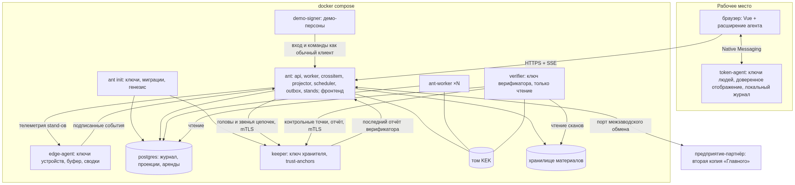

# Путеводитель для проверяющих

«Главный» — платформа управления качеством для единичного и мелкосерийного производства ракетно-космической отрасли; решение кейса КосмоХакатона 2026 «Интеллектуальный контроль качества деталей». В коде система называется `ant`.

> **Система уже развёрнута: <https://main.coopenomics.world/>** — ничего устанавливать не нужно. На экране входа
> раскройте «Демо-вход: выберите сотрудника», пароль не нужен. С чего начать — [показ за 10 минут](#что-посмотреть-за-10-минут).
> Скринкасты — [папка на Google Диске](https://drive.google.com/drive/folders/1KHaW8OrHoSdArqbAYhVbvDC0NDHx3q_L?usp=sharing).

Документ отвечает на три вопроса эксперта: где что лежит, что посмотреть в первую очередь и как проверить каждый критерий оценки — что нажать или запустить, что должно получиться, где это в коде. Статус каждого пункта кейса — в [case-compliance.md](case-compliance.md), рассказ о решении — в [presentation.md](presentation.md), запуск у себя — в [README](../README.md#быстрый-старт).

## Содержание

- [Навигатор по решению](#навигатор-по-решению) — все документы решения
- [Быстрый старт: онлайн-демо](#быстрый-старт-онлайн-демо) — роли и вход
- [Что посмотреть за 10 минут](#что-посмотреть-за-10-минут) — показ «Партия фланцев» в 7 шагах
- [Запуск у себя](#запуск-у-себя) — только то, что нужно для проверок
- [Сводная таблица критериев](#сводная-таблица-критериев) и разделы по каждому критерию: что проверяем, как проверить, что должно получиться, где в коде
- [Ограничения решения](#ограничения-решения) — что реализовано частично или только описано
- [Приложение. Где в коде — подробно](#приложение-где-в-коде--подробно) — полные карты кода по критериям и нормативные опоры

## Навигатор по решению

Полный список документов решения; у каждого своя задача.

**Посмотреть**

| Что | Где |
|---|---|
| Онлайн-демо — работает без установки | <https://main.coopenomics.world/> |
| Скринкасты | [папка с роликами на Google Диске](https://drive.google.com/drive/folders/1KHaW8OrHoSdArqbAYhVbvDC0NDHx3q_L?usp=sharing) |
| Техническая презентация: проблема, идея, история показа, архитектура, масштаб и ключевые отличия | [presentation.md](presentation.md), [«Чем решение выделяется»](presentation.md#чем-решение-выделяется) |
| Сценарии показа и главная история | [guides/demo_scenarios.md](guides/demo_scenarios.md) |
| Запуск у себя, вход, материалы защиты | [README.md](../README.md) |

**Как устроено**

| Что | Где |
|---|---|
| Архитектура: схемы, модули, потоки данных | [architecture.md](architecture.md) |
| 47 архитектурных решений с обоснованием | [architecture-spine.md](architecture-spine.md) |
| Требования к системе: роли, сценарии, FR-1…FR-158 | [prd.md](prd.md) |
| Состав целевой системы (кейс §3.2) | [target-components.md](target-components.md) |
| Модель данных | [data-model.md](data-model.md) |
| Спецификации: API, события, процесс, интеграции | [specifications.md](specifications.md), контракты — [`contracts/`](../contracts/), свойства расширения BPMN — [bpmn-ext-properties.md](bpmn-ext-properties.md) |
| Кодогенерация и проверка контрактов | [codegen.md](codegen.md) |
| Масштабирование и расширение | [scaling.md](scaling.md), [new-adapter.md](new-adapter.md), [observability-kafka-otel.md](observability-kafka-otel.md) |

**Производство и контроль качества**

| Что | Где |
|---|---|
| Схема процесса изготовления фланца (BPMN) и материалы процесса | [process/README.md](process/README.md) |
| Как система отрабатывает сценарии кейса | [scenario-processing.md](scenario-processing.md) |
| Камеры и ИИ: проект комплекса и контур допуска моделей | [vision-camera-project.md](vision-camera-project.md) |
| Документы по этапам процесса | [document-catalog.md](document-catalog.md) |
| Нормативные опоры: ГОСТ и отраслевые требования | [normative-anchors.md](normative-anchors.md) |
| Методы обнаружения: какой дефект чем ловим | [process/detection-methods.md](process/detection-methods.md) |
| Паспорт контрольной точки КТ-3 (шов после сварки) | [process/control-point-kt3.md](process/control-point-kt3.md) |
| Находки сверх требований кейса | [process/differentiators.md](process/differentiators.md) |
| Интеграции: 1С, Галактика:ERP, MES, КОМПАС-3D, СКУД | [integrations/README.md](integrations/README.md), кооперация заводов — [federation.md](federation.md) |

**Безопасность**

| Что | Где |
|---|---|
| Модель угроз | [threat-model.md](threat-model.md) |
| Подписи, ключи, криптопрофили | [crypto.md](crypto.md) |
| Резервирование и восстановление | [backup-restore.md](backup-restore.md) |
| Единый вход (SSO) — перспектива | [sso.md](sso.md) |

**Пользователям и проверяющим**

| Что | Где |
|---|---|
| Руководства по ролям | [guides/README.md](guides/README.md) |
| Соответствие каждому пункту кейса: решение, код, состояние | [case-compliance.md](case-compliance.md) |
| Короткие ответы на вопросы жюри | [jury-answers.md](jury-answers.md) |
| Ограничения и допущения | [assumptions.md](assumptions.md) |
| Словарь терминов | [glossary.md](glossary.md) |
| Лицензии, заимствованный код, источники | [third-party.md](third-party.md), [sources.md](sources.md), перечень зависимостей — `make licenses` |



## Быстрый старт: онлайн-демо

Откройте <https://main.coopenomics.world/>, на экране входа раскройте «Демо-вход: выберите сотрудника». У каждой роли свой рабочий стол:

| Роль | Кого выбрать | Что на столе |
|---|---|---|
| Мастер участка | «Мастер сварочного цеха» | посты, люди, оборудование, задачи цеха |
| Сварщик (исполнитель) | «Сварщик W21» | терминал: допуск к посту, «Начать», «Выполнено» |
| Контролёр ОТК | «Контролёр ОТК 1» | изделия, которые ждут решения |
| Технолог | «Технолог» | расследование: область риска, причины |
| Руководитель производства | «Руководитель производства» | обзор производства, живая карта, показатели |
| Аудитор ИБ | «Аудитор ИБ» | целостность журнала, критические действия |
| Администратор | «Администратор безопасности» | пульт тестовых сценариев и табло «Ожидалось → получилось» |

Данные в демо условные: изделия, люди и внешние системы (1С, Галактика, MES, СКУД) эмулируются.

## Что посмотреть за 10 минут

**Показ «Партия фланцев: сбой сварочного источника».** Партия из трёх фланцев проходит сварочный участок. На втором фланце сварочный источник ИС-2 уходит из режима, на третьем камера видит прожог. Каждое действие людей — нажатием на их столе; оборудование, камера, лаборатория и 1С отвечают сами.

1. **Запуск.** Администратор → «Тестовые сценарии» → «Показ: партия фланцев, сбой ИС-2» → «Запустить сценарий». Прошлые партии уже в истории; в шапке идут часы прогона, пульт подсказывает, чьё действие сейчас нужно.
2. **Приёмка.** Мастер нажимает «Принять в цех» по каждому фланцу — перемещение между цехами уходит в 1С.
3. **Сварка без отклонений.** Сварщик получает допуск к посту ИС-1, нажимает «Начать» и «Выполнено» по первому фланцу; ток в допуске, камера признаков дефекта не видит, контролёр принимает фланец.
4. **Сбой.** Второй и третий фланцы варятся на ИС-2, ток выходит за допуск — мастер и руководитель получают тревогу. По второму фланцу кадр камеры плохого качества: система пишет «оценка невозможна» и «годно» не ставит. На третьем камера видит прожог — система сама ставит блок и готовит черновик несоответствия.
5. **Решения людей.** Контролёр подтверждает несоответствие и изолирует третий фланец, по второму назначает дополнительную проверку. Мастер подтверждает перемещение фланца в изолятор и нажимает «Остановить пост» по ИС-2.
6. **Причина.** Технолог открывает «Область риска»: под подозрением 34 изделия, сваренные после последнего подтверждённо годного. Он сужает её с основанием: до 13 — исключив сваренные на исправном ИС-1, затем до 6 — по опоздавшему журналу ИС-2 исключив сваренные до выхода тока из допуска. Запрашивает проверку контрольным образцом, подтверждает причину «оборудование», а не «ошибка сварщика», и назначает «Переделка» — решение уходит в 1С.
7. **Итог.** Сварщик переваривает третий фланец на ИС-1 — это новое выполнение со ссылкой на прежнее. После дополнительной проверки второго фланца контролёр принимает оба. Аудитор видит, что цепочка журнала цела и кто что подписал; на пульте — табло «Ожидалось → получилось» по всем шагам.

Что это доказывает: сигнал камеры — ещё не брак; дефект, найденный после операции, — не вина исполнителя; плохой кадр — не «годно». Решения принимает человек с подписью, а система хранит неизменяемую историю каждого изделия.

Второй прогон на пульте — **«Плохой день сварочного участка (ИС-2)»**: большая история со входным браком кольца, бликом камеры, опоздавшим журналом с повторами и потерями, подменой записи и переваркой. В режиме «Автопроверка» он проходит сам и заполняет табло. Подробно — [guides/demo_scenarios.md](guides/demo_scenarios.md).

## Запуск у себя

Нужен только Docker; одна команда — `make demo`. Команды, адреса и требования к машине — в [README: «Быстрый старт»](../README.md#быстрый-старт) и [«Запуск подробно»](../README.md#запуск-подробно). Здесь — только то, что нужно для проверок ниже.

- **Все проверки сборки** — `make check`: слои, детерминизм, линтеры, тесты, фронтенд, криптобиблиотека, контракты, кодогенерация, совместимость, секреты; около 3 минут. Список целей — `make help`.
- **Команды `go …` без Go на машине** — в контейнере сборки (зависимости в `backend/vendor`, сеть не нужна):

```sh
docker run --rm -v "$PWD":/src -w /src/backend -e GOTOOLCHAIN=local golang:1.27.1 go <команда>
```

## Сводная таблица критериев

По каждому критерию — четыре блока: **что проверяем**, **как проверить**, **что должно получиться**, **где в коде** (главные места; полная карта — в [приложении](#приложение-где-в-коде--подробно)). Порядок — по весу критерия.

| Критерий | Баллы |
|---|---:|
| [О2 / Т6. Сквозной процесс контроля качества и работы с браком](#о2--т6-сквозной-процесс-контроля-качества-и-работы-с-браком-15--15) | 15 + 15 |
| [О3 / Т7. Модуль сбора и обработки данных](#о3--т7-модуль-сбора-и-обработки-данных-15--15) | 15 + 15 |
| [Т2. Архитектура и системные интеграции](#т2-архитектура-и-системные-интеграции-12) | 12 |
| [О1. Понимание производственных процессов и специфики отрасли](#о1-понимание-производственных-процессов-и-специфики-отрасли-10) | 10 |
| [Т1. Работоспособность и воспроизводимость](#т1-работоспособность-и-воспроизводимость-8) | 8 |
| [Т3. Информационная безопасность и аудит](#т3-информационная-безопасность-и-аудит-5) | 5 |
| [О9. Долгосрочная криптографическая защита](#о9-долгосрочная-криптографическая-защита-5) | 5 |
| [О7. Спецификации и кодогенерация](#о7-спецификации-и-кодогенерация-5) | 5 |
| [О8. Автоматизация предотвращения рассинхронизации](#о8-автоматизация-предотвращения-рассинхронизации-5) | 5 |
| [О6. Расширяемость, масштабируемость и поддерживаемость](#о6-расширяемость-масштабируемость-и-поддерживаемость-5) | 5 |
| [О5. Дополнительные отраслевые улучшения](#о5-дополнительные-отраслевые-улучшения-5) | 5 |
| [Т5. Полнота и качество документации](#т5-полнота-и-качество-документации-5) | 5 |
| [О4. Презентация и защита решения](#о4-презентация-и-защита-решения-5) | 5 |

## О2 / Т6. Сквозной процесс контроля качества и работы с браком (15 + 15)

**Что проверяем.** Путь дефекта от сигнала до решения по изделию: разные статусы, входной брак, повторные операции, действия исполнителей, методы обнаружения.

**Как проверить.**
1. Пройдите [показ «Партия фланцев»](#что-посмотреть-за-10-минут).
2. Под контролёром откройте карточку несоответствия по третьему фланцу; под технологом — «Область риска» и «Разбор обстоятельств».
3. Отдельные случаи. В прогоне «Плохой день сварочного участка (ИС-2)»: входной брак кольца, переделка шва, «забыли прокладку» — шаг остановлен до брака, честная отметка пропуска проверки, блик — «оценка невозможна». Отдельными прогонами на пульте: «Лимит переделок участка шва — Ф-090», «Общий фактор — один сварщик». Разбор по строкам — [guides/demo_scenarios.md](guides/demo_scenarios.md#отдельные-сценарии).

**Что должно получиться.**
- В карточке раздельно: исходный сигнал, анализ системы, решения людей, итоговый статус. Уверенность анализатора и качество кадра — разные числа.
- Автоматика только ограничивает (блок, изоляция, расширение области риска); «годно», «переделка», «списать» ставит человек с подписью.
- Входной брак — отдельной строкой и не приписывается исполнителю; переделка — новое выполнение со ссылкой на прежнее; лимит доработок не даёт переделывать бесконечно.
- Общий фактор «один сварщик» система показывает, но «ошибку исполнителя» сама не ставит.
- Опоздавшие данные помечают уже принятое решение: «пересмотрите».

**Где в коде.** `backend/internal/domain/quality/` (три исхода контроля, карта реакций), `backend/internal/domain/nonconformity/` (несоответствия и проверки допустимости решений), `backend/internal/domain/analysis/` (область риска, разбор обстоятельств), `backend/internal/domain/process/` (исполнитель схемы процесса). Разбор сценариев — [scenario-processing.md](scenario-processing.md). Методы обнаружения — какой дефект фланца чем ловится (камера, журнал оборудования, рентген, измерения): [process/detection-methods.md](process/detection-methods.md).

## О3 / Т7. Модуль сбора и обработки данных (15 + 15)

**Что проверяем.** Приём готовых результатов от систем видеофиксации и оборудования без собственных моделей распознавания: проверка входа, пропуски, повторы, задержки, воспроизведение, маршрутизация.

**Как проверить.**
1. Во время любого прогона на пульте нажмите кнопки цифрового стенда: «Прислать повтор события», «Прислать опоздавшее событие», «Потерять кусок данных».
2. Администратор → «Источники»: пропуски в номерах, расхождение часов, карантин.
3. Без интерфейса: `go run ./cmd/edge-agent demo` (секунды, без базы данных) и `make sim-check` — автосверка всех сценариев.

**Что должно получиться.**
- Повтор учитывается один раз: «Ничего не задвоилось»; тот же номер события с другим содержимым — отказ и запись в журнал критических действий.
- Опоздавшее событие встаёт на своё время, выводы пересчитываются с пометкой.
- Нет данных — «неизвестно», а не «годно».
- Пять случаев изменения контракта источника разобраны по отдельности: карантин или приём с флагом.
- `make sim-check`: «не совпало 0».

**Где в коде.** `backend/internal/application/ingest/pipeline.go` (конвейер приёма), `backend/internal/domain/ingest/` (контракт, повторы, номера, часы, привязка к изделию), `backend/cmd/edge-agent/` (агент у источника), `backend/internal/domain/simulation/` (генератор, стенд, табло). Агент у источника в промышленном варианте (буфер, досылка, защищённый канал) — [process/edge-agent.md](process/edge-agent.md); какие сигналы и от каких камер принимаются — [vision-camera-project.md](vision-camera-project.md), [process/control-point-kt3.md](process/control-point-kt3.md).

## Т2. Архитектура и системные интеграции (12)

**Что проверяем.** Двусторонний обмен с 1С, Галактикой:ERP, MES и КОМПАС-3D, обработка ошибок интеграции, адаптивность под внешние системы.

**Как проверить.**
1. Эмулятор 1С «глазами 1С» (у себя — <http://127.0.0.1:8491/stand/1c/>): журнал обмена, документы 1С, включаемые сбои.
2. Администратор → «Интеграции»: по каждой системе — установлена ли, режим «эмулятор» или «реальная», «Проверить соединение».
3. Эмуляторы Галактики и MES — на том же порту; КОМПАС-3D — импорт файла условной сборки ([integrations/kompas.md](integrations/kompas.md)).
4. `make contract-demo` — ломающее изменение сообщения в 1С ловится сборкой до отправки.

**Что должно получиться.**
- Внутрь: задания, номенклатура, партии из 1С; повторный опрос ничего не дублирует.
- Наружу — только учётные последствия решений: «принято в работу», «смена склада», «перевод в брак», «выпуск».
- Сбой 503 — повтор с тем же номером сообщения; ошибка 422 — сообщение в карантин исходящих, после исправления сопоставления проходит.

**Где в коде.** `backend/internal/application/erp/` (порт учётной системы: 1С и Галактика за одним портом), `backend/internal/infrastructure/integration/` (адаптеры и эмуляторы: `erp/onec/`, `erp/galaktika/`, `mes/b2mml/`, `cad/kompas/`); сквозной тест обмена — `backend/cmd/ant/erp_e2e_test.go`, общий контрактный тест адаптеров учёта — `backend/internal/application/erp/ledgertest/`, `contracts/integrations/` (контракты обмена). Описание — [integrations/README.md](integrations/README.md).

## О1. Понимание производственных процессов и специфики отрасли (10)

**Что проверяем.** Требования отрасли к качеству, критичность брака, режимные ограничения, бизнес-требования заказчика.

**Как проверить.**
1. Руководитель → «Обзор производства»: живая карта процесса по цехам. Технолог → «Процесс»: версии схемы и читаемые отличия.
2. Контролёр → карточка несоответствия: блок «Требование» (характеристика, допуск, ревизия конструкторской документации).
3. Паспорт изделия → «Документы»: документы собраны из истории, вручную не заполнялись.
4. Под любой ролью — «Справка для вашей роли»: должностная инструкция на платформе.

**Что должно получиться.**
- Процесс — данные: схема BPMN с методами контроля, точками предъявления ОТК и заказчика, лимитами доработок и специальным процессом (сварка).
- Изготовитель не принимает своё изделие; разрешение на отклонение — не «годно».
- Нарушение режима специального процесса — несоответствие на всё окно нарушения, даже без найденного дефекта.

**Где в коде.** `normative/process/flange-process.bpmn` (схема процесса), `normative/policy/policy.v1.yaml` (роли, полномочия, клейма), `normative/reactions/reaction-map.v1.yaml` (реакции на дефекты), `backend/internal/domain/process/`. Опоры на ГОСТ с местами в коде — [в приложении](#нормативные-опоры), с цитатами — [normative-anchors.md](normative-anchors.md). Пример погружения в операцию — паспорт контрольной точки КТ-3 «шов фланца после сварки»: камеры, карта контроля, профили съёмки, правила перепроверки — [process/control-point-kt3.md](process/control-point-kt3.md).

## Т1. Работоспособность и воспроизводимость (8)

**Что проверяем.** Запуск на чистой машине, отсутствие ошибок при инициализации, структура кода.

**Как проверить.** На машине с Docker: клонировать репозиторий, `docker compose up` (или `make demo`), затем `curl -s http://127.0.0.1:8480/readyz`. Все проверки — `make check`. Развёрнутая копия — <https://main.coopenomics.world/>.

**Что должно получиться.** Разовые службы завершаются успешно, `postgres`, `keeper`, `verifier`, `ant` — `healthy`; `/readyz` — 200. Интернет во время работы не нужен, секретов в репозитории нет — ключи и пароли создаются при первом запуске. Проверено 26.09.2026 на чистом клоне `main` (`fcd8332a`): 159 с до готовности вместе со сборкой образа, в логе 0 ошибок.

**Где в коде.** `compose.yaml`, `deploy/Dockerfile`, `deploy/config/ant.yaml`, `Makefile`; слои `backend/internal/{domain,application,infrastructure}`.

## Т3. Информационная безопасность и аудит (5)

**Что проверяем.** Защита информации, шина безопасности, неизменяемый журнал критических действий, разграничение прав.

**Как проверить.**
1. `make tamper` — три атаки в обход системы (правка записи в базе, правка с пересчётом цепочки, правка представления) и независимая проверка.
2. Аудитор ИБ → «Целостность и аудит», «Журнал критических действий», «События безопасности».
3. У любой кнопки решения — «Почему вы можете (не можете) это сделать».

**Что должно получиться.** Верификатор находит каждую подмену с местом и типом нарушения, индикатор целостности в шапке у всех ролей становится красным. В журнале критических действий — кто, в какой роли, по какому полномочию, было → стало; отменить можно только новой записью. Чужая команда — отказ 403.

**Где в коде.** `backend/internal/domain/journal/chain.go` (хеш-цепочка), `backend/cmd/keeper/`, `backend/cmd/verifier/` (хранитель и независимый верификатор), `backend/cmd/tamper/` (атаки в обход системы), `backend/internal/application/security/bus.go` (шина безопасности), `backend/internal/application/security/critical.go` (журнал критических действий), `backend/internal/infrastructure/security/casbin/` (права). Модель угроз — [threat-model.md](threat-model.md).

## О9. Долгосрочная криптографическая защита (5)

**Что проверяем.** Модель угроз, управление ключами, смена криптопрофилей, реализованный постквантовый или гибридный сценарий.

**Как проверить.**
1. `make verify` — отчёт верификатора подписан гибридным ключом ГОСТ Р 34.10-2012 + ML-DSA-65.
2. Подпись решения ключом человека: `make token-agent` собирает расширение «Главный — подпись» ([guides/sign_extension.md](guides/sign_extension.md)).
3. `make gogost-verify` — криптобиблиотека сверена с архивом автора и его подписью.

**Что должно получиться.** Три криптопрофиля — ГОСТ, постквантовый и гибридный; смена профиля — только повышение и только актом. Старые подписи проверяются и после смены профиля. Ключи людей и устройств — вне сервера, с актами выпуска, ротации и отзыва.

**Где в коде.** `backend/internal/domain/signing/` (профили, конверт подписи, реестр ключей), `backend/internal/infrastructure/security/hybrid/`, `extension/`. Подробно — [crypto.md](crypto.md); модель угроз — [threat-model.md](threat-model.md).

## О7. Спецификации и кодогенерация (5)

**Что проверяем.** Единый источник истины и генерация повторяемого кода.

**Как проверить.** `make generate`, затем `git status`; `make check-generated`. Описание — [codegen.md](codegen.md).

**Что должно получиться.** После генерации `git status` пуст — сгенерированное руками не правится. Из одной спецификации получаются типы Go и TypeScript, клиент фронтенда, коды ошибок и словарь статусов.

**Где в коде.** Источники — `contracts/` (каталог событий, AsyncAPI, OpenAPI, ошибки, статусы); генераторы — `backend/tools/contractgen/`, `frontend/scripts/generate.mjs`.

## О8. Автоматизация предотвращения рассинхронизации (5)

**Что проверяем.** Автоматическое обнаружение несовместимых контрактов, устаревшего кода и ошибок интеграции.

**Как проверить.** `make contract-demo`, `make check-compat`; всё вместе — `make check`.

**Что должно получиться.** Удаление обязательного поля в сообщении для 1С признаётся ломающим изменением до отправки. Ручные HTTP-вызовы во фронтенде запрещены — только сгенерированный клиент. Во время работы адаптер 1С проверяет сообщение схемой до отправки.

**Где в коде.** `contracts/scripts/contract-demo.mjs`, `contracts/scripts/check-compat.mjs`, `frontend/scripts/check-shell.mjs`, цели `check*` в `Makefile`.

## О6. Расширяемость, масштабируемость и поддерживаемость (5)

**Что проверяем.** Новый адаптер или модуль без переписывания ядра, конфигурация масштабирования, отсутствие жёстких связей.

**Как проверить.**
1. [new-adapter.md](new-adapter.md) — Галактика подключена как новый адаптер без правки ядра.
2. `deploy/config/ant.yaml` — адаптеры портов и число партиций; [`deploy/k8s/`](../deploy/k8s/README.md) — манифесты Kubernetes с автомасштабированием.
3. `normative/desks/technologist.yaml` — стол роли собирается из виджетов конфигурацией.
4. `make check-backend` — правила слоёв и детерминизм домена.

**Что должно получиться.** Внешние системы, хранилище и транспорт — за портами с ключом конфигурации. Новая роль и новый стол — конфигурация, без изменения ядра. Обработка делится по изделиям, узкое место названо — запись в цепочку журнала.

**Где в коде.** `backend/internal/application/platform/ports.go`, `backend/tools/archgen/layers.json`, `backend/tools/detcheck/`, `normative/desks/`. Подробно — [scaling.md](scaling.md).

## О5. Дополнительные отраслевые улучшения (5)

**Что проверяем.** Функции сверх базового задания с практической пользой. Где в коде — [в приложении](#о5--где-в-коде). Все находки сверх кейса с пользой для заказчика — [process/differentiators.md](process/differentiators.md).

| Улучшение | Где увидеть |
|---|---|
| Цифровой стенд: эксперт сам вносит сбой в идущий сценарий | Администратор → пульт → «Внести сбой» |
| Тающая область риска с «почему?» у каждого шага | Технолог → «Область риска» |
| Разбор обстоятельств: изделие, человек и оборудование на одной шкале | Технолог → «Разбор обстоятельств» |
| «Что мы знали на момент…» — воспроизведение прошлого | Руководитель → шкала времени под картой |
| Контрольные карты и раскрытие любого показателя до записей | Руководитель → «Аналитика» |
| Цена задержки в «Требует вашего внимания» | Руководитель → «Обзор производства» |
| Документы из истории: сопроводительная карта, акт о браке | Паспорт изделия → «Документы» |
| Подпись на бумаге с QR как равноправный путь | Окно подписи → «Подписать на бумаге» |
| Журналы оборудования: профиль выполнения, ресурс инструмента, ручные изменения режима | Карточка несоответствия → оборудование во время операции |
| СКУД, допуск к рабочему месту, цифровые клейма ОТК | Мастер → «Участок»; эмулятор СКУД |
| Редактор процесса с утверждением новой версии | Технолог → «Процесс» |
| Адаптация камер: паспорта допуска анализатора, автооткат | Начальник ОТК → «Адаптация VisionQC» |
| Межзаводская кооперация: подписанные выписки паспорта | Начальник ОТК → «Партнёры и выписки» |
| Предложения, корректирующие меры, карта дефицита данных | Руководитель → «Предложения», «Меры и качество», «Карта дефицита данных» |

## Т5. Полнота и качество документации (5)

**Что проверяем.** Описание архитектуры, схемы данных, спецификации API, сценарии работы и ограничения; достаточность для передачи другой команде.

**Как проверить.** [Навигатор](#навигатор-по-решению) ведёт к каждому документу. `node docs/scripts/check-docs.mjs` проверяет, что ссылки целы, руководства совпадают со встроенной справкой, а пути и команды в этом путеводителе существуют.

**Что должно получиться.** На каждое требование кейса к документации — свой документ: архитектура, модель данных, спецификации, сценарии, ограничения. В интерфейсе у каждой роли — «Справка для вашей роли». У каждого пакета Go — заголовочный комментарий на русском.

## О4. Презентация и защита решения (5)

**Что проверяем.** Ясность выступления, демонстрация собственного вклада, ответы на вопросы.

**Материалы.** Техническая мини-презентация — [presentation.md](presentation.md); скринкасты — [папка на Google Диске](https://drive.google.com/drive/folders/1KHaW8OrHoSdArqbAYhVbvDC0NDHx3q_L?usp=sharing); PDF презентации — на платформе хакатона; ответы на частые вопросы — [jury-answers.md](jury-answers.md).

**Что увидеть на защите.** Живой показ «Партия фланцев»: одна история глазами разных ролей — мастер видит, где изделие и что его держит; контролёр — доказательства и решение; технолог — причину; руководитель — цену для производства; аудитор — что никто ничего не подменил.

## Ограничения решения

Всё, что описано в критериях выше, работает в `main`. Ниже — сознательные границы решения в рамках хакатона: эти места спроектированы, но реализованы частично или только описаны. Построчные статусы — в [case-compliance.md](case-compliance.md) (🟡 — частично).

| Что | Критерий | Что есть сейчас |
|---|---|---|
| Настоящие 1С, Галактика:ERP, MES, КОМПАС-3D | Т2 | все четыре системы проверены на эмуляторах; форматы Галактики и MES — проектные предположения; прямое подключение к КОМПАС-3D — описание |
| Сравнение прогонов на 1 и N обработчиках | О6, Т7 | нагрузочный прогон `make load` подготовлен; не запускался, потому что нагружает общую машину разработки — нужен выделенный стенд |
| Второй адаптер хранилища и транспорта (Kafka, OpenTelemetry) | О6 | порты и ключи конфигурации есть, адаптеров нет — описание в [observability-kafka-otel.md](observability-kafka-otel.md) |
| Шифрование соединения с базой данных | Т3 | взаимная аутентификация TLS между сервисом, хранителем и верификатором есть; к базе данных — без TLS |
| Единый вход (SSO) | Т3 | описание — [sso.md](sso.md); права, клейма и подписи остаются в системе |
| Смена ключа шифрования с перешифрованием, акт восстановления | О9, Т3 | описание — [crypto.md](crypto.md), [backup-restore.md](backup-restore.md) |
| Подпись без расширения браузера | О9 | подписать можно через расширение, физический ключ или на бумаге; ключа в хранилище страницы нет |
| Агент у источника как постоянная служба стенда | О3 | агент работает в режиме самопоказа (`go run ./cmd/edge-agent demo`); эмуляторы оборудования — отдельной службой |
| Сбор снимков, обучение и экзамен анализатора | О5 | паспорта допуска, автооткат и страница адаптации есть; остальное — описание в [vision-camera-project.md](vision-camera-project.md) |
| Предприятие-партнёр в межзаводской кооперации | О5 | наша сторона обмена работает; сторона партнёра — описание и каркас адаптера, [federation.md](federation.md) |

## Приложение. Где в коде — подробно

Полные таблицы: что где лежит и какие требования (FR, AD, пункты кейса) закрывает. Метки требований стоят и в комментариях кода.

### О2 / Т6 — где в коде

| Что | Где | Метки |
|---|---|---|
| Показ «Партия фланцев»: сценарий, прогон, ожидания; путь пользователя по шагам проверяет тест `TestShowIS2UserPath` | `scenarios/definitions/scenarios/SHOW-IS2.yaml`, `scenarios/definitions/runs/SHOW-IS2.yaml`, `scenarios/expected/SHOW-IS2.yaml`, `backend/cmd/ant/show_user_path_test.go` | Д-85 |
| Три исхода результата контроля, «оценка невозможна», уверенность ≠ качество наблюдения | `backend/internal/domain/quality/observe.go` | FR-36, FR-38, кейс §4.4, §4.5 |
| Карта реакций: вид × тяжесть × уверенность × качество; «ограничивать безопаснее, чем разрешать» | `backend/internal/domain/quality/assess.go`, `normative/reactions/reaction-map.v1.yaml` | FR-48, FR-50, FR-144 |
| Физический дефект отдельно от наблюдений, полнота контроля | `backend/internal/domain/quality/derive.go` | FR-35, FR-37 |
| Черновик несоответствия по сигналу | `backend/internal/domain/nonconformity/intents.go` | FR-51, FR-50 |
| Гарды решений: причина отклонения, разрешение на отклонение, возврат поставщику, разделение обязанностей | `backend/internal/domain/nonconformity/guard.go` | FR-52, FR-53, FR-54, FR-56 |
| Разрешение на отклонение (ГОСТ Р ИСО 9000 п. 3.12.5) | `backend/internal/domain/nonconformity/concession.go` | FR-54 |
| Сдерживание процесса, стоп точки, усиленный контроль первых N | `backend/internal/domain/nonconformity/stage.go` | FR-49 |
| Специальный процесс: несоответствие на всё окно нарушения режима | `backend/internal/domain/nonconformity/register.go`, `backend/internal/domain/analysis/window.go`, `backend/internal/domain/machinelogs/classify.go` | FR-151 |
| Исполнитель BPMN: точки предъявления, предусловия, лимит доработок, повторы | `backend/internal/domain/process/exec.go`, `backend/internal/domain/process/preconditions.go`, `backend/internal/domain/process/reduce.go` | FR-17, FR-18, FR-19, FR-44, FR-47 |
| Разбор обстоятельств: окно возникновения, категории гипотез, нехватка сведений | `backend/internal/domain/analysis/circumstances.go`, `backend/internal/domain/analysis/timeline.go` | FR-58, FR-59, FR-153 |
| Общие факторы «сколько из N» и похожие случаи | `backend/internal/domain/analysis/factors.go` | FR-135, FR-60 |
| Область риска: расширение — система, сужение — только человек с основанием | `backend/internal/domain/analysis/stage.go`, `backend/internal/domain/analysis/guard.go` | FR-61, FR-62, AD-27 |
| Генеалогия и блок партии (входной брак) | `backend/internal/domain/crossitem/genealogy.go`, `backend/internal/domain/crossitem/own.go` | FR-15, FR-45, FR-49 |
| Профиль выполнения операции на оборудовании | `backend/internal/domain/machinelogs/profile.go` | FR-147, FR-148 |
| Действия оператора — гипотеза, а не вина (OperatorVision) | `backend/internal/domain/vision/operator.go` | FR-126 |
| Решение до новых данных — «пересмотрите» | `backend/internal/domain/engine/supervise.go`, `backend/internal/domain/engine/diff.go` | FR-32, AD-5 |
| Экраны: очередь, карточка, панель решений, область риска, три дорожки | `frontend/src/widgets/decision-queue/`, `frontend/src/widgets/nc-card/`, `frontend/src/widgets/decision-panel/`, `frontend/src/widgets/risk-scope/`, `frontend/src/widgets/circumstances/` | FR-51, FR-52, FR-61, FR-153 |
| Ожидания сценариев — отдельно от входа | `scenarios/expected/`, `scenarios/definitions/scenarios/` | кейс §5.1 |

Подробный разбор сценариев — [scenario-processing.md](scenario-processing.md); корнер-кейсы по строкам — [guides/demo_scenarios.md](guides/demo_scenarios.md#отдельные-сценарии).

### О3 / Т7 — где в коде

| Что | Где | Метки |
|---|---|---|
| Конвейер приёма: подпись → схема → пять случаев → идемпотентность → номер источника → часы → привязка → журнал | `backend/internal/application/ingest/pipeline.go`, `backend/internal/application/ingest/api.go` | FR-26…FR-34, FR-39 |
| Подлинность источника, отозванный ключ | `backend/internal/application/ingest/auth.go` | FR-26, FR-70 |
| Пять случаев изменения контракта, `UNKNOWN(значение)`, поля безопасности | `backend/internal/domain/ingest/contract.go`, `backend/internal/domain/ingest/enums.go`, `contracts/events/safety-critical-enums.yaml` | FR-29, FR-30, кейс §4.7 |
| Повтор не учитывается; тот же ключ с другим содержимым — конфликт | `backend/internal/domain/ingest/idempotency.go`, `backend/internal/domain/ingest/fingerprint.go` | FR-31, кейс §4.5, AD-7 |
| Пропуски и разрывы номеров источника, потери | `backend/internal/domain/ingest/sequence.go`, `backend/internal/application/ingest/losses.go` | FR-35, FR-39 |
| Часы источника: будущее, сдвиг, нарушение порядка | `backend/internal/domain/ingest/clock.go` | FR-33, AD-5 |
| Привязка события к изделию и её надёжность | `backend/internal/domain/ingest/binding.go` | FR-34, кейс §4.6 |
| Карантин и повторная обработка | `backend/internal/application/ingest/reprocess.go`, `backend/internal/application/ingest/queries.go` | FR-30 |
| Ручной ввод и импорт журнала CSV | `backend/internal/application/ingest/manual.go`, `backend/internal/application/ingest/importcsv.go` | FR-140, FR-141 |
| Метрики приёма | `backend/internal/application/ingest/metrics.go` | FR-41 |
| Edge-агент: ключ устройства, `source_seq`, буфер, досылка | `backend/cmd/edge-agent/agent.go`, `backend/cmd/edge-agent/demo.go` | FR-39, AD-7 |
| Вход систем видеофиксации — только готовые результаты внешнего анализатора | `backend/cmd/edge-agent/vision.go`, `backend/internal/infrastructure/integration/vision/visionqc/adapter.go`, `contracts/integrations/vision/` | FR-97, FR-126, кейс §2.1 |
| Иллюстрации — ссылки и метаданные, не файлы и не распознавание | `backend/internal/domain/vision/illustration.go` | FR-102, кейс §5.4 |
| Маршрутизация: партиция по изделию, воркер, межизделийная стадия, живые обновления | `backend/internal/domain/kernel/partition.go`, `backend/internal/application/engine/worker.go`, `backend/internal/domain/crossitem/stage.go`, `backend/internal/application/engine/live.go` | AD-6, FR-2 |
| Позднее событие → пересчёт с пометкой | `backend/internal/domain/engine/diff.go` | FR-32 |
| Воспроизведение: генератор по seed, шум, прогоны, табло | `backend/internal/domain/simulation/generate.go`, `backend/internal/domain/simulation/noise.go`, `backend/internal/application/simulation/runner.go`, `backend/internal/domain/simulation/board.go` | FR-104, FR-108, FR-129 |
| Кнопки цифрового стенда | `backend/internal/domain/simulation/inject.go`, `backend/internal/application/simulation/inject.go` | FR-152 |
| Эмуляторы оборудования и сбоев источников | `backend/internal/infrastructure/integration/ingest/stands/equipment.go`, `backend/internal/infrastructure/integration/ingest/stands/faults.go` | FR-149 |
| Контракт событий и примеры пяти случаев | `contracts/events/asyncapi.yaml`, `contracts/events/catalog.yaml`, `contracts/events/examples/contract-change/` | FR-28, FR-29 |

Каталог сценариев и покрытие мест кейса — `scenarios/definitions/index.yaml` (разделы `coverage`, `reproduction`).

### Т2 — где в коде

| Что | Где | Метки |
|---|---|---|
| Порт учётной системы (1С и Галактика за одним портом) | `backend/internal/application/erp/ports.go` | FR-90, FR-92, AD-18 |
| Исходящие: очередь, повторы только при транспортной ошибке, карантин | `backend/internal/application/erp/outbox.go`, `backend/internal/domain/erp/exchange.go` | FR-96 |
| Что и когда уходит в 1С: закрывающие точки процесса, смена склада между цехами | `backend/internal/domain/erp/plan.go`, `backend/internal/domain/erp/topology.go` | FR-91, FR-130, кейс §3.3 |
| Входящие: задания, номенклатура, партии — через приём | `backend/internal/application/erp/gateway.go` | FR-90, FR-95 |
| Адаптер 1С: OData v3 на чтение, HTTP-сервис `qc.v1` на запись, проверка схемы до отправки | `backend/internal/infrastructure/integration/erp/onec/client.go`, `backend/internal/infrastructure/integration/erp/onec/odata.go`, `backend/internal/infrastructure/integration/erp/onec/qc.go` | FR-91, FR-95, FR-111 |
| Эмулятор 1С за тем же протоколом, сбои 503, 422, дубль, задержка | `backend/internal/infrastructure/integration/erp/onec/stand/stand.go`, `backend/internal/infrastructure/integration/erp/onec/stand/page.go` | FR-91, NFR-TEST-2 |
| Контракт обмена с 1С | `contracts/integrations/erp/1c/` | FR-110 |
| Смена эмулятора на настоящую 1С — адрес в конфигурации | `deploy/config/ant.yaml` (`erp.onec.base_url`) | AD-18 |
| Видеофиксация как внешние системы: VisionQC, OperatorVision | `backend/internal/infrastructure/integration/vision/` | FR-97, FR-126 |
| Галактика:ERP — порт учёта на двух транспортах (каталог обмена, REST-фасад), контракт `gal.qc.v1`, stand | `backend/internal/infrastructure/integration/erp/galaktika/`, `backend/internal/infrastructure/integration/erp/galaktika/stand/`, `contracts/integrations/erp/galaktika/` | FR-92, AD-35 |
| Общий контрактный тест порта учёта для 1С и Галактики | `backend/internal/application/erp/ledgertest/` | FR-92, FR-114 |
| MES: подмножество B2MML-JSON `mes.isa95.v1`, задания и операции внутрь, блоки ОТК наружу, stand | `backend/internal/infrastructure/integration/mes/b2mml/`, `backend/internal/infrastructure/integration/mes/b2mml/stand/`, `backend/internal/application/mes/`, `backend/internal/domain/mes/`, `contracts/integrations/mes/` | FR-93 |
| КОМПАС-3D: импорт файла условной сборки, дерево, зоны, ограничения, расхождения | `backend/internal/infrastructure/integration/cad/kompas/`, `backend/internal/application/cad/`, `backend/internal/domain/cad/`, `contracts/integrations/cad/assembly.schema.json` | FR-94 |
| СКУД: журнал проходов, присутствие на постах | `backend/internal/infrastructure/integration/access/skud/`, `backend/cmd/ant/access_skud.go` | FR-82 |
| Управление интеграциями: установлена, включена, стенд ↔ реальная, проверка соединения | `backend/cmd/ant/integrations.go`, `backend/internal/application/ops/`, `frontend/src/widgets/integrations/` | FR-157, AD-47 |

Описание всех четырёх систем — [integrations/README.md](integrations/README.md), [integrations/1c.md](integrations/1c.md), [integrations/galaktika.md](integrations/galaktika.md), [integrations/mes.md](integrations/mes.md), [integrations/kompas.md](integrations/kompas.md). Пример подключения нового адаптера на Галактике — [new-adapter.md](new-adapter.md).

### О1 — где в коде

| Что | Где | Метки |
|---|---|---|
| Стартовый процесс фланца: 5 цехов, 87 узлов, подпроцесс «Брак», ссылки на нормы `ant:normRef` | `normative/process/flange-process.bpmn`, `normative/README.md` | FR-10…FR-13, FR-130 |
| Исполнитель BPMN и проверка описания при загрузке | `backend/internal/domain/process/exec.go`, `backend/internal/domain/process/validate.go` | FR-11, FR-13, AD-17 |
| Версии процесса и кворум; изделие доделывается по своей версии | `backend/internal/domain/process/version.go` | FR-22, FR-23 |
| Политика: роли кейса и дополнительные, области, полномочия, клейма, разделение обязанностей | `normative/policy/policy.v1.yaml`, `backend/internal/domain/access/approvals.go` | FR-50, FR-56, FR-78, FR-145 |
| Классификатор дефектов и карта реакций | `normative/defects/classifier.v1.yaml`, `normative/reactions/reaction-map.v1.yaml` | FR-48, FR-125 |
| Документы шагов, маршруты подписей, сопроводительная карта из истории | `normative/documents/templates.v1.yaml`, `backend/internal/domain/documents/traveler.go`, `backend/internal/domain/documents/route.go` | FR-65 |
| Справочники: цеха со складами, оборудование и поверка, календарь, смены | `normative/reference/flange/` | FR-17, FR-130 |
| Контрольные карты Шухарта в целых числах (ГОСТ Р ИСО 7870-2) | `backend/internal/domain/analytics/chart.go` | FR-5, FR-89 |

Каталог документов по этапам — [document-catalog.md](document-catalog.md).

### Нормативные опоры

Проверено по официальным изданиям (PRD §11.17); подробно с цитатами — [normative-anchors.md](normative-anchors.md).

| Функция «Главного» | Опора | Где |
|---|---|---|
| Прослеживаемость, последовательные записи; штампы и электронные подписи как средства приёмки | ГОСТ Р 58876-2020, п. 8.5.2 | паспорт изделия; `backend/internal/domain/item/reduce.go` |
| Контрольные точки, свидетельства выполнения операций | ГОСТ Р 58876-2020, п. 8.5.1 m), n) | `normative/process/flange-process.bpmn` |
| Человеческий фактор | ГОСТ Р 58876-2020, п. 8.5.1 g), 10.2.1 b) 2) | `backend/internal/domain/vision/operator.go` |
| Валидация оборудования и ПО до допуска | ГОСТ Р 58876-2020, п. 8.5.1.1 | `backend/internal/domain/vision/passports.go` |
| Управление изменениями | ГОСТ Р 58876-2020, п. 8.5.6 | `backend/internal/domain/process/version.go` |
| Выпуск с записью, кто санкционировал | ГОСТ Р 58876-2020, п. 8.6 b) | `backend/internal/domain/security/actions.go` |
| Несоответствия | ГОСТ Р 58876-2020, п. 8.7 | `backend/internal/domain/nonconformity/` |
| Защита электронных записей | ГОСТ Р 58876-2020, п. 7.5.3.2 | `backend/internal/domain/journal/chain.go` |
| Двойной и тройной независимый контроль с фото- и видеорегистрацией — только для критичных процессов | ГОСТ Р 58633-2020, п. 7.2 | `normative/reactions/reaction-map.v1.yaml` |
| Проверки оборудования, оснастки, средств измерений, квалификации | ГОСТ Р 58633-2020, п. 8.2 | `backend/internal/domain/process/preconditions.go` |
| Малые серии: статистическое управление допускается не включать | ГОСТ Р 58633-2020, прим. к 7.1, п. 8.10 | `backend/internal/domain/analytics/chart.go` |
| Разная критичность — разная глубина контроля | ГОСТ Р 58629-2020, п. 8.2, 9.2 | `backend/internal/domain/quality/assess.go` |
| Специальные процессы | ГОСТ Р 59861-2021, п. 7.4.14 | `backend/internal/domain/machinelogs/stage.go` |
| Разрешение на отклонение и на отступление | ГОСТ Р ИСО 9000-2015, п. 3.12.5, 3.12.6 | `backend/internal/domain/nonconformity/concession.go` |

Чего не утверждаем: «ГОСТ требует камеры», «ГОСТ требует неизменяемый журнал или хеш-цепочку», «ГОСТ запрещает винить оператора» — подробно в [normative-anchors.md](normative-anchors.md#5-чего-не-утверждаем).

### Т1 — где в коде

| Что | Где | Метки |
|---|---|---|
| Запуск одной командой, порядок служб, лимиты памяти ~2,4 ГБ | `compose.yaml`, `deploy/compose/compose.yaml` | FR-109, AD-25 |
| Сборка образа: фронтенд встроен в бинарник, distroless | `deploy/Dockerfile` | FR-109 |
| Конфигурация и профили `fixtures`, `demo`, `load`, `prod` | `deploy/config/ant.yaml` | AD-25, AD-36 |
| Самопроверка после старта: `/healthz`, `/readyz` | `backend/cmd/ant/api.go` | FR-109 |
| Единая точка сборки и проверок | `Makefile` | AD-25 |
| Структура: слои `domain`, `application`, `infrastructure`, точки входа `backend/cmd/` | `backend/internal/` | AD-1, NFR-ARCH-1 |
| Инструкции | `README.md` | FR-109, Т1 |

### Т3 — где в коде

| Что | Где | Метки |
|---|---|---|
| Журнал только на дописывание: роль БД `ant_app` — только INSERT и SELECT | `backend/internal/infrastructure/storage/journal/roles.go` | AD-2 |
| Хеш-цепочка на Стрибоге: commit, open_hash, link | `backend/internal/domain/journal/chain.go`, `contracts/journal/chain-format.v1.md` | AD-8, AD-44 |
| Хранитель контрольных точек — отдельный процесс, свой том, mTLS | `backend/cmd/keeper/main.go`, `backend/internal/application/security/trust.go` | FR-72, AD-8 |
| Независимый верификатор: цепочки, реакции и проекции пересчитываются тем же доменным кодом | `backend/cmd/verifier/main.go`, `backend/internal/application/security/verify/verify.go` | FR-73, AD-9 |
| Права фронтенда совпадают с решением сервера; пост А ≠ пост Б | `backend/cmd/ant/access_test.go` | FR-78, FR-85 |
| Инструмент подделки для демонстрации | `backend/cmd/tamper/main.go`, `backend/internal/infrastructure/storage/security/tamper.go` | FR-74, AD-28 |
| Сервис доверенных решений и журнал критических действий | `backend/internal/application/security/critical.go`, `backend/internal/domain/security/actions.go` | FR-77, FR-146, AD-28 |
| Шина безопасности поверх журнала | `backend/internal/application/security/bus.go`, `backend/internal/infrastructure/storage/access/securitybus.go` | FR-118, AD-24 |
| Права: Casbin — единственный вычислитель; роль в области, полномочия с рамками | `backend/internal/infrastructure/security/casbin/casbin.go`, `backend/internal/application/access/gate.go`, `normative/policy/policy.v1.yaml` | FR-78, FR-85, AD-15 |
| Каждая операция API помечена действием политики `x-ant-action` | `backend/internal/infrastructure/transport/httpapi/`, `contracts/openapi.yaml` | AD-20, AD-40 |
| Пароли argon2id, сеансы, демо-персоны только в профилях demo и fixtures | `backend/internal/infrastructure/security/identity/` | FR-128 |
| Шифрование при хранении конвертной схемой | `backend/internal/infrastructure/security/atrest/atrest.go` | FR-75, AD-23 |

Модель угроз и меры приказа ФСТЭК № 117 — [threat-model.md](threat-model.md). Единый вход (OpenID Connect, SAML, LDAP) ляжет адаптером порта входа `IdentityProvider` — [sso.md](sso.md).

### О9 — где в коде

| Что | Где | Метки |
|---|---|---|
| Криптопрофили и реестр профилей | `backend/internal/domain/signing/profiles.go` | FR-76, AD-32, О9 |
| Гибридная подпись ГОСТ + ML-DSA-65 | `backend/internal/infrastructure/security/hybrid/hybrid.go` | FR-72, FR-76, AD-32 |
| ГОСТ Р 34.10-2012, Стрибог (GoGOST исходниками, проверка подлинности) | `backend/internal/infrastructure/security/gost/`, `third_party/gogost/` | NFR-SEC-2 |
| Конверт подписанного пакета (DSSE v1) | `backend/internal/domain/signing/envelope.go` | FR-67, кейс §6.3 |
| Реестр ключей и акты, компрометация | `backend/internal/domain/signing/registry.go`, `backend/internal/domain/signing/compromise.go`, `backend/internal/application/signing/acts.go` | FR-68…FR-70, FR-79 |
| Проверка подписи пакета | `backend/internal/domain/signing/verdict.go` | FR-68, FR-76 |
| Уровни подписи 0–3 и сменный рапорт (дерево Меркла) | `backend/internal/domain/signing/levels.go`, `backend/internal/domain/signing/merkle.go` | FR-66 |
| Бумага — равноправный путь подписи | `backend/internal/domain/signing/paper.go` | FR-139, AD-43 |
| Тест-векторы профилей | `contracts/crypto/`, `scenarios/crypto/` | FR-119 |
| Генезис доверия: роль `init`, блок генезиса, детерминированные ключи демо-персон | `backend/cmd/ant/init.go`, `backend/internal/infrastructure/storage/signing/genesis.go`, `backend/internal/infrastructure/storage/signing/demokeys.go`, `deploy/compose/genesis.yaml` | FR-109, AD-33, Д-82 |
| Класс хранения ключа в реестре | `backend/internal/domain/signing/registry.go` | FR-69, AD-14, Д-72 |
| Расширение «Главный — подпись», пакет подписи WASM, агент токена | `extension/`, `backend/cmd/token-agent/`, `backend/cmd/token-agent/wasm/`, `frontend/src/features/sign-decision/` | FR-69, AD-14 |

Запасной путь демо-профиля — кнопка «Подтвердить без агента токена — демо» (решение Д-30): решение записывается с пометкой «подпись не проверялась»; на защите показываем подпись через расширение. Агент токена — рабочий каркас под macOS и Linux.

### О7 — где в коде

| Что | Где | Метки |
|---|---|---|
| Источники: каталог событий и AsyncAPI 3.0, JSON Schema, коды ошибок, статусы, расширение BPMN | `contracts/events/catalog.yaml`, `contracts/events/asyncapi.yaml`, `contracts/errors.yaml`, `contracts/statuses.yaml`, `contracts/bpmn-ext/` | FR-110, AD-20 |
| OpenAPI генерируется из Go-описаний операций (Huma) и фиксируется | `contracts/openapi.yaml`, `backend/internal/infrastructure/transport/httpapi/` | FR-110, NFR-DEV-2 |
| Генераторы | `backend/tools/contractgen/`, `deploy/scripts/generate-go.sh`, `contracts/scripts/gen-ts.mjs`, `frontend/scripts/generate.mjs` | FR-110 |
| Результат генерации | `backend/internal/contracts/`, `frontend/src/shared/contracts/`, `frontend/src/shared/api/generated/`, `docs/bpmn-ext-properties.md` | AD-20 |
| Две последовательные версии события и повышатель v1 → v2 | `contracts/events/examples/versions/` | FR-110, кейс §6.2 |

### О8 — где в коде

| Что | Где | Метки |
|---|---|---|
| Демонстрация ломающего изменения | `contracts/scripts/contract-demo.mjs` | FR-111, О8 |
| Правила совместимости событий и HTTP API | `contracts/scripts/check-compat.mjs`, `contracts/scripts/compat-rules.mjs`, `contracts/oasdiff-levels.txt` | FR-111, FR-29 |
| Проверки контрактов: схемы, каталог, эмитенты, примеры, BPMN, OpenAPI ↔ политика | `contracts/scripts/check.sh` | AD-20, AD-40 |
| Проверка оболочки: реестр виджетов ↔ столы ↔ политика ↔ тексты; клиент не устарел | `frontend/scripts/check-shell.mjs` | NFR-EXT-1, NFR-DEV-2 |
| Доменный код не строит запись чужого модуля | `backend/tools/emitcheck/` | AD-40 |
| Проверка схемы до отправки в 1С | `backend/internal/infrastructure/integration/erp/onec/client.go` | FR-111 |
| Все проверки одной целью | `Makefile` (цели `check`, `check-compat`, `check-generated`) | FR-111 |

### О6 — где в коде

| Что | Где | Метки |
|---|---|---|
| Правила слоёв и порядок импорта доменных модулей | `backend/tools/archgen/layers.json`, `backend/.golangci.yml` | AD-1, NFR-DEV-3 |
| Детерминизм домена | `backend/tools/detcheck/` | AD-4, NFR-DET-1 |
| Порты платформы и их ключи конфигурации | `backend/internal/application/platform/ports.go`, `deploy/config/ant.yaml` | AD-35 |
| Заготовки — адаптеры за теми же ведущими портами | `backend/internal/infrastructure/fixtures/` | AD-36 |
| Сборка модулей в точке входа | `backend/cmd/ant/modules.go` | AD-1 |
| Партиция по изделию и аренды партиций | `backend/internal/domain/kernel/partition.go`, `backend/internal/infrastructure/storage/journal/lease.go` | AD-6, FR-112 |
| Столы ролей — данные; реестр виджетов (FSD) | `normative/desks/`, `frontend/src/widgets/registry.ts` | NFR-EXT-1, NFR-UI-1 |
| Порт учётной системы — пример «новый адаптер без правки ядра» | `backend/internal/application/erp/ports.go`, `backend/internal/infrastructure/integration/erp/galaktika/`, [new-adapter.md](new-adapter.md) | FR-114 |
| Нагрузочный прогон 1 и N воркеров | `scenarios/load/load.sh`, `scenarios/load/compose.load.yaml`, `scenarios/load/README.md`, `backend/cmd/ant/load.go` | FR-107, AD-6 |
| Манифесты Kubernetes | `deploy/k8s/` | AD-25, FR-107 |
| Метрики Prometheus `/metrics` | `backend/internal/infrastructure/observability/telemetry/prometheus.go`, `backend/cmd/ant/ops.go` | FR-41, FR-113 |

Масштабирование, состояние, повторы и порядок — [scaling.md](scaling.md); OpenTelemetry и Kafka — [observability-kafka-otel.md](observability-kafka-otel.md).

### О5 — где в коде

| Улучшение | Где в коде | Метки |
|---|---|---|
| Цифровой стенд: эксперт сам вносит сбой в идущий сценарий | `backend/internal/domain/simulation/inject.go` | FR-152 |
| Разбор обстоятельств: три дорожки на одной шкале | `backend/internal/domain/analysis/timeline.go`, `frontend/src/widgets/circumstances/` | FR-153 |
| Тающая область риска с «почему?» у каждого шага | `backend/internal/domain/analysis/stage.go` | FR-61, FR-62 |
| Воспроизведение и «что мы знали на момент…» | `backend/internal/application/engine/query.go` | FR-4, FR-124 |
| Контрольные карты Шухарта и раскрытие показателя до записей | `backend/internal/domain/analytics/chart.go`, `frontend/src/widgets/metric-drilldown/` | FR-5, FR-89 |
| Цена задержки в «Требует вашего внимания» | `backend/internal/domain/notifications/projection.go` | FR-8, FR-57 |
| Документы из истории: сопроводительная карта, акт о браке | `backend/internal/domain/documents/traveler.go` | FR-65 |
| Подпись на бумаге с QR как равноправный путь | `backend/internal/domain/signing/paper.go` | FR-139 |
| Специальный процесс: несоответствие на всё окно нарушения режима | `backend/internal/domain/nonconformity/register.go` | FR-151 |
| Контроль действий оператора: шаг остановлен до дефекта | `backend/internal/domain/vision/operator.go` | FR-126 |
| Журналы оборудования: профиль выполнения, ресурс инструмента, ручные изменения режима | `backend/internal/domain/machinelogs/profile.go` | FR-147, FR-148 |
| СКУД, допуск к рабочему месту, цифровые клейма ОТК при подписи | `backend/internal/infrastructure/integration/access/skud/`, `backend/internal/domain/access/presence.go`, `frontend/src/features/workplace-admission/`, `frontend/src/widgets/station-posts/` | FR-82…FR-84, FR-145 |
| Редактор процесса: реестр, загрузка и скачивание `.bpmn`, новая версия в bpmn-js, утверждение кворумом, слой «нормы» на карте | `backend/internal/application/process/processes.go`, `backend/internal/application/process/approval.go`, `frontend/src/features/process-editor/`, `frontend/src/widgets/process-registry/`, `frontend/src/features/norms-layer/` | FR-22, FR-23, FR-25, FR-156 |
| Адаптация VisionQC: карты контроля, паспорта допуска, автооткат по дрейфу, эталону, расхождениям и пропускам брака | `backend/internal/domain/vision/rollback.go`, `backend/internal/domain/vision/adaptation.go`, `backend/internal/application/vision/`, `frontend/src/widgets/vision-adaptation/` | FR-98, FR-101 |
| Межзаводская кооперация: подписанные выписки паспорта, проверка без доступа к журналу отправителя | `backend/internal/domain/federation/extract.go`, `backend/internal/application/federation/`, `frontend/src/widgets/federation/` | FR-132, AD-19 |
| Предложения, корректирующие меры с проверкой эффективности, карта дефицита данных | `backend/internal/domain/analysis/suggestions.go`, `backend/internal/domain/analysis/actions.go`, `backend/internal/domain/analysis/deficit.go`, `frontend/src/widgets/proposals/`, `frontend/src/widgets/corrective-actions/`, `frontend/src/widgets/data-deficit-map/` | FR-63, FR-64, FR-143 |
| Predictive, MobileOps, путь внедрения для неоцифрованных предприятий | [target-components.md](target-components.md) | FR-116 |

Подробно: федерация — [federation.md](federation.md), адаптация VisionQC — [vision-camera-project.md](vision-camera-project.md), СКУД — [integrations/skud.md](integrations/skud.md).
