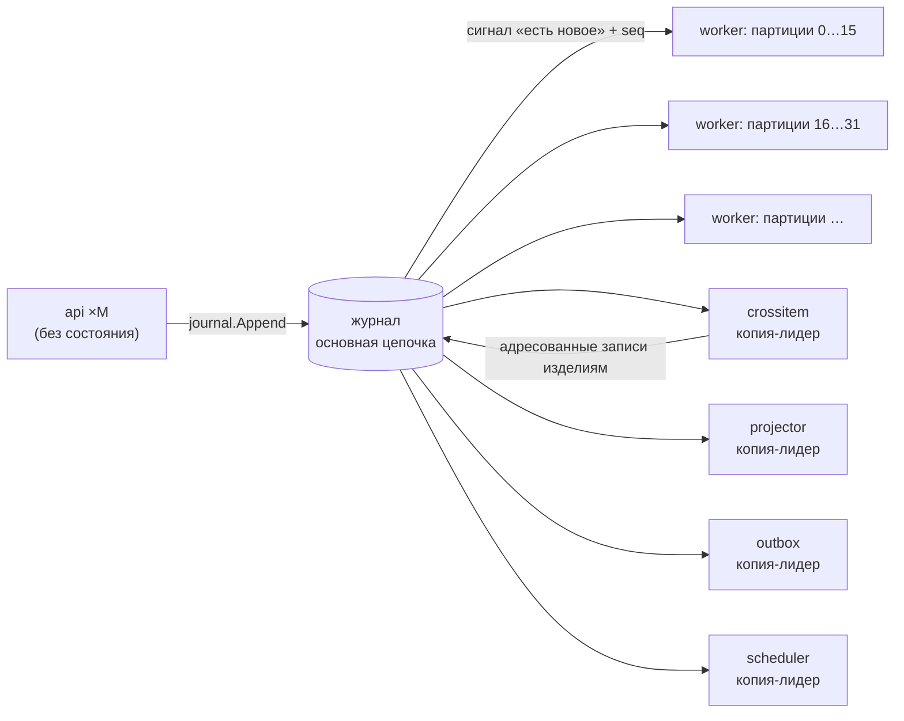

# Масштабирование, состояние, параллелизм, повторы и порядок

Ответ на кейс §3.1 и §6.1: вертикальное и горизонтальное масштабирование, правила работы с состоянием, параллельной обработкой, повторами и порядком событий, ограничения, общие ресурсы и узкие места. Опоры: AD-4, AD-5, AD-6, AD-7, AD-37, AD-39, AD-42, AD-44, AD-45; FR-31, FR-32, FR-107, FR-112; SM-3; критерий О6.

**Статус.** Написано по спайну до кода. Значения параметров — из `deploy/config/ant.yaml` на момент написания; измеренные числа появятся после нагрузочного прогона (эпик 35) — раздел «Уточнить после появления кода».

## 1. Коротко

- **Ключ разбиения — изделие.** Все события одного изделия обрабатывает одна партиция; партиций P фиксированное число (`hash(item_id) mod P`), воркеров N ≤ P. Поэтому горизонтальное масштабирование не сводится к «запустить несколько копий»: у каждой копии своя доля изделий, а смысл обработки от N не зависит.
- **Межизделийные расчёты** (сборка, партия, область риска, привязка событий без изделия) — отдельная стадия с явным порядком «изделие → стадия → изделие».
- **Точка сериализации названа**: запись в основную хеш-цепочку журнала. Остальные названные ограничения — копии-лидеры и общий Postgres.
- **Смысл сохраняется при изменении N**: детерминированный домен, идемпотентный приём, показатели из вкладов изделий, две проверки «1 = N» (`rebuild_hash`, `state_hash`).

## 2. Вертикальное масштабирование

Ресурсы и настройки одной копии — конфигурация `deploy/config/ant.yaml` и переменные `ANT_*`:

| Параметр | Ключ конфигурации | `demo` | `load` / `prod` | На что влияет |
|---|---|---|---|---|
| Число партиций P | `engine.partitions` | 16 | 64 | верхняя граница параллелизма свёртки; меняется перераспределением |
| Параллелизм свёртки в копии | `engine.fold_parallelism` | 2 | 4 | сколько изделий копия сворачивает одновременно |
| Пул соединений Postgres | `db.max_conns` | 10 | 30 | параллелизм записи и чтения |
| Размер пачки записи K | `journal.batch_max` | 256 | 1024 | пропускная способность записи в цепочку |
| Ожидание пачки | `journal.batch_wait` | 50 мс | 50 мс | задержка против пропускной способности |
| Режим ведущих портов | `ports.mode` | `live` | `live` | заготовки или движок (AD-36) |

Postgres масштабируется вертикально; для аналитики и воспроизведения — реплики чтения (AD-6). Лимиты памяти контейнеров в демо рассчитаны на ~2,4 ГБ на всю систему.

## 3. Горизонтальное масштабирование

| Роль | Сколько копий | Как делят работу |
|---|---|---|
| `api` | сколько угодно | без состояния: сеансы в Postgres; `LISTEN/NOTIFY` несёт только сигнал «есть новое» с `seq`; копия после переподключения догоняет по `seq` |
| `worker` (`ant-worker ×N`) | до P | фиксированные партиции с арендой в Postgres (`LeaseStore`); у аренды есть эпоха, `journal.Append` отвергает запись от копии, потерявшей аренду (`ErrFenced`); упавший воркер отдаёт партиции по истечении аренды; изменение N — перераспределение |
| `crossitem`, `scheduler`, `outbox`, `stands`, `projector` | одна активная копия-лидер по аренде | названные ограничения; резервная копия ждёт аренду |
| `keeper`, `verifier` | по одной | отдельные процессы по границам доверия |

Семантика партиций совпадает с группой потребителей Kafka с ключом `item_id`; поэтому замена `WorkFeed` на Kafka не меняет правил ([observability-kafka-otel.md](observability-kafka-otel.md)). Манифесты k8s — `deploy/k8s` (конфигурация масштабирования, без локального запуска).

Масштабирование между предприятиями — федерацией: каждое предприятие масштабируется независимо, связь асинхронная ([federation.md](federation.md)).

## 4. Правила работы с состоянием

- **Состояние = журнал.** Проекции — пересобираемый кэш; `ant rebuild` пересобирает их из журнала (на время пересборки берёт все аренды; `--item` — одно изделие).
- **Свёртка целиком.** На каждую новую запись в потоке изделия воркер заново сворачивает весь вход изделия и сравнивает вычисленные реакции с записанными (AD-5). Второго, инкрементального алгоритма с откатом нет.
- **Проекции и курсор — в одной транзакции** с выходом потребителя (AD-45): после падения нет ни двойного применения, ни пропуска.
- **Один писатель на проекцию, один эмитент на тип записи** (AD-40): нет гонок между модулями.
- **Детерминированный домен** (AD-4): нет часов, случайности, порядка map, float — одинаковый результат на 1 и N воркерах, при воспроизведении и у верификатора.

## 5. Параллельная обработка и конкурентность команд

- Внутри изделия — строгий порядок (одна партиция); между изделиями — параллельно.
- Команда человека несёт `basis_seq` потоков, которые проверил её гард, и `policy_seq`. `journal.Append` в той же транзакции проверяет, что после `basis_seq` в этих потоках не было новых записей, влияющих на гард, что у изделия нет необработанного входа, что политика не менялась, что остаток лимита разрешения на отклонение достаточен (AD-39). Иначе — `409` (`journal.stale_state`, `journal.stale_policy`, `journal.concession_exhausted`). Два противоречащих решения с двух копий `api` поэтому невозможны.
- Межизделийная стадия — одна копия-лидер; порядок слоёв «изделие → стадия → изделие»; без нового факта стадия не реагирует на свои же адресованные записи (тест неподвижной точки в `make check`).
- Ошибка свёртки одного изделия не останавливает партицию: служебная запись `ops.processing.failed`, изделие помечается «обработка остановлена», партиция продолжает; `ant rebuild --item` повторяет.

## 6. Повторы

| Что повторяется | Правило | Итог |
|---|---|---|
| Доставка события | ключ `source_id + event_id`; сравнивается отпечаток канонического содержимого, а не конверт и не подписи (AD-7) | тот же payload — дубль: подтверждается, не учитывается повторно (счётчик дублей растёт); другой payload — конфликт целостности, запись CA и событие `security` |
| Досылка после обрыва | edge-агент хранит исходные байты конверта и досылает их с исходным `occurred_at`; `source_seq` по устройству | потерь нет, двойного учёта нет; «потеря данных источника» — только реакция планировщика после окна ожидания |
| Команда API | `command_id`; повтор возвращает прежний ответ | |
| Исходящее сообщение | бизнес-ключ (субъект, учётное действие, закрывающая точка); повтор только при транспортных ошибках; затем карантин и ручная переотправка | двойной отправки в 1С нет |
| Выполнение операции | новый `operation_run_id` + `rework_of` | «сделали дважды» отличается от «событие пришло дважды» (FR-47) |
| Прогон сценария | своё пространство имён `run_id`; `event_id` = UUIDv5(`run_id`, seed, номер) | второй прогон не гасится идемпотентностью первого |

## 7. Порядок событий

- **Требование к порядку сформулировано явно** (кейс §6.1): в пределах изделия — `occurred_at` → `received_at` → `event_id` (FR-32). Между изделиями порядок не гарантируется и не нужен.
- **Порядок знания** — `seq` журнала: «что было известно на момент T» — префикс журнала по `seq`.
- **Позднее событие** не меняет прежние записи: свёртка пересчитывается, изменившийся вывод — новая версия слота с пометкой «пересмотрен из-за записи ‹id›»; решение человека, уже принятое на прежнем выводе, не отменяется, а получает пометку «решение принято до новых данных — пересмотрите» и задачу автору (AD-5).
- **Расхождение часов** оценивается по каждому `source_id`; событие из будущего или со сдвигом выше порога получает флаг; противоречие последовательности процесса — флаг и сигнал; порядок по `occurred_at` молча не подменяется.
- **Защитная реакция не снимается пересвёрткой** (AD-3): если основание блока исчезло, уполномоченному ставится задача пересмотреть.

## 8. Ограничения, общие ресурсы, узкие места

| Узкое место | Почему | Смягчение сейчас | Путь развития |
|---|---|---|---|
| Запись в основную хеш-цепочку | звено зависит от предыдущего; блокировка головы до фиксации | пачки до K записей или 50 мс | цепочки по партициям (Deferred) |
| Копии-лидеры `crossitem`, `projector`, `outbox`, `scheduler`, `stands` | порядок межизделийных расчётов, единственность отправки | аренда с эпохой, быстрая передача лидерства | разбиение стадии по независимым объектам (партия, станок) |
| Postgres | журнал, проекции, аренды в одной БД | вертикально + реплики чтения для аналитики и воспроизведения | вынос `WorkFeed` в Kafka; `MaterialStore` в S3-совместимое хранилище в контуре |
| Пересвёртка изделия целиком на каждое событие | простота и детерминизм | десятки–сотни событий на изделие в единичном производстве | снимки свёрток по `seq` как пересобираемый кэш (AD-22) |
| Хранитель | принимает головы обеих цепочек | головы раз в N секунд, не на каждую запись | — |
| Нагрузочный генератор | не создаёт соревнования за общий лимит разрешения | названное ограничение | — |
| Демо-машина | около 2,4 ГБ памяти на всю систему | лимиты памяти в compose | — |

## 9. Как проверяется, что масштабирование не ломает историю

Две проверки «1 = N» (AD-6, FR-107, SM-3):

| Хеш | Что сравнивает | Что доказывает |
|---|---|---|
| `rebuild_hash` | пересборка всех проекций над **одним и тем же журналом** на 1 и на N воркерах; строгое совпадение | обработка детерминирована и не зависит от числа обработчиков и распределения партиций |
| `state_hash` | **раздельные прогоны** одного seed на 1 и на N воркерах; только итоговое состояние (оси статусов, итоговые версии выводов, состав несоответствий и областей риска, показатели) — без истории версий, `seq`, `basis_seq`, времени записи и номеров CA | при разной очерёдности записи итоговая история изделий и показатели одинаковы; повторного учёта нет |

Нагрузочный режим (`make load`, профиль `load`): настраиваемые интенсивность, число источников, seed; прогон на одном и на N обработчиках; сценарий недоступности и восстановления (edge-агенты копят и досылают); отчёт `scenarios/load/` — задержки (в том числе `ant_event_to_sse_seconds` против бюджета 2 с: приём → запись ≤ 200 мс, свёртка ≤ 500 мс, SSE ≤ 300 мс), потери, повторы (счётчик дублей), полнота (событий на изделие против ожидаемых).

## Уточнить после появления кода

- Внести измеренные числа нагрузочного прогона: пропускная способность на 1 и N воркерах, задержки, значения `rebuild_hash` и `state_hash`, путь к отчёту в `scenarios/load/`.
- Сверить таблицу параметров с `deploy/config/ant.yaml` (добавить длительность аренды, окно ожидания потери данных, число воркеров по умолчанию).
- Проверить, какие роли в compose запущены отдельными контейнерами и сколько копий `ant-worker` в демо.
- Описать фактическое содержимое `deploy/k8s` (Deployment/StatefulSet, ресурсы, число реплик).
- Указать фактические имена метрик приёма и обработки из `/metrics`.
