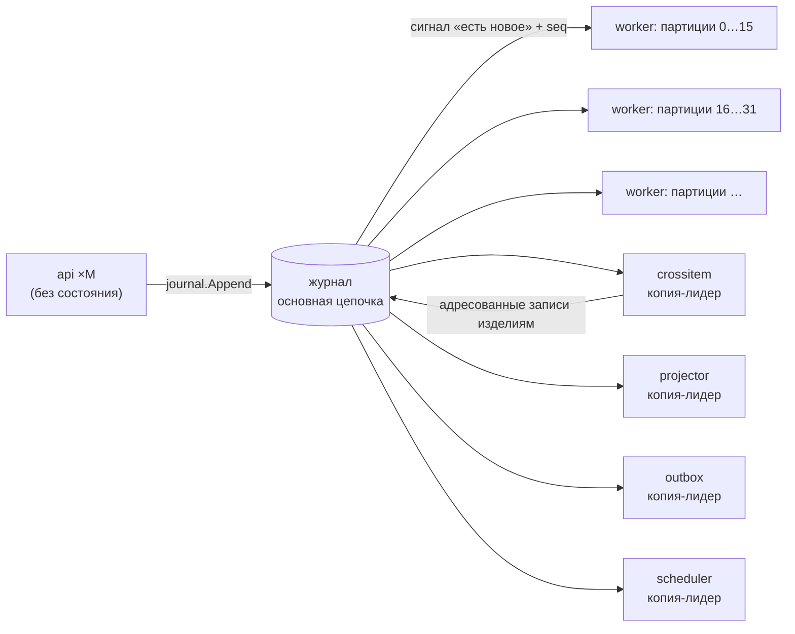

# Масштабирование, состояние, параллелизм, повторы и порядок

Ответ на кейс §3.1 и §6.1: вертикальное и горизонтальное масштабирование, правила работы с состоянием, параллельной обработкой, повторами и порядком событий, ограничения, общие ресурсы и узкие места. Опоры: AD-4, AD-5, AD-6, AD-7, AD-37, AD-39, AD-42, AD-44, AD-45; FR-31, FR-32, FR-107, FR-112; SM-3; критерий О6.

**Статус.** Написано по спайну, уточнено измерениями эпика 35: узкие места прогона MS-1 и что с ними сделано — §10, нагрузочный прогон «1 = N» — `make load` ([scenarios/load](../scenarios/load/README.md)), конфигурация Kubernetes — [deploy/k8s](../deploy/k8s/README.md).

## 1. Коротко

- **Ключ разбиения — изделие.** Все события одного изделия обрабатывает одна партиция; партиций P фиксированное число (`hash(item_id) mod P`), воркеров N ≤ P. Поэтому горизонтальное масштабирование не сводится к «запустить несколько копий»: у каждой копии своя доля изделий, а смысл обработки от N не зависит.
- **Межизделийные расчёты** (сборка, партия, область риска, привязка событий без изделия) — отдельная стадия с явным порядком «изделие → стадия → изделие».
- **Точка сериализации названа**: запись в основную хеш-цепочку журнала. Остальные названные ограничения — копии-лидеры и общий Postgres.
- **Смысл сохраняется при изменении N**: детерминированный домен, идемпотентный приём, показатели из вкладов изделий, две проверки «1 = N» (`rebuild_hash`, `state_hash`).

## 2. Вертикальное масштабирование

Ресурсы и настройки одной копии — конфигурация `deploy/config/ant.yaml` и переменные `ANT_*`:

| Параметр | Ключ конфигурации | `demo` | `load` / `prod` | На что влияет |
|---|---|---|---|---|
| Число партиций P | `engine.partitions` | 16 | 64 | верхняя граница параллелизма свёртки; меняется перераспределением |
| Параллелизм свёртки в копии | `engine.fold_parallelism` | 2 | 4 | сколько изделий копия сворачивает одновременно |
| Пул соединений Postgres | `db.max_conns` | 24 | 30 | параллелизм записи и чтения; при 10 потребители одного процесса ждали соединения (§10) |
| Ожидание сброса WAL | `db.synchronous_commit` | `off` | `off` / не задан | в demo и load фиксация не ждёт диска; в prod — ждёт (§10) |
| Срок аренды | `engine.lease_ttl` | 10 с | 10 с | через сколько партиции упавшего воркера уходят живым копиям |
| Размер пачки записи K | `journal.batch_max` | 256 | 1024 | пропускная способность записи в цепочку |
| Ожидание пачки | `journal.batch_wait` | 50 мс | 50 мс | задержка против пропускной способности |
| Режим ведущих портов | `ports.mode` | `live` | `live` | заготовки или движок (AD-36) |

Postgres масштабируется вертикально; для аналитики и воспроизведения — реплики чтения (AD-6). Лимиты памяти контейнеров в демо рассчитаны на ~2,4 ГБ на всю систему.

## 3. Горизонтальное масштабирование

| Роль | Сколько копий | Как делят работу |
|---|---|---|
| `api` | сколько угодно | без состояния: сеансы в Postgres; `LISTEN/NOTIFY` несёт только сигнал «есть новое» с `seq`; копия после переподключения догоняет по `seq` |
| `worker` (`ant-worker ×N`) | до P | фиксированные партиции с арендой в Postgres (`LeaseStore`); у аренды есть эпоха, `journal.Append` отвергает запись от копии, потерявшей аренду (`ErrFenced`); упавший воркер отдаёт партиции по истечении аренды; изменение N — перераспределение |
| `crossitem`, `scheduler`, `outbox`, `stands`, `projector` | одна активная копия-лидер по аренде | названные ограничения; резервная копия ждёт аренду |
| `keeper`, `verifier` | по одной | отдельные процессы по границам доверия |

Семантика партиций совпадает с группой потребителей Kafka с ключом `item_id`; поэтому замена `WorkFeed` на Kafka не меняет правил ([observability-kafka-otel.md](observability-kafka-otel.md)). Манифесты k8s — [deploy/k8s](../deploy/k8s/README.md): `ant-api` 2…8 копий (HPA по CPU), `ant-worker` 2…16 копий (HPA, не больше P = 64), `ant-leaders` (crossitem, projector, scheduler, outbox, security) — активная копия и резерв, хранитель и верификатор — по одной; без локального запуска.

В демо-стенде все роли — в одном процессе `ant`; нагрузочный профиль (`make load`) выносит воркеры в отдельные контейнеры `ant-worker ×N`.

Масштабирование между предприятиями — федерацией: каждое предприятие масштабируется независимо, связь асинхронная ([federation.md](federation.md)).

## 4. Правила работы с состоянием

- **Состояние = журнал.** Проекции — пересобираемый кэш; `ant rebuild` пересобирает их из журнала (на время пересборки берёт все аренды; `--item` — одно изделие).
- **Свёртка целиком.** На каждую новую запись в потоке изделия воркер заново сворачивает весь вход изделия и сравнивает вычисленные реакции с записанными (AD-5). Второго, инкрементального алгоритма с откатом нет.
- **Проекции и курсор — в одной транзакции** с выходом потребителя (AD-45): после падения нет ни двойного применения, ни пропуска.
- **Один писатель на проекцию, один эмитент на тип записи** (AD-40): нет гонок между модулями.
- **Детерминированный домен** (AD-4): нет часов, случайности, порядка map, float — одинаковый результат на 1 и N воркерах, при воспроизведении и у верификатора.

## 5. Параллельная обработка и конкурентность команд

- Внутри изделия — строгий порядок (одна партиция); между изделиями — параллельно.
- Команда человека несёт `basis_seq` потоков, которые проверил её гард, и `policy_seq`. `journal.Append` в той же транзакции проверяет, что после `basis_seq` в этих потоках не было новых записей, влияющих на гард, что у изделия нет необработанного входа, что политика не менялась, что остаток лимита разрешения на отклонение достаточен (AD-39). Иначе — `409` (`journal.stale_state`, `journal.stale_policy`, `journal.concession_exhausted`). Два противоречащих решения с двух копий `api` поэтому невозможны.
- Межизделийная стадия — одна копия-лидер; порядок слоёв «изделие → стадия → изделие»; без нового факта стадия не реагирует на свои же адресованные записи (тест неподвижной точки в `make check`).
- Ошибка свёртки одного изделия не останавливает партицию: служебная запись `ops.processing.failed`, изделие помечается «обработка остановлена», партиция продолжает; `ant rebuild --item` повторяет.

## 6. Повторы

| Что повторяется | Правило | Итог |
|---|---|---|
| Доставка события | ключ `source_id + event_id`; сравнивается отпечаток канонического содержимого, а не конверт и не подписи (AD-7) | тот же payload — дубль: подтверждается, не учитывается повторно (счётчик дублей растёт); другой payload — конфликт целостности, запись CA и событие `security` |
| Досылка после обрыва | edge-агент хранит исходные байты конверта и досылает их с исходным `occurred_at`; `source_seq` по устройству | потерь нет, двойного учёта нет; «потеря данных источника» — только реакция планировщика после окна ожидания |
| Команда API | `command_id`; повтор возвращает прежний ответ | |
| Исходящее сообщение | бизнес-ключ (субъект, учётное действие, закрывающая точка); повтор только при транспортных ошибках; затем карантин и ручная переотправка | двойной отправки в 1С нет |
| Выполнение операции | новый `operation_run_id` + `rework_of` | «сделали дважды» отличается от «событие пришло дважды» (FR-47) |
| Прогон сценария | своё пространство имён `run_id`; `event_id` = UUIDv5(`run_id`, seed, номер) | второй прогон не гасится идемпотентностью первого |

## 7. Порядок событий

- **Требование к порядку сформулировано явно** (кейс §6.1): в пределах изделия — `occurred_at` → `received_at` → `event_id` (FR-32). Между изделиями порядок не гарантируется и не нужен.
- **Порядок знания** — `seq` журнала: «что было известно на момент T» — префикс журнала по `seq`.
- **Позднее событие** не меняет прежние записи: свёртка пересчитывается, изменившийся вывод — новая версия слота с пометкой «пересмотрен из-за записи ‹id›»; решение человека, уже принятое на прежнем выводе, не отменяется, а получает пометку «решение принято до новых данных — пересмотрите» и задачу автору (AD-5).
- **Расхождение часов** оценивается по каждому `source_id`; событие из будущего или со сдвигом выше порога получает флаг; противоречие последовательности процесса — флаг и сигнал; порядок по `occurred_at` молча не подменяется.
- **Защитная реакция не снимается пересвёрткой** (AD-3): если основание блока исчезло, уполномоченному ставится задача пересмотреть.

## 8. Ограничения, общие ресурсы, узкие места

| Узкое место | Почему | Смягчение сейчас | Путь развития |
|---|---|---|---|
| Запись в основную хеш-цепочку | звено зависит от предыдущего; блокировка головы до фиксации | пачки до K записей или 50 мс | цепочки по партициям (Deferred) |
| Копии-лидеры `crossitem`, `projector`, `outbox`, `scheduler`, `stands` | порядок межизделийных расчётов, единственность отправки | аренда с эпохой, быстрая передача лидерства | разбиение стадии по независимым объектам (партия, станок) |
| Postgres | журнал, проекции, аренды в одной БД | вертикально + реплики чтения для аналитики и воспроизведения | вынос `WorkFeed` в Kafka; `MaterialStore` в S3-совместимое хранилище в контуре |
| Пересвёртка изделия целиком на каждое событие | простота и детерминизм | десятки–сотни событий на изделие в единичном производстве | снимки свёрток по `seq` как пересобираемый кэш (AD-22) |
| Хранитель | принимает головы обеих цепочек | головы раз в N секунд, не на каждую запись | — |
| Нагрузочный генератор | не создаёт соревнования за общий лимит разрешения | названное ограничение | — |
| Потребители одного процесса (эпик 35) | десятки глобальных проекций; каждая фиксация — отдельная транзакция | проектор — одна группа потребителей: чтение, декодирование и фиксация на пачку один раз; курсоры без `pg_notify`; аренды продлеваются раз в TTL/3 | разбиение проектора по семействам проекций между копиями |
| `pg_notify` в транзакции | Postgres держит общую на кластер блокировку очереди уведомлений до сброса WAL — все уведомляющие фиксации идут строго по одной | уведомляет только запись в цепочку (она и так сериализована головой) | — |
| Состояние стадии crossitem | один ключ в сотни КБ | не переписывается, если не изменилось | разбиение состояния стадии по объектам |
| Пересвёртка изделия и чтение его потока | каждый триггер — чтение всего потока изделия и свёртка | — | снимки свёрток (выше) |
| Демо-машина | около 2,4 ГБ памяти на всю систему | лимиты памяти в compose | — |

## 9. Как проверяется, что масштабирование не ломает историю

Две проверки «1 = N» (AD-6, FR-107, SM-3):

| Хеш | Что сравнивает | Что доказывает |
|---|---|---|
| `rebuild_hash` | пересборка всех проекций над **одним и тем же журналом** на 1 и на N воркерах; строгое совпадение | обработка детерминирована и не зависит от числа обработчиков и распределения партиций |
| `state_hash` | **раздельные прогоны** одного seed на 1 и на N воркерах; только итоговое состояние (оси статусов, итоговые версии выводов, состав несоответствий и областей риска, показатели) — без истории версий, `seq`, `basis_seq`, времени записи и номеров CA | при разной очерёдности записи итоговая история изделий и показатели одинаковы; повторного учёта нет |

Нагрузочный режим — `make load` ([scenarios/load](../scenarios/load/README.md)): генератор интенсивности — пульт сценариев (сценарий и seed — параметры, события источников без пауз, шум генератора — опоздания, повторы, конфликты, потери), параметры профиля `load` (64 партиции); два раздельных прогона на 1 и на N обработчиках (`ant-worker ×N`), во втором — падение копии воркера и её подъём (недоступность и восстановление; досылка edge-агентами после обрыва — в самом сценарии, ИС-2). Отчёт роли `ant -role=load` — задержки «факт → реакция» по времени фиксации, приём (получено, принято, дубли, карантин, пропуски номеров источника), полнота (изделия, «обработка остановлена», фактов на изделие), оба хеша. Задержка до SSE в отчёт `make load` не входит: её считает гистограмма `ant_event_to_sse_seconds` на `/metrics` роли api (эпик 34; порт `Telemetry`, адаптер Prometheus — [observability-kafka-otel.md](observability-kafka-otel.md)), её снимают с работающей системы; в опубликованных ниже прогонах она не снималась.

## 10. Измерено (эпик 35)

### Прогон MS-1: где было время

Главная история демо MS-1 — 1678 шагов людей (решения demo-signer), 64 изделия, live-режим. До эпика 35 полный прогон шёл около 45 минут (≈ 1,65 с на шаг). Измерения (pprof процесса, выборки `pg_stat_activity`, счётчики `pg_stat_database`/`pg_stat_user_tables`, тайминги раннера по видам шагов) на своей БД в общем dev-postgres:

| Что увидели | Число |
|---|---|
| Транзакций на запись журнала | ≈ 150 (152 663 транзакции на ~1 000 записей за первые 3 мин): каждый из ~30 глобальных потребителей на каждую запись брал аренду (запись), читал курсор, читал пачку и фиксировал курсор |
| Записей в `journal_state.leases` / `consumer_offsets` | 27 379 / 16 228 обновлений за те же 3 мин |
| Ожидание соединения из пула (`db.max_conns` = 10) | в среднем 17 горутин в очереди за соединением |
| Фиксации в Postgres | 80 % выборок активных запросов — `commit` в ожидании `Lock:object`: блокировка очереди `NOTIFY`, общая на кластер и удерживаемая до сброса WAL на диск |
| Раннер прогона | 75 % времени — ожидание «движок догнал журнал» (Settler); половина этого — сама проверка: по запросу на каждого из ~30 потребителей на каждый сдвиг любого курсора |
| Процесс ant | 34 % одного ядра, почти всё — системные вызовы сети к БД: упирались не в свёртку, а в круговые поездки и фиксации |

### Что сделано

| Правка | Где |
|---|---|
| Сдвиг курсора сообщается ожидающему в процессе (`Store.OnProgress`), `pg_notify` — только у записей в цепочку; Settler для потребителей других процессов перепроверяет раз в 100 мс | `storage/journal/store.go`, `settle.go` |
| Проверка Settler — одна выборка | `storage/journal/settle.go` |
| Потребитель продлевает аренду раз в TTL/3 и помнит курсор после своей фиксации | `storage/journal/feed/feed.go` |
| Проектор — группа потребителей: пачка читается и декодируется один раз, выход и курсоры всех проекций — одна фиксация (у каждой проекции свой курсор и своя аренда, как раньше) | `application/engine/projector.go`, `feed.ConsumeGroup`, `AppendRequest.Cursors` |
| Фиксации без записей журнала (курсоры, проекции — пересобираемый кэш) — `synchronous_commit = off` во всех профилях; в demo и load — для всех соединений (`db.synchronous_commit`) | `storage/journal/store.go`, `cmd/internal/db`, `deploy/config/ant.yaml` |
| Пул 24 в demo | `deploy/config/ant.yaml` |
| Стадия crossitem не переписывает неизменившееся состояние | `application/crossitem/stage.go` |

### Результат

| | До (main) | После (эпик 35) |
|---|---|---|
| Полный прогон MS-1, 1678 шагов | ≈ 45 мин (≈ 1,65 с на шаг без соседней нагрузки; на загруженной машине — 60,8 мин) | ≈ 13–16 мин — оценка: итоговый прогон остановлен на шаге ~830 (машина понадобилась под стенд пользователя) |
| Первые 163 шага | 274 с | 60 с |
| Первые 466 шагов | 1 140 с (соседняя нагрузка) | 214 с |
| Первые 827 шагов | ≈ 1 750 с (соседняя нагрузка) | 465 с |
| Журнал: записей / фактов / реакций | 21 052 / 5 258 / 9 839 | — |
| Табло автосверки (совпало из 248) | 20 | — (прогон не дошёл до конца) |
| `state_hash` итогового состояния (64 изделия) | `d798d562…e043` | не сверен: нужен полный прогон |
| Хеш табло: статусы / полученные значения | `36581439…b534` / `893394ea…1823` | не сверен |
| `rebuild_hash` на 1 и 4 обработчиках (журнал прогона «до», новый код) | совпал (`5caf9b45…a350`) | — |

Сверка итогового состояния «до/после» на MS-1 ещё не сделана: нужен один полный прогон после правок (`ant -role=load` с `ANT_LOAD_RUN_ID` сравнивает `state_hash`, хеши табло и `rebuild_hash`; эталон «до» — выше). Правки не касаются свёрток и домена: меняется только то, когда и какими транзакциями потребители фиксируют курсоры и проекции. Остаток (профиль итогового прогона): раннер ~60 % времени ждёт, пока движок догонит журнал; процесс ant — около половины ядра, из него воркер ~35 % (половина — перечитывание и декодирование всего потока изделия на каждый триггер: названное узкое место «пересвёртка целиком», путь — снимки свёрток), решения demo-signer через API ~15 % (гарды заново сворачивают изделие), стадия crossitem ~13 %; Postgres — 1–1,3 ядра. Следующий шаг — снимки свёрток по seq (AD-22) и разбиение состояния стадии.

### Нагрузочный прогон «1 = N»

`make load` ([scenarios/load](../scenarios/load/README.md)) — два раздельных прогона одного seed на чистой БД: один обработчик (`ant` + `ant-worker ×1`) и N (`ant-worker ×N`, одна копия падает посреди прогона и поднимается). Проверено тем же бинарником и тем же разделением ролей на машине разработки (сценарий S14 — 12 изделий, 208 шагов; параметры профиля load, 64 партиции):

| | 1 обработчик |
|---|---|
| Прогон, с | 261 |
| Записей журнала / фактов / реакций | 2 754 / 761 / 1 194 |
| Приём: получено / принято / дубли / карантин / пропуски | 583 / 583 / 0 / 0 / 0 |
| Факт → реакция, мс (p50 / p95 / max) | 258 / 1 441 / 2 211 |
| `rebuild_hash` на 1 и 4 обработчиках над тем же журналом | совпал (`cf2d364d…f549`) |
| `state_hash` итогового состояния | `37b09970…c6b7` |
| Табло (статусы строк) | `e11158c0…1e39` |

Раздельный прогон на 4 обработчиках (4 процесса `-role=worker`) дважды прерван до конца (первый раз — нехватка соединений общего dev-postgres при пулах по 30, второй — остановка по требованию); сравнение `state_hash` 1 и N — за полным `make load`. `rebuild_hash` на 1 и 4 обработчиках совпал и на журнале полного прогона MS-1 (21 052 записи, `5caf9b45…a350`).

При падении копии её 16 партиций через срок аренды (10 с) разошлись по трём живым копиям (20/22/22), после подъёма новой копии — снова по 16; прогон не останавливался.

По решению Д-75 `make load` и профиль `load` на общей машине разработки больше не запускаются: полный раздельный прогон на N обработчиках — на выделенном стенде. Промышленная раскладка тех же ролей — манифесты Kubernetes `deploy/k8s/` (`api` и `worker` с HPA, лидерские роли `leaders.yaml`, разовая миграция, доверие; описание — `deploy/k8s/README.md`).

