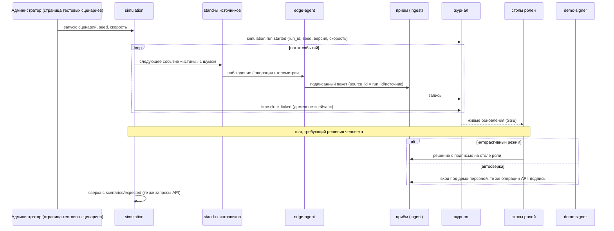

# Сценарии кейса: как их отрабатывает система

Архитектурный взгляд на сценарии работы: какие механизмы отвечают за каждую ситуацию кейса §4.2 и каждый проверочный сценарий §5.1, где лежат определения и ожидаемые результаты и как устроена автосверка. Руководства пользователей и описание демо-сценариев «как нажимать» — в пользовательской документации (эпик 47). Опоры: AD-3, AD-5, AD-7, AD-22, AD-26, AD-29, AD-36, AD-37, AD-38, AD-42; FR-104…FR-108, FR-119, FR-124, FR-129, FR-152, FR-155; кейс §1.5, §4.2, §5.1, §6.4; критерии О2, О3, Т6, Т7.

**Статус.** Сверено с кодом: фактические сценарии, файлы и команды — в разделе «Сверено с кодом»; при расхождении прав код и `scenarios/`.

## 1. Как запускается сценарий

- **Через обычный вход** (AD-26). События сценария идут stand-ы → edge-агент → приём, с подписью, проверкой схем, дедупликацией. Служебных обходов нет; `demo-signer` — обычный клиент: входит через `IdentityProvider`, получает допуск к рабочему месту событиями СКУД-stand, вызывает те же операции API и подписывает только шаги, совпадающие с `scenarios/definitions`.
- **Отдельное пространство имён** (AD-38). Каждый прогон — `run_id`; `source_id` источников — `‹run_id›/‹источник›`; `event_id` = UUIDv5(`run_id`, seed, номер события), поэтому второй прогон не гасится идемпотентностью первого; проекции и столы фильтруются по `run_id`.
- **Детерминизм** (AD-4, AD-37). Генератор детерминирован по seed; время — доменные часы сценария (`time.clock.ticked`); пауза останавливает поток и часы — все столы показывают состояние на момент паузы (FR-129).
- **Ожидаемое отдельно** (кейс §5.1). `scenarios/expected/‹сценарий›.yaml` — утверждения над теми же `operationId`, что вызывает интерфейс; автосверка вызывает те же `Queries`; итог — табло «ожидалось → получилось» (FR-108).
- **Наружу ничего** при воспроизведении и прогоне «по новым правилам»: роль `outbox` не запущена (AD-22, FR-4).

## 2. Ситуации кейса §4.2 и сценарии §5.1

Кейс §4.2 требует 8 ситуаций, §5.1 — 9 проверочных сценариев; у §4.2 повтор и задержка объединены. Ниже одна таблица на оба списка.

| № | Ситуация §4.2 / сценарий §5.1 | Ожидаемое поведение (кейс) | Механизм системы | Что проверяет автосверка |
|---|---|---|---|---|
| 1 | Нормальное изготовление / нормальное производство | целостная история и доступные показатели | свёртка по версии процесса; закрывающие точки с подписями; документы собраны из истории; учётные события в 1С на ЗТ с квитанциями | положение «завершено», «годно»; все ЗТ подписаны; в 1С «принято в работу», перемещения, «выпуск» — подтверждены; длительности с пометкой происхождения — `S01.yaml` |
| 2 | Входной дефект / входной брак | связь с состоянием до операции без необоснованного приписывания оператору | окно возможного возникновения: последняя чистая проверка зоны до и первая с дефектом после (FR-58); дефект, найденный до операции, не связывается с исполнителем; решение «вернуть поставщику» только для необработанных изделий; область риска по партии (AD-42) | гипотеза «входной брак»; исполнитель не указан; «возврат поставщику» в 1С с основанием претензии — `S02.yaml` |
| 3 | Дефект после операции / новый дефект | связь с предыдущими проверками и операцией, обстоятельства | разбор обстоятельств: проверки до и после, профиль выполнения операции, действия исполнителя в интервале (FR-58, FR-148, FR-153); исполнитель — в обстоятельствах, не виновник | связь с последней чистой проверкой и выполнением операции; альтернативы перечислены; «ремонт» только с разрешением на отклонение — `S03.yaml` |
| 4 | Недостаток сведений / неопределённость | отсутствие категоричного вывода | «оценка невозможна» ≠ «годно» (FR-36); метод, не покрывающий вид дефекта, не даёт годности (FR-14); явные `unknown`; «нехватка сведений» в разборе и в карте дефицита данных (FR-143) | нет вывода о причине; изделие на доп. контроле, не «годно» — `S04.yaml` |
| 5 | Отклонение оборудования / событие станка | привязка к оборудованию и операции | события оборудования по классам MTConnect; привязка к выполнению операции делает только межизделийная стадия по `equipment_id` и интервалу (AD-29, AD-42); нарушение режима — самостоятельный сигнал; специальный процесс — несоответствие для всех изделий окна (FR-151); область риска «тает» по основаниям (FR-61) | событие привязано к оборудованию и выполнению операции; в карточке — фрагмент профиля; версии области риска с основаниями — `S05.yaml` |
| 6 | Повторная доставка / повтор | отсутствие повторного учёта | идемпотентность по `source_id + event_id` и отпечатку содержимого (AD-7); один дефект — ключ (изделие, зона, место) без вида (FR-37); показатели из вкладов изделия (AD-45) | счётчик дублей вырос; показатели не изменились; один дефект с несколькими наблюдениями — `S06.yaml`, `F01.yaml`, `F02.yaml` |
| 7 | Поздняя доставка / задержка | обновление истории по описанным правилам | порядок `occurred_at → received_at → event_id`; пересвёртка изделия целиком; новая версия вывода «пересмотрен из-за записи ‹id›»; принятое решение не переписывается, а получает пометку и задачу автору (AD-5) | история перестроена по времени события; обе версии вывода видны; решение не изменено — `S07.yaml`, `F03.yaml` |
| 8 | Решение контролёра / решение пользователя | новая запись с сохранением исходного сообщения | решение — отдельный вид записи с автором, причиной, подписью (AD-2); исходный сигнал не меняется (FR-51); отклонение без причины невозможно (FR-52) | исходный сигнал цел; статус «отклонён»; число подтверждённых несоответствий не изменилось — `S08.yaml` |
| 9 | Контрольное изменение записи / изменение данных | предотвращение либо обнаружение нарушения целостности | через API — отказ 403/405; в обход системы — `cmd/tamper`: нарушение звена, расхождение с контрольной точкой хранителя, расхождение проекции с журналом (AD-8, AD-9, AD-28) | верификатор находит место и тип нарушения; индикатор целостности на столах — `S09.yaml`, `F25.yaml` |

## 3. Сквозной сценарий кейса §1.5

| Шаг кейса §1.5 | Что происходит в системе |
|---|---|
| 1. Получение задания и сведений об изделии | stand 1С отдаёт производственное задание и справочник номенклатуры; адаптер передаёт их через приём; соответствия внешних ID — записями `reference`; старт процесса изделия — стартовое событие BPMN по сообщению из 1С (решение Д-5) |
| 2. Регистрация поступления деталей и входного контроля | поступившая партия из 1С; регистрация изделий и носителей (бирка с QR); входной контроль — результат контроля; ЗТ-1 с подписью контролёра |
| 3. Приём событий операций, действий, оборудования | терминал исполнителя, stand-ы станка ЧПУ и сварочного источника через edge-агент; сводки телеметрии на окно цикла |
| 4. Обновление истории изделия и промежуточного контроля | свёртка изделия; паспорт и живая карта обновляются по SSE (≤ 2 с) |
| 5. Карточка несоответствия с основаниями | сигнал камеры → карта реакций → изоляция и черновик карточки (реакции режима 1); блок «почему система это предлагает» |
| 6. Рассмотрение и решение контролёра | «Подтвердить несоответствие» — сводка уровня 2 и подпись агентом токена или на бумаге с заверением; запись журнала критических действий |
| 7. Аналитика и передача во внешнюю систему | вклады изделия пересчитаны; реакция «перевод в брак» → `outbox` → stand 1С → квитанция; годное изделие проходит ЗТ-6 → «выпуск» |

Контрольная точка разработки — «10-й час»: этот путь проходит насквозь (PRD §6.4).

## 4. Демо-сценарии и сбои

| Сценарий | Что показывает | Механизмы |
|---|---|---|
| «Плохой день сварочного участка» / «станок сломался» | ток сварочного источника вне уставки → дефекты → область риска 34 → 13 → 6 на живой карте с основаниями каждого сужения; разбор трёх дорожек | AD-29, AD-42, FR-61, FR-153, FR-155 |
| «На вход завезли брак» | блок партии, область риска по партии включая собранные изделия и отгруженные партнёру; «вернуть поставщику»; уведомление партнёру | AD-42, FR-53, FR-133 |
| «Специалист заснул» | точка предъявления без подписи копит очередь → ограничение линии и аномалия узла; эскалация с ценой задержки | FR-5, FR-19, FR-57 |
| «Сварка вне режима» (специальный процесс) | все 6 изделий окна нарушения получают несоответствие, в том числе 3 без найденного дефекта; решение — комиссией | FR-151 |
| Оборудование: нормальное выполнение и с двумя отклонениями (описание) | «до операции чисто → две машинные нештатности → после — дефект»; «возможные связанные обстоятельства» | FR-149 |
| Потеря или неоднозначность идентификации | «идентификация под сомнением» → изоляция до повторной идентификации человеком | AD-16, AD-41 |
| Входящая выписка партнёра | подписи проверены, выписка — корень генеалогии; изменённая выписка отклонена | AD-19, FR-132 |
| «Эмулятор меняет свет» | дрейф → автоматический откат анализатора в сторону строгости → запись и уведомление; возврат — только начальник ОТК | AD-29, FR-101 |
| Недоступность и восстановление | edge-агенты копят и досылают; нет потерь и двойного учёта | FR-39, FR-107 |
| Ошибка интеграции до отправки | ломающее изменение контракта краснеет до отправки в 1С (`make contract-demo`) | AD-20, FR-111 |
| Смена ключа и профиля | данные до и после, изменённый пакет, понижение профиля, недоступный ключ (`scenarios/crypto`) | AD-32, FR-76 |

**Цифровой стенд** (FR-152) — кнопки-инъекции поверх идущего сценария: повтор события, опоздавшее событие, испорченный кадр (качество наблюдения 0,3), сбой станка / ток вне уставки, потеря куска данных — через служебный порт stand-ов и обычный приём; «подделать запись в обход системы» — только демо-инструментом `cmd/tamper` (профили `fixtures` и `demo`). Результат каждой кнопки виден на столах и на табло сверки.

## 5. Воспроизведение и «что мы знали»

- **Воспроизведение истории** (FR-4, FR-155) — те же запросы состояния на момент T (ось `occurred`), ничего не пишут и не отправляют; скорость ×1…×1000.
- **«Что мы знали на момент…»** (FR-124) — ось `recorded`: префикс журнала по `seq`; видно, на каких данных было принято решение.
- **«По новым правилам»** (FR-124) — прогон тех же событий по другой версии нормативного слоя без изменения действующих выводов.
- **Сброс проекций и переигрывание** журнала 1…N дают то же состояние (`ant rebuild`, `rebuild_hash`).

## 6. Набор воспроизведения (кейс §6.4, FR-119)

| Что | Где |
|---|---|
| описание сценариев, справочники, потоки событий или параметры генератора | `scenarios/definitions/` (YAML, JSONL) |
| ожидаемые результаты | `scenarios/expected/` (кнопки цифрового стенда — `scenarios/expected/stand/`) |
| заготовки ответов API для режима заготовок | `scenarios/fixtures/` |
| интеграционные сообщения (эталонные) | `contracts/integrations/` |
| криптографические материалы | `scenarios/crypto/` |
| выписки партнёров для межзаводского обмена | `scenarios/federation/` |
| нагрузочные материалы и отчёт | `scenarios/load/` |
| версии, допущения, параметры, команды запуска | `scenarios/README.md`, этот документ, [assumptions.md](assumptions.md) |

Обязательные автопроверки (NFR-TEST-1): сверка сценариев с ожидаемым и согласованность контрактов и сгенерированного кода. `make check` (тесты бэкенда) прогоняет каждый сценарий пульта в режиме автосверки на заготовках приёма — то же отдельно даёт `make sim-check` с печатью табло: строки, которые проверяет приём, обязаны совпасть, остальные без движка помечены «операция пока не отвечает»; холодный старт стенда (`make up`) и верификатор (`make verify`) в `make check` не входят и запускаются на стенде.

## Сверено с кодом

- Каталог сценариев — `scenarios/definitions/index.yaml` (45 записей): главная история `MS-1` («Плохой день сварочного участка (ИС-2)», 64 фланца, карточки S01–S17 и I1); ситуации кейса `S01`–`S09`; дополнительные `S10A`, `S10B`, `S11`, `S12`, `S14`–`S17`, `I1` (обмен с 1С); демо `S13` («Специалист заснул»); сбои `F01`–`F25`. Отдельные прогоны (`definitions/runs/`, потоки `definitions/streams/‹прогон›.events.jsonl`) есть у `MS-1`, `S10B`, `S13`, `S14` и каждого `F‹nn›`; остальные карточки идут внутри прогона `MS-1`. Ожидаемое — `scenarios/expected/‹id›.yaml` на каждую карточку, для кнопок цифрового стенда — `scenarios/expected/stand/‹кнопка›.yaml`.
- Запуск: стол администратора «Тестовые сценарии» (виджет `scenario-console`, `frontend/src/widgets/scenario-console/`) или API `simulation.run.start` (`POST /api/v1/scenarios/{scenario_id}/runs`: `seed`, `speed` ×1…×1000, `items`, `mode`); пауза, продолжение, скорость, остановка — `simulation.run.pause` / `resume` / `set_speed` / `stop`, кнопки стенда — `simulation.injection.apply`, табло — `simulation.board.read`. Цели make: `make demo` (стенд с `demo-signer`), `make sim-check` (автосверка на заготовках), `make sim-streams` (пересборка потоков), `make tamper` (S09, три атаки и верификатор), `make contract-demo`, `make load` (только на выделенном стенде).
- Утверждения: ситуации 1–9 раздела 2 покрывают `scenarios/expected/S01.yaml`…`S09.yaml` (ссылки — в таблице); у каждого утверждения `check` — `operationId`, параметры, путь в ответе и сравнение, `mapping` — `exact` (поле контракта), `draft` (путь уточняет модуль-владелец) или `manual` (видно на экране).
- Демо-сценарии раздела 4: «Плохой день» и «станок сломался» — `MS-1`, `S05`; «На вход завезли брак» — `S02` (уведомление партнёру в утверждениях S02 нет); «Специалист заснул» — `S13`; «Сварка вне режима» — групповое несоответствие окна и решение комиссии в `S05`; потеря идентификации — `F16`, `F17`; недоступность источника — `F22`, `F23` и кнопка `data_loss`; «Эмулятор меняет свет» — кнопка `light_change`; входящая выписка партнёра — материалы `scenarios/federation/` (в том числе изменённая `mz01-heat-5512.tampered.json`) без отдельной карточки; смена ключа и профиля — `scenarios/crypto/`; ошибка интеграции — `make contract-demo`. Оборудование «нормально и с двумя отклонениями» (FR-149) карточки не имеет — помечено «описание».
- Снимка табло после полного прогона на стенде в репозитории нет (`scenarios/load/out/` пуст); табло показывает виджет `frontend/src/widgets/verification-board/`, на заготовках его печатает `make sim-check`.
- Режим задаётся полем `mode` запуска: `interactive` (по умолчанию — решения на столах ролей), `autocheck` (на шаге решения прогон вызывает `demo-signer`), `load`; в интерфейсе — выбор режима на пульте (`cfg-mode-autocheck` — «Автопроверка: решения подписывает демо-подписант»). `demo-signer` (`backend/cmd/demo-signer`, контракт `contracts/internal/demo-signer.openapi.yaml`, служба профиля `demo` в `deploy/compose/genesis.yaml`) входит через `POST /api/v1/auth/session` под демо-персоной, ищет шаг в `scenarios/definitions` (`Steps.Find`) и подписывает только совпавший запрос; несовпадение — `mismatch` без подписи (`ErrMismatch`, тест `backend/cmd/demo-signer/demo_signer_test.go`).
