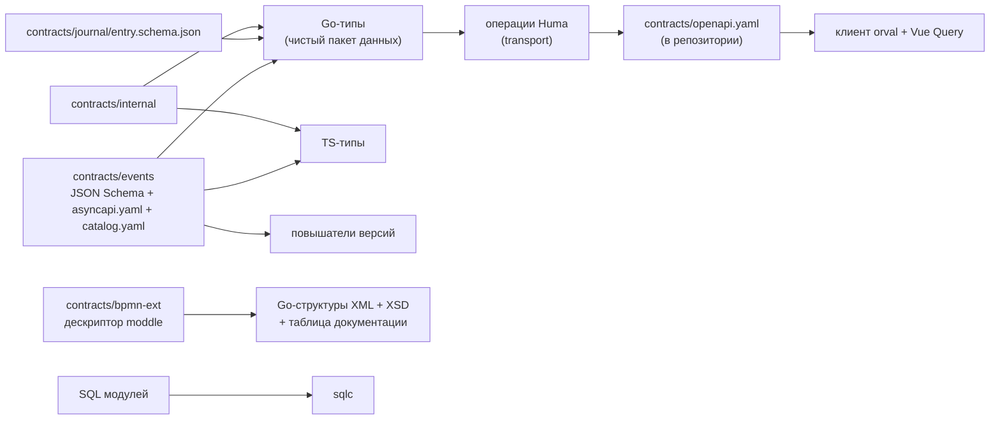

# Спецификации: API, события, процесс, интеграции

Где лежит каждая спецификация, что она описывает, что из неё генерируется и как сборка проверяет согласованность. Опоры: AD-20, AD-40, AD-44, AD-46; FR-27…FR-29, FR-110, FR-111; NFR-DEV-1, NFR-DEV-2; кейс §4.7, §6.2; критерии О7, О8, Т5.

Как генерируется код, версии генераторов, команды и пример изменения контракта v1 → v2 — в [codegen.md](codegen.md) (материалы кейса §6.2 одним файлом). Смысл полей и сущностей — в [data-model.md](data-model.md).

**Статус.** Пути — по дереву спайна; контракты пишет эпик 00, операции API — эпик 02. Где путь или имя изменится, прав код.

## 1. Правило одного источника

На каждый вид контракта — ровно один источник; всё повторяемое генерируется из него, руками не пишется и не правится (AD-20). Сгенерированные файлы — `*_gen.go` и `frontend/src/shared/api/generated/`; источник указан в шапке файла; конфликт при слиянии решается перегенерацией. Цепочка генерации без циклов:

Направление REST — **из кода в спецификацию**: операции описываются в Go (Huma), `contracts/openapi.yaml` выгружается без запуска сервера и фиксируется в репозитории; из него генерируется клиент фронтенда (NFR-DEV-2). Направление событий — **из спецификации в код**.

## 2. Перечень спецификаций

| Спецификация | Путь | Формат | Что описывает | Что из неё генерируется |
|---|---|---|---|---|
| REST API | `contracts/openapi.yaml` | OpenAPI 3.1 (выгрузка из Huma) | все операции чтения и команды, параметры момента, ошибки | клиент фронтенда (orval + Vue Query) |
| События | `contracts/events/‹семейство›/‹тип›.v‹N›.json`, `contracts/events/asyncapi.yaml` | JSON Schema (подмножество draft-07) + AsyncAPI 3.0 | содержимое каждого типа события; канал живых обновлений SSE | Go-типы (`go-jsonschema`), TS-типы (`json-schema-to-typescript`), повышатели версий, `huma.SchemaProvider` для приёма |
| Каталог типов и операций | `contracts/events/catalog.yaml` | YAML | эмитент, вид записи, поток, ось статуса, класс действия, критичность, `guard_relevant`, `publish: stage` | проверки `make check`, правила эмитентов |
| Соответствие полям кейса | `contracts/events/README` | Markdown | поля кейса §4.4 → поля контракта (например, `item_id` → `item_ref`) | — |
| Запись журнала | `contracts/journal/entry.schema.json` | JSON Schema | открытые и зашифрованные поля записи, формат цепочки | Go-типы для всех, включая верификатор |
| Коды ошибок | `contracts/errors.yaml` | YAML | код, HTTP-статус, смысл, текст для пользователя | перечисления кодов; привязка текстов интерфейса |
| Криптография | `contracts/crypto` | схемы + тест-векторы | кодирование подписей профилей `gost`, `pq`, `hybrid`; `payloadType` классов пакетов; тест-векторы JCS и Стрибога | тесты |
| Собственные процессы | `contracts/internal/` | JSON Schema, OpenAPI | Native Messaging агента токена; `keeper.openapi.yaml` (головы и звенья, контрольные точки, отчёты верификатора); API `demo-signer`; схема отчёта верификатора; телеметрия stand-ов → edge-агент | Go- и TS-типы тем же `make generate` (AD-46) |
| Расширение BPMN | `contracts/bpmn-ext/` | дескриптор moddle (JSON), `README.md` | свойства `urn:ant:bpmn-ext:1` в `extensionElements`, язык условий на стрелках (решение Д-7) | Go-структуры XML, XSD, таблица документации; панель свойств bpmn-js — рукописная, с тестом соответствия |
| Интеграции | `contracts/integrations/‹система›/…` | JSON Schema / XSD / примеры | форматы 1С, Галактики, MES, КОМПАС и эталонные сообщения; только для `infrastructure` | каркасы stand-ов, контрактные тесты адаптеров |
| Базы данных | `backend/internal/infrastructure/storage/‹модуль›/` | SQL + конфигурация sqlc | схемы модулей и запросы | Go-код доступа (sqlc) |
| Столы ролей | `normative/desks/‹роль›.yaml` | YAML | раскладка → слоты → виджеты → параметры | проверка id виджетов против `frontend/src/widgets/registry.ts` |
| Сценарии | `scenarios/definitions/`, `scenarios/expected/`, `scenarios/fixtures/` | YAML + JSONL | потоки событий, справочники, ожидаемые утверждения, заготовки ответов API | тела заготовок валидируются схемами `openapi.yaml` |

## 3. REST API

- **Одна операция — один id** вида `‹модуль›.‹объект›.‹действие›`; он же `operationId` в OpenAPI, ключ политики Casbin и ключ отображения прав `@casl` на фронтенде (AD-40).
- **Расширение `x-ant-action`** у каждой операции: класс действия (защитное / разрешающее / необратимое, AD-27), признак критичности, модуль-владелец, обязательные гарды. `make check` падает, если у операции нет класса.
- **Команды** несут `command_id` (UUIDv7 клиента; у подписанных — `event_id` пакета) — повтор возвращает прежний ответ (AD-7); `basis_seq` проверенных гардом потоков и `policy_seq` (AD-39). Устаревшее состояние — `409` с кодом `journal.stale_state`, `journal.stale_policy` или `journal.concession_exhausted`.
- **Чтение на момент** — параметры `axis=occurred|recorded` (по умолчанию `occurred`) и `as_of` во всех запросах состояния (AD-22). В воспроизведении действия выключены правилом прав.
- **Допустимые действия по объекту** вычисляются тем же вызовом политики и возвращаются вместе с объектом; интерфейс сам прав не вычисляет (FR-85).
- **Режим ответа** — заголовок `Ant-Backend: fixtures | live` и метка в ответе на каждый объект (AD-36).
- **Ошибки** — RFC 9457 `application/problem+json`, коды из `contracts/errors.yaml`.
- **Приём событий** — операция приёма берёт тело как сырой JSON и проверяет его теми же схемами из `contracts/events` (`santhosh-tekuri/jsonschema`); пачки edge-агента идут этой же операцией.

## 4. События и живые обновления

- **Диалект схем** — подмножество draft-07: без `type: number` (целое + масштаб), без `format: date|time|duration` (только `date-time` или строка с `pattern`), полиморфизм через `event_type` и отдельные схемы, а не `oneOf`. Схемы событий не запрещают дополнительные поля (новое необязательное поле принимается); схемы подписываемых документов — закрыты. Линтер схем — в `make check`.
- **AsyncAPI 3.0** (`contracts/events/asyncapi.yaml`) описывает каналы событий и канал SSE живых обновлений: сообщение (сущность, id, `seq`); фронтенд по нему инвалидирует ключ Vue Query `[сущность, id]`.
- **Каталог** (`contracts/events/catalog.yaml`) — одна строка на тип записи и на операцию; из него `make check` проверяет, что модуль не эмитит чужой тип.

## 5. Процесс (BPMN)

- Процесс — BPMN 2.0 XML; наши свойства — в `extensionElements` пространства `urn:ant:bpmn-ext:1`; описание шага — стандартный `<bpmn:documentation>` (FR-10, FR-154).
- Свойства (FR-12, AD-17): стабильный `step_key`; метод контроля и покрытие видов дефектов; требование (характеристика, допуск, ревизия КД); зона; «закрывает доступ к зоне»; точка предъявления (роль или полномочие, срок); лимит доработок по зоне; предусловия; документы шага; карта реакций; норма времени и пропускной способности; признак буфера; цех и его склад; признак «специальный процесс»; заверитель бумажной подписи; нормативные опоры — повторяемый элемент `ant:normRef` (`standard`, `clause`, `check`, `systemAction`) для слоя «нормы» (FR-156).
- Загрузчик отклоняет с кодом и id элемента: нарушение схемы, неподдерживаемый элемент, недостижимые узлы, закрывающий путь без контроля человеком, точку предъявления без роли или полномочия, неявное слияние стрелок без шлюза (FR-13, Д-6). Контроль без ссылки на требование КД — предупреждение.
- Язык условий на стрелках — собственный минимальный: `поле == 'значение'`, `!=`, `<`, `<=`, `>`, `>=` над целыми, `and`, `or`, `not`, скобки; поля — только из состояния изделия и решения; вызовов функций нет (Д-7). Описание — `contracts/bpmn-ext/README.md`.
- Стартовый процесс — `normative/` (seed фланца), загружается при первом запуске в составе генезиса.

## 6. Сценарии и воспроизведение (кейс §6.4)

| Каталог | Что лежит | Формат |
|---|---|---|
| `scenarios/definitions/` | определения сценариев: 8 ситуаций §4.2, 9 проверочных сценариев §5.1, демо-сценарии, сбои, оборудование, специальный процесс, идентификация, выписка партнёра | справочники и определения — YAML; потоки событий — JSONL (исходное событие в строке) |
| `scenarios/expected/‹сценарий›.yaml` | утверждения над теми же `operationId` (путь → ожидаемое значение); хранятся отдельно от входа (кейс §5.1) | YAML |
| `scenarios/fixtures/‹сценарий›/steps/NN.yaml` | заготовки ответов API по шагам сценария | YAML, тела валидируются `openapi.yaml` |
| `scenarios/crypto/` | данные до и после смены ключа и профиля, изменённый пакет, понижение профиля, недоступный ключ, тест-векторы JCS; создаются при `init`, в репозитории — только открытые ключи | JSON |
| `scenarios/load/` | параметры и отчёт нагрузочного прогона | YAML / отчёт |

## 7. Что проверяет сборка

`make check` (FR-111, критерий О8):

- перегенерация всех производных файлов и `git diff --exit-code` — устаревший сгенерированный код краснеет;
- `oasdiff breaking` и `@asyncapi/diff` против прошлого тега — ломающее изменение контракта краснеет;
- контрактные тесты адаптеров на эталонных сообщениях внешних систем;
- линтер схем событий и линтер слоёв (`depguard`);
- каталог: у каждой операции есть класс, модуль не эмитит чужой тип;
- столы ролей ссылаются только на зарегистрированные виджеты;
- заготовки валидируются схемами `openapi.yaml`;
- тест «отпечаток сервера = отпечаток агента токена» на эталонных документах.

`make contract-demo` — ветка с ломающим изменением контракта краснеет до отправки результата в 1С (кейс §6.2 «сценарий, в котором ошибка обнаруживается до передачи результата»).

## 8. Как посмотреть

- REST — файл `contracts/openapi.yaml` читается любым офлайн-просмотрщиком OpenAPI 3.1; внешние сервисы для просмотра не нужны.
- События — `contracts/events/asyncapi.yaml` и схемы рядом; `@asyncapi/cli` закреплён в зависимостях сборки.
- Таблица свойств расширения BPMN — генерируется из дескриптора в `contracts/bpmn-ext/`.

## Уточнить после появления кода

- Проверить фактические пути и имена файлов в `contracts/` (в том числе где лежит README соответствия полей кейса и эталонные примеры).
- Добавить команду выгрузки OpenAPI без запуска сервера и имя цели Makefile.
- Уточнить, какие из проверок раздела 7 реально входят в `make check`, и какие вынесены в отдельные цели.
- Указать, отдаёт ли `ant` встроенную страницу документации API и работает ли она офлайн; если нет — оставить только файлы.
- Сверить формат `x-ant-action` и перечень его полей с выгрузкой `openapi.yaml`.
- Добавить ссылки на два тега контракта событий (v1 и v2) для `@asyncapi/diff`.
