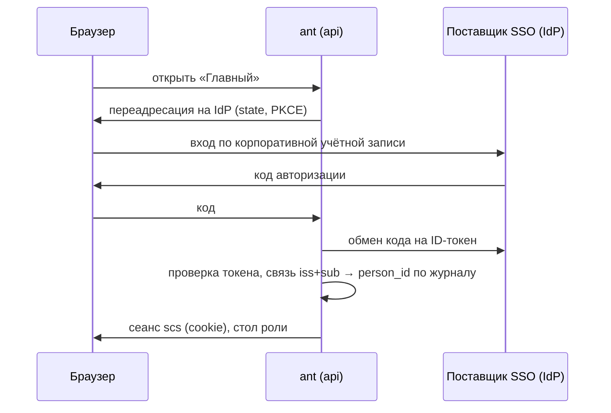

# Единый вход (SSO) — перспектива

- **Статус:** проект, в MVP не реализуется. В MVP вход — локальные пользователи (логин и пароль, сеанс `scs` + `argon2id`) и демо-персоны в профилях `demo` и `fixtures`.
- **Где встаёт:** ещё один адаптер ведомого порта входа `IdentityProvider` (`backend/internal/application/access/ports.go`; барьер 1 AD-15, порты платформы AD-35, ключ конфигурации `identity_provider`). Ядро, политика доступа и подписи не меняются.

## 1. Зачем

На предприятии учётные записи уже ведёт корпоративный каталог. Единый вход снимает отдельные пароли «Главного», даёт одну точку блокировки уволенного или переведённого сотрудника и централизует меры идентификации и аутентификации (группа ИАФ приказа ФСТЭК № 117 — [threat-model.md](threat-model.md)).

## 2. Протоколы и поставщики

| Вариант | Протокол | Типичный поставщик на предприятии |
|---|---|---|
| Основной | OpenID Connect, Authorization Code + PKCE | Keycloak, ALD Pro, Blitz Identity Provider, AD FS |
| Для старых каталогов | SAML 2.0 | AD FS, Keycloak |
| Рабочие станции в домене | Kerberos (SPNEGO) через поставщика OIDC | ALD Pro, FreeIPA, Active Directory |
| Без поставщика OIDC | LDAP bind к каталогу | ALD Pro, FreeIPA, Active Directory |

## 3. Как устроено

- **SSO отвечает только на вопрос «кто это».** Роли, полномочия, области, цифровые клейма и сроки остаются данными политики в журнале (AD-15): группы каталога в права автоматически не превращаются. Предложение прав по группе каталога — только заявка через обычный маршрут выдачи прав со второй подписью.
- **Связь учётной записи с человеком** — запись журнала о привязке (`iss` + `sub` поставщика → `person_id`), её делает администратор безопасности со второй подписью; неизвестный субъект — отказ во входе и событие шины безопасности (AD-24).
- **Сеанс — наш.** После ответа поставщика открывается обычный сеанс `scs`; сроки и ограничения сеанса — как сейчас. Выход в поставщике (back-channel logout) закрывает наш сеанс.
- **Подпись не меняется.** SSO не заменяет усиленную неквалифицированную подпись: решения по-прежнему подписываются личным ключом человека (AD-11, AD-14), допуск к рабочему месту — барьер 2 (СКУД, роль, квалификация, назначение, токен и PIN).
- **Аварийный вход.** При недоступности поставщика остаётся локальная учётная запись администратора безопасности; её использование — критическое действие в журнале.
- **Конфигурация:** `identity_provider: local | oidc | saml | ldap`, адрес поставщика, `client_id`; секрет клиента — только файлом в томе, как остальные секреты (AD-25).

## 4. Что потребуется

| Что | Где |
|---|---|
| Адаптер `IdentityProvider` для OIDC / SAML / LDAP | `backend/internal/infrastructure/security/identity/` |
| Тип записи привязки учётной записи к человеку и операция администратора безопасности | `contracts/events/access/`, `normative/policy/policy.v1.yaml` |
| Кнопка «Войти через корпоративную учётную запись» на экране входа | `frontend/src/pages/` |
| Общий контрактный тест входа для всех адаптеров порта | как у остальных портов AD-35 |

## 5. Что закрывает в кейсе

§3.4 — разграничение доступа и защита информации; критерий Т3 «Разграничение прав доступа»; О6 — новый адаптер без переписывания ядра; путь к промышленной эксплуатации ([threat-model.md](threat-model.md), раздел 14).
