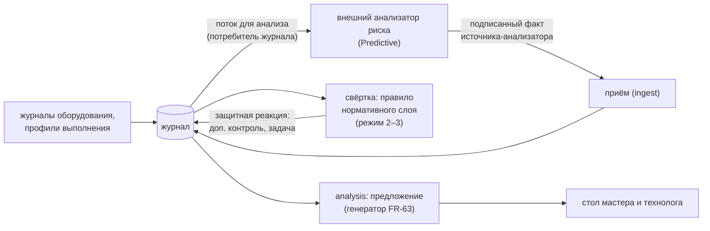
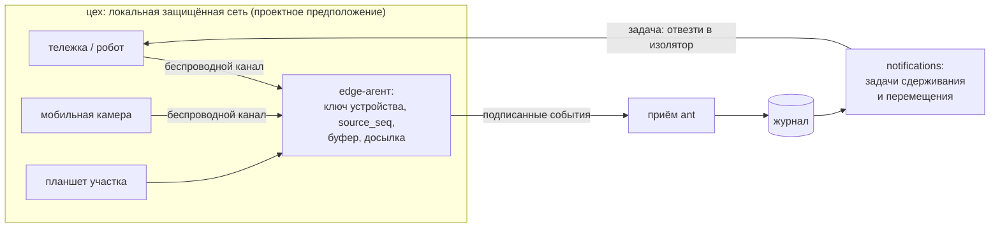

# Состав целевой системы (кейс §3.2)

Документ отвечает на вопрос кейса §3.2: как в системе `ant` представлен каждый из десяти компонентов целевой системы, что из этого работает в MVP, а что описано как архитектура. Здесь же — Predictive и MobileOps, путь внедрения из четырёх ступеней и упрощённый режим для неоцифрованных предприятий.

- **Опоры:** FR-116, FR-142, FR-141, FR-143, PRD §11.14, §11.6; AD-1, AD-18, AD-25, AD-27, AD-29, AD-35; раздел спайна «Окружения и упрощённый режим»; кейс §3.2, §3.1; критерии О5, О6, Т2, Т5.
- **Связанные документы:** [architecture.md](architecture.md) — архитектура целиком; [vision-camera-project.md](vision-camera-project.md) — проект комплекса «камеры + ИИ»; [threat-model.md](threat-model.md) — модель угроз; [integrations/README.md](integrations/README.md) — внешние системы; [federation.md](federation.md) — межзаводская кооперация; [assumptions.md](assumptions.md) — допущения и проектные предположения; [architecture-spine.md](architecture-spine.md) — спайн (AD-1…AD-46); [prd.md](prd.md) — требования.
- **Статус:** проект. Пути кода даны по дереву спайна; источник правды — код, когда он появится.

Всё, что касается оборудования, беспроводных сетей, роботов, датчиков и чисел, не подтверждённых измерениями на производстве, помечено **«проектное предположение»** (NFR-DOC-2).

## 1. Десять компонентов кейса §3.2

Кейс: «Выделение каждого компонента в отдельный сервис не требуется». Каждый компонент — это модуль (или группа модулей) модульного монолита, одноимённый на всех слоях `domain → application → infrastructure` (AD-1), а отдельные процессы выделены только по границам доверия (раздел 2).

| Компонент кейса | Ожидаемое представление (кейс) | Чем закрываем | Модули и точки входа | MVP / описание | Где в коде | Подробности |
|---|---|---|---|---|---|---|
| **Централизованное ядро** | Работающий учёт и обработка производственной истории | Журнал событий — единственный источник истины (AD-2); детерминированная свёртка изделия (AD-4, AD-5); межизделийная стадия (AD-42); проекции; сроки и задачи | `journal`, `engine`, `crossitem`, `reference`, `process`, `item`, `notifications`, `analytics`; роли `cmd/ant`: `api`, `worker`, `crossitem`, `projector`, `scheduler` | MVP | `backend/internal/domain/{journal,engine,crossitem,process,item,…}`, `backend/internal/application/…`, `backend/internal/infrastructure/storage/journal`, `backend/cmd/ant` | [architecture.md](architecture.md), [data-model.md](data-model.md) |
| **Edge-агенты и защищённый обмен** | Проект подключения источников и программная эмуляция потока | Edge-агент у источника: ключ устройства, `source_seq`, буфер исходных конвертов, досылка с исходным `occurred_at` (FR-39, AD-7); подписанный пакет DSSE (AD-10); приём с проверкой подписи, схемы, дублей и карантином (FR-26…31); TLS 1.3 / mTLS между контейнерами (AD-23) | `ingest`, `cmd/edge-agent`, stand-ы источников (роль `stands`) | MVP (эмуляция потока — stand-ы → edge-агент → обычный приём) | `backend/cmd/edge-agent`, `backend/internal/{domain,application}/ingest`, `backend/internal/infrastructure/transport/ingest` | [architecture.md](architecture.md), [threat-model.md](threat-model.md) |
| **VisionQC** | Проект визуального контроля; в MVP поступают готовые результаты | Порт VisionQC и адаптер-эмулятор (FR-97); сигнал как цепочка ступеней анализатора (FR-38); карты контроля, паспорта допуска, уровни доверия 0–4, откат (FR-98, FR-101, AD-29); собственных CV-моделей нет | `vision`, `quality`; stand VisionQC за edge-агентом | MVP — порт и эмулятор; проект комплекса — документ (FR-103) | `backend/internal/{domain,application}/vision`, `backend/internal/infrastructure/integration/vision/visionqc/stand` | [vision-camera-project.md](vision-camera-project.md) |
| **OperatorVision** («Контроль действий оператора») | Проект анализа действий; в MVP поступают события действий | Порт OperatorVision и адаптер-эмулятор (FR-126); результат — гипотеза о действии, не вина; исполнитель определяется по входу на рабочее место, распознавания лиц нет | `vision` (порт), `access` (рабочее место) | MVP — порт и эмулятор; проект — документ | `backend/internal/infrastructure/integration/vision/operatorvision/stand` | [vision-camera-project.md](vision-camera-project.md) |
| **MachineLogs** («Журналы оборудования») | Приём и сопоставление журналов оборудования | Выделитель значимых событий: классификация как в MTConnect (измерение / событие / условие), понятия OPC UA Machine Tools, четыре слоя (FR-147); профиль выполнения операции (FR-148); привязка к выполнению операции делает только межизделийная стадия (AD-29, AD-42); нарушение режима специального процесса (FR-151) | `machinelogs`, `crossitem`; stand-ы станка ЧПУ и сварочного источника (FR-149) | MVP | `backend/internal/{domain,application}/machinelogs`, `backend/internal/infrastructure/integration/machinelogs/…/stand` | [architecture.md](architecture.md) |
| **CriticalActions** («Критические действия») | Журнал критических действий и решений | Сервис доверенных решений: единственный путь `application/security.CriticalActions.Execute`; отдельная хеш-цепочка CA в той же транзакции, что и основная запись (AD-8, AD-28); цифровое клеймо (FR-145); шина безопасности (AD-24) | `security`, `documents`, `access` | MVP | `backend/internal/{domain,application}/security`, `backend/internal/infrastructure/storage/security` | [threat-model.md](threat-model.md) |
| **ErrorAnalysis** | Разбор несоответствий и возможных причин | Несоответствия, решения, сдерживание (FR-51…56); разбор обстоятельств и экран трёх дорожек (FR-58, FR-153); общие факторы (FR-135); область риска с версиями (FR-61); гипотезы и подтверждённая ошибка — только человек (FR-59) | `nonconformity`, `analysis`, `crossitem` | MVP | `backend/internal/{domain,application}/{nonconformity,analysis}` | [architecture.md](architecture.md) |
| **Predictive** | Архитектура прогнозирования; реализация необязательна | Внешний анализатор «риска качества» за тем же портом сигналов, что VisionQC; реакции только защитные по утверждённым правилам; допуск паспортом (раздел 3) | `analysis` (генератор предложений), `vision` (паспорт допуска) | Описание | — (точки подключения — раздел 3.4) | раздел 3 |
| **Simulation** | Воспроизведение событий; расширенное моделирование необязательно | Генератор «истины» по seed (FR-104); прогоны в своём пространстве имён (AD-38); виртуальные часы и пауза (AD-37); автосверка «ожидалось → получилось» (FR-108); воспроизведение и «что мы знали» (FR-124, AD-22); цифровой стенд (FR-152); режим заготовок (AD-36) | `simulation`, `cmd/demo-signer`, `cmd/tamper` (только профили `fixtures`, `demo`) | MVP | `backend/internal/{domain,application}/simulation`, `scenarios/{definitions,expected,fixtures,crypto,load}` | [architecture.md](architecture.md) |
| **MobileOps** | Архитектура беспроводного взаимодействия с роботами; реализация необязательна | Тележки, роботы, мобильная камера, планшеты — источники событий через edge-агент; роботу — только задачи сдерживания и перемещения (раздел 4) | `ingest`, `process` (перемещение), `notifications` (задачи) | Описание; в прототипе — только события перемещения от stand-а | — (точки подключения — раздел 4.3) | раздел 4 |

**Модули вне списка кейса**, которые нужны для работы перечисленных компонентов: `signing`, `access`, `materials` (хранение и защита, кейс §3.4), `documents` (документы из журнала), `erp` / `mes` / `cad` (интеграции, кейс §3.3 — [integrations/README.md](integrations/README.md)), `federation` (межзаводская кооперация — [federation.md](federation.md)), `ops` (состояние компонентов, FR-127).

## 2. Почему не отдельные сервисы

Кейс не требует выносить компоненты в сервисы, и мы этого сознательно не делаем (AD-25, парадигма спайна):

- **Детерминизм и порядок.** Свёртка изделия вызывает функции модулей в фиксированном порядке `item → process → vision → quality → machinelogs → documents → nonconformity → analysis → notifications` (AD-40). Между сервисами этот порядок пришлось бы восстанавливать сетевым протоколом, и повторный прогон верификатором перестал бы давать тот же результат.
- **Ресурсы.** Весь демо-стенд должен уложиться примерно в 2,4 ГБ памяти (AD-25).
- **Масштабирование** достигается не числом сервисов, а партициями по изделию и ролями одного бинарника (`api`, `worker ×N`, `crossitem`, `projector`, `scheduler`, `outbox`, `stands`) — см. [architecture.md](architecture.md).

**Отдельные процессы — только по границам доверия:**

| Процесс | Почему отдельно |
|---|---|
| `cmd/keeper` — хранитель контрольных точек | Хранит головы цепочек вне досягаемости администратора БД `ant` (AD-8) |
| `cmd/verifier` — верификатор | Независимая проверка журнала, роль БД только на чтение, корни доверия вне `ant` (AD-9) |
| `cmd/token-agent` + `extension/` | Личные ключи людей и доверенное отображение на рабочем месте (AD-14) |
| `cmd/edge-agent` | Ключи устройств у источника, буфер и досылка (AD-11, FR-39) |
| `cmd/demo-signer` | Демо-персоны сценариев — обычный клиент API, вне `ant` (AD-26, AD-33) |

## 3. Predictive — прогноз риска качества

**Статус:** описание (кейс: «реализация необязательна»; PRD §11.14, FR-116). В прототипе не реализуется.

### 3.1. Что делает

Предупреждает о росте риска брака **до** появления несоответствия и предлагает защитное действие. Решений по изделию не принимает: сигнал ≠ решение (глоссарий, FR-51).

**На каких данных.** Всё уже есть в истории изделия и в журнале:

- тренды параметров оборудования по выполнениям операций — ток сварки, нагрузка шпинделя, температура (профиль выполнения операции, FR-148);
- ресурс инструмента («73 из 75 циклов», FR-147);
- способность процесса по конкретной важной характеристике — Cpk для связки «характеристика + операция + станок»;
- здоровье камеры на точке контроля — доля «оценка невозможна» и расхождений с контролёрами;
- повторы прошлых проблем — организационная память «причина → мера → результат» (FR-64, FR-138).

**Что выдаёт.** Запись «риск качества» с основаниями и ссылками на исходные записи. Пример формулировки: «на источнике ИС-2 ток дрейфует к верхней границе уставки; в прошлый раз такой дрейф предшествовал непровару за 3 смены». Уверенность прогноза — не вероятность брака (NFR-UI-4).

### 3.2. Реакции — только защитные и только по утверждённым правилам

Прогноз подчиняется общему правилу «автоматически ограничивать безопаснее, чем разрешать» (FR-144, AD-27). Допустимые реакции — по заранее утверждённым правилам нормативного слоя, режимы автоматизации 2–3 (FR-50):

- усилить контроль следующих N изделий;
- поставить задачу «проверить инструмент»;
- предупредить мастера участка;
- назначить обслуживание оборудования.

Остановить процесс (стоп точки процесса) — только если такое правило утверждено и риск высокий; снимает стоп только уполномоченный человек (FR-49). Разрешающих действий у прогноза нет: ложная тревога только усиливает контроль и никогда не выпускает изделие.

### 3.3. Допуск прогнозной модели

Прогнозная модель — такой же анализатор, как VisionQC, и допускается тем же контуром (AD-29, FR-98, FR-101):

- **паспорт допуска** — документ с маршрутом подписей в нормативном слое (изделие, операция, характеристика, входные данные, версия модели, проверочный набор, разрешённые и запрещённые автоматические действия);
- **теневой режим** (уровень доверия 0 — только запись) → рекомендация (1) → защитные действия (2–3); уровень 4 («пропуск годен») прогнозу не выдаётся;
- **откат** по триггерам (дрейф, рост расхождений с людьми, пропущенный брак) — приостановка паспорта, действует на будущее;
- «уверенность ≠ доказательство»: у каждой записи хранится вектор версий (модель, профиль порогов, контракт, приложение).

Подробно контур допуска описан в [vision-camera-project.md](vision-camera-project.md).

### 3.4. Как встаёт в архитектуру

- **Вход анализатора** — выгрузка из журнала через потребителя журнала (AD-45) или, в промышленном варианте, поток брокера за портом `WorkFeed`/`Publisher` (AD-35, см. [observability-kafka-otel.md](observability-kafka-otel.md)).
- **Выход** — факт источника-анализатора через обычный приём с ключом устройства или шлюза (как у VisionQC: порт сигналов модуля `vision`). Прогноз недетерминирован, поэтому это **факт**, а не реакция движка (AD-3: «предложения генератора на ИИ — факты источника-генератора»).
- **Реакция** — правило нормативного слоя с режимом автоматизации и классом «защитное» (AD-27), исполняется детерминированной свёрткой; верификатор проверяет, что реакция не превысила класс, режим и уровень паспорта.
- **Предложение** человеку — через фабрику генераторов предложений модуля `analysis` (FR-63): новый генератор подключается адаптером без изменения ядра.
- **Тип записи** — предварительно `analyzer.risk.observed` в семействе `analyzer` (владелец — `vision`, AD-40); окончательное имя фиксирует каталог событий (эпик 00).

### 3.5. Отраслевая специфика: мелкие серии

В единичном и мелкосерийном производстве больших выборок нет. ГОСТ Р 58633-2020 **допускает не включать требования о статистическом управлении процессом** (примечание к п. 7.1) и проводить первичную аттестацию, как правило, без статистической оценки стабильности (п. 8.10); ГОСТ Р 59861-2021, п. 7.4.14: «При единичном и мелкосерийном производстве оценку стабильности ТП допускается не проводить ввиду малой статистики». Подробно — [normative-anchors.md](normative-anchors.md).

Поэтому прогноз опирается на **физические параметры процесса и ресурс**, а не на статистику дефектов, и растёт по лестнице цифровизации (раздел 5):

| Ступень | Что возможно |
|---|---|
| 0–1 «поверх бумаги» | прогноза нет |
| 2 «дооснащённый цех» | тренды датчиков (ток, нагрузка, ресурс инструмента) |
| 3 «связанное производство» | Cpk по характеристикам, корреляции с данными MES и PLM |
| 4 «адаптивное» | адаптивный контроль: глубина контроля меняется по риску по утверждённым правилам |

### 3.6. Чего не делаем

По PRD §11.6: MachineLogs и Predictive — не SCADA; миллисекундная телеметрия в журнал не пишется (сырые данные остаются на краю); не строим платформу предиктивного технического обслуживания, OEE предприятия, управление станком и цифровой двойник станка.

## 4. MobileOps — беспроводное взаимодействие с роботами и мобильными средствами

**Статус:** описание (кейс: «реализация необязательна»; PRD §11.14). В прототипе — только события перемещения «отправлено / принято» от stand-а.

### 4.1. Что это в процессе

Мобильные средства цеха (состав и характеристики — **проектное предположение**):

- автоматические тележки (AGV) и мобильные роботы — перемещение деталей между участками и в изолятор;
- мобильная камера на роботе или манипуляторе — осмотр крупных изделий по зонам;
- планшеты и терминалы людей — ступень 1 лестницы цифровизации.

### 4.2. Какие события дают

| Событие | Зачем |
|---|---|
| Перемещение «отправлено / принято»: кто или что везло, время в пути | Отличить дефект операции от повреждения при перемещении (разбор обстоятельств, FR-58) |
| Наблюдение мобильной камеры с позицией и зоной | Связать кадр с зоной изделия (FR-46); тот же общий тип «результат контроля» (FR-36) |
| Подтверждение физической задачи («деталь помещена в изолятор») | Снять расхождение «изолировано в системе, физически не перемещено» (FR-55) |

Изделие в пути не может «потеряться»: пока нет события «принято», его положение — «в перемещении» (ось «положение в процессе», §3b PRD).

### 4.3. Как работает с системой

- **Источник событий.** Робот или тележка — обычный источник через edge-агент (AD-25) с пометкой источника и надёжности (FR-140). Новый тип источника — новый адаптер, ядро не меняется.
- **Какие задачи получает робот.** Только задачи **сдерживания и перемещения**: «отвезти изолированную деталь в изолятор», «доставить на дополнительный контроль». Это защитные действия (AD-27), режимы автоматизации 1–3.
- **Чего робот не получает никогда.** Команду выпустить или отправить дальше заблокированное изделие. Блок снимает только человек (FR-144): снятие блока — разрешающее действие.
- **Потеря связи.** Робот доделывает текущую безопасную задачу; edge-агент хранит подписанные события и досылает их с исходным `occurred_at` (FR-39, AD-7). Задержка не меняет историю: порядок в пределах изделия — `occurred_at → received_at → event_id` (AD-5).
- **Закрытый контур.** Беспроводная связь в режимных цехах ограничена; **проектное предположение** — локальная защищённая сеть без выхода наружу (NFR-SEC-1).
- **Точки подключения в коде (цель):** адаптер источника `backend/internal/infrastructure/integration/ingest/mobileops/…` за edge-агентом; выдача задач роботу — подписчик журнала на задачи `notifications` через порт `Publisher` (AD-35). В прототипе — stand перемещений в сценариях `scenarios/definitions`.

## 5. Путь внедрения из четырёх ступеней и упрощённый режим

**Статус:** описание, без отдельного кода (FR-142, FR-116, addendum A13, раздел спайна «Упрощённый режим и путь внедрения»).

### 5.1. Главный принцип

История изделия **одна и та же** на всех ступенях. Меняется только доля фактов, приходящих автоматически, и их надёжность (FR-140). Ядро — журнал, свёртка, нормативный слой, права, подписи — от ступени не зависит: ступень определяется набором подключённых адаптеров источников.

«Уровень цифровизации ≠ облако»: даже четвёртая ступень целиком работает в закрытом контуре (NFR-SEC-1).

### 5.2. Ступени

| Ступень | Источники фактов | Адаптеры | Что меняется в системе |
|---|---|---|---|
| **0–1. Поверх бумаги** | Терминал или планшет участка (FR-137), формы на столах, импорт журналов Excel/CSV (FR-141), бумага с QR | ручной ввод; импорт CSV/Excel (`ingest`); печать сопроводительной карты с QR; подпись на бумаге с заверением (AD-43); «допуск подтверждает мастер» вместо СКУД | Факты помечены «ручной ввод / импорт»; надёжность привязки ниже; область риска широкая |
| **2. Дооснащённый цех** | Внешние датчики и шлюз на старом станке (ток, вибрация, датчик двери, начало и конец цикла), приборы с цифровым выходом, камеры | edge-агент со шлюзом датчиков; stand-ы оборудования как образец адаптера (FR-149); порт VisionQC | Появляются профили выполнения операции и окна по данным оборудования; прогноз — тренды датчиков |
| **3. Связанное производство** | MES, ERP, PLM напрямую | адаптеры `erp` (1С, Галактика), `mes`, `cad` (КОМПАС-3D, ЛОЦМАН:PLM) — [integrations/README.md](integrations/README.md) | Задания и события операций без повторного ручного ввода (FR-93); блокировки уходят в MES |
| **4. Адаптивное** | Всё выше + допущенные анализаторы | те же; больше утверждённых правил режима 2 и паспортов допуска высокого уровня | Контроль усиливается при риске; больше автоматических защитных реакций — всё по утверждённым правилам |

Все характеристики оборудования и датчиков на ступенях 2–4 — **проектные предположения**.

### 5.3. Как сужается область риска

Чем больше надёжных фактов, тем уже область риска той же детали. Пример главной истории «плохой день сварочного участка»: **34 → 13 → 6** изделий (FR-155) — по мере того как появляются данные источника (только этот источник), режима (только этот режим) и окна сбоя (только окно). На ступени 0–1 область остаётся шире: неизвестное хранится как «неизвестно» (FR-123), и система не делает категоричного вывода.

### 5.4. Упрощённый режим для неоцифрованных предприятий

Процесс собирается в одном месте, а недостающая инфраструктура заменяется адаптерами за теми же портами (addendum A13):

| Нет… | Замена | Пометка в журнале |
|---|---|---|
| СКУД | адаптер «допуск подтверждает мастер» за портом СКУД | источник — ручное подтверждение мастера |
| ПК у станков | один терминал участка с токеном (FR-137) | источник — ручной ввод |
| электронной подписи на участке | печать документа с QR-отпечатком, подпись ручкой, скан заверяет второй человек (FR-139, AD-43) | класс подписи `paper`, заверитель, номер бумажного оригинала |
| электронных журналов | импорт Excel/CSV с проверкой входов, дублей и привязки (FR-141) | источник — импорт |

Отклонено: подпись с телефона (на режимных объектах телефонов нет) и централизованное хранение ключей или облачная подпись (сервер получает ключи — ломает модель угроз, [threat-model.md](threat-model.md)).

### 5.5. Карта дефицита данных — инструмент планирования цифровизации

Карта дефицита данных (FR-143, MVP) агрегирует «нехватку сведений» из разборов по всем несоответствиям и оценивает, какая цифровизация сузила бы область риска: например, «учёт инструмента на станках 17–18 сузил бы область риска в среднем с 13 до 4 деталей» (числа — иллюстрация сценария). Так система подсказывает руководителю, какую следующую ступень внедрять и где.

## 6. Как добавить компонент

Новый компонент подключается без переписывания бизнес-логики ядра (кейс §3.1, FR-114, критерий О6):

1. **Внешняя зависимость — только за портом** с ключом конфигурации и общим контрактным тестом для всех адаптеров (AD-35). Порты платформы: `JournalStore`, `LeaseStore`, `MaterialStore`, `WorkFeed`, `Publisher`, `Telemetry`, `Signer` / `Verifier` / `Cipher`, `AccessControl`, `IdentityProvider`, внешние системы.
2. **Новый источник** (датчик, робот, анализатор) — адаптер `infrastructure/integration/‹модуль›/‹система›` и stand с тем же протоколом; факты идут через edge-агент и обычный приём (AD-18). Новый вид результата контроля ложится в общий тип «результат контроля» с полем метода (FR-36).
3. **Новый генератор предложений** — адаптер порта генераторов модуля `analysis` (FR-63).
4. **Новый тип записи** — совместимое расширение своего семейства в `contracts/events/catalog.yaml` (AD-40, AD-20); ломающее изменение ловит `make check`.
5. **Экспорт метрик и брокер** — [observability-kafka-otel.md](observability-kafka-otel.md).

Пример подключения нового адаптера по шагам — [new-adapter.md](new-adapter.md).

## Уточнить после появления кода

- Точные пути модулей и адаптеров в таблице раздела 1 (сверить с деревом `backend/internal/**`).
- Имя порта сигналов анализатора в `application/vision` и тип записи прогноза (`analyzer.risk.observed` — предварительно) по каталогу `contracts/events/catalog.yaml`.
- Имена stand-ов VisionQC, OperatorVision, станка ЧПУ, сварочного источника и stand-а перемещений; какие события перемещения реально отдаёт stand в прототипе.
- Имя адаптера импорта CSV/Excel и адаптера «допуск подтверждает мастер» (если появится в коде).
- Ссылки на операции API карты дефицита данных (`operationId` в `contracts/openapi.yaml`).
- Сверить таблицу отдельных процессов с `deploy/compose` (фактический состав контейнеров).
