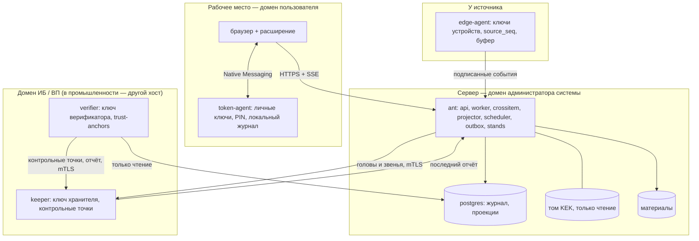

# Модель угроз системы `ant`

**Назначение.** Документ отвечает на вопросы: что защищает система контроля качества `ant`, от кого, какими механизмами, как это проверить и от чего она **не** защищает. Он закрывает FR-120 и NFR-SEC-2 из [`prd.md`](prd.md), раскрывает AD-34 «Резервирование, восстановление и границы защиты» из [`architecture-spine.md`](architecture-spine.md) и работает на критерии кейса О9 «Долгосрочная криптографическая защита», Т3 «Информационная безопасность и аудит» и Т5 «Документация».

**Опоры:** кейс §2 («Защита»), §3.4, §5.1 «Изменение данных», §6.3; PRD FR-26, FR-66…FR-77, FR-85, FR-118, FR-120, FR-139, FR-144…FR-146, NFR-SEC-1, NFR-SEC-2; спайн AD-2, AD-7…AD-15, AD-23, AD-24, AD-27, AD-28, AD-32…AD-34, AD-37, AD-43, AD-44, AD-46.

**Статус.** Проект до появления кода. Пути кода даны по дереву спайна; при слиянии их сверяют с репозиторием (см. [раздел 15](#15-уточнить-после-появления-кода)).

**Связанные документы:** [`architecture.md`](architecture.md) — общая архитектура; [`data-model.md`](data-model.md) — запись журнала и конверт события; [`crypto.md`](crypto.md) — криптопрофили и жизненный цикл ключей (пишет эпик 27); [`backup-restore.md`](backup-restore.md) — резервирование и восстановление; [`assumptions.md`](assumptions.md) — допущения и проектные предположения; [`integrations/README.md`](integrations/README.md) — внешние системы; [`federation.md`](federation.md) — межзаводской обмен.

## Содержание

1. [Объект защиты, режим и границы документа](#1-объект-защиты-режим-и-границы-документа)
2. [Активы](#2-активы)
3. [Границы доверия и административные домены](#3-границы-доверия-и-административные-домены)
4. [Нарушители и границы защиты](#4-нарушители-и-границы-защиты)
5. [Угрозы и меры](#5-угрозы-и-меры)
6. [Соответствие мерам приказа ФСТЭК № 117](#6-соответствие-мерам-приказа-фстэк--117)
7. [Криптография](#7-криптография)
8. [Шифрование при хранении: цель и нецель](#8-шифрование-при-хранении-цель-и-нецель)
9. [Шина безопасности и журнал критических действий](#9-шина-безопасности-и-журнал-критических-действий)
10. [Демонстрация защиты](#10-демонстрация-защиты)
11. [Резервирование и восстановление](#11-резервирование-и-восстановление)
12. [Упрощённый режим и его угрозы](#12-упрощённый-режим-и-его-угрозы)
13. [Остаточные риски и честные ограничения демо](#13-остаточные-риски-и-честные-ограничения-демо)
14. [Путь к промышленной эксплуатации](#14-путь-к-промышленной-эксплуатации)
15. [Уточнить после появления кода](#15-уточнить-после-появления-кода)

---

## 1. Объект защиты, режим и границы документа

### 1.1 Главная угроза

Цель противника — **подменить запись контроля или решение по изделию так, чтобы дефектная деталь ушла дальше по маршруту и попала в изделие**. Последствия в ракетно-космической отрасли — авария, гибель людей, остановка производственных цепочек. Противник — внешний (в том числе иностранные спецслужбы, вредительство) и внутренний, включая администратора базы данных и операционной системы (addendum A5 к PRD).

Отсюда принцип «не доверять никому, включая собственный сервер»:
- у каждого человека и устройства свой ключ, которого нет на сервере (AD-11);
- все записи сцеплены хешами, а головы цепочек хранит внешний свидетель — хранитель (AD-8);
- независимый верификатор переигрывает журнал и сверяет всё с подписями и контрольными точками (AD-9).

Одна база данных с хеш-цепочкой **не защищает** от администратора базы: он может пересчитать цепочку целиком. Защищают только подписи ключами, которых у него нет, и внешний свидетель голов цепочек. Поэтому архитектура держится именно на этих двух механизмах, а не на хеш-цепочке самой по себе.

### 1.2 Объект защиты

Объект — цифровая система `ant` в составе, описанном в [`architecture.md`](architecture.md): процесс `ant` со всеми ролями, воркеры, хранитель (`keeper`), верификатор (`verifier`), edge-агенты, агент токена с браузерным расширением, демо-подписант (`demo-signer`), база Postgres, том ключа шифрования (KEK), хранилище материалов. Внешние системы (1С, Галактика, MES, КОМПАС-3D, СКУД, удостоверяющий центр, VisionQC, OperatorVision) — за границей объекта: система защищает свою сторону обмена и не доверяет входящим данным больше, чем позволяет их класс происхождения (AD-2, AD-18).

### 1.3 Режим

- **Закрытый контур** (NFR-SEC-1): система работает без доступа в интернет; зависимости, шрифты и иконки поставляются локально; образы и модули закреплены по версиям и собираются заранее (AD-25).
- **Приказ ФСТЭК России от 11.04.2025 № 117** (действует с 01.03.2026) — требования о защите информации в государственных информационных системах и иных информационных системах государственных органов, унитарных предприятий и учреждений. Применимость к конкретному предприятию определяет заказчик; мы проектируем так, чтобы требования приказа можно было выполнить (раздел 6).
- **Смежные требования** (из исследования идентичности и доступа): приказ ФСТЭК № 239 — для значимых объектов критической информационной инфраструктуры (ракетно-космическая и оборонная промышленность названы в ст. 2 закона 187-ФЗ); приказ ФСТЭК № 31 — для автоматизированных систем управления технологическим процессом. Из них для нас важны группы мер идентификации и аутентификации (в том числе устройств до начала взаимодействия), управления доступом (блокировка сеанса при неактивности) и управления физическим доступом — основание для связи системы со СКУД.
- **Указ Президента РФ № 166** (иностранное ПО на значимых объектах КИИ): ядро построено на открытом стеке без иностранных сервисов во время работы. Сторонние библиотеки (например, bpmn-js) перечислены с лицензиями (`make licenses`, раздел «Заимствованный код» в [`architecture.md`](architecture.md)); ни одна из них не обращается наружу.
- **Данные системы** не составляют государственную тайну — проектное допущение. Если составляют, режим другой: другие средства электронной подписи и аттестация объекта; архитектура портов (`Signer`, `Verifier`, `Cipher`) это допускает, но документ этот режим не описывает.

### 1.4 Границы документа

Документ описывает угрозы информационной безопасности цифровой системы. Он не описывает физическую охрану, промышленную безопасность, защиту внешних систем и сертификацию средств защиты — только места, куда они подключаются.

---

## 2. Активы

| Актив | Что это | Что с ним может случиться | Главные механизмы |
|---|---|---|---|
| **Основной журнал** | Записи append-only: факты, реакции движка, решения людей, служебные записи (AD-2, AD-44) | правка, удаление, вставка, откат, вилка, задержка или потеря «неудобного» факта | подписи вне сервера, хеш-цепочка, хранитель, верификатор, права БД и триггеры |
| **Журнал критических действий (CA)** | Вторая хеш-цепочка: решения по изделию, выдача прав, утверждение версий, конфликты, пропуски проверок (AD-28, FR-77) | правка и удаление; отсутствие записи о действии | запись в той же транзакции, что и основная; нет пути записи у администратора приложения; хранитель |
| **Контрольные точки хранителя** | Подписанные головы обеих цепочек вне основного хранилища (AD-8, FR-72) | подмена, отказ хранителя, «молчание» сервера | отдельный процесс и том, mTLS, профиль `hybrid`, тревога через 2N секунд |
| **Подписи людей** | Решения и факты людей, подписанные личным ключом в агенте токена или на бумаге с заверением (AD-11, AD-13, AD-14, AD-43) | подпись чужим ключом, «второй ключ», подмена отображения, оракул подписи, поддельный скан | ключи только в агенте токена, акт регистрации с доказательством владения, доверенное отображение, уровни подписи, заверитель |
| **Подписи устройств** | События edge-агентов (уровень 0, AD-25) | подменённое устройство, удаление и вставка событий | ключ устройства в edge-агенте, акт ввода, `source_seq`, отзыв |
| **Системные ключи** | Ключи движка, шлюзов, хранителя, верификатора, шлюза предприятия (AD-11, AD-32) | подпись фактов от имени сервера, компрометация | тома с правами 0400, класс `server-attested` с ограничениями, перепроверка реакций верификатором |
| **Нормативный слой и версии процесса** | BPMN, карта реакций, правила, шаблоны документов и маршруты, классификатор, паспорта допуска (AD-17) | исполнение неподписанной или изменённой версии, «тихая» правка правила | подпись кворума над хешем байтов XML; движок отказывается исполнять без полного набора подписей; верификатор |
| **Политика доступа и цифровые клейма** | Роли, области, полномочия, клейма, параметры аудита (AD-15, FR-145) | выдача себе прав, правка проекции политики, изменение параметров аудита | изменения только записями `policy.*` с маршрутом и второй подписью независимой стороны; верификатор строит политику из журнала |
| **KEK и DEK** | Ключ шифрования ключей и ключи данных (AD-23) | утечка, утрата, чтение копий | отдельный том, монтируется только на чтение; обёртки DEK вне цепочки; ротация служебной записью |
| **Материалы** | Сканы бумажных подписей, иллюстрации, вложения по адресу H(байты) (AD-23) | подмена, «нарисованный сервером» скан | адресация по содержимому, шифрование, заверение скана подписью уровня 2 |
| **Проекции** | Пересчитываемые представления: паспорт, карта, сдерживание, показатели (AD-2, AD-45) | правка таблицы в обход системы | верификатор сравнивает проекции с пересвёрткой; строки, изменённые критическим действием, хранят `ca_id` |
| **Файл `trust-anchors`** | Отпечатки якоря, хранителя, верификатора, генезиса; ожидаемые профили (AD-33) | подмена корней доверия | лежит вне БД и вне `ant`; в промышленности передаётся ИБ или ВП на отчуждаемом носителе |
| **Отчёт верификатора** | Подписанный вердикт «цело / цело с оговорками / нарушение» с хешем бинарника (AD-46) | подавление или подделка вердикта взломанным `ant` | подпись ключом верификатора; первичный канал — хранитель и сам верификатор, а не `ant` |
| **Генезис** | Первые записи журнала: профили, ключи, политика, нормативный слой v1 (AD-33) | второй генезис, подмена стартовой политики | подпись якорем `hybrid`, уничтожение якоря, отпечаток генезиса в первой контрольной точке и в `trust-anchors` |
| **Выписки партнёров** | Подписанные паспорта изделий и партий от других предприятий (AD-19) | подмена выписки, непроверяемое происхождение | проверка цепочкой к корням партнёра из нашего акта регистрации |
| **Внешние обмены** | Сообщения в 1С, Галактику, MES и из них (AD-18) | двойная отправка, отправка при воспроизведении, подмена входящих | идемпотентность по бизнес-ключу, проверка ответной стороны, класс `server-attested` у входящих |
| **Сеансы и учётные данные** | Сеансы веба, пароли, допуск к рабочему месту (AD-15) | подбор пароля, кража сеанса, работа не на своём месте | `argon2id`, ограничение частоты, блокировка, `http.CrossOriginProtection`, сеанс рабочего места журналом |

---

## 3. Границы доверия и административные домены

### 3.1 Процессы и контейнеры

Отдельные процессы выделены **только по границам доверия** (AD-25): всё, что может быть взломано вместе с сервером, живёт в одном модульном монолите `ant`; всё, что должно устоять при взломе сервера, вынесено.

| Процесс | Где работает | Какие ключи держит | Кому доверяет |
|---|---|---|---|
| `ant` (роли `api`, `worker`, `crossitem`, `projector`, `scheduler`, `outbox`, `stands`) | сервер | системные: движок, шлюзы, шлюз предприятия; KEK на чтение | никому из внешних без подписи |
| `ant init` | сервер, однократно | создаёт ключи в тома, пишет генезис, уничтожает якорь | — |
| `keeper` (хранитель) | в демо — контейнер со своим томом; в промышленности — хост службы ИБ или ВП | ключ хранителя | только продолжению цепочки, звенья которого сходятся |
| `verifier` (верификатор) | в демо — контейнер; в промышленности — также рабочее место ВП | ключ верификатора; роль БД `ant_verifier` только на чтение | `trust-anchors` и контрольным точкам хранителя, но не БД и не `ant` |
| `token-agent` + расширение | рабочее место пользователя | личные ключи людей | своему локальному журналу подписанного; сервер для него — недоверенный |
| `edge-agent` | у источника данных | ключи устройств | — |
| `demo-signer` | демо-профили | ключи демо-персон класса `scenario` | только шагам из `scenarios/definitions` (том только на чтение) |
| `postgres` | сервер | — | — |

Каждая стрелка через границу — аутентифицированный канал: HTTPS для браузера, mTLS с хранителем и верификатором, подписанные пакеты от edge-агента и агента токена (AD-10, AD-23).

### 3.2 Три административных домена

Администратор не проверяет сам себя (AD-15). Права разделены так:

| Домен | Кто | Что может | Чего не может |
|---|---|---|---|
| 1. Администратор системы | ОС, Postgres, контейнеры `ant` | устанавливать, обновлять, резервировать | в приложении прав нет; не администрирует хранитель и рабочее место верификатора |
| 2. Администратор безопасности | роль кейса «Администратор» | выдавать обычные роли одной подписью; готовить привилегированные выдачи и ключи | привилегированная выдача и выдача ключей — только со второй подписью независимой стороны (AD-11); выдать себе права (проверка по эффективным правам) |
| 3. Аудитор ИБ | только чтение | видеть отчёты верификатора, журнал критических действий, шину безопасности, историю выдачи прав; владеть параметрами аудита `policy.audit.*` (перечень критических типов, интервал и предельный разрыв контрольных точек, отпечаток ключа хранителя, подписчики шины) | менять производственные данные и выдавать права |

**Вторая подпись — от независимой стороны** (AD-11, PRD §11.16): полномочия ОТК, клейма и ключи контролёров — начальник ОТК (для продукции с приёмкой ВП — плюс уведомление ВП); полномочия и ключи производства — руководитель производства; привилегии администраторов и аудита — Аудитор ИБ; регистрация партнёра и его корней — начальник ОТК. Руководитель производства — заинтересованная сторона, поэтому не подписывает полномочия ОТК.

### 3.3 Демо и промышленность

В демо все границы доверия — контейнеры на одном хосте, а все ключи создал один `ant init`. Демонстрируется **механизм**, а не независимость сторон. В промышленной эксплуатации хранитель — хост службы ИБ или ВП в другом административном домене, верификатор дополнительно работает на рабочем месте ВП, ключи людей и держателей второй подписи создаются на их токенах в церемонии ключей (раздел 14).

---

## 4. Нарушители и границы защиты

Для каждого нарушителя — три колонки: что система **предотвращает** (действие невозможно), что **обнаруживает** (действие возможно, но будет найдено верификатором, хранителем или шиной безопасности) и от чего **не защищает**. Таблица — AD-34 спайна с пояснениями.

| Нарушитель | Предотвращаем | Обнаруживаем | Не защищаем |
|---|---|---|---|
| **Исполнитель, контролёр — чужой ключ, чужое место** | подпись чужим ключом; действие вне своего места, прав и клейма; самоприёмку (FR-56) | пропуск проверки; «чужой ключ»; повторный ключ | — |
| **Подписант со своим ключом и клеймом, действующий злонамеренно** (подкупленный контролёр) | действия сверх полномочий и клейма | противоречие подписи фактам `device` (например, «годен» при сигнале камеры и отклонении режима); статистику подписанта | ложное заключение, которому не противоречат данные |
| **Администратор приложения** (домен 2) | выдачу себе прав; запись в журнал критических действий; изменение параметров аудита | изменения политики (журнал выдачи прав у Аудитора ИБ) | — |
| **Администратор и держатель второй подписи в сговоре** | — | выдачу прав и ключей (верификатор, Аудитор ИБ, уведомление субъекту через его агент) | подписи выданным ключом до обнаружения |
| **Администратор БД/ОС, взломанный `ant`** | подделку подписей людей уровня ≥ 2 и подписей устройств | правку, удаление и вставку записей до последней контрольной точки; подмену проекций; разрывы `source_seq`; задержку записи; молчание перед хранителем; подписи уровня 1 сверх обычного (сменный рапорт) | подделку фактов `server-attested` и дописывание новых записей ключами сервера; бумажные подписи (только сверка с оригиналом); чтение данных (KEK доступен процессу); отказ в обслуживании |
| **Администратор БД/ОС в сговоре с администратором хранителя** | — | — | подделку всей истории после генезиса, включая перерегистрацию ключей |
| **Подменённое устройство** | работу с неизвестным или отозванным ключом | разрывы `source_seq`, аномалии | данные устройства до обнаружения |
| **Скомпрометированное рабочее место** | — | подписи сверх обычного (сменный рапорт уровня 3) | подписи от имени пользователя, пока токен разблокирован; в MVP окно подтверждения — страница расширения: подменённое расширение показывает одно, а подписывает другое (цель — окно локальной программы, AD-14) |
| **Разработчик, поставщик зависимостей** | — | расхождение хеша сборки верификатора с нормативным слоем | закладку в общем доменном коде |
| **Предприятие-партнёр** | принятие непроверенной выписки как доверенной | подмену выписки | ложь в правильно подписанной выписке |

### 4.1 Пояснения

- **Почему администратор БД не может подделать решение контролёра.** Решение подписано личным ключом контролёра в агенте токена уровнем 2 (доверенное отображение и явное подтверждение). Ключа на сервере нет. Запись без действительной подписи верификатор помечает «отвергнуто».
- **Почему он может дописать факт `server-attested`.** Ключи шлюзов и движка лежат в томе `ant`. Кто владеет сервером, тот может ими подписать. Поэтому такие факты ограничены (AD-2): справочники, от которых зависят права и предусловия (квалификации, допуски, поверка, клейма, смены, календарь), фактами `server-attested` не меняются; разрешающее действие (AD-27) не может опираться только на такие факты. Реакции движка, подписанные ключом `server-attested`, проверяются не ключом, а пересчётом верификатором (AD-3, AD-9).
- **Почему пересчёт цепочки не помогает.** Хранитель принимает новую голову, только если звенья от прежней головы сходятся, и отвергает точку с тем же `seq` и другим звеном (AD-8). Цепочка, пересчитанная «с середины», расходится с уже подписанной контрольной точкой.
- **Окно до контрольной точки.** Записи после последней контрольной точки ещё не засвидетельствованы. Их можно удалить незаметно для хранителя, но edge-агенты хранят исходные конверты до подтверждения контрольной точкой, а агенты токена — локальный журнал подписанного; расхождение даёт разрыв `source_seq` или тревогу сменного рапорта.
- **Сговор с администратором хранителя.** Если оба свидетеля в руках одного лица, защиты нет. Поэтому в промышленности хранитель — в другом административном домене (ИБ или ВП), а его ключ регистрирует акт Аудитора ИБ и администратора безопасности.
- **Цепочка поставки.** Верификатор исполняет тот же доменный код, что и воркеры. Ошибку или закладку в этом коде он не найдёт. Смягчение в MVP: хеш доменной сборки (`domain_build`) пишется в каждую пачку реакций и сверяется с перечнем допустимых сборок нормативного слоя; отчёт верификатора содержит хеш его бинарника; GoGOST закреплён по sha256 в `third_party/gogost/SOURCE`. Вторая независимая реализация ключевых проверок — описание (AD-9, Deferred).

---

## 5. Угрозы и меры

Колонка «Проверка» — чем мера подтверждается: **верификатор** (`backend/cmd/verifier`), **хранитель** (`backend/cmd/keeper`), **`make tamper`** (`backend/cmd/tamper`), **`scenarios/crypto`**, тест в **`make check`**, автотест или сценарий в `scenarios/definitions`. Статус: **MVP** — реализуется и показывается; **описание** — спроектировано, в прототипе не делается.

### 5.1 Целостность журнала и истории

| # | Угроза | Механизм | AD / FR | Проверка | Статус |
|---|---|---|---|---|---|
| У-1 | Изменение или удаление записи через API | API не предоставляет операций изменения и удаления журнала; в журнал пишет только `journal.Append`; исправление — новое событие `corrects_event` | AD-2, AD-44; FR-71, FR-122 | попытка через API → 403 или 405 (`make tamper`) | MVP |
| У-2 | Правка записи прямо в БД | роль `ant_app` без `UPDATE`/`DELETE`/`TRUNCATE`; строчный триггер `BEFORE UPDATE OR DELETE`, триггер `BEFORE TRUNCATE`; таблицами владеет `ant_owner` без LOGIN; роль приложения не меняет `session_replication_role`; обход — только суперпользователю, его ловит звено цепочки | AD-2, AD-44 | `make tamper`, атака 1: «нарушение звена в записи seq N» | MVP |
| У-3 | Правка записи и пересчёт всей цепочки суперпользователем | внешний свидетель: хранитель принимает только продолжение цепочки; верификатор сверяет цепочку с контрольными точками | AD-8, AD-9; FR-72, FR-73 | `make tamper`, атака 2: «расхождение с контрольной точкой хранителя» | MVP |
| У-4 | Подмена проекции (например, «заблокировано» → «разрешено») | проекции — пересобираемый кэш; верификатор сравнивает их с пересвёрткой журнала; строка, изменённая критическим действием, хранит `ca_id` | AD-9, AD-28, AD-45 | `make tamper`, атака 3: «проекция расходится с журналом: изделие X в журнале „заблокировано“ (CA-…), в проекции „разрешено“» | MVP |
| У-5 | Откат из резервной копии («восстановили» старое состояние) | журнал из копии старше последней контрольной точки верификатор принимает только при подписанном акте восстановления (администратор безопасности + Аудитор ИБ) с диапазоном потерянных номеров; иначе — «откат» | AD-34 | верификатор против контрольных точек | MVP — обнаружение; акт восстановления — описание |
| У-6 | Вилка цепочки (две версии истории) | одна основная цепочка, запись под `pg_advisory_xact_lock`; хранитель отвергает точку с тем же `seq` и другим звеном | AD-8, AD-44 | хранитель; тест конкурентной записи в `make check` | MVP |
| У-7 | Молчание сервера перед хранителем (перестал отдавать головы, чтобы переписать хвост) | хранитель сам поднимает тревогу, если головы не приходили дольше 2N секунд; разрыв между точками больше порога — нарушение у верификатора; N и порог — данные `policy.audit.*` у Аудитора ИБ, а не конфигурация администратора | AD-8, AD-15 | хранитель, верификатор | MVP |
| У-8 | Потеря «неудобного» факта (не записать, выкинуть в карантин) | факт помещения в карантин — служебная запись журнала (источник, `source_seq`, отпечаток, код причины); содержимое — в хранилище материалов; верификатор проверяет непрерывность `source_seq` по каждому источнику | AD-2, AD-7, AD-9 | верификатор: «разрыв source_seq» | MVP |
| У-9 | Задержка записи (придержать факт, пока принимается решение) | факт `device` с `committed_at − occurred_at` выше порога и решение, записанное между `occurred_at` и `seq` противоречащего факта, получают флаг «задержка записи»; `committed_at` и `recorded_at` не убывают по `seq` | AD-9, AD-37 | верификатор | MVP |
| У-10 | Незаметная ошибка свёртки или «ядовитое» изделие | ошибка — служебная запись `ops.processing.failed`; изделие «обработка остановлена», партиция продолжает | AD-45 | стол администратора, `ant rebuild --item` | MVP |
| У-11 | Подмена истории задним числом в справочниках | справочники — версионируемые записи журнала с датой действия; изменение с действием в прошлом доходит до изделий адресованными записями | AD-31, AD-42 | верификатор строит входы из журнала | MVP |

### 5.2 Подписи и ключи

| # | Угроза | Механизм | AD / FR | Проверка | Статус |
|---|---|---|---|---|---|
| У-12 | Подделка подписи человека взломанным сервером | ключи людей только в агенте токена; сервер не хранит закрытых ключей людей и устройств | AD-11; FR-69 | верификатор: подпись, ключ зарегистрирован, не отозван | MVP |
| У-13 | Подпись чужим ключом / ключом не своего пользователя | пользователь сеанса ≠ субъект ключа → отказ подписи и тревога «чужой ключ» на шине безопасности | AD-11, AD-24 | автотест, шина | MVP |
| У-14 | «Второй ключ» человека, выпущенный без его участия | акт регистрации содержит подпись нового ключа над актом (владение) и подтверждение субъекта; у человека не больше одного действующего ключа на профиль; второй — тревога «повторный ключ» и уведомление субъекту через его агент | AD-11 | верификатор, шина | MVP |
| У-15 | Понижение гибридной подписи (срезать одну из двух) | профиль, `key_id@версия` каждого подписанта и перечень обязательных подписей — внутри payload под подписью; обязательный профиль верификатор берёт из реестра на момент подписи; более слабый — «отвергнуто: понижение профиля»; лишние подписи и повторы одного ключа не засчитываются | AD-10 | `scenarios/crypto`: пакет с понижением профиля | MVP |
| У-16 | Атака на расхождение парсеров и каноникализации | конверт DSSE над каноническим JSON RFC 8785; подписываемые байты обязаны совпадать с каноническим видом разбора: без повторяющихся ключей, целые в пределах ±(2^53−1), строки в NFC, идентификаторы — ASCII по шаблону; схемы подписываемых документов закрыты | AD-10, AD-20 | тест-векторы JCS в `scenarios/crypto` | MVP |
| У-17 | Подпись не по назначению (пакет одного класса выдан за другой) | у каждого класса пакета свой `payloadType` `application/vnd.ant.‹класс›+json; v=1`; акт регистрации ключа перечисляет допустимые классы; для `pq` — контекстная строка `ant/‹payloadType›` | AD-10 | верификатор | MVP |
| У-18 | Подмена отображения при подписи (сервер показывает одно, даёт подписать другое) | агент получает **содержимое** документа, сам считает отпечаток пакетом `domain/documents` и сам строит сводку; окно подтверждения — страница расширения (origin не контролирует сервер); PIN только там; тест «отпечаток сервера = отпечаток агента» | AD-12, AD-14 | тест в `make check` | MVP; окно локальной программы — описание |
| У-19 | Агент токена как оракул подписи уровня 1 для кода сервера | уровень 1 — только перечень фактов исполнителя и физических подтверждений мастера, вкомпилированный в агент; всё остальное агент отклоняет сам; «годен» и все заключения ОТК — не ниже уровня 2; ограничение частоты уровня 1; локальный журнал подписанного и сменный рапорт уровня 3; расхождение с сервером — тревога `security` | AD-13, AD-14; PRD §11.16 | автотест: «годен» уровнем 1 отклоняется агентом | MVP (сменный рапорт — очередь) |
| У-20 | Подделанный или «нарисованный сервером» скан бумажной подписи | бумага — всегда два человека: подписант ставит подпись ручкой на распечатке с QR (отпечаток и ожидаемый подписант этапа), скан загружает и заверяет своей подписью уровня 2 второй человек, заданный свойством шага BPMN или этапом `attester`; заверитель ≠ подписант; учётный номер бумажного оригинала; этап маршрута может запретить бумагу; реестр бумажных решений для сверки | AD-43; FR-139 | верификатор перечитывает QR из скана; отдельная строка в отчёте | MVP |
| У-21 | Подписи скомпрометированным ключом | отзыв несёт «скомпрометирован с X» (X может быть раньше отзыва); подписи после X — «под сомнением»; защитная реакция — сдерживание «подпись под сомнением» и задачи на переподписание | AD-11, AD-32 | верификатор, сценарий | MVP |
| У-22 | Компрометация ключа хранителя | верификатор опирается на точки до X; новый ключ регистрирует акт Аудитора ИБ и администратора безопасности; новый `trust-anchors`, подписанный Аудитором ИБ, передаётся вне `ant` | AD-32, AD-33 | процедура | описание |
| У-23 | Компрометация ключа-якоря | закрытый ключ-якорь уничтожается сразу после подписи генезиса (служебная запись «якорь уничтожен»); компрометация якоря — новый домен доверия (новый генезис); второй блок генезиса в журнале — нарушение | AD-33 | верификатор | MVP |
| У-24 | Подмена корней доверия верификатора | корни — файл `trust-anchors` вне БД и вне `ant`; в `verifier` монтируется только этот файл, без закрытого ключа хранителя | AD-9, AD-33 | верификатор при старте | MVP |
| У-25 | Недоступный ключ выдаётся за «валидно» | недоступный ключ — «ключ недоступен» и «не проверяемо», никогда не «валидно»; общий вердикт «цело» только при нуле «не проверяемо» | AD-9, AD-32; FR-76 | `scenarios/crypto`: недоступный ключ | MVP |
| У-26 | Изменённый пакет | подпись над каноническими байтами; изменённый пакет — «отвергнуто» | AD-10; FR-76 | `scenarios/crypto`: изменённый пакет | MVP |
| У-27 | Класс доверия «отмывается» через акты (ключ демо-персоны становится «настоящим») | класс доверия наследуется: ключ, зарегистрированный подписями `scenario` или `genesis`, получает класс не выше исходного; профиль `prod` не стартует при ключах `scenario` в реестре или при `demo-signer` в составе | AD-11, AD-26, AD-33 | проверка при старте, верификатор | MVP |
| У-28 | Демо-подписант как оракул всех демо-персон | `demo-signer` — обычный клиент: входит через `IdentityProvider`, получает допуск событиями СКУД-stand, подписывает только запросы, совпадающие с шагом `scenarios/definitions`, сам считает отпечаток; в отчёте верификатора — отдельный класс `scenario` | AD-26, AD-33 | верификатор | MVP |

### 5.3 Источники данных и приём

| # | Угроза | Механизм | AD / FR | Проверка | Статус |
|---|---|---|---|---|---|
| У-29 | Событие от незарегистрированного или отозванного источника | приём только от зарегистрированных источников; неподписанное или подписанное неизвестным или отозванным ключом отклоняется с кодом `ingest.signature_invalid` и событием на шине | AD-7, AD-11; FR-26, FR-70 | сценарий, шина | MVP |
| У-30 | Подменённое устройство, удаление и вставка событий из потока | ключ устройства в edge-агенте; `source_seq` на `source_id`; разрыв — сигнал «потеря данных источника» по окну ожидания; буфер исходных конвертов и досылка | AD-7, AD-25; FR-39 | верификатор, сценарий «потеря куска данных» | MVP |
| У-31 | Повтор события | ключ приёма `source_id + event_id`; тот же канонический payload — дубль, не учитывается | AD-7; FR-31 | сценарий «повтор», хеш показателей | MVP |
| У-32 | Конфликт идемпотентности (тот же ключ, другое содержимое) | запись CA и событие `security`; ограничение частоты по `source_id` от засорения журнала CA | AD-7, AD-28 | сценарий, журнал CA | MVP |
| У-33 | Ручной ввод выдаётся за данные станка | у каждого факта `source_kind` и `reliability`, пометка источника видна в интерфейсе | AD-2; FR-140 | паспорт изделия | MVP |
| У-34 | Ненадёжная идентификация изделия (подмена метки, потеря бирки) | ID изделия рождается в системе и из метки не выводится; носитель — отдельная сущность; разрешение носителя — чистая функция, её перепроверяет верификатор; потеря идентификации → «идентификация под сомнением» → изоляция до повторной идентификации человеком с подписью | AD-16, AD-41 | сценарий «потеря / неоднозначность идентификации» | MVP |
| У-35 | Событие из будущего, расхождение часов, нарушение последовательности | сдвиг оценивается по каждому `source_id`; флаг и сигнал; порядок по `occurred_at` молча не подменяется | AD-5, AD-37; FR-33 | сценарий | MVP |
| У-36 | Невалидное или вредоносное сообщение (разбор, лишние поля, неизвестная версия) | тело берётся как сырой JSON и проверяется схемой; пять случаев изменения контракта; содержимое карантина шифруется | AD-20; FR-29, FR-30 | контрактные тесты в `make check` | MVP |
| У-37 | Подмена входящих данных внешней системы | факты шлюзов — класс `server-attested` с ограничениями; проверка ответной стороны (метаданные и версия контракта), при расхождении канал `degraded`; промышленный путь — шлюз отдельным процессом со своим ключом или подпись на стороне внешней системы | AD-2, AD-18 | контрактные тесты | MVP; вынос шлюзов — описание |
| У-38 | Двойная или ошибочная отправка в 1С, отправка при воспроизведении | ключ идемпотентности исходящих — бизнес-ключ; исправление через порт учёта только по решению человека; при воспроизведении роль `outbox` не запущена | AD-7, AD-18, AD-22 | сценарий «сбой 1С», `make contract-demo` | MVP |
| У-39 | Непроверенная выписка партнёра принимается как доверенная | доверие к ключам партнёра — из нашего акта регистрации (администратор безопасности + начальник ОТК); подписи проверяются цепочкой к корням партнёра; без актов и контрольной точки отправителя — «происхождение подтверждено сервером отправителя»; непроверяемая — «происхождение не подтверждено» | AD-19 | сценарий входящей выписки | MVP (порт и формат); вторая копия — описание |

### 5.4 Доступ, права и автоматика

| # | Угроза | Механизм | AD / FR | Проверка | Статус |
|---|---|---|---|---|---|
| У-40 | Выдача себе прав администратором | изменения политики — записи `policy.*` через маршрут подписей; «выдача себе» проверяется по эффективным правам; привилегированная выдача — со второй подписью Аудитора ИБ | AD-11, AD-15; FR-85 | верификатор: политика на момент подписи, построенная из журнала | MVP |
| У-41 | Подмена проекции политики, чтобы Casbin пропустил действие | Casbin — единственный вычислитель, но верификатор проверяет право подписанта по политике, **построенной из журнала**, а проекцию только сверяет; каждая команда несёт `policy_seq`; устаревшая политика → `409 journal.stale_policy` | AD-9, AD-15, AD-39 | верификатор | MVP |
| У-42 | Действие вне своего рабочего места, роли, клейма | три барьера: вход, допуск к рабочему месту (СКУД ∧ роль в области ∧ квалификация на дату ∧ назначение ∧ токен и PIN), действие по политике и гардам; цифровое клеймо — полномочие на вид контроля с областью и сроком | AD-15; FR-78, FR-83, FR-145 | генерируемые тесты «чужая операция → отказ», «нарушение гарда → отказ» | MVP (СКУД-барьер — очередь) |
| У-43 | Самоприёмка | доменный гард разделения обязанностей: принять на точке предъявления нельзя изделие, в изготовлении которого участвовал | AD-15; FR-56 | гард, верификатор по пересвёртке | MVP |
| У-44 | Гонка команд, решение по устаревшему состоянию, двойной расход лимита разрешения на отклонение | `basis_seq` потоков и `policy_seq` в каждой команде; проверка в той же транзакции `journal.Append`; расход лимита атомарно с решением | AD-39 | `409 journal.stale_state` / `journal.concession_exhausted` | MVP |
| У-45 | Злоупотребление автоматикой (система сама «выпускает» или снимает блок) | класс действия в каталоге: защитное — движок сам; разрешающее — только по явно делегированному правилу режима 2 или человеком; необратимое — только уполномоченный по маршруту; защитная реакция при пересвёртке не снимается автоматически; верификатор проверяет, что ни одна реакция не превысила класс, режим правила и уровень паспорта | AD-3, AD-27; FR-50, FR-144 | `make check` падает без класса; верификатор | MVP |
| У-46 | Недетерминизм домена (разные выводы у воркера и верификатора) | домен без часов, случайности, float и порядка обхода map; `forbidigo` и свой анализатор; тест «свернуть дважды в разных процессах» | AD-4; NFR-DET-1 | `make check` | MVP |
| У-47 | Исполнение неподписанной или изменённой версии процесса | подпись кворума над хешем байтов XML; движок отказывается исполнять без полного набора действительных подписей; каждая запись ссылается на хеш версии | AD-17; FR-23 | запуск, верификатор | MVP |
| У-48 | Подбор пароля, кража сеанса, межсайтовые запросы | `scs` + `argon2id`, `http.CrossOriginProtection`, ограничение частоты `x/time/rate`, блокировка после N неудач, неудачный вход — событие `security`; сеансы в Postgres | AD-15 | тест входа | MVP |
| У-49 | Ошибочный вывод VisionQC или генератора предложений становится решением | сигнал ≠ решение; допустимые автоматические действия по уровню доверия паспорта допуска (0 — только запись … 4 — пропуск уверенных «годен» по правилу режима 2); откат по триггерам — защитное действие; предложения генератора на ИИ — факты источника, ничего не применяют | AD-3, AD-27, AD-29; FR-63, FR-98, FR-101 | верификатор, сценарий «меняет свет» | MVP |
| У-50 | Работа при отказе в допуске, пропуск обязательной проверки, ручная смена режима оборудования | критические действия исполнителя пишутся в журнал CA | AD-28; FR-146 | журнал CA | MVP |
| У-51 | Демо-инструмент подделки остаётся в рабочей системе | `cmd/tamper` и его учётные данные есть только в профилях `fixtures` и `demo`; профиль `prod` без них не стартует | AD-26; PRD §11.16 | проверка профиля при старте | MVP |

### 5.5 Конфиденциальность, доступность, цепочка поставки

| # | Угроза | Механизм | AD / FR | Проверка | Статус |
|---|---|---|---|---|---|
| У-52 | Чтение данных из резервной копии, с носителя, из таблиц без KEK | конвертное шифрование конверта и соли; открыт только заголовок записи | AD-23; FR-75 | тест чтения без KEK | MVP |
| У-53 | Подбор результата контроля по открытому отпечатку | звено строится над обязательством `commit` = H(`salt` ‖ JCS(конверт)), соль 128 бит внутри зашифрованного блока; имена типов не кодируют результат | AD-23, AD-40 | — (свойство конструкции) | MVP |
| У-54 | Перехват и подмена на канале между контейнерами | TLS 1.3 (гибридный обмен X25519MLKEM768 по умолчанию в Go); с хранителем и верификатором — mTLS; в промышленности — ГОСТ-TLS через СКЗИ | AD-23 | конфигурация | MVP; ГОСТ-TLS — описание |
| У-55 | Секреты в переменных окружения и образах | секретов в `ANT_*` нет; ключи — только файлами в томах с правами 0400; секретных ключей нет ни в пакете, ни в коде, ни в демо-наборе; в `scenarios/crypto` — только открытые ключи | AD-10, AD-25; кейс §6.3 | `make check`, ревью | MVP |
| У-56 | Отказ в обслуживании | ограничение частоты входа и приёма; буфер edge-агентов; «ядовитое» изделие не останавливает партицию | AD-6, AD-7, AD-45 | нагрузочный прогон | частично; от DoS администратором не защищаем |
| У-57 | Закладка или уязвимость в зависимости | закреплённые версии; `go mod vendor`, офлайн-кэш npm; GoGOST по sha256 и проверке подписи автора; `make licenses`; хеш доменной сборки в пачках реакций; хеш бинарника в отчёте верификатора | AD-1, AD-9, AD-25 | `make check`, верификатор | MVP — обнаружение смены сборки; закладка в общем коде — не защищаем |
| У-58 | Подавление или подделка вердикта целостности взломанным `ant` | отчёт подписан ключом верификатора и сдаётся хранителю; Аудитор ИБ и ВП получают его без `ant`; индикатор на столах помечен «по данным сервера» и желтеет сам, если свежего отчёта нет дольше двух интервалов | AD-46 | страница верификатора, хранитель | MVP |

---

## 6. Соответствие мерам приказа ФСТЭК № 117

### 6.1 Как устроен приказ

Требования, утверждённые приказом ФСТЭК России от 11.04.2025 № 117, состоят из трёх разделов: I «Общие положения»; II «Организация деятельности по защите информации и управление данной деятельностью»; III «Проведение мероприятий и принятие мер по защите информации»; и приложения о классе защищённости информационной системы. Раздел III содержит перечень **мероприятий** (в их числе выявление и оценка угроз, контроль конфигураций, управление уязвимостями и обновлениями, защита привилегированного доступа, мониторинг информационной безопасности, разработка безопасного ПО, непрерывность функционирования, защита при использовании искусственного интеллекта, контроль уровня защищённости) и перечень **базовых мер** (в их числе идентификация и аутентификация, управление доступом, регистрация событий безопасности, защита контейнерных сред, защита веб-технологий и API, антивирусная защита, обнаружение вторжений, сегментация, защита каналов передачи).

Отдельный пункт посвящён искусственному интеллекту: должна быть обеспечена возможность исключить несанкционированный доступ, распространение и модификацию информации и использование системы не по назначению за счёт воздействия на наборы данных, модели ИИ и их параметры, процессы и сервисы обработки данных и поиска решений; не допускается передавать разработчику модели информацию ограниченного доступа, в том числе для улучшения модели.

> Структура и формулировки сверены по публикации текста приказа в справочной системе «Контур.Норматив» и обзору на regulhub.kaspersky.ru (сентябрь 2026). Официальная страница ФСТЭК из нашей сети не открылась. Номера пунктов в таблице ниже намеренно не указаны: **номера пунктов сверить с официальным текстом приказа при аттестации.** Выбор конкретных мер зависит от класса защищённости системы, который определяет заказчик; приказ устанавливает, что делать, а методический документ ФСТЭК к нему — как.

### 6.2 Группа мер → механизм системы

| Группа мер / мероприятий | Механизм `ant` | Где в коде и документах | MVP / описание |
|---|---|---|---|
| **Идентификация и аутентификация пользователей** | вход по логину и паролю (`scs` + `argon2id`), блокировка после N неудач, ограничение частоты; подпись личным ключом в агенте токена; допуск к рабочему месту с токеном и PIN; порт `IdentityProvider` | `backend/internal/infrastructure/security/…` (сеансы, пароли), `backend/internal/domain/access`, `backend/cmd/token-agent`, `extension/`; AD-14, AD-15 | вход и подпись — MVP; LDAP / ALD Pro / FreeIPA — описание |
| **Идентификация и аутентификация устройств** (до начала взаимодействия) | ключ устройства в edge-агенте, акт ввода устройства с маршрутом подписей, отзыв прекращает приём; mTLS с хранителем и верификатором | `backend/cmd/edge-agent`, `backend/internal/domain/signing`, `backend/internal/application/ingest`; AD-11, AD-25; FR-26, FR-70 | MVP; неизвлекаемое хранилище (токен, модуль) и сертификаты УЦ — описание |
| **Управление идентификаторами и средствами аутентификации** | реестр ключей — акты журнала; один действующий ключ на профиль; ротация, отзыв с «скомпрометирован с X» | `backend/internal/domain/signing`, [`crypto.md`](crypto.md); AD-11, AD-32 | MVP |
| **Управление доступом** | политика-данные «кто — что — над чем — где», Casbin как единственный вычислитель, иерархия областей, цифровые клейма, доменные гарды, разделение обязанностей, три административных домена, вторая подпись независимой стороны | `backend/internal/domain/access`, `backend/internal/infrastructure/security/…` (адаптер Casbin), `normative/` (стартовая политика); AD-15, AD-39, AD-43 | MVP |
| **Защита привилегированного доступа** | администратор системы без прав в приложении; привилегированные выдачи — со второй подписью Аудитора ИБ; параметры аудита — данные журнала у Аудитора ИБ; у администратора приложения нет пути записи в журнал критических действий | AD-11, AD-15, AD-28 | MVP |
| **Регистрация событий безопасности** | семейство `security` журнала: ошибки аутентификации, недействительные подписи, нарушения целостности, отказы в доступе и допуске, конфликты идемпотентности, выдача привилегий, отзыв ключей, тревоги хранителя и агента; журнал критических действий отдельной хеш-цепочкой | `backend/internal/domain/security`, `backend/internal/application/security`; AD-24, AD-28; FR-77, FR-118 | MVP |
| **Мониторинг информационной безопасности** | шина безопасности поверх журнала; подписчики — уведомления, индикатор целостности, экспорт во внешний мониторинг ИБ (JSON-строки в файл или syslog); тест «новый подписчик без изменения источников» | AD-24, AD-45 | MVP; подключение к SIEM заказчика — описание |
| **Контроль целостности** | две хеш-цепочки, хранитель, верификатор (цепочки, подписи, момент подписи, права на момент подписи, реакции, `source_seq`, задержка записи, сборка, проекции); подписанный отчёт верификатора | `backend/cmd/keeper`, `backend/cmd/verifier`, `contracts/internal/keeper.openapi.yaml`; AD-8, AD-9, AD-46 | MVP |
| **Контроль конфигураций, ограничение программной среды, разработка безопасного ПО** | сборка только в контейнерах из закреплённых образов; `go mod vendor`; линтеры слоёв и детерминизма в `make check`; хеш доменной сборки в каждой пачке реакций и перечень допустимых сборок в нормативном слое; хеш бинарника верификатора в отчёте; GoGOST по sha256; `make licenses` | `Makefile`, `third_party/gogost/SOURCE`, `.golangci.yml`; AD-1, AD-4, AD-9, AD-20, AD-25 | MVP; воспроизводимая сборка и вторая реализация проверки — описание |
| **Управление уязвимостями и обновлениями** | закреплённые версии зависимостей; перечень заимствованного кода с лицензиями; смена сборки домена — служебная запись и пересмотр слотов реакций | AD-9, AD-25; раздел «Заимствованный код» в [`architecture.md`](architecture.md) | процедура — описание |
| **Защита каналов передачи** | TLS 1.3 браузер ⇄ `ant` (сертификат от `init`); mTLS с хранителем и верификатором; подписанные пакеты от edge-агента и агента токена независимо от канала | AD-10, AD-23 | MVP; ГОСТ-TLS через сертифицированное СКЗИ — описание |
| **Криптографическая защита** | профили `gost` (ГОСТ Р 34.10-2012, Стрибог-256), `pq` (ML-DSA-65, демонстрационный), `hybrid`; конвертное шифрование («Кузнечик»-MGM / AES-256-GCM); порты `Signer`, `Verifier`, `Cipher` | `backend/internal/infrastructure/security/…`, `contracts/crypto`, `scenarios/crypto`, [`crypto.md`](crypto.md); AD-10, AD-23, AD-32 | MVP — программная криптография, **не СКЗИ**; в промышленности — сертифицированное СКЗИ класса не ниже КС2 |
| **Защита контейнерных сред** | роли по границам доверия в отдельных контейнерах; образ исполнения — distroless static без оболочки и пакетного менеджера; ключи — только в томах 0400; KEK монтируется только на чтение; лимиты памяти; `depends_on` с успешным `init` | `deploy/compose`, `deploy/k8s`; AD-25 | MVP в демо; жёсткая изоляция хостов — описание |
| **Защита веб-технологий и API** | единственный контракт OpenAPI; проверка каждого вызова на сервере по политике; `problem+json` с кодами; `http.CrossOriginProtection`; ручные HTTP-вызовы во фронтенде запрещены; расширение принимает сообщения только со своего origin | `contracts/openapi.yaml`, `contracts/errors.yaml`; AD-14, AD-15, AD-20, AD-21 | MVP |
| **Физическая защита / управление физическим доступом** | связь со СКУД через порт: присутствие в зоне — условие допуска к рабочему месту; «ключ вставлен, владельца нет в зоне» — тревога на шине | `backend/internal/infrastructure/integration/access/…`; AD-15; FR-82…FR-84 | очередь MVP (эмулятор СКУД); реальные СКУД — описание |
| **Непрерывность функционирования, резервирование** | журнал — единственный источник истины, проекции пересобираются; резервирование журнала, контрольных точек, KEK, материалов; буферы edge-агентов и агентов токена; горизонтальное масштабирование воркеров с арендами | AD-6, AD-34; [`backup-restore.md`](backup-restore.md) | восстановление проекций — MVP; остальное — описание |
| **Выявление и оценка угроз** | этот документ; модель нарушителей и границы защиты AD-34 | `docs/threat-model.md` | MVP (документ) |
| **Контроль уровня защищённости** | верификатор по расписанию и по запросу; `make tamper`; цифровой стенд; подписанный отчёт у хранителя | AD-9, AD-26, AD-28 | MVP |
| **Защита при использовании искусственного интеллекта** | внешние анализаторы (VisionQC, OperatorVision, генератор предложений) — источники за портами; модель не обучается внутри системы и данные наружу не передаются (закрытый контур); сигнал ≠ решение; паспорт допуска с уровнем доверия и перечнем разрешённых и запрещённых автоматических действий; теневой режим, экзамен, пилот; автоматический откат в сторону строгости; возврат — только начальник ОТК; вектор версий на каждом наблюдении; предложения ИИ — факты источника, ничего не применяют | `backend/internal/domain/vision`, `backend/internal/domain/analysis`; AD-3, AD-27, AD-29; FR-63, FR-97…FR-101; [`vision-camera-project.md`](vision-camera-project.md) | MVP (порты, паспорт, откат — очередь); обучение моделей — вне системы |
| **Защита при взаимодействии с подрядчиками и партнёрами** | федерация: партнёр — зарегистрированное предприятие с корнями, выписки проверяются получателем самостоятельно; никакой общей базы | AD-19; [`federation.md`](federation.md) | MVP (формат, порт); вторая копия — описание |

Меры, которые обеспечивает **среда**, а не система (антивирусная защита, обнаружение вторжений, сегментация сети, защита почты, мобильных устройств, беспроводного доступа, защита от DDoS, взаимодействие с ГосСОПКА), `ant` не реализует; система к ним совместима: работает в закрытом контуре, не требует входящих соединений из внешних сетей, отдаёт события безопасности во внешний мониторинг.

---

## 7. Криптография

Краткая сводка; подробности и жизненный цикл ключей — в [`crypto.md`](crypto.md) (эпик 27).

### 7.1 Единый формат подписанного пакета (AD-10)

Всё подписываемое — события устройств, подписи людей и документов, контрольные точки, выписки, акты, генезис, отчёты верификатора — один формат: **конверт DSSE над каноническим JSON RFC 8785**. Под подписью в payload лежат метаданные, которых требует кейс §6.3:

| Требование кейса §6.3 | Где в пакете |
|---|---|
| версия формата | поле версии формата в payload; `payloadType` с `v=1` |
| идентификатор криптографического профиля | id профиля (`gost`, `pq`, `hybrid`) под подписью |
| идентификатор и версия ключа | `key_id@версия` каждого подписанта |
| применённый механизм защиты | профиль + перечень обязательных подписей; для шифрования — алгоритм AEAD и версия обёртки DEK |
| открытые параметры проверки или расшифрования | открытые параметры проверки в payload; обёртки DEK — в `journal.dek_wraps` |
| связь с исходным событием или материалом | ссылка на исходное событие или адрес материала `streebog256:…` |

Секретных ключей нет ни в пакете, ни в коде, ни в демонстрационном наборе.

### 7.2 Профили и объекты (AD-32)

| Профиль | Алгоритмы | Назначение |
|---|---|---|
| `gost` | ГОСТ Р 34.10-2012, 256 бит, `id-tc26-gost-3410-12-256-paramSetA`; хеш Стрибог-256 (ГОСТ Р 34.11-2012) | основной профиль подписей людей, устройств и реакций |
| `pq` | ML-DSA-65 с контекстной строкой `ant/‹payloadType›` | только демонстрационный; следующий промышленный постквантовый профиль — отечественный (разработки ТК 26) за тем же id профиля |
| `hybrid` | обе подписи обязательны | контрольные точки, генезис, акты; переключаемый профиль в `scenarios/crypto` |

| Объект | Профиль в MVP |
|---|---|
| контрольные точки хранителя, генезис, акты (регистрация ключей, выдача прав, партнёры) | `hybrid` — реализованный гибридный сценарий О9; у подписантов актов по два ключа (`gost` и `pq`) |
| подписи людей и устройств | `gost`; `hybrid` — переключаемый в `scenarios/crypto` |
| реакции движка | `gost` |

**Смена профиля и ключа.** Старые подписи не трогаются и проверяются по профилю, требуемому реестром на момент подписи; реестр профилей и ключей — акты журнала. Хеш-функцию задаёт версия формата цепочки, а не профиль подписи; смена хеш-функции открывает новый сегмент, который хранитель подписывает обоими профилями. Смена алгоритма шифрования — ленивое перешифрование при чтении; старый формат читается, пока в нём есть записи. Миграция не переписывает доказательную историю молча (кейс §6.3). Материалы проверки — `scenarios/crypto`: данные до и после смены ключа и профиля, изменённый пакет, понижение профиля, недоступный ключ, тест-векторы JCS.

**Криптография MVP — не СКЗИ.** GoGOST 7.0.0 (исходник и sha256 в `third_party/gogost/SOURCE`) и `crypto/mldsa` из стандартной библиотеки Go. GoGOST 34.10 работает не за постоянное время. В промышленной эксплуатации за портами `Signer`, `Verifier`, `Cipher` — сертифицированное СКЗИ класса не ниже КС2.

---

## 8. Шифрование при хранении: цель и нецель

Кейс §3.4 требует шифровать исходные сохраняемые данные и прямо говорит, что шифрование — не то же самое, что подлинность и неизменяемость. Поэтому у шифрования в `ant` названа узкая цель (AD-23).

**Как устроено.** Конвертная схема: DEK на объект, обёртки DEK — в таблице `journal.dek_wraps` (только дописывание, вне цепочки), KEK — в отдельном томе, монтируется только на чтение в `ant`, `ant-worker` и `verifier`. AEAD: «Кузнечик»-MGM для ГОСТ, AES-256-GCM для остальных; в дополнительные данные входят цепочка, `seq` и `commit`; после расшифрования `commit` проверяется всегда. Ротация KEK — новые обёртки и служебная запись; старый KEK уничтожается, и об этом делается служебная запись.

**Защищает:** резервные копии, носители, чтение таблиц без KEK.

**Не защищает:** от взломанного `ant` и администратора ОС (KEK доступен процессу); проекции не шифруются.

**Что видно без KEK.** Открыт заголовок записи (AD-44): маршрутизация, время, тип события, изделие, правило, слот реакции, `commit` и звено. Результат контроля и содержание решения — только в зашифрованном блоке вместе с конвертом DSSE; имена типов результат не кодируют (`inspection.result.recorded`, а не `…failed`). Метаданные без KEK видны — это названное ограничение.

**Почему подписи не ломаются при ротации.** Звено цепочки строится над обязательством `commit` = H(`salt` ‖ канонические байты конверта), а не над шифртекстом. Перешифрование меняет шифртекст, но не `commit`, поэтому цепочка и подписи остаются действительными.

---

## 9. Шина безопасности и журнал критических действий

### 9.1 Шина безопасности (AD-24, FR-118)

События безопасности — записи журнала семейства `security`, то есть сами неизменяемы и сцеплены. Подписчики — глобальные потребители журнала: уведомления администратору безопасности и Аудитору ИБ, индикатор целостности на столах, экспорт во внешний мониторинг ИБ (в MVP — JSON-строки в файл или syslog). Новый подписчик подключается к порту шины без изменения источников — это проверяет тест. Журнал критических действий шиной **не питается**: он пишется в той же транзакции, что и основная запись.

### 9.2 Журнал критических действий (AD-28, FR-77, FR-146)

Критическое действие — меняет судьбу изделия или процесса, заключение о качестве, полномочия или защищённую настройку контроля; не каждое нажатие. Группы: решения по изделию; по несоответствию; причина; изменение области риска; изменения контроля; полномочия; защищённые данные; администрирование и безопасность.

- **Единственный путь записи** — `application/security.CriticalActions.Execute`: гард класса и полномочий → основная запись → `domain/security.BuildCA` → `journal.Append(записи, критические_действия)` одной транзакцией. Модули сами записей CA не создают.
- **Запись CA:** действие, объект, было → стало, кто, полномочие и клеймо с ревизией политики, основание, материалы, ссылка на подписанную запись основного журнала (`event_id`, `commit`). Номер `CA-‹n›` — позиция в цепочке. Верификатор сверяет CA с подписанным решением один к одному.
- **Отмена** — только новой записью «отменяет CA-…» с причиной.
- **MVP — не меньше девяти действий:** подтвердить несоответствие; отклонить признак; блок; снять блок / выпуск; назначить переделку; исправить прежнее решение новой записью; и действия исполнителя — пропуск обязательной проверки, работа при отказе в допуске к рабочему месту, ручная смена режима оборудования или отключение источника.

### 9.3 Что видит Аудитор ИБ

Стол «Целостность и аудит», только чтение: результаты верификатора и их историю (первичный канал — отчёт у хранителя и страница самого верификатора, без `ant`), журнал критических действий, ленту шины безопасности, историю выдачи прав и ключей, реестр бумажных решений для сверки с оригиналами. Ему принадлежат параметры аудита `policy.audit.*`.

---

## 10. Демонстрация защиты

### 10.1 `make tamper` — три атаки

Демо-инструмент `backend/cmd/tamper` подключается к Postgres отдельной учётной записью суперпользователя в обход API; есть только в профилях `fixtures` и `demo` (AD-28, FR-74).

| Атака | Что делает инструмент | Кто замечает | Ожидаемый вывод |
|---|---|---|---|
| 1. Правка записи журнала | меняет результат контроля в записи основного журнала (обход триггера правами суперпользователя) | верификатор | нарушение звена цепочки с номером записи; индикатор целостности на всех столах — красный |
| 2. Правка записи и пересчёт всей цепочки | меняет запись и пересчитывает звенья до головы | верификатор против контрольных точек хранителя | расхождение цепочки с подписанной контрольной точкой хранителя (`seq` и звено) |
| 3. Правка проекции сдерживания | меняет в проекции «заблокировано» на «разрешено» | верификатор (сравнение проекции с пересвёрткой) | «проекция расходится с журналом: изделие X в журнале „заблокировано“ (CA-…), в проекции „разрешено“» |

Та же попытка через API — `403` или `405`: API не предоставляет операций изменения и удаления журнала, а изменение сдерживания без полномочий отклоняет политика.

### 10.2 Цифровой стенд (FR-152)

На странице тестовых сценариев поверх идущего прогона — кнопки-инъекции: повтор события, опоздавшее событие, испорченный кадр, сбой станка / ток вне уставки, потеря куска данных — через служебный порт stand-ов и обычный приём; «подделать запись в обход системы» — тем же `cmd/tamper`. Результат виден на столах и на табло сверки: ничего не задвоилось, история пересчиталась с пометкой, изделие не стало «годным», подделку поймали.

### 10.3 Криптографические материалы (кейс §6.3, О9)

`scenarios/crypto`: подписи и шифрование до и после смены ключа и профиля; изменённый пакет → «отвергнуто»; понижение `hybrid` до одной подписи → «отвергнуто: понижение профиля»; недоступный ключ → «ключ недоступен», «не проверяемо»; тест-векторы JCS. Создаются при `init`; в репозитории — только открытые ключи.

---

## 11. Резервирование и восстановление

Кратко (AD-34, FR-115); полностью — [`backup-restore.md`](backup-restore.md).

- **Резервируются:** журнал (дамп Postgres), контрольные точки и открытые ключи хранителя, KEK (отдельно; разделение секрета M из N у ИБ — описание), хранилище материалов.
- **Не резервируются:** проекции (их пересобирает `ant rebuild`) и закрытые ключи хранителя и движка (при утрате — новый ключ по акту).
- **Восстановление:** БД → верификатор против контрольных точек хранителя → `ant rebuild` → сверка хеша проекций. Копия старше последней контрольной точки принимается только с подписанным актом восстановления (администратор безопасности + Аудитор ИБ) с диапазоном потерянных номеров; иначе это «откат». Хвост досылают edge-агенты и агенты токена; недосланные решения акт перечисляет как потерянные с задачей принять заново.

---

## 12. Упрощённый режим и его угрозы

Упрощённый режим — ступени 0–1 пути внедрения «поверх бумаги» (FR-116, FR-142, addendum A13): терминал или планшет участка, ручной ввод и импорт CSV/Excel, печать сопроводительной карты с QR, подпись на бумаге с заверением. История изделия та же; меняется доля фактов, приходящих автоматически, и вместе с ней — сила доказательств.

| Что добавляет режим | Какая угроза появляется | Чем компенсируется |
|---|---|---|
| Ручной ввод и импорт журналов вместо данных станка | ложная или задним числом внесённая отметка; нет подписи устройства, нет `source_seq` | факт помечен `source_kind` = ручной ввод / импорт и пониженной `reliability`, пометка видна в паспорте (FR-140); импорт проверяет схему, дубли и привязку как любой источник; подпись того, кто вносит; верификатор различает классы происхождения |
| Подпись на бумаге | скан может нарисовать тот, кто контролирует сервер; подпись ручкой не проверяется криптографически | два человека: подписант и заверитель уровня 2, заверитель ≠ подписант; QR с отпечатком и ожидаемым подписантом этапа; учётный номер оригинала в архиве ОТК; реестр бумажных решений для сверки с оригиналами; этап маршрута может запретить бумагу. Остаток риска назван: бумажные подписи от администратора БД/ОС защищены только сверкой с оригиналом (раздел 4) |
| Нет СКУД — адаптер «допуск подтверждает мастер» | работа не на своём месте, чужое присутствие | допуск — подписанная запись мастера с пометкой способа в журнале; остальные условия барьера 2 (роль в области, квалификация на дату, назначение, токен и PIN) действуют; отклонения видны на столе мастера |
| Сопроводительная карта с QR | подмена распечатки | QR документа `ant:doc:‹id›:‹отпечаток›`; печатная рамка вне отрисовки; бумажный экземпляр — своим статусом (напечатан / подписан / уничтожен) |
| Меньше автоматических фактов | область риска шире, выводы менее определённые | система не додумывает (FR-123): «неизвестно» и «оценка невозможна» остаются явными; карта дефицита данных показывает, что цифровизовать (FR-143) |

---

## 13. Остаточные риски и честные ограничения демо

1. **Все границы доверия — на одном хосте.** Хранитель, верификатор, edge-агент и `demo-signer` — контейнеры рядом с `ant`, а все ключи создал один `ant init`. Показывается механизм, а не независимость сторон.
2. **Криптография MVP — не СКЗИ.** GoGOST 34.10 работает не за постоянное время (утечка по времени возможна); `pq` — демонстрационный профиль.
3. **Окно подтверждения подписи — страница расширения.** Подменённое расширение может показать одно, а подписать другое. Цель — окно локальной программы агента (AD-14, Deferred).
4. **Проекции открыты;** шифрование защищает копии и носители, а не работающую систему; метаданные заголовка видны без KEK.
5. **Факты `server-attested`** (шлюзы внешних систем, реакции) может дописать тот, кто владеет сервером. Ограничено правилами AD-2; промышленный путь — шлюзы отдельным процессом со своим ключом (Deferred).
6. **Бумажные подписи** защищены от взломанного сервера только сверкой с оригиналом.
7. **Закладку в общем доменном коде** верификатор не находит: он исполняет тот же код. Смягчение — хеш сборки; вторая реализация — описание.
8. **Отказ в обслуживании** со стороны администратора ОС/БД не предотвращается.
9. **Подписи, пока токен разблокирован,** на скомпрометированном рабочем месте возможны; их объём ограничивает частота уровня 1 и выявляет сменный рапорт.
10. **Ложь в правильно подписанных данных** (подкупленный контролёр без противоречащих фактов, партнёр) криптографией не ловится — только противоречием с фактами устройств и статистикой.
11. **X.509 и УЦ с ГОСТ** в MVP нет: «сертификат» — это акт регистрации в журнале (DSSE); в `crypto/x509` нет ГОСТ.
12. **Агент токена** на машине жюри может быть не установлен; тогда путь подписи — бумага с заверением (FR-139), в том числе заверение демо-персоной через `demo-signer` (класс `scenario`, отдельной строкой в отчёте верификатора).

---

## 14. Путь к промышленной эксплуатации

Всё ниже подключается за существующими портами без изменения домена (AD-11, AD-14, AD-15, AD-35).

| Что | В MVP | В промышленности |
|---|---|---|
| Средства криптографии | GoGOST, `crypto/mldsa` за портами `Signer`/`Verifier`/`Cipher` | сертифицированное СКЗИ класса не ниже КС2 (для устройств вне контролируемой зоны может потребоваться КС3); ГОСТ-TLS через СКЗИ между разнесёнными компонентами |
| Ключи людей | программные ключи в агенте токена | аппаратные токены через PKCS#11 (класса Рутокен ЭЦП 3.0, JaCarta ГОСТ); подтверждение каждой закрывающей подписи касанием или повторным PIN |
| Ключи устройств | ключ в файле edge-агента | неизвлекаемое хранилище (USB-токен или встраиваемый модуль) на edge-ПК с доверенной загрузкой; жизненный цикл по IEEE 802.1AR: акт ввода → сертификат от корпоративного УЦ |
| Сертификаты | акт регистрации (DSSE) в журнале | корпоративный УЦ с ГОСТ (профиль сертификатов по рекомендациям ТК 26), CRL/OCSP во внутреннем контуре; выпуск и отзыв — по-прежнему записью в журнал; CAdES для внешнего юридически значимого обмена |
| Юридическая сила подписи | — | усиленная неквалифицированная подпись от корпоративного УЦ, равнозначность собственноручной — локальным актом или соглашением участников (63-ФЗ, ст. 6 ч. 2) |
| Вход | локальные пользователи | LDAP / ALD Pro / FreeIPA через порт `IdentityProvider` |
| СКУД | эмулятор | отечественные СКУД через серверный API (порт `access`); СКУД работает автономно при недоступности `ant` |
| Генезис | `ant init` создаёт все ключи | церемония ключей с протоколом: генезис регистрирует ключи хранителя, верификатора, первого администратора безопасности и всех держателей второй подписи (начальник ОТК, руководитель производства, Аудитор ИБ), созданные на их токенах; ключей людей `init` не создаёт |
| Хранитель | контейнер на том же хосте | хост службы ИБ или ВП в другом административном домене |
| Верификатор | контейнер | также на рабочем месте ВП; `trust-anchors` передаётся ИБ или ВП на отчуждаемом носителе |
| KEK | том | разделение секрета M из N у ИБ |
| Однонаправленные каналы | — | диод данных: буфер на краю и подтверждения асинхронными событиями (FR-39); федерация работает и через однонаправленные каналы |
| Внешние шлюзы | внутри `ant`, класс `server-attested` | отдельными процессами со своими ключами или подпись на стороне внешней системы |
| Аттестация | — | аттестация системы по требованиям, которые применимы к заказчику (приказ ФСТЭК № 117 или № 239); класс защищённости определяет заказчик |

---

## 15. Уточнить после появления кода

- Пути и имена пакетов: `backend/internal/infrastructure/security/…` (адаптеры Casbin, сеансов, криптопрофилей, хранилищ ключей), `backend/internal/domain/security`, `backend/internal/application/security`, `backend/cmd/keeper`, `backend/cmd/verifier`, `backend/cmd/tamper`, `backend/cmd/edge-agent`, `backend/cmd/token-agent`, `extension/`, `contracts/crypto`, `contracts/internal/keeper.openapi.yaml`, `scenarios/crypto` — сверить с репозиторием и проставить ссылки на строки с метками `// FR-…`.
- Фактический перечень кодов ошибок безопасности из `contracts/errors.yaml` (`ingest.signature_invalid`, `ingest.duplicate_conflict`, `journal.stale_state`, `journal.stale_policy`, `journal.concession_exhausted` и др.) и типов семейства `security` из `contracts/events/catalog.yaml`.
- Точный текст вывода `make tamper` и верификатора для трёх атак — вставить из реального прогона.
- Параметры: интервал N и предельный разрыв контрольных точек (данные `policy.audit.*` генезиса), параметры `argon2id`, N неудачных входов, пороги задержки записи и сдвига часов, лимиты частоты уровня 1.
- Перечень девяти критических действий MVP и их группы — по `contracts/events/catalog.yaml` и каталогу операций.
- Какие строки таблиц раздела 5 фактически реализованы к сдаче, а какие остались «описанием» (сменный рапорт уровня 3, СКУД-барьер, «Кузнечик»-MGM, реакция на «скомпрометирован с X», окно локальной программы агента).
- Роли БД и триггеры — ссылки на миграции `backend/internal/infrastructure/storage/journal/migrations`.
- Экспорт шины безопасности: формат строки и место файла или адрес syslog.
- Номера пунктов приказа ФСТЭК № 117 — сверить с официальным текстом при подготовке к аттестации.
