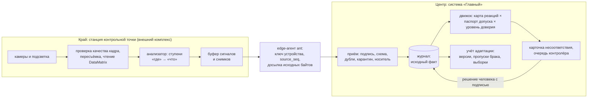

# Проект комплекса «камеры + ИИ» (VisionQC, OperatorVision) и контур адаптации

**Назначение.** Документ описывает целевой комплекс визуального контроля и анализа действий, как его подключает система «Главный», и полный контур адаптации к данным заказчика. Он закрывает кейс §2.1 «Проект комплекса „камеры + ИИ“», §2.2 «Адаптация к данным заказчика», §5.4 «Фото и видео» и требование PRD FR-103.

**Опоры:** PRD FR-14, FR-36…38, FR-97…103, FR-125, FR-126, FR-140, NFR-DOC-2, NFR-UI-3, NFR-UI-4, §11.12; спайн AD-2, AD-3, AD-16, AD-17, AD-18, AD-27, AD-29, AD-41; кейс §1.4, §2.1, §2.2, §2.3, §4.4, §4.5, §5.4; критерии О1, О2/Т6, О3/Т7, Т5.

**Статус.** Проект комплекса — описание; часть системы «Главный» (порты, эмуляторы, контур допуска и отката — эпики 33 и 40) реализована и сверена с кодом `main` на 26.09.2026: что сделано, а что только описано, — [раздел 15](#15-что-реализовано-в-mvp-и-что-только-описано), пути и имена — [«Сверено с кодом»](#сверено-с-кодом).

> **Главное правило документа (NFR-DOC-2, кейс «Что должно работать»).** Все характеристики камер, оптики, освещения, алгоритмов, все числа, пороги и сроки ниже — **проектные предположения, требующие проверки на реальном производстве**. У каждого есть номер `ПП-nn`. Сводный перечень — в [разделе 17](#17-перечень-проектных-предположений). Демонстрационные результаты не являются промышленной валидацией (кейс §5.4).

## Содержание

- [0. Рамка: что делает комплекс, а что — система «Главный»](#0-рамка-что-делает-комплекс-а-что--система-главный)
- [1. Контрольные точки и расположение камер](#1-контрольные-точки-и-расположение-камер)
- [2. Освещение, ракурсы и ограничения наблюдения](#2-освещение-ракурсы-и-ограничения-наблюдения)
- [3. Классы дефектов и способы обнаружения](#3-классы-дефектов-и-способы-обнаружения)
- [4. Сравнение состояния до и после обработки](#4-сравнение-состояния-до-и-после-обработки)
- [5. Идентификация изделия, связь с операцией и исполнителем](#5-идентификация-изделия-связь-с-операцией-и-исполнителем)
- [6. Анализ действий (OperatorVision) и сопоставление с оборудованием](#6-анализ-действий-operatorvision-и-сопоставление-с-оборудованием)
- [7. Распределение обработки: локальный и центральный контур](#7-распределение-обработки-локальный-и-центральный-контур)
- [8. Разрешение, поле зрения, минимальный дефект, частота, задержка, нагрузка](#8-разрешение-поле-зрения-минимальный-дефект-частота-задержка-нагрузка)
- [9. Поведение при плохом изображении, низкой уверенности и потере связи](#9-поведение-при-плохом-изображении-низкой-уверенности-и-потере-связи)
- [10. Формат выходных сигналов](#10-формат-выходных-сигналов)
- [11. Съёмка крупных изделий по зонам](#11-съёмка-крупных-изделий-по-зонам)
- [12. Калибровки и дополнительные средства контроля](#12-калибровки-и-дополнительные-средства-контроля)
- [13. Границы визуального метода](#13-границы-визуального-метода)
- [14. Контур адаптации к данным заказчика](#14-контур-адаптации-к-данным-заказчика)
- [15. Что реализовано в MVP и что только описано](#15-что-реализовано-в-mvp-и-что-только-описано)
- [16. Нормативные опоры и ориентиры](#16-нормативные-опоры-и-ориентиры)
- [17. Перечень проектных предположений](#17-перечень-проектных-предположений)
- [Сверено с кодом](#сверено-с-кодом)

---

## 0. Рамка: что делает комплекс, а что — система «Главный»

Кейс разделяет две вещи, и документ держит это разделение.

1. **Комплекс «камеры + ИИ»** — внешний источник. Он снимает изделие, проверяет качество кадра, выполняет анализ и сообщает результат. В MVP изображения не обрабатываются и собственная CV-модель не обучается: на вход приходят уже подготовленные результаты анализа (кейс §1.4, §2.1, §4.1, §4.5; критерий О3/Т7 «без разработки собственных CV-моделей»). Источник полностью заменяется эмулятором.
2. **Система «Главный»** — цифровой контур учёта и решения. Она принимает сигнал через порт, хранит его как исходный факт, сопоставляет с нормативным слоем (карта контроля, карта реакций, паспорт допуска), ставит защитные реакции, готовит карточку несоответствия, ведёт учёт версий и контура адаптации. **Решение по изделию принимает человек** (AD-27, FR-50).

Принцип, на котором стоит весь проект: **автоматизированный контроль — машина ищет, человек решает**. Термин «автоматизированный», а не «автоматический», — по ГОСТ 16504; по нему же принятие решения не входит в контроль. Отсюда «сигнал ≠ решение» (глоссарий в `prd.md`, §3).

Что это значит на экране и в данных (NFR-UI-3, NFR-UI-4):

| Так | Не так |
|---|---|
| «Обнаружен признак дефекта» | «ИИ нашёл брак» |
| «Уверенность анализатора 0,81 при качестве наблюдения 0,74» | «Вероятность брака 81 %», «точность ИИ» |
| «Оценка невозможна: блик в зоне Z4» | «Годно» |
| «Под подозрением», «заблокировано» | «Брак», «признано дефектным» |
| «Признаки не обнаружены», «признак дефекта» | OK / NOK |
| «Система предложила», «правило применило», «специалист утвердил» | «ИИ решил» |

**Где это в коде.** Модуль `vision` на всех слоях: `backend/internal/domain/vision/` (паспорта допуска, уровни доверия, откат), `backend/internal/application/vision/` (сценарии и порты), `backend/internal/infrastructure/integration/vision/visionqc/` и `.../vision/operatorvision/` (клиенты и stand-ы, то есть эмуляторы кейса, AD-18). Результат контроля как тип записи принадлежит модулю `quality` (семейства `inspection` и `quality`, AD-40), записи о версиях анализатора и паспортах — модулю `vision` (семейство `analyzer`). События оборудования — модуль `machinelogs`. Подробнее о модулях — [architecture.md](architecture.md); о записях и полях — [data-model.md](data-model.md).



---

## 1. Контрольные точки и расположение камер

Кейс §2.1: «расположение камер и назначение контрольных точек». Демо-изделие — фланец люка гермокорпуса в сборе (фланец, кольцо или патрубок, крышка, уплотнение, крепёж). Маршрут: входной контроль → мехобработка → сварка → сборка → испытание на герметичность → окончательный контроль ОТК (PRD FR-104, §11.15).

Правило расстановки: **контрольная точка стоит там, где позже соответствие уже не проверить**, и **до и после операций, где может возникнуть дефект**. Первое — прямая опора ГОСТ Р 58876-2020, п. 8.5.1 m). Второе — наш выбор, чтобы локализовать этап возникновения дефекта (кейс §1.1); ГОСТ его не требует (см. [normative-anchors.md](normative-anchors.md)).

### 1.1. Точки маршрута фланца [ПП-11]

| КТ | Где | Назначение | Что видит камера | Чем дополняется | Размещение и ракурсы |
|---|---|---|---|---|---|
| **КТ-1** | Входной контроль: партия заготовок, кольца, крышки, крепёж | Отделить входной брак от производственного; зафиксировать базовое состояние поверхности | Коррозия, забоины, вмятины, риски, загрязнения, маркировка поставщика, комплектность | Проверка документов поставщика и выписки паспорта (FR-132); выборочно КИМ | Светонепроницаемый бокс; камера сверху + переворот или две камеры; ось ≥ 30° к плоскости зоны [ПП-01] |
| **КТ-2** | До и после мехобработки фланца на станке с ЧПУ | Сравнение «до/после»; новые риски, заусенцы, забоины; подготовка кромок под сварку | Риски, заусенцы на кромках и отверстиях, следы инструмента, вибрационная рябь, забоины | **КИМ** — размеры и допуски; профилометр — шероховатость | Бокс у выгрузки ячейки; **то же приспособление и тот же профиль освещения до и после** |
| **КТ-3** | После сварки фланца с кольцом (и до сварки — подготовка разделки) | Шов W-1: поверхностные несплошности и геометрия | Подрез, брызги, выходящие на поверхность поры и кратеры, форма валика, видимые признаки непровара, поверхностные трещины | **Рентгеновский контроль (РК)** или **УЗК** — внутренние дефекты; журнал сварочного источника (MachineLogs) | Детальная камера и лазерный профилометр вдоль траектории шва (робот или линейная ось) |
| **КТ-4** | После сборки | Крепёж J-1, уплотнение S-1, ориентация деталей, посторонние предметы | Наличие, тип и положение болтов и шайб; ориентация деталей; метки затяжки; открытые посторонние предметы | **Журнал моментного ключа** — момент затяжки визуально не проверяется | Обзорная камера сверху + детальная камера на полость |
| **КТ-4d** | Сборка, **перед закрытием полости** крышкой | Последняя возможность увидеть полость | Посторонние предметы (стружка, крепёж, ветошь), загрязнения (в УФ) | — | Детальная камера, УФ-подсветка; точка «перед закрытием» обязательна, так как после установки крышки полость не видна |
| **Стенд** | Испытание на герметичность | Внутренняя плотность соединений | Камера не применяется | **Течеискатель**; действующая поверка стенда | — |
| **КТ-5** | Окончательный контроль ОТК | Сводка всех методов; повреждения при перемещении | Внешний вид, маркировка, повреждения при транспортировке, загрязнения | Сводка протоколов КИМ, РК/УЗК, стенда | Многоракурсный бокс: 4 камеры + поворотный стол |
| **OV-1** | Рабочие места мехобработки и сборки | «Контроль действий оператора» (OperatorVision) | Шаги операции, их порядок, использование инструмента | Терминал исполнителя, журнал оборудования | Обзор сверху или под углом; лица по возможности вне кадра [ПП-17] |

Нумерация КТ совпадает с описанием процесса фланца (нормативный слой `normative/`, BPMN) и со сценариями S01–S13 (`scenarios/definitions`).

### 1.2. Что это даёт системе

- **Каждая КТ в нормативном слое — «точка контроля» (`inspection_point`)** со своей **картой контроля**: что проверять, каким методом, при каком свете, какие классы дефектов метод видит и какие нет, что делать с результатом (FR-98). В коде слово `checkpoint` занято контрольной точкой журнала, поэтому точка процесса называется `inspection_point` (соглашения спайна).
- **Метод контроля несёт перечень видов дефектов, которые он способен выявить** (FR-14). Если ни один выполненный метод не покрывает вид дефекта, изделие не получает «годно» по этому виду: показывается «не проверено методом, способным выявить».
- **Закрывающие точки (ЗТ)** на КТ-1…КТ-5 — это места, где решение принимает человек с подписью: контролёр ОТК, при необходимости представитель заказчика (ВП/ПЗ). Камера на ЗТ не решает.

---

## 2. Освещение, ракурсы и ограничения наблюдения

Кейс §2.1: «условия освещения, ракурсы и ограничения наблюдения». На металле **освещение важнее разрешения**: блестящие криволинейные поверхности фланца и шва дают блики, а дефекты рельефа видны только при правильной геометрии света.

### 2.1. Условия наблюдения по аналогии с визуальным контролем человеком

Нормы визуального и измерительного контроля сварных соединений задают условия для глаза человека: освещённость не менее 350 лк (рекомендуется 500 лк) и угол зрения не менее 30° к поверхности по ГОСТ Р ИСО 17637; освещённость не менее 500 лк и угол более 30° по РД 03-606-03. ГОСТ Р ИСО 17637 прямо допускает дистанционный контроль камерами, если прямой доступ невозможен. Для камеры переносим это так [ПП-01]:

- оптическая ось камеры отклоняется от плоскости контролируемой зоны не менее чем на 30°;
- внешний свет экранирован, работает только управляемая подсветка;
- для каждой зоны изделия задано, какой камерой и в каком режиме света она снимается (карта покрытия, [раздел 11](#11-съёмка-крупных-изделий-по-зонам)).

### 2.2. Техники освещения для металла

| Техника | Что выявляет на металле | Ограничения | Где применяем [ПП-10] |
|---|---|---|---|
| Светлое поле | Маркировку, наличие и отсутствие деталей | Блики на криволинейных поверхностях | КТ-4, чтение маркировки |
| **Тёмное поле, низкий угол** (скользящий свет 5–30°) | Царапины, риски, вмятины, забоины, кромки: светятся на тёмном фоне | Зависит от ориентации дефекта — нужны 4 азимута | КТ-1, КТ-2, КТ-3, КТ-5 |
| Коаксиальный | Дефекты плоских зеркальных граней | Только плоские участки | Торцы и уплотнительные поверхности фланца |
| **Купол (рассеянный)** | Подавляет блики: коррозия, цвет, загрязнения, прямая маркировка DataMatrix | Скрывает мелкий рельеф — сочетаем с низким углом | Базовый режим на всех КТ |
| Контровой, телецентрический | Силуэт: контур, заусенцы на внешней кромке, 2D-размеры | Только контур | КТ-2, измерительные задачи |
| **Фотометрическое стерео** (4–8 направленных источников) | Карта нормалей: рельеф отделён от бликов и цвета | Время на серию, калибровка направлений | КТ-1, КТ-5 |
| **Лазерная триангуляция** | 3D-профиль: подрез, усиление валика, вмятины, высота заусенца | Калибровка по высоте; зеркальные участки | КТ-3 |
| Поляризация | Убирает зеркальный блик, показывает микроцарапины | Потеря яркости | КТ-5, полированные поверхности |
| **УФ-A (флуоресценция)** | Масло, СОЖ, смазка; индикации капиллярного контроля | Нужны затемнение и защита персонала | КТ-4d перед закрытием полости |

### 2.3. Бокс контроля и профиль освещения [ПП-10]

Проектное решение: **бокс визуального контроля** — светонепроницаемый корпус с приспособлением, в котором изделие базируется по установочным элементам и стоит в воспроизводимом положении. Внутри — купол, кольцо низкого угла на 4 азимута, по необходимости коаксиальный свет и УФ-A; для многоракурсной съёмки — поворотный стол или робот.

Последовательность режимов подсветки — **профиль освещения** (id, версия, хеш параметров: режимы, интенсивности, экспозиции). Профиль входит в карту контроля и в вектор версий каждого наблюдения ([раздел 10](#10-формат-выходных-сигналов)). **Смена профиля — изменение условий наблюдения**: она требует перепроверки анализатора по таблице триггеров ([раздел 14.8](#148-триггеры-повторной-проверки)).

### 2.4. Ограничения наблюдения

- Закрытые полости, обратная сторона шва без доступа, резьба в глубоких отверстиях — **камере не видны**. Для полостей — отдельная точка «перед закрытием» (КТ-4d); для глубоких отверстий — эндоскоп.
- Зона, перекрытая приспособлением, бликом или другой деталью, в сигнале помечается как непроверенная (`zones_not_inspected`); критичная непроверенная зона не может получить «годно» по визуальному каналу [ПП-13].
- Вне области применения анализатора (новый тип изделия, материал, покрытие, профиль освещения, не входящий в паспорт допуска) результат — «оценка невозможна» ([раздел 9](#9-поведение-при-плохом-изображении-низкой-уверенности-и-потере-связи)).

---

## 3. Классы дефектов и способы обнаружения

Кейс §2.1: «классы дефектов и предлагаемые способы их обнаружения». Классы — **классификатор видов дефектов** нормативного слоя (FR-125): код, наименование, класс тяжести по ГОСТ 15467 (критический / значительный / малозначительный), методы, способные выявить вид, признак «измеряемая характеристика». Сигнал с кодом вида, которого нет в классификаторе, принимается как «неизвестный вид» с флагом.

Для визуального канала классификатор дополнительно хранит **видимость** и **требуемый иной метод**. Обозначения: **В** — надёжно видимо при правильной оптике; **Ч** — частично (только открытые или крупные проявления, косвенные признаки); **Н** — визуально не выявляется.

| Код (предварительно) | КТ | Вид дефекта | Видимость | Способ обнаружения | Чем закрывается остальное |
|---|---|---|---|---|---|
| `SURF.SCRATCH` | КТ-1, КТ-2, КТ-5 | Риски, царапины | В | Тёмное поле, поляризация | Глубина — профилометр или 3D |
| `SURF.DENT`, `SURF.NICK` | КТ-1, КТ-5, после перемещения | Вмятины, забоины | В/Ч | Низкий угол, фотометрическое стерео | Глубина — 3D |
| `EDGE.BURR` | КТ-2 | Заусенцы на кромках и отверстиях | В/Ч | Контровой свет, купол, низкий угол | Глубокие отверстия — эндоскоп |
| `SURF.TOOLMARK`, `SURF.CHATTER` | КТ-2 | Следы инструмента, вибрационная рябь | Ч | Низкий угол, стерео | **Шероховатость Ra/Rz — профилометр** |
| `SURF.CORROSION` | КТ-1, КТ-5 | Коррозия, питтинг, цвета побежалости | В | Купол, цвет | Глубина питтинга — нет |
| `SURF.CONTAM` | все | Масло, СОЖ, отпечатки | Ч/В | УФ-флуоресценция | Нефлуоресцирующее — косвенно |
| `SURF.CRACK.OPEN` | КТ-1, КТ-3 | Открытые поверхностные трещины | Ч | Высокое разрешение, тёмное поле | **Закрытые трещины — капиллярный или вихретоковый контроль** |
| `WELD.UNDERCUT` | КТ-3 | Подрез | В (крупный) / Ч | Низкий угол + лазерный профиль | Глубина в мм — откалиброванный 3D |
| `WELD.SPATTER` | КТ-3 | Брызги | В | Купол, тёмное поле | — |
| `WELD.POROSITY.SURF` | КТ-3 | Поры и кратеры, выходящие на поверхность | В | Тёмное поле, 3D | **Внутренняя пористость — РК** |
| `WELD.SHAPE` | КТ-3 | Превышение усиления, вогнутость, смещение кромок, наплывы, прожог | В (геометрия — 3D) | Лазерный профилометр | Приёмка по размерам — только с калибровкой |
| `WELD.LOF.VISIBLE` | КТ-3 | Видимые признаки непровара, незаполненная разделка | Ч | Тёмное поле, 3D, осмотр корня | **Внутреннее несплавление — УЗК или РК** |
| `WELD.CRACK.SURF` | КТ-3 | Поверхностные трещины шва | Ч | Высокое разрешение | Подповерхностные — УЗК, вихретоковый |
| `ASM.FASTENER.MISSING`, `.MISPLACED` | КТ-4 | Нет крепежа, не тот тип, смещение | В | Обзор и сравнение со схемой сборки | **Момент затяжки — журнал ключа** |
| `ASM.WRONG_PART`, `ASM.ORIENTATION` | КТ-4 | Не та деталь, неверная ориентация | В | Обзор, маркировка, эталон | Нужна маркировка компонентов |
| `ASM.FOD` | КТ-4, КТ-4d, КТ-5 | Посторонние предметы | В (открытые) / Н (закрытые полости) | Обзор и детальная камера **до закрытия** | Закрытые полости — только до закрытия |
| `DIM.*` | все | Размеры, допуски формы и расположения | Н без калибровки | Только откалиброванная измерительная система | **КИМ** |
| `INT.*` | КТ-3 | Внутренние дефекты | **Н** | — | **РК, УЗК** |

Классы сварочных несплошностей сопоставляются с группами ISO 6520-1 (трещины, полости, твёрдые включения, несплавления и непровары, нарушения формы, прочие), допустимые размеры — с уровнями качества ISO 5817. Это ориентир для привычной технологу терминологии, а не требование системы.

Коды классов — проектное предложение [ПП-23]; окончательный классификатор входит в нормативный слой (`normative/`) и меняется только новой версией через кворум (FR-22, FR-23).

**Что делает система с классом.** Реакцию выбирает **карта реакций** нормативного слоя (FR-48): по виду дефекта, тяжести, уверенности анализатора и качеству наблюдения. Низкая уверенность при критической тяжести всё равно ведёт к блоку. Пример наполнения — [раздел 9.3](#93-карта-реакций-пример-наполнения-пп-15).

---

## 4. Сравнение состояния до и после обработки

Кейс §2.1: «сравнение состояния до и после обработки»; кейс §2.3 и §5.1: «обнаружение после операции не означает, что дефект создан оператором», сценарии «Входной брак» и «Новый дефект».

### 4.1. Техническая часть (на стороне комплекса) [ПП-12]

- То же приспособление с базированием, реперные метки, **тот же профиль освещения и та же калибровка** до и после.
- Совмещение изображений по реперам или характерным элементам; сравнение **по зонам изделия** (карта зон из КД или условной сборки КОМПАС, `contracts/integrations/cad/assembly.schema.json`), а не по пикселям кадра.
- Итог по зоне (предварительно): `present_before` — дефект был до операции; `new_after` — появился после; `changed` — изменился размер; `not_comparable` — нет базовой линии, другое базирование или плохое качество одного из снимков.

### 4.2. Логика системы (наша ответственность)

Сравнение, которое делает сама система, не зависит от того, умеет ли комплекс сравнивать кадры. Она сравнивает **результаты контроля зоны** во времени (FR-58, AD-29):

1. Для каждого дефекта находится **последнее подтверждённо нормальное наблюдение** той же зоны и **первое наблюдение с дефектом** — **окно возможного возникновения**.
2. Всё, что лежит в окне, — операции, перемещения, действия исполнителей, события оборудования — становится **возможными обстоятельствами**, а не виновниками. Экран «Разбор обстоятельств» показывает их на трёх дорожках: изделие, человек, оборудование (FR-153).
3. Дефект виден уже на КТ-1 или в состоянии «до» на КТ-2 → гипотеза «входной брак / возник раньше»; исполнитель операции с дефектом не связывается (проверка FR-58).
4. Состояния «до» нет или оно `not_comparable` → система явно показывает **нехватку сведений** и не делает категоричного вывода (кейс §2.3, сценарий «Неопределённость»). Нехватка сведений попадает в карту дефицита данных (FR-143).
5. Между двумя КТ было перемещение → в перечне альтернатив есть «повреждение при перемещении» (для MobileOps — событие «отправлено / принято», см. [target-components.md](target-components.md)).

Экран формулирует это как «возможные обстоятельства», не «причина». Гипотезу причины подтверждает человек; ошибку исполнителя — только уполномоченный после письменного объяснения работника (FR-59).

---

## 5. Идентификация изделия, связь с операцией и исполнителем

Кейс §2.1: «идентификация изделия и связь с операцией и оператором»; кейс §4.6: «при ненадёжной идентификации объекта или операции это обозначается явно».

### 5.1. Изделие и носитель идентификатора (AD-16, AD-41)

**ID изделия рождается в системе** при регистрации (`код_предприятия:локальный_id`) и из метки не выводится. Метка — это **носитель**, отдельная сущность: тип, значение, зона по КД, временный или постоянный. QR носителя — `ant:carrier:‹тип›:‹значение›`.

Носители по маршруту фланца [ПП-24]:

| Этап | Носитель | Как считывает камера КТ |
|---|---|---|
| Приёмка, до мехобработки | Бирка или ярлык с QR (временный) | Считыватель или обзорная камера; купол |
| После мехобработки | **Прямая маркировка DPM DataMatrix** на нерабочей поверхности фланца — **проектное предположение: КД разрешает маркировку** | Та же камера КТ; купол или тёмное поле; качество маркировки — по ISO/IEC TR 29158 |
| Крепёж | Тара с ячейками (партия + ячейка) | Контекст поста и тары |
| На посту | Контекст поста (изделие на приспособлении, задание терминала) | — |
| Резерв | Ручной ввод контролёром со сканером | — |

В контракте источника изделие передаётся полем `item_ref` (тип носителя, значение). **Разрешение носителя в изделие делает приём** чистой доменной функцией над реестром носителей на `occurred_at` события (AD-41); результат — `item_id`, основание и **надёжность привязки**. Нечитаемая или неоднозначная метка → событие идёт в межизделийную стадию, которая пишет привязку с кандидатами; **автоматического слияния с историей нет**. Потеря идентификации → «идентификация под сомнением» → изоляция до повторной идентификации человеком с подписью (AD-16). Не снятый временный носитель — задача от контроля полноты.

### 5.2. Операция

`operation_run_id` приходит от MES или терминала исполнителя; повторное выполнение получает новый id со ссылкой на прежнее (`rework_of`, FR-47). Если источник его не дал, **привязку к выполнению операции делает только межизделийная стадия** по оборудованию и интервалу (AD-29, AD-42); edge-агент `operation_run_id` не подставляет.

### 5.3. Исполнитель

Условный `operator_id` — **по входу на рабочее место** (допуск к рабочему месту: СКУД, роль в области места, квалификация, назначение, токен и PIN — AD-15, FR-83). **Не по распознаванию лица.** Персональные данные в событиях не нужны (кейс §4.6).

У каждого факта хранится источник и его надёжность (FR-140): «камера», «ручной ввод», «вывод системы» различаются и видны пометкой в интерфейсе.

---

## 6. Анализ действий (OperatorVision) и сопоставление с оборудованием

Кейс §2.1: «анализ действий и сопоставление с работой оборудования»; кейс §3.2: OperatorVision — «проект анализа действий; в MVP поступают события действий». В интерфейсе модуль называется **«Контроль действий оператора»**.

### 6.1. Что реалистично [ПП-16]

- Распознавание шагов операции и их порядка на фиксированном рабочем месте. В публикациях в контролируемых условиях — порядка 90 % верно распознанных шагов (это ориентир, а не обещание для нашего производства).
- Обнаружение пропущенного шага, нарушения порядка, аномальной длительности, отсутствия инструмента в зоне.
- Сверка «взял крепёж из ячейки N» с ожидаемым составом, если ячейки размечены.

### 6.2. Что нереалистично или недопустимо

- **Установление вины.** Результат — **гипотеза о действии**, «наблюдаемое событие», а не ошибка (FR-126, кейс §2.3). Подтверждённая ошибка исполнителя — только решением уполномоченного после расследования и объяснения работника (ТК РФ ст. 247; FR-59).
- Проверка качества ручной операции по видео (например, затяжки) — для этого инструмент с регистрацией.
- Распознавание лиц, эмоций, усталости, оценка «производительности личности».

### 6.3. Приватность [ПП-17]

- Лица не распознаём; исполнитель определяется по входу на рабочее место.
- На краю из видео извлекается скелетная поза; сырое видео хранится коротко (например, 72 ч) и только вокруг событий-отклонений, с ограниченным доступом.
- Работники уведомляются локальным нормативным актом; места съёмки обозначены. Изображение, по которому устанавливают личность, — биометрические персональные данные (152-ФЗ, ст. 11); мы его так не используем.
- Показатели по исполнителям (кейс §2.4 «подтверждённые ошибки по сопоставимым работам») строятся **только по подтверждённым решениям**, не по сырым сигналам OperatorVision.

### 6.4. Сопоставление с журналами оборудования

MachineLogs — не логгер, а **выделитель значимых событий** (FR-147): что станок делал, чем, как шёл процесс (сводки на окно цикла), отклонения. Сырые данные остаются на краю (AD-29). Сопоставление — по `equipment_id`, выполнению операции и интервалу; часы источников синхронизированы (NTP/PTP), сдвиг оценивается по каждому `source_id` (AD-5).

Пример цепочки для разбора обстоятельств (FR-153):

```text
человек:      ручное изменение подачи 130 %   (терминал или OperatorVision; источник помечен)
оборудование: нагрузка шпинделя выше уставки  (MachineLogs, профиль выполнения операции FR-148)
изделие:      вибрационная рябь в зоне Z2     (VisionQC, КТ-2 «после»)
→ гипотеза причины со ссылками на все три основания; статус «предполагаемая причина»,
  пока технолог не подтвердит
```

Для специального процесса (сварка, FR-151): ток вне уставки во время операции — само по себе нарушение техпроцесса; все изделия окна нарушения получают несоответствие даже без найденного дефекта, решение — комиссией.

---

## 7. Распределение обработки: локальный и центральный контур

Кейс §2.1: «распределение обработки между локальным и центральным контуром»; кейс §3.2: «Edge-агенты и защищённый обмен».

| Функция | Край: станция КТ | Центр: «Главный» | Изолированный контур обучения |
|---|---|---|---|
| Съёмка, управление светом, проверка качества кадра, пересъёмка | ✔ | | |
| Анализ (ступени анализатора), сравнение «до/после» | ✔ | | |
| Локальная индикация: «на ручной осмотр», «в изолятор» | ✔ (только сдерживание) | | |
| Хранение полноразмерных снимков | ✔ (например, 30 суток) [ПП-08] | архив по правилам [раздела 8.5](#85-нагрузка-и-объёмы-пп-08) | |
| Подпись события ключом устройства, `source_seq`, буфер исходных конвертов, досылка | edge-агент `cmd/edge-agent` | | |
| Приём: подпись, схема, дубли, карантин, разрешение носителя | | ✔ `ingest` | |
| Карта реакций, паспорт допуска, уровень доверия → реакции | | ✔ источник истины | |
| История изделия, карточки, решения, подписи, аналитика | | ✔ | |
| Реестры: точки контроля, камеры, калибровки, профили света, анализаторы, пороги, паспорта | | ✔ нормативный слой и справочники | |
| Отбор примеров, учёт разметки и версий наборов | | ✔ учёт | ✔ данные |
| Обучение, проверка кандидата | | учёт результатов | ✔ |
| Доставка допущенной версии на край | | назначение по паспорту | подписанный артефакт |

**Почему так.** Сырые изображения тяжёлые и могут быть режимными; в центр идут только структурированные сигналы и ссылки с хешами. Решение и история — в центре, где журнал, подписи и верификатор. Модель в эксплуатации **заморожена**: онлайн-обучения нет, любое изменение — новая версия через проверку и допуск ([раздел 14](#14-контур-адаптации-к-данным-заказчика)).

**Защищённый обмен.** Край → центр идёт через edge-агент: каждое событие подписано ключом устройства (уровень подписи 0; ключ зарегистрирован актом ввода, FR-70), несёт `source_seq`; приём проверяет подпись, схему и дубли (AD-7, AD-10, AD-11). Передача — TLS 1.3, в промышленной эксплуатации — ГОСТ-TLS через СКЗИ (AD-23). Подробнее — [threat-model.md](threat-model.md).

---

## 8. Разрешение, поле зрения, минимальный дефект, частота, задержка, нагрузка

Кейс §2.1: «предполагаемые разрешение, частота наблюдений, задержка, нагрузка и минимальный размер обнаруживаемого дефекта». **Все значения раздела — проектные предположения.**

### 8.1. Формулы

```text
разрешение на объекте, мм/px = поле зрения (мм) / число пикселей по оси
минимальный обнаруживаемый дефект d_min = мм/px × k
  k = 2–4 px  — классическая обработка (рекомендации производителей машинного зрения)
  k = 3–5 px  — «правило трёх пикселей»
  k = 5–10 px — нейросетевое распознавание
```

Сверх пиксельной арифметики ограничивают: разрешающая способность объектива, глубина резкости (на детальных полях — доли миллиметра: малая апертура, телецентрика или фокус-стекинг), смаз, блики. Тонкие риски в тёмном поле видны и при ширине меньше пикселя (светят рассеянием), но их ширину тогда измерить нельзя [ПП-03]. **«Выявляемый» не значит «надёжно выявляемый»**: надёжность подтверждается статистически при допуске ([раздел 14.5](#145-проверка-кандидата)).

### 8.2. Расчёт по контрольным точкам [ПП-04]

Сенсоры — глобальный затвор, класс 5–25 Мп (например, линейка Sony Pregius S).

| КТ | Камера | Поле зрения, мм | мм/px | d_min при k = 4 | d_min при k = 8 (нейросеть) |
|---|---|---|---|---|---|
| КТ-1 входной, бокс, 2 стороны | 24,5 Мп (5328×4608) | 220×190 | 0,041 | ~0,17 мм | ~0,33 мм |
| КТ-2 до/после мехобработки | 12,4 Мп (4128×3008) | 150×110 | 0,037 | ~0,15 мм | ~0,29 мм |
| КТ-3 шов, детальная камера + лазерный профиль | 12,4 Мп | 40×30 | 0,010 | ~0,04 мм | ~0,08 мм |
| КТ-4 сборка, обзор | 20,2 Мп (4512×4512) | 600×600 | 0,133 | ~0,53 мм | ~1,1 мм |
| КТ-4d полость перед закрытием | 12,4 Мп | 120×90 | 0,029 | ~0,12 мм | ~0,23 мм |
| КТ-5 окончательный, 4 ракурса | 4 × 20,2 Мп | 300×300 | 0,067 | ~0,27 мм | ~0,53 мм |
| OV-1 рабочее место, видео | 4 Мп (2688×1520) | 2000×1130 | ~0,74 | — (руки, инструмент, детали) | — |

Как читать: головка болта M-размера около 7 мм на КТ-4 занимает ~50 px — наличие и отсутствие распознаются уверенно; стружка 0,5 мм на обзорной камере — на пороге, поэтому для посторонних предметов в полости нужна детальная камера КТ-4d.

Минимальный размер по классу и КТ хранится в классификаторе видов дефектов с пометкой «подтверждено / проектное предположение» — пока везде второе.

### 8.3. Частота наблюдений [ПП-05, ПП-06]

- Производство мелкосерийное: такт — минуты и часы на изделие [ПП-05]. **VisionQC работает по событию** (изделие установлено → серия снимков), а не непрерывным видео.
- Серия из 4–8 режимов подсветки занимает ~0,2–0,5 с; кадровая частота сенсоров (16–58 кадров/с при полном разрешении) систему не ограничивает.
- OperatorVision — непрерывный поток 10–15 кадров/с [ПП-06]; этого хватает для шагов длительностью в секунды.

### 8.4. Бюджет задержки [ПП-07]

| Этап | Где | Цель |
|---|---|---|
| Серия снимков (4–8 режимов, 1–2 ракурса) | край | ≤ 0,5 с |
| Проверка качества кадра, чтение DataMatrix | край | ≤ 0,1 с |
| Анализ комплекта | край (вычислитель класса Jetson Orin: 20–100 мс на кадр) | ≤ 1 с |
| Формирование сигнала, подпись edge-агентом, буфер | край | ≤ 0,1 с |
| Доставка в центр по ЛВС | сеть | ≤ 1 с (p95) |
| Приём → запись → свёртка → SSE | центр | ≤ 1 с (бюджет спайна FR-2: приём → запись ≤ 200 мс, свёртка ≤ 500 мс, SSE ≤ 300 мс) |
| **Итого: снимок → карточка в интерфейсе** | | **≤ 5 с (p95)** |

Центральная часть бюджета измеряется метрикой `ant_event_to_sse_seconds` (AD-6). Облачный анализ для закрытого производства неприменим ни по режиму, ни по задержке.

### 8.5. Нагрузка и объёмы [ПП-08]

- Кадр 24,5 Мп монохром 8 бит ≈ 24,5 МБ. КТ-1: 2 стороны × 4 режима = 8 кадров ≈ 200 МБ сырых данных, ~100 МБ со сжатием без потерь. При 40 изделиях в смену — ~4 ГБ на станцию за смену, **хранится на краю**.
- В центр уходят только сигналы (JSON 2–10 КБ) и ссылки на материалы с хешами. Полноразмерные снимки выгружаются в центральное хранилище материалов (`MaterialStore`, адрес = H(байты), шифрование при хранении, AD-23) только для: признаков дефекта, «оценка невозможна», расхождений с контролёром, пропусков брака и случайной выборки 1–2 % [ПП-18].
- Поток в центр в реальном производстве мал: 10 станций × 40 изделий × ~10 событий ≈ 4 000 событий за смену. Масштабирование проверяется нагрузочным генератором на порядки больших объёмов (FR-107, `scenarios/load`) — см. [architecture.md](architecture.md).

---

## 9. Поведение при плохом изображении, низкой уверенности и потере связи

Кейс §2.1: «поведение при плохом изображении, недостаточной уверенности и потере связи»; кейс §1.4 и §4.5: три значения результата, «отсутствие признаков при плохом наблюдении не означает годность».

### 9.1. Три исхода результата контроля (FR-36)

| Исход | Что значит | Что делает система |
|---|---|---|
| **Признаки дефекта обнаружены** | Источник видит что-то похожее на дефект. Это сигнал, а не брак | Сигнал → карта реакций → при необходимости изоляция или блок → черновик карточки → контролёр |
| **Признаки не обнаружены** при достаточном качестве наблюдения | Годится только для видов дефектов, которые метод видит | Метод пройден; остальные методы — по маршруту; «годно» ставит человек на закрывающей точке (или правило режима 2 при уровне доверия 4) |
| **Оценка невозможна** (с кодом причины) | Блик, нерезко, зона перекрыта, код не прочитан, сбой анализатора, вне области применения | Повторный или ручной контроль. **Никогда не «годно»** |

«Не обнаружено» при качестве наблюдения ниже порога карты контроля или при `processing_state` «прервано» / «сбой» система трактует как «оценка невозможна» **в производном представлении**; исходный факт не меняется (AD-2, FR-123). Качество наблюдения и уверенность анализатора — **разные поля**; высокая уверенность на плохом кадре не засчитывается.

### 9.2. Нештатные ситуации [ПП-14]

| Ситуация | Край | Центр «Главный» | Итог для изделия |
|---|---|---|---|
| Плохой кадр: расфокус, пересвет, блик, неверная укладка | Автопересъёмка до N = 2 раз, в том числе другим режимом света; метрики качества — в сигнал | «Оценка невозможна» + коды причин; метрика доли «оценка невозможна» | Ручной осмотр; не «годно» |
| Маркировка не читается | Пересъёмка другим светом; резерв: тара, MES, ручной ввод | Нет надёжного изделия → межизделийная стадия, кандидаты; «идентификация под сомнением» | Изоляция до повторной идентификации человеком |
| Низкая уверенность | — | Карта реакций → ручной осмотр в изоляции | Изоляция до решения |
| Противоречие ракурсов или ступеней | Берётся худший результат | Ручной осмотр | Изоляция |
| Вне области применения анализатора (новый тип изделия, материал, покрытие, профиль света) | «Оценка невозможна», причина «вне области применения» | Ручной осмотр; кандидат в набор данных | Изоляция |
| Неполное покрытие зон | `zones_not_inspected` | Критичные зоны → ручной осмотр; контроль полноты (FR-35) | По зонам |
| **Потеря связи с центром** | Работа продолжается; edge-агент хранит **исходные байты подписанных конвертов** с `source_seq` и исходным `occurred_at`; на табло станции — «результат не зарегистрирован в центре»; изделия с признаком дефекта или «оценка невозможна» физически уходят в изолятор по локальной индикации | После восстановления — досылка пачками; дубли гасятся по `source_id + event_id`; порядок в пределах изделия восстанавливается (`occurred_at` → `received_at` → `event_id`); `received_at` ставит центр; пропуск в `source_seq` даёт «потерю данных источника» только после окна ожидания | Решение по изделию — после регистрации в центре (FR-39, AD-5, AD-7) |
| Однонаправленный канал (диод данных) | Досылка без ожидания ответа | Подтверждения — асинхронными событиями | — |
| Отказ камеры, анализатора или света | Станция переходит в режим «только ручной контроль» | Все проверки на КТ — ручные, источник «человек» | В истории видно, что контроль ручной |
| Истекла калибровка или профиль света изменён без допуска | Станция «с ограничениями» | Сигналы принимаются с флагом; размеры — оценка, не измерение | Ручное подтверждение |
| Расхождение часов | Синхронизация NTP/PTP | Сдвиг выше порога → флаг «время источника ненадёжно» (FR-33) | Порядок в пределах источника — по `source_seq` |

Позднее событие (связь с краем КТ-3 пропала, наблюдение пришло после событий сборки) не меняет исходных записей: вывод пересчитывается новой версией с пометкой «пересмотрен из-за события ‹id›»; подписанное решение не отменяется, а получает метку «решение принято до новых данных — пересмотрите» и задачу автору (FR-32, AD-5).

### 9.3. Карта реакций: пример наполнения [ПП-15]

Вход: вид дефекта (с тяжестью по классификатору) × уверенность × качество наблюдения × критичность зоны × **уровень доверия паспорта допуска** (AD-29). Выход: пропуск к следующему контролю / ручной осмотр в изоляции / изоляция с блоком + пояснение человеку. **Автоматического «брака» и автоматического списания нет** (AD-27).

| Условие | Реакция | Пояснение в карточке |
|---|---|---|
| Качество ниже порога, вне области применения, критичная зона не покрыта | Ручной осмотр в изоляции | «Оценка невозможна: ‹причины›. Нужен ручной осмотр» |
| Критический вид (трещиноподобный признак, посторонний предмет в полости, нет крепежа), уверенность ≥ c_low | Изоляция и блок | «Признак критического дефекта; изделие изолировано до решения контролёра» |
| Критический вид, уверенность < c_low | Ручной осмотр в изоляции | «Слабый признак критического дефекта» — низкая уверенность при критической тяжести всё равно не пропускается (FR-48) |
| Трещиноподобный признак на ответственной детали | Изоляция + предложение «назначить капиллярный или вихретоковый контроль» | «Визуальный метод не подтверждает и не исключает трещину» |
| Значительный вид, уверенность ≥ c_high | Изоляция | — |
| Значительный вид, c_low ≤ уверенность < c_high | Ручной осмотр в изоляции | — |
| Малозначительный вид в нефункциональной зоне | Ручной осмотр или пропуск с записью — по настройке зоны | — |
| Признаков нет, качество ≥ Q_min, покрытие полное, в области применения | Пропуск к следующему контролю **только по визуальным видам** | «Визуальных признаков нет; иные виды контроля — по маршруту» |
| Сигнал без требования КД | Вопрос технологу | Нет требования — это вопрос инженерам, а не брак (FR-48) |

Пороги Q_min, c_low, c_high определяются при проверке анализатора и версионируются **отдельно от анализатора** (профиль порогов). Карта реакций — часть нормативного слоя с режимами автоматизации и владельцем правила (AD-3), меняется только новой версией через кворум. Выборочную перепроверку части пропущенных изделий человеком задаёт карта контроля (FR-48).

---

## 10. Формат выходных сигналов

Кейс §2.1: «формат выходных сигналов»; кейс §4.4 — рекомендуемый состав сигнала; §4.7 — версия контракта не смешивается с версией анализатора и приложения.

### 10.1. Принципы

- **Один общий тип «результат контроля» для всех методов** (камера, КИМ, РК, УЗК, стенд, человек) с полем метода (FR-36). Новый датчик подключается без изменения процесса качества.
- **Сигнал VisionQC — цепочка ступеней** анализатора (локализация места → классификация вида), у каждой своя версия и уверенность (FR-38). Рекомендация анализатора — только совет; реакцию выбирает карта реакций.
- **Уверенность анализатора и качество наблюдения — раздельно.**
- **Вектор версий на каждом наблюдении** (AD-29, FR-98): ревизия изделия, карта контроля, камера, калибровка, анализатор, профиль порогов, контракт, приложение. Ответ анализатора и ответ эксперта хранятся раздельно.
- **Числа без плавающей точки** (AD-4): уверенность и доли — фиксированная точка в базисных пунктах (`*_bp`, 0…10000); размеры — целое + единица + масштаб.
- **Время** — RFC 3339 UTC, ровно три знака после секунд. `received_at` и `recorded_at` ставит только ядро.
- **Изделие** в контракте источника — `item_ref` (тип носителя, значение); внутренний `item_id` появляется после разрешения носителя (AD-16, AD-41).
- `processing_state` — «выполнено / прервано / сбой» по образцу OPC UA Machine Vision; «прервано» и «сбой» дают «оценка невозможна».
- `evidence_refs` **необязательны**. Нет материала — интерфейс пишет «материал отсутствует» и не показывает фиктивное доказательство (кейс §5.4). Хеш позволяет проверить, что материал не подменён.

### 10.2. Пример сигнала VisionQC

Схема — `contracts/events/inspection/inspection.result.recorded.v1.json` (каталог — `contracts/events/catalog.yaml`, AD-40; эталонные сообщения внешнего контракта — `contracts/integrations/vision/visionqc/`). Имя типа результата не кодирует (`recorded`, а не `failed`). Пример показывает payload внутри подписанного конверта DSSE (AD-10); конверт подписывает edge-агент ключом устройства.

```json
{
  "event_id": "0192f3a1-7c2e-7b8a-9d10-3f4e5a6b7c8d",
  "event_type": "inspection.result.recorded",
  "schema_version": 1,
  "source_id": "edge-kt2-cell3",
  "source_seq": 18342,
  "occurred_at": "2026-09-25T10:15:42.120Z",
  "correlation_id": "0192f3a0-0000-7000-8000-000000000001",
  "causation_id": null,
  "source_kind": "camera",
  "item_ref": { "carrier_type": "dpm_datamatrix", "value": "FL100-000123" },
  "item_type_id": "FL-100.00.000",
  "line_id": "L1",
  "station_id": "ST-MILL-3",
  "inspection_point_id": "KT-2",
  "phase": "after_operation",
  "operation_run_id": "OPR-777-2",
  "operator_id": null,
  "equipment_id": "CNC-3",
  "inspection_method": "camera",
  "processing_state": "completed",
  "inspection_result": "defect_found",
  "observation_quality": {
    "score_bp": 7400,
    "reasons": ["glare_zone_Z4"],
    "retake_count": 1
  },
  "coverage": { "zones_inspected": ["Z1", "Z2", "Z3"], "zones_not_inspected": ["Z4"] },
  "stages": [
    { "stage": "localize", "analyzer_version": "surf-loc 1.4.0", "confidence_bp": 8800 },
    { "stage": "classify", "analyzer_version": "surf-cls 2.1.0", "confidence_bp": 8100 }
  ],
  "defects": [
    {
      "defect_type": "SURF.SCRATCH",
      "zone_id": "Z2",
      "component_id": null,
      "location": { "unit": "mm", "scale": 1, "bbox": [121, 403, 32, 4] },
      "size": { "value": 32, "unit": "mm", "scale": 1, "measurable": false },
      "severity_hint": "minor",
      "confidence_bp": 8100,
      "comparison": "new_after",
      "evidence_idx": [0]
    }
  ],
  "limitations": ["zone_Z4_not_inspected"],
  "versions": {
    "item_revision": "Б",
    "recipe_ref": "KT-2-MILL@3",
    "camera_config": "CAM-17@2",
    "lighting_profile": "LP-KT2@3",
    "calibration_id": "CAL-ST-MILL-3-2026-09-01",
    "analyzer_version": "visionqc-pipeline 2.3.1",
    "thresholds_profile": "TH-KT2@7",
    "deployment_mode": "active",
    "app_version": "edge 1.8.0"
  },
  "evidence_refs": [
    {
      "material_ref": "streebog256:…",
      "captured_at": "2026-09-25T10:15:41.900Z",
      "camera_id": "CAM-17",
      "lighting_mode": "darkfield_N",
      "media_type": "image/png",
      "available_centrally": false
    }
  ]
}
```

Пояснения:

- `size.value = 32` при `scale = 1` означает 3,2 мм (целое × 10^-scale). `measurable: false` — размер оценён без действующей калибровки: это оценка, а не измерение, и основанием приёмки по допуску он быть не может [ПП-02].
- **Один физический дефект — ключ (изделие, зона и место) без вида дефекта** в пределах выполнения операции или до следующей (FR-37, соглашения спайна). Повторные наблюдения с другой камеры или следующей КТ не увеличивают число дефектов; уточнение вида обновляет вид, а не создаёт новый дефект.
- Уверенность и пороги имеют смысл только вместе с версией анализатора и профиля порогов: одинаковые 0,81 у разных версий несравнимы.
- Версия контракта (`schema_version`) ≠ версия анализатора ≠ версия приложения (кейс §4.7). Поведение при неизвестной версии, новом поле, отсутствии обязательного поля, неизвестном значении перечисления и несовместимом изменении — общее для всех событий (AD-20, [data-model.md](data-model.md)). Неизвестный вид дефекта — «неизвестный вид» с флагом (FR-125).

### 10.3. Сигнал OperatorVision

Отдельный тип семейства `operator` (владелец схемы — `access`, AD-40), — `operator.action.observed` (`contracts/events/catalog.yaml`): вид действия, шаг техпроцесса (`step_key` из версии процесса), начало и конец, отклонение ∈ {пропущен шаг, нарушен порядок, лишний шаг, аномальная длительность, инструмент не обнаружен, нет}, `confidence_bp`, качество наблюдения, `operator_id` из допуска к рабочему месту, `evidence_refs` (по умолчанию ссылка на скелетную последовательность, а не на видео). Это **гипотеза о действии**: запись — факт источника с `source_kind` «камера», а не решение.

### 10.4. Записи контура допуска (семейство `analyzer`, модуль `vision`)

Типы в каталоге: `analyzer.check.recorded` (отчёт проверки: эталонный набор, контроль дрейфа, расхождения с людьми), `analyzer.passport.admitted` (допуск — паспорт с маршрутом подписей, AD-12, AD-13), `analyzer.passport.suspended` (приостановка — реакция автоотката, режим 2), `analyzer.passport.reinstated` (возврат в работу — решение начальника ОТК), `analyzer.passport.retired` (вывод из эксплуатации). Пропуск брака отдельного типа не имеет: он выводится из поздней находки и ранних наблюдений «признаков нет» (`domain/vision.RecheckList`). Теневой режим на потоке — описание. Таблица «уровень доверия → допустимые действия» — `contracts/analyzer-trust-levels.yaml` (проверка `TestTrustTableMatchesContract`), паспорта демо — `normative/vision/analyzer-passports.v1.yaml`.

---

## 11. Съёмка крупных изделий по зонам

Кейс §2.1 требует описать съёмку изделий, которые не помещаются в одно поле зрения.

- **Карта зон изделия.** У каждого типа изделия — перечень зон: поверхности, швы (участки шва W-1), полости, крепёжные позиции (J-1), уплотнения (S-1); у каждой зоны — критичность. Зоны приходят из КД или условной сборки КОМПАС (`contracts/integrations/cad/assembly.schema.json`; `geometry: null` — геометрии в MVP нет) и хранятся в нормативном слое. К зоне привязываются контроль, доработки, скрытые работы и вмешательства (FR-46).
- **Карта покрытия.** Для каждой КТ задано, какие зоны какими камерами и в каком режиме света снимаются. Сигнал сообщает `zones_inspected` и `zones_not_inspected`.
- **Способы съёмки** [ПП-25]: поворотный стол и несколько камер (КТ-5); линейная ось или робот с детальной камерой вдоль шва (КТ-3); для изделий крупнее бокса — **мобильная камера** на манипуляторе или роботе, которая снимает изделие по зонам с записью позиции.
- **Мобильная камера — источник MobileOps.** Её наблюдения идут через edge-агент на беспроводном канале, с позицией и зоной, чтобы кадр связывался с зоной изделия; при потере связи — досылка с исходным временем. Роботу система даёт только задачи сдерживания и перемещения, никогда — выпуск. Подробнее — [target-components.md](target-components.md).
- **Правило полноты.** Изделие не получает «годно» по визуальному каналу, пока все критичные зоны карты покрытия не проверены [ПП-13]. Непокрытая зона — «оценка невозможна» по этой зоне и задача от контроля полноты (FR-35).

---

## 12. Калибровки и дополнительные средства контроля

Кейс §2.1: «для измерения размеров, проверки допусков и качества соединений необходимо указать требуемые калибровки и дополнительные средства контроля».

| Задача | Минимально необходимое средство | Калибровка и подтверждение [ПП-26] |
|---|---|---|
| Линейные размеры 2D (контур, отверстия) | Телецентрический объектив + телецентрический контровой свет | Внутренняя калибровка камеры (дисторсия), масштаб «пиксель → мм» по аттестованной мере (калибровочная пластина), термостабилизация, периодическая проверка, анализ измерительной системы (Gage R&R) |
| Геометрия шва (усиление, подрез, смещение кромок) | Лазерный профилометр | Калибровка по ступенчатой мере высоты; погрешность по высоте; эталонные образцы швов |
| Отклонения формы и расположения, 3D-размеры фланца | **КИМ** (координатно-измерительная машина), оптическая КИМ | Поверка; для оптических КИМ — приёмка и перепроверка по ISO 10360-7 |
| Шероховатость | Профилометр | Поверка |
| Внутреннее качество шва W-1 | **РК** или **УЗК** (для плоскостных несплавлений УЗК обычно эффективнее) | Аттестованная методика и персонал, образцы с дефектами |
| Трещины на ответственных деталях | Капиллярный или вихретоковый контроль | Демонстрация выявляемости на образцах |
| Затяжка болтов J-1 | **Моментный ключ с регистрацией** | Поверка ключей; журнал — в MachineLogs как событие оборудования |
| Герметичность сборки | **Течеискатель** на стенде | Действующая поверка стенда — предусловие операции (FR-17) |
| Равномерность освещения | Эталонная мишень | Проверка при каждой смене профиля освещения |

Как система это использует:

- **Калибровка — запись справочника со сроком действия** (оборудование с поверкой — версионируемый справочник `reference`, AD-31). Предусловия операции проверяются на дату операции: истёкшая поверка блокирует операцию или даёт нарушение с записью (FR-17).
- Истёкшая калибровка переводит станцию в режим «с ограничениями»: сигналы принимаются, размеры помечаются как оценка (`measurable: false`), администратор получает уведомление [ПП-02].
- Если средство оказалось непригодным, **прежние результаты пересматриваются** — система находит все наблюдения, сделанные с этой калибровкой или этой версией анализатора (опора — ГОСТ Р 58876-2020, п. 7.1.5.2; механизм — [раздел 14.7](#147-пропуск-брака-fr-100)).
- Станция допускается как **связка**: камера + объектив + свет + калибровка + ПО + анализатор + пороги. Допуск по аналогии с квалификацией средств контроля: установка, функционирование, работа в реальных условиях.

---

## 13. Границы визуального метода

Кейс §2.1: «границы визуального метода должны быть раскрыты».

1. **Камера видит только поверхность.** Надёжно — открытые признаки: забоины, риски, вмятины, заусенцы, коррозия, выходящая на поверхность пористость, подрезы, брызги, незаполнение разделки, отсутствие или смещение крепежа, открытые посторонние предметы, загрязнения (в УФ).
2. **Камера не видит:** внутренние дефекты шва (непровар корня, внутренняя пористость, шлаковые включения, внутренние трещины), подповерхностные дефекты, закрытые усталостные трещины без пенетранта, закрытые полости после установки крышки, момент затяжки, герметичность.
3. **Камера не измеряет без калибровки:** размеры, допуски формы и расположения, глубину царапины и подреза, шероховатость.
4. **Следствие для системы: «признаки не обнаружены» по визуальному каналу ≠ «изделие годно».** Итог по изделию складывается из всех назначенных методов; метод, не покрывающий вид дефекта, не даёт годности по нему (FR-14). Решение «годно» на закрывающей точке ставит человек.
5. **Уверенность анализатора — не вероятность брака** (NFR-UI-4); «под подозрением» — не «брак».
6. **Выявляемый ≠ надёжно выявляемый.** Надёжность по критичным видам подтверждается статистически при допуске, для каждого вида отдельно ([раздел 14.5](#145-проверка-кандидата)).
7. **Условия применимости.** Анализатор допускается для конкретной карты контроля: изделие и ревизия, операция, точка, камера, свет, калибровка, классы. За пределами — «оценка невозможна» и ручной контроль.
8. **Для критичных процессов** отраслевой стандарт предусматривает двойной или тройной независимый контроль, в том числе с фото- и видеорегистрацией **при необходимости** (ГОСТ Р 58633-2020, п. 7.2). Визуальный канал — одна из линий этого контроля, а не замена остальных.

---

## 14. Контур адаптации к данным заказчика

Кейс §2.2: «полный контур адаптации: сбор данных, разметка или подтверждение специалистом, обучение или настройка, проверка, версионность, допуск к эксплуатации и возврат к предыдущей версии; какие действия автоматизируются, а какие требуют решения человека». PRD FR-98…101; спайн AD-29.

### 14.1. Принципы

- **Система ведёт учёт, но не обучает модель.** Обучение — во внешнем изолированном контуре; в «Главном» — реестр версий, паспорта допуска, размеченные примеры из решений, пропуски брака, выборки для перепроверки.
- **Анализатор в эксплуатации заморожен.** Онлайн-обучения нет. «Самообучение» в терминах кейса — периодическая новая версия через проверку, допуск и возможный откат.
- **Допускается не модель, а конфигурация контура контроля**: изделие и ревизия + операция + точка + камера + свет + калибровка + карта контроля + версия анализатора + профиль порогов + классы (FR-98).
- **Нехватка дефектных данных — норма закрытого производства.** Практичный «холодный старт» — обнаружение аномалий, обученное только на годных изделиях (десятки–сотни снимков); классификатор видов дообучается по мере накопления подтверждённых случаев, при необходимости — на искусственно нанесённых дефектах [ПП-27].
- **Автоматика ограничивает, но не разрешает** (AD-27): откат в сторону строгости — автоматически по делегированному правилу; возврат в работу — только человек.

```mermaid
flowchart LR
  A["1. Сбор кандидатов:<br/>«оценка невозможна», низкая уверенность,<br/>расхождения с контролёром,<br/>пропуски брака, случайная выборка"] --> B["2. Подтверждение специалистом:<br/>решение контролёра = метка"]
  B --> C["3. Версия набора данных<br/>(вне «Главного» — данные, в «Главном» — учёт)"]
  C --> D["4. Обучение или настройка<br/>(изолированный контур)"]
  D --> E["5. Проверка:<br/>экзамен, эталонный набор,<br/>сравнение с людьми и прошлой версией"]
  E --> F["6. Теневой режим → пилот"]
  F --> G["7. Допуск: паспорт допуска<br/>карты контроля, маршрут подписей"]
  G --> H["8. Эксплуатация и мониторинг"]
  H -->|"дрейф, провал эталона,<br/>рост расхождений, пропуск брака"| I["9. Автооткат в сторону строгости<br/>(режим 2): паспорт приостановлен"]
  I -->|"решение начальника ОТК"| H
  H --> A
```



### 14.2. Сбор и подтверждение специалистом

- **Источники кандидатов:** «оценка невозможна» и низкая уверенность; **расхождение анализатора и контролёра** (ложная отбраковка или пропуск); **пропуски брака**, найденные ниже по потоку; случайная выборка «годных» 1–2 % [ПП-18]; новые типы изделий, смена профиля освещения.
- **Размеченные примеры из решений** (FR-99): подтверждённое решение контролёра (вид, зона, итог) — подписанная метка со ссылкой на наблюдение и материалы. Ответ анализатора и ответ эксперта хранятся раздельно.
- **Эталонный (проверочный) набор** — двойная слепая разметка экспертами (эксперт не видит вывода анализатора, чтобы не было автоматизационной предвзятости), арбитраж расхождений; набор заморожен и в обучении не используется. Спорные случаи из работы после решения эксперта попадают в проверочный набор следующей версии.
- Разбиение данных — по экземплярам изделий, партиям и времени, без утечки одного изделия в обучение и проверку.

### 14.3. Обучение и настройка

Во внешнем изолированном контуре, в закрытом контуре предприятия. На выходе — кандидат анализатора, описание (карточка модели) и предложенные пороги. В «Главном» фиксируются только метаданные: набор данных, версия кода, хеш артефакта.

### 14.4. Версионность — что не смешивать

| Версия | Что это | Где хранится |
|---|---|---|
| версия контракта (`schema_version`) | формат сигнала | `contracts/events` |
| версия анализатора | конвейер внешнего модуля, ступени | реестр `vision`, в каждом наблюдении |
| профиль порогов | пороги по видам | реестр `vision`, в каждом наблюдении |
| карта контроля | что и как проверять на точке | нормативный слой, закрепляется при запуске изделия |
| профиль освещения, конфигурация камеры, калибровка | условия наблюдения | справочники, в каждом наблюдении |
| карта реакций | что делать с сигналом | нормативный слой, кворум |
| набор данных | на чём обучено и проверено | учёт адаптации |
| версия приложения | сборка `ant` и edge-агента | в наблюдении; `domain_build` в журнале |

Проверка: **по наблюдению годичной давности восстанавливается, какими версиями и почему изделие признано подозрительным** (FR-98).

### 14.5. Проверка кандидата

Вариант «экзамен + теневой режим + пилот» (FR-101). Критерии задаются **до** испытаний.

- **Экзамен:** скрытая проверочная выборка и эталонный набор; метрики по каждому виду дефекта и по срезам (КТ, профиль света, тип изделия); устойчивость (блик, расфокус, смещение); сравнение с людьми и с действующей версией — **нет ухудшения ни по одному критическому виду**.
- **Ориентиры [ПП-20]:** атрибутивный анализ согласия по AIAG MSA — эффективность ≥ 90 %, пропуск брака < 2 %, ложные тревоги < 5 %, каппа > 0,75; для критических видов — демонстрация без пропусков: 29 дефектных образцов подряд дают 90 % выявляемости при 95 % доверия, 59 — 95/95, 299 — 99/95 (`n = ln(1 − C) / ln(R)`). Это **ориентиры, а не обещание**: окончательные критерии согласуются с ОТК и держателем КД.
- **Доля ложной отбраковки** и **доля «оценка невозможна»** — не выше значений, согласованных с ОТК: они определяют нагрузку на контролёров.
- **Теневой режим** на одной контрольной точке: кандидат работает параллельно, его выводы пишутся (уровень доверия 0 — только запись), но не влияют на решения; все расхождения с действующей версией — на просмотр. Длительность — N изделий или недель [ПП-19]. Затем **пилот** на одной станции.

### 14.6. Допуск к эксплуатации: паспорт допуска и уровни доверия

**Паспорт допуска карты контроля** (FR-98) — документ нормативного слоя с маршрутом подписей (AD-12, AD-13): номер; изделие и ревизия; операция; точка; метод; классы; камера; калибровка; карта контроля; анализатор; проверочный набор; подтверждённые возможности и известные ограничения; поведение при плохом кадре (→ ручной контроль); **разрешённые и запрещённые автоматические действия** (запрещены окончательный выпуск, «ремонт», «как есть»); кто и когда утвердил; предыдущая допущенная версия для отката. Нет паспорта — «для этой карты контроля нет допущенного анализатора» → ручной контроль.

**Маршрут подписей паспорта** (каталог документов спайна): начальник ОТК + технолог + метролог (согласующий); при изменении ТП или КД — дополнительно представитель заказчика (ВП/ПЗ) и держатель КД (FR-136). Уровень подписи 2. Допущенная версия заморожена.

**Уровни доверия паспорта → допустимые автоматические действия** (AD-29; таблица — в `contracts`):

| Уровень | Что анализатор может сам | Соответствие режимам FR-50 |
|---|---|---|
| 0 | Только запись наблюдения (тень) | — |
| 1 | Рекомендация: задача контролёру | 1 |
| 2 | «Под подозрением» и предложение доп. контроля | 1 |
| 3 | Дополнительно — блок и изоляция | 1 (защитные действия) |
| 4 | Дополнительно — пропуск уверенных «признаки не обнаружены» по правилу | 2 (явно делегированное правило) |

Реакция допустима, только если её разрешают **одновременно** класс действия (AD-27), режим правила и уровень доверия паспорта (AD-3). Верификатор проверяет, что ни одна реакция не превысила ни одно из трёх ограничений (AD-9).

**Что закрепляется, а что действует на момент операции** (AD-17): карта контроля и карта реакций закрепляются при запуске изделия; **статус паспорта допуска действует на `occurred_at`**, и приостановка паспорта сильнее закреплённой версии.

### 14.7. Эксплуатация, мониторинг, откат и пропуск брака

**Мониторинг — четыре слоя** [ПП-21]: камера, калибровка и качество кадра; входные данные (дрейф); анализатор (рост «оценка невозможна», расхождения с людьми, ложные тревоги, пропуски); производственный эффект (задержка обнаружения, переделки, пропуски контроля).

**Откат** (FR-101):

- Триггеры: дрейф, провал эталонного набора, рост расхождений с людьми, пропуск брака.
- Выполняется **автоматически в сторону строгости** — к предыдущей допущенной версии или к 100 % ручному контролю — как **явно делегированное правило режима 2** с записью в журнале и уведомлением. Это защитное действие (AD-27).
- Паспорт получает статус «приостановлен»; действует предыдущий допущенный. **Откат меняет будущее, а не историю**: старые наблюдения сохраняют пометку «проанализировано версией …».
- **Вернуть анализатор в работу — только решением пользователя с полномочием начальника ОТК** (разрешающее действие, документ «Возврат анализатора в работу после отката», уровень подписи 2).
- Критерии заданы до испытаний и не меняются по ходу (`backend/internal/domain/vision/rollback.go`): дрейф — три наблюдения подряд с качеством кадра ниже 0,70 при ответе анализатора; провал эталонного набора; доля расхождений с людьми в отчёте проверки выше 20 %; пропуск брака. Что действует вместо приостановленного паспорта — прежний паспорт (`previous_passport`) или ручной контроль (`manual_control`).
- Правило исполняет роль `projector` (глобальный потребитель журнала, одна копия-лидер; `backend/internal/application/vision/rollback.go`); прогон сценария не трогает живую работу (своё `run_id`, AD-38); задачу начальнику ОТК ставит модуль `notifications`.
- Проверка MVP: на пульте тестовых сценариев кнопка цифрового стенда «Сменить свет на камере» — три кадра подряд с качеством 0,55, анализатор по-прежнему отвечает «признаков нет» → дрейф → паспорт приостановлен, контроль ручной, начальнику ОТК — задача; возврат без его решения невозможен. Тесты: `TestRollbackDrift`, `TestRollbackReferenceSet`, `TestRollbackEscape` (`backend/internal/domain/vision/rollback_test.go`), гарды возврата — `TestGuards`.

<a id="147-пропуск-брака-fr-100"></a>**Пропуск брака** (FR-100):

1. Дефект найден ниже по потоку (следующая КТ, РК, сборка, стенд, заказчик).
2. Система связывает его с ранними наблюдениями «признаки не обнаружены» той же зоны и фиксирует их версии: анализатор, пороги, профиль освещения, калибровка, покрытие.
3. Человек классифицирует причину пропуска: зона не покрывалась / дефект меньше d_min / метод визуально неприменим / промах анализатора / порог / карта реакций / решение контролёра / **дефект возник позже** (тогда это не пропуск, а новый дефект — не смешивать) / сведений недостаточно.
4. Выходы: пример в набор данных; метрика пропусков по КТ и версии; **список всех изделий, проверенных той же версией с «признаки не обнаружены» по этому виду или зоне, — на перепроверку**. Это защитная реакция (расширение области риска); сузить её можно только с основанием.
5. Если метод пропустившей точки в принципе не способен выявить этот вид дефекта, это не ошибка модели: перепроверка по версии не назначается (экран показывает «метод не видит этот вид»).

**Где это видно.** Страница «Адаптация VisionQC» (`frontend/src/widgets/vision-adaptation/`) — на столе начальника ОТК (`normative/desks/head_of_qc.yaml`) и администратора: «Анализаторы и паспорта допуска» (версия, карта контроля, уровень доверия 0–4, статус, контроль дрейфа), «Пропуски брака» (поздняя находка, ранние «признаков нет», изделия на перепроверку), «Размеченные примеры» (ответ анализатора и ответ эксперта раздельно). По любому давнему наблюдению — объяснение «какими версиями и почему» с паспортом, действовавшим тогда (`domain/vision.Explain`, FR-98). Проверки — `TestRecheckList`, `TestExplain`.

### 14.8. Триггеры повторной проверки

Таблица «изменение → что перепроверять» (addendum PRD, A18) — **данные нормативного слоя**, а не код; её меняет кворум.

| Изменение | Что перепроверять |
|---|---|
| Подпись в интерфейсе | Ничего |
| Необязательное поле события | Проверка контракта (`make check`) |
| Сервер без изменения анализа | Регрессия (сверка сценариев) |
| Порог | Повторная проверка |
| Новая версия анализатора | Экзамен |
| Сдвиг камеры или смена объектива | Калибровка + проверка |
| Новый свет (профиль освещения) | Проверка |
| Новая ревизия изделия | Анализ влияния |
| Новый вид дефекта | Новая проверка |
| Новая операция | Новая карта контроля |

Плюс плановая периодическая проверка и выход доли «оценка невозможна» или расхождений за пределы [ПП-21].

### 14.9. Что автоматизировано, а что решает человек

| Автоматически | Только человек (с подписью) |
|---|---|
| Отбор кандидатов в набор данных, дедупликация | Включение закрытых данных в набор |
| Предразметка (кроме эталонного набора) | Метки эталонного набора и арбитраж |
| Сборка манифеста версии набора | Утверждение версии набора |
| Обучение и расчёт метрик (внешний контур) | Допуск анализатора и порогов — паспорт допуска по маршруту |
| Теневой прогон и сравнение | Изменение карты контроля и карты реакций — кворум |
| Мониторинг дрейфа, уведомления | Решение о переобучении |
| **Откат в сторону строгости** по делегированному правилу (режим 2) | **Возврат в работу после отката** — начальник ОТК |
| Список изделий на перепроверку после пропуска брака | Классификация причины пропуска; решение о перепроверке и уведомлении получателя |
| Изоляция и блок по уровню доверия 3 | Решение по изделию: переделка, ремонт, «как есть», списать, вернуть поставщику |

### 14.10. Метрики эффективности контроля

Раздельно для дефектов и изделий с дефектами (кейс §5.2); входной брак, проблемы оборудования, ошибки исполнителей и гипотезы — раздельно (кейс §2.4).

| Метрика | Определение | Срез |
|---|---|---|
| Доля пропусков брака по КТ | пропуски, отнесённые к КТ / (дефекты, найденные на КТ + пропуски КТ) | КТ, вид, версия, период |
| Полнота по виду | найдено / (найдено + пропущено) | вид, КТ, версия |
| Доля ложной отбраковки | изделия, изолированные по сигналу и признанные контролёром соответствующими / проверенные | КТ, вид, версия |
| Доля «оценка невозможна» | «оценка невозможна» / все наблюдения | КТ, причина |
| Доля пересъёмок | наблюдения с пересъёмкой / все | КТ |
| Согласие анализатора и контролёра | каппа Коэна по слепой выборке | КТ, вид |
| Прохождение контроля с первого раза | изделия без подтверждённых несоответствий и доработки / начатые | участок, период |
| Задержка обнаружения | первое обнаружение − оценка момента возникновения (происхождение: «вычислено системой») | КТ, вид |
| Задержка доставки сигнала | `received_at − occurred_at` | источник |
| Покрытие зон | проверенные критичные зоны / требуемые | КТ, тип изделия |

Показатели строятся из строк вклада изделия и раскрываются до исходных записей (AD-45).

---

## 15. Что реализовано в MVP и что только описано

| Часть | В MVP | Эпик | Где в коде (по дереву спайна) |
|---|---|---|---|
| Порт VisionQC; эмулятор-адаптер (stand), отдающий готовые результаты ступеней через edge-агент | Реализовано | 33 | `backend/internal/application/vision/`, `backend/internal/infrastructure/integration/vision/visionqc/stand/`, `cmd/edge-agent` |
| Порт OperatorVision («Контроль действий оператора»); эмулятор событий действий | Реализовано | 33 | `backend/internal/infrastructure/integration/vision/operatorvision/stand/` |
| Общий тип «результат контроля», три исхода, «оценка невозможна» с причинами, раздельные уверенность и качество | Реализовано | 00, 20 | `contracts/events/inspection/`, `backend/internal/domain/quality/` |
| Цепочка ступеней, вектор версий в наблюдении, связывание повторных наблюдений одного дефекта | Реализовано | 00, 20 | `backend/internal/domain/quality/` |
| Карта реакций, реакции с режимами и уровнем доверия | Реализовано | 20 | `normative/`, `backend/internal/domain/quality/` |
| Реестр версий анализатора, карты контроля, паспорта допуска с уровнями доверия и маршрутом подписей | Реализовано | 40 | `backend/internal/domain/vision/passports.go`, `backend/internal/domain/vision/versions.go`, `normative/vision/analyzer-passports.v1.yaml`, `contracts/analyzer-trust-levels.yaml` |
| Автооткат по дрейфу, провалу эталона, расхождениям с людьми и пропуску брака (кнопка стенда «Сменить свет на камере»), приостановка паспорта, возврат только начальником ОТК | Реализовано | 40 | `backend/internal/domain/vision/rollback.go`, `backend/internal/application/vision/rollback.go`, `backend/internal/domain/vision/guard.go`, `backend/internal/domain/simulation/inject.go` |
| Размеченные примеры из решений; пропуск брака и список на перепроверку; объяснение наблюдения «какими версиями и почему»; страница адаптации | Реализовано | 40 | `backend/internal/domain/vision/adaptation.go`, `backend/internal/application/vision/adaptation.go`, `frontend/src/widgets/vision-adaptation/` |
| Сбор снимков, обучение и настройка, экзамен кандидата на эталонном наборе, теневой режим на потоке (§14.2–14.5) | **Только описано**; демо-паспорта — «допуск без экзамена» | — | `normative/vision/analyzer-passports.v1.yaml` |
| Материалы: ссылки с хешами, «материал отсутствует», иллюстрации с пометкой | Реализовано | 20, 33 | `MaterialStore` (`backend/internal/infrastructure/storage/materials/`) |
| Профиль выполнения операции, сопоставление с оборудованием | Реализовано | 23 | `backend/internal/domain/machinelogs/` |
| Физические камеры, свет, анализ изображений, обучение, реальный теневой режим на потоке, доставка артефактов на край | **Только описано** (этот документ) | — | — |
| Predictive, MobileOps, мобильная камера | **Только описано** | — | [target-components.md](target-components.md) |

**Иллюстрации (PRD FR-102, §11.12).** Собственная CV-модель не обучается, внешняя модель не подключается. К структурированному выводу эмулятора VisionQC прикладываются иллюстрации из открытого набора **TIG Aluminium 5083** (Kaggle, лицензия **CC BY-SA 4.0**) с пометкой **«ИЛЛЮСТРАЦИЯ»**, источником, лицензией, автором и отметкой «не относится к изделию». В сдаточных материалах указываются ссылка, лицензия и автор набора. Демонстрационные результаты не выдаются за промышленную валидацию (кейс §5.4, §7.2).

---

## 16. Нормативные опоры и ориентиры

Опоры — по PRD §11.17 и [normative-anchors.md](normative-anchors.md); формулировки — строго как там.

| Что в проекте | Опора | Как связано |
|---|---|---|
| Камера и анализатор проходят валидацию до допуска к производству; паспорт допуска | ГОСТ Р 58876-2020, п. 8.5.1.1 | Прямо: оборудование и ПО для мониторинга и измерения проходят валидацию до допуска. Сам «паспорт допуска» — наша форма |
| Реестр средств контроля; пересмотр прежних результатов, если средство непригодно (пропуск брака, перепроверка по версии) | ГОСТ Р 58876-2020, п. 7.1.5.2 | Прямо |
| Изменения анализатора, камер, света — через уполномоченных лиц с записью | ГОСТ Р 58876-2020, п. 8.5.6 | Прямо (изменения оборудования и ПО — в примечании к пункту) |
| Точки контроля там, где позже соответствие не проверить (КТ-4d перед закрытием полости) | ГОСТ Р 58876-2020, п. 8.5.1 m) | Прямо; правило «до и после каждой операции» — наш выбор |
| Предотвращение ошибок человеческого фактора (OperatorVision) | ГОСТ Р 58876-2020, п. 8.5.1 g), п. 10.2.1 b) 2) | Прямо о человеческом факторе как одной из возможных причин; принцип «не приписывать автоматически» — наш |
| Посторонние предметы (КТ-4, КТ-4d) | ГОСТ Р 58876-2020, п. 8.5.1 p), п. 8.5.4 b) | Прямо |
| Двойной и тройной независимый контроль с фото- и видеорегистрацией | ГОСТ Р 58633-2020, п. 7.2 | Только для **критичных** процессов; фото- и видеорегистрация — «при необходимости» |
| Классы тяжести дефектов | ГОСТ 15467-79 | Прямо |
| «Автоматизированный контроль»; решение не входит в контроль | ГОСТ 16504 | Термин (глоссарий `prd.md`) |

**Чего не утверждаем:** «ГОСТ требует камеры»; «ГОСТ Р 58633 требует видеоконтроль»; «ГОСТ запрещает винить оператора»; что конкретное предприятие применяет эти стандарты.

**Ориентиры проектирования** (международные и отраслевые практики, не нормативные опоры системы): условия визуального контроля — ГОСТ Р ИСО 17637, РД 03-606-03; классификация и уровни качества сварных несплошностей — ISO 6520-1, ISO 5817; выявляемость методов неразрушающего контроля и демонстрация 29/29 — NASA-STD-5009C; атрибутивный анализ согласия — AIAG MSA; замороженная модель, область применения, уровень «поддержка решения, полномочия у человека» — концептуальный документ EASA по ИИ; жизненный цикл ML-системы — ISO/IEC 23053 (ПНСТ 838-2023).

---

## 17. Перечень проектных предположений

Каждое предположение ниже — **проектное предположение, требует проверки на реальном производстве** (NFR-DOC-2, кейс «Что должно работать»).

| № | Предположение | Как проверить на производстве |
|---|---|---|
| ПП-01 | Ось камеры ≥ 30° к плоскости зоны; внешний свет экранирован | Пробные съёмки, контраст дефектов на образцах |
| ПП-02 | Размер без действующей калибровки — оценка (`measurable: false`); истёкшая калибровка → станция «с ограничениями» | Процедура калибровки, анализ измерительной системы |
| ПП-03 | Тонкие риски в тёмном поле видны и при ширине меньше пикселя, но без измерения ширины | Образцы с эталонными рисками |
| ПП-04 | Камеры, поля зрения и d_min по таблице 8.2 | Испытания на образцах с дефектами известного размера; кривая выявляемости |
| ПП-05 | Мелкосерийное производство, такт — минуты и часы; VisionQC работает по событию | Данные MES |
| ПП-06 | OperatorVision: 4 Мп, 10–15 кадров/с | Пилот на одном рабочем месте |
| ПП-07 | Бюджет задержки «снимок → карточка» ≤ 5 с (p95) | Нагрузочный прогон и замер на пилоте |
| ПП-08 | Объёмы: ~100 МБ на изделие на КТ-1, хранение 30 суток на краю, выгрузка в центр по правилам | Замер на пилоте |
| ПП-09 | Мультиспектральная и SWIR-съёмка — опционально | Технико-экономическое обоснование |
| ПП-10 | Бокс контроля с профилем освещения; набор техник по КТ (таблица 2.2) | Макет бокса |
| ПП-11 | Набор и расположение КТ-1…КТ-5, КТ-4d, OV-1 | Согласование с технологами |
| ПП-12 | Сравнение «до/после» по зонам при одном приспособлении и профиле освещения | Повторяемость базирования |
| ПП-13 | Непокрытая критичная зона не получает «годно» по визуальному каналу | Правило домена; карта зон от конструктора |
| ПП-14 | Поведение в нештатных ситуациях (таблица 9.2), до 2 пересъёмок | Сценарии эмулятора; пилот |
| ПП-15 | Пороги Q_min, c_low, c_high и пример карты реакций | Калибровка на проверочном наборе |
| ПП-16 | Распознавание шагов операции ~90 % в контролируемых условиях | Пилот, сравнение с журналом терминала |
| ПП-17 | Без распознавания лиц; скелетные позы; видео 72 ч только вокруг отклонений | Юридическое согласование (152-ФЗ, локальный акт) |
| ПП-18 | Случайная выборка «годных» 1–2 % для мониторинга и выгрузки снимков | Согласование нагрузки с ОТК |
| ПП-19 | Длительность теневого режима — N изделий или недель | По статистике расхождений |
| ПП-20 | Критерии допуска: демонстрация 29/59/299 без пропусков, AIAG 90/2/5, каппа > 0,75 | Согласование с ОТК и держателем КД |
| ПП-21 | Перечень триггеров повторной проверки и слои мониторинга | Регламент предприятия |
| ПП-22 | Объём MVP по разделу 15 | План команды |
| ПП-23 | Коды классификатора видов дефектов и их видимость (таблица 3) | Согласование с технологами и ОТК |
| ПП-24 | Носители по маршруту: бирка QR → DPM DataMatrix после мехобработки (КД разрешает маркировку) → тара с ячейками | Согласование с конструктором; проверка качества маркировки |
| ПП-25 | Способы съёмки крупных изделий: поворотный стол, линейная ось, робот, мобильная камера | Макет, пилот |
| ПП-26 | Средства и процедуры калибровки (таблица 12) | Метрологическая служба предприятия |
| ПП-27 | Холодный старт на обнаружении аномалий по годным изделиям | Пилот на одной КТ |

Общий перечень допущений системы — [assumptions.md](assumptions.md).

---

## Сверено с кодом

- Типы событий: `inspection.result.recorded` (результат контроля, три исхода), `operator.action.observed` (OperatorVision), семейство `analyzer.*` — §10.4; схемы — `contracts/events/`, каталог — `contracts/events/catalog.yaml`; внешние контракты анализаторов — `contracts/integrations/vision/`.
- Код: модуль `vision` — `backend/internal/domain/vision/`, `backend/internal/application/vision/`; stand-ы — `backend/internal/infrastructure/integration/vision/visionqc/stand/`, `backend/internal/infrastructure/integration/vision/operatorvision/stand/`; край — `backend/cmd/edge-agent/vision.go`; качество — `backend/internal/domain/quality/`; оборудование — `backend/internal/domain/machinelogs/`.
- Уровни доверия и допустимые действия — `contracts/analyzer-trust-levels.yaml`; паспорта демо — `normative/vision/analyzer-passports.v1.yaml`; карта реакций — `normative/reactions/reaction-map.v1.yaml`.
- Иллюстрации TIG Aluminium 5083 — `normative/vision/illustrations.v1.yaml` (ссылка на набор Kaggle, лицензия CC BY-SA 4.0, автор, цитирование); файлы набора в репозиторий не кладутся.
- Автооткат в демо — кнопка цифрового стенда «Сменить свет на камере» (`light_change`), отдельного сценария в `scenarios/definitions` нет.
- Метрики эффективности контроля §14.10 — описание; модуль `analytics` считает дефекты по версиям анализатора и долю «оценка невозможна».
